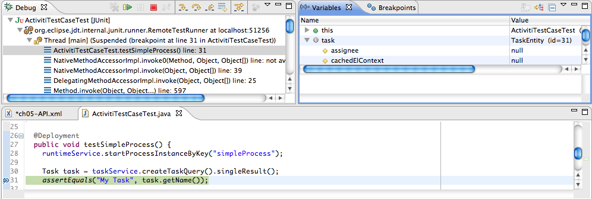
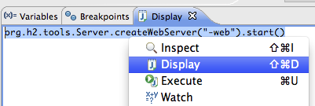
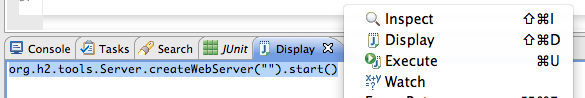
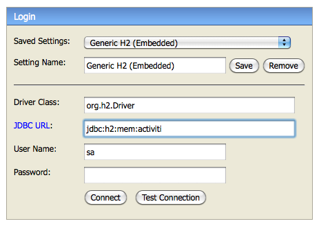

# Chapter 1\. Introduction 介绍

## License 协议

Activiti 基于 [Apache V2](http://www.apache.org/licenses/LICENSE-2.0.txt) 协议.。Activiti Modeler 使用了不同的协议 [LGPL 2.1](http://opensource.org/licenses/LGPL-2.1)

## Download 下载

[`activiti.org/download.html`](http://activiti.org/download.html)

## Sources 源码

发布包里包含大部分的已经打好 jar 包的源码。如果想找到并构建完整的源码库，请参考 wiki [构建发布包](http://docs.codehaus.org/display/ACT/Developers+Guide#DevelopersGuide-Buildingthedistribution)

## Required software 需要的软件

### JDK 6+

JDK 需要 6 或者以上的版本 。在 [Oracle Java SE 下载页面](http://www.oracle.com/technetwork/java/javase/downloads/index.html) 进行下载，安装完成后 执行 `java -version` 命令行来检验是否成功。

### Eclipse Indigo and Juno

下载 [eclipse](http://www.eclipse.org/downloads/) 进行安装，版本选 Indigo 或者 Juno。详见 [Chapter 12\. Eclipse Designer-安装一节](https://github.com/waylau/activiti-5.x-user-guide/blob/master/Chapter%2012.%20Eclipse%20Designer/Installation%20%E5%AE%89%E8%A3%85.md)

## Reporting problems 报告问题

任何一个自觉的开发者都应该看看 [如何聪明的提出问题](http://www.catb.org/~esr/faqs/smart-questions.html)。 看完之后，你可以在[用户论坛](http://forums.activiti.org/en/viewforum.php?f=3)上进行提问和评论， 或者在[JIRA 问题跟踪系统](http://jira.codehaus.org/browse/ACT) 中创建问题。

*注意*

*虽然 Activiti 已经托管在 GitHub 上了，但是问题不应该提交到 GitHub 的问题跟踪系统上。如果你想报告一个问题， 不要创建一个 GitHub 的问题，而是应该使用 [JIRA 问题跟踪系统](http://jira.codehaus.org/browse/ACT)*

*译者注：如果对本翻译有疑问，可以在[`github.com/waylau/activiti-5.x-user-guide/issues`](https://github.com/waylau/activiti-5.x-user-guide/issues) 提问。*

## Experimental features 试验性功能

标记为 [EXPERIMENTAL] 的章节表示功能尚未稳定。

所有包名中包含 .impl. 的类都是内部实现类，都是不保证稳定的。 不过，如果用户指南把哪些类列为配置项，那么它们可以认为是稳定的。

## Internal implementation classes 内部实现类

在 jar 包中，所有包名中包含.impl.（比如：org.activiti.engine.impl.pvm.delegate）的类都是实 现类， 它们应该被视为流程引擎内部的类。对于这些类和接口都不能够保证其稳定性。

# One minute version 一分钟版

## One minute version 一分钟版

从 [Activiti 网站](http://www.activiti.org)下载 Activiti Explorer 的 WAR 文件后，可以按照下列步骤以默认配置运行示例。 你需要安装 [Java 运行时](http://java.sun.com/javase/downloads/index.jsp) 和 [Apache Tomcat](http://tomcat.apache.org/download-70.cgi)（其实，任何提供了 servlet 功能的 web 容器都可以正常运行。但是我们主要是使用 Tomcat 进行的测试）。

*   把下载的 activiti-explorer.war 复制到 Tomcat 的 webapps 目录下。
*   执行 Tomcat 的 bin 目录下的 startup.bat 或 startup.sh 启动服务器。
*   Tomcat 启动后，打开浏览器访问 [`localhost:8080/activiti-explorer`](http://localhost:8080/activiti-explorer)（译者注：8080 是你的 Tomcat 安装默认端口，当然你可以给 Tomcat 指定其他端口号）。 使用 kermit/kermit 账号登录。

这样就好了！Activiti Explorer 默认使用 H2 内存数据库，如果你想使用其他数据库 请参考这里[长版本-Activiti setup](https://github.com/waylau/activiti-5.x-user-guide/blob/master/Chapter%202.%20Getting%20Started%20%E5%BC%80%E5%A7%8B/Activiti%20setup%20%E5%AE%89%E8%A3%85.md)。

# Activiti setup 安装

## Activiti setup 安装

要安装 Activiti， 需要安装 [Java 运行时](http://java.sun.com/javase/downloads/index.jsp) 和 [Apache Tomcat](http://tomcat.apache.org/download-70.cgi)同时确保系统变量 JAVA_HOME 设置正确。具体方法看你是什么操作系统。

只需要将 WAR 拷贝进 Tomcat 的 webapps 就能运行 Activiti Explorer 和 REST 应用。默认，应用是运行在内存数据库的，已经包含了示例流程，用户和群组信息。

下面是示例中可以使用的用户：

Table 2.1\. The demo users

| 用户 Id | 密码 | 角色 |
| --- | --- | --- |
| kermit | kermit | admin |
| gonzo | gonzo | manager |
| fozzie | fozzie | user |

现在可以用上面的账号访问应用

Table 2.2\. The webapp tools

| 应用名称 | URL | 描述 |   |
| --- | --- | --- | --- |
| Activiti Explorer | [`localhost:8080/activiti-explorer`](http://localhost:8080/activiti-explorer) | 用户控制台。使用此工具来启动新的流程，分配任务，查看和认领任务等，这个工具还允许对 Activiti 引擎进行管理。 |   |

注意 Activiti Explorer 演示实例只是一种简单快速展示 Activiti 的功能的方式。 但是并**不是**说只能使用这种方式使用 Activiti。 Activiti 只是一个 jar， 可以内嵌到任何 Java 环境 中：swing 或者 Tomcat, JBoss, WebSphere 等等。 也可以把 Activiti 作为一个典型的单独运行的 BPM 服务器运行。 只要 java 可以做的，Activiti 也可以。

# Activiti database setup 数据库安装

## Activiti database setup 数据库安装

就像在一分钟版本示例里说过的，Activiti Explorer 默认使用 H2 内存数据库。 要让 Activiti 使用独立运行的 H2 数据库或者其他数据库，可以修改 Activiti Explorer web 应用 WEB-INF/ classes 目录下的 db.properties。

另外，注意 Activiti Explorer 自动生成了 demo 用的默认用户和群组，流程定义，数据模型。要想禁用这个功能，要修改 WEB-INF/classes 目录下的 属性文件。 禁用 demo 安装，可以设置所有属性为 false 。从代码中也可以看出，我们可以单独启用或禁用每一项功能。

```java
# demo data properties
create.demo.users=true
create.demo.definitions=true
create.demo.models=true
create.demo.reports=true 
```

# Include the Activiti jar and its dependencies 包含 jar 和依赖

## Include the Activiti jar and its dependencies 包含 jar 和依赖

想要包含 jar 和依赖，建议使用 [Maven](http://maven.apache.org/) (或者 [Ivy](http://ant.apache.org/ivy/)) 来简化依赖管理。[`www.activiti.org/community.html#maven.repository`](http://www.activiti.org/community.html#maven.repository) 中包含了需要的 jar

如果不想用 Maven，你也可以自己把这些 jar 引入到你的项目中。Activiti 下载 zip 包包含了一个 libs 目录，包含了所有 Activiti 的 jar 包（和源代码 jar 包）。依赖没有用这种方式发 布。 Activiti 引擎必须的依赖如下所示（通过 mvn dependency:tree 生成）：

```java
org.activiti:activiti-engine:jar:5.17.0
+- org.activiti:activiti-bpmn-converter:jar:5.17.0:compile
|  \- org.activiti:activiti-bpmn-model:jar:5.17.0:compile
|     +- com.fasterxml.jackson.core:jackson-core:jar:2.2.3:compile
|     \- com.fasterxml.jackson.core:jackson-databind:jar:2.2.3:compile
|        \- com.fasterxml.jackson.core:jackson-annotations:jar:2.2.3:compile
+- org.activiti:activiti-process-validation:jar:5.17.0:compile
+- org.activiti:activiti-image-generator:jar:5.17.0:compile
+- org.apache.commons:commons-email:jar:1.2:compile
|  +- javax.mail:mail:jar:1.4.1:compile
|  \- javax.activation:activation:jar:1.1:compile
+- org.apache.commons:commons-lang3:jar:3.3.2:compile
+- org.mybatis:mybatis:jar:3.2.5:compile
+- org.springframework:spring-beans:jar:4.0.6.RELEASE:compile
|  \- org.springframework:spring-core:jar:4.0.6.RELEASE:compile
+- joda-time:joda-time:jar:2.6:compile
+- org.slf4j:slf4j-api:jar:1.7.6:compile
+- org.slf4j:jcl-over-slf4j:jar:1.7.6:compile 
```

注意：只有使用了 [mail service task](http://www.activiti.org/userguide/index.html#bpmnEmailTask) 才必须引入 mail 依赖 jar。

在 [Activiti 源代码](https://github.com/Activiti/Activiti)执行 mvn dependency:copy-dependencie 依赖将会轻松下载

# Next steps 下步

## Next steps 下步

使用 Activiti Explorer web 应用 是一个熟悉 Activiti 概念和功能的好办法。但是，Activiti 的主要目标是为你自己的应用添加强大的 BPM 和工作流功能。 下面的章节会帮助你熟悉如何在你的环境中使用 Activiti 进行编程：

*   Chapter 3\. Configuration 配置 会教你如何设置 Activiti， 如何获得 ProcessEngine 类的实例，它是所有 Activiti 引擎功能的中心入口。
*   Chapter 4\. The Activiti API 会带领你了解建立 Activiti API 的服务。 这些服务用简便的方法提供了 Activiti 引擎的强大功能，它们可以使用在任何 Java 环境下。
*   对深入了解 BPMN 2.0，Activiti 引擎中流程的编写结构感兴趣吗？ 请继续浏览 Chapter 7\. BPMN 2.0 Introduction 介绍 BPMN 2.0

# Creating a ProcessEngine 创建 ProcessEngine

## Creating a ProcessEngine 创建 ProcessEngine

Activiti 流程引擎的配置文件是名为 activiti.cfg.xml 文件。 注意这与使用 Spring 方式创建流程引擎是不一样的。

获得 ProcessEngine 最简单的办法是 使用 org.activiti.engine.ProcessEngines 类：

```java
ProcessEngine processEngine = ProcessEngines.getDefaultProcessEngine() 
```

它会在 classpath 下搜索 activiti.cfg.xml， 并基于这个文件中的配置构建引擎。 下面代码展示了实例配置。 后面的章节会给出配置参数的详细介绍。

```java
<beans 

       xsi:schemaLocation="http://www.springframework.org/schema/beans   http://www.springframework.org/schema/beans/spring-beans.xsd">

  <bean id="processEngineConfiguration" class="org.activiti.engine.impl.cfg.StandaloneProcessEngineConfiguration">

    <property name="jdbcUrl" value="jdbc:h2:mem:activiti;DB_CLOSE_DELAY=1000" />
    <property name="jdbcDriver" value="org.h2.Driver" />
    <property name="jdbcUsername" value="sa" />
    <property name="jdbcPassword" value="" />

    <property name="databaseSchemaUpdate" value="true" />

    <property name="jobExecutorActivate" value="false" />
    <property name="asyncExecutorEnabled" value="true" />
    <property name="asyncExecutorActivate" value="false" />

    <property name="mailServerHost" value="mail.my-corp.com" />
    <property name="mailServerPort" value="5025" />
  </bean>

</beans> 
```

注意配置 XML 文件其实是一个 Spring 的配置文件。 **但不是说 Activiti 只能用在 Spring 环境 中！** 我们只是利用了 Spring 的解析和依赖注入功能 来构建引擎。

配置文件中使用的 ProcessEngineConfiguration 可以通过编程方式创建。 可以使用不同的 bean id（比如，例子第三行）。

```java
ProcessEngineConfiguration.createProcessEngineConfigurationFromResourceDefault();
ProcessEngineConfiguration.createProcessEngineConfigurationFromResource(String resource);
ProcessEngineConfiguration.createProcessEngineConfigurationFromResource(String resource, String beanName);
ProcessEngineConfiguration.createProcessEngineConfigurationFromInputStream(InputStream inputStream);
ProcessEngineConfiguration.createProcessEngineConfigurationFromInputStream(InputStream inputStream, String beanName); 
```

也可以不使用配置文件，基于默认创建配置 （参考[各种支持类](http://www.activiti.org/userguide/index.html#configurationClasses)）

```java
ProcessEngineConfiguration.createStandaloneProcessEngineConfiguration();
ProcessEngineConfiguration.createStandaloneInMemProcessEngineConfiguration(); 
```

所有这些 ProcessEngineConfiguration.createXXX() 方法都返回 ProcessEngineConfiguration，后续可以调整成所需的对象。 在调用 buildProcessEngine() 后， 就会创建一个 ProcessEngine：

```java
ProcessEngine processEngine = ProcessEngineConfiguration.createStandaloneInMemProcessEngineConfiguration()
  .setDatabaseSchemaUpdate(ProcessEngineConfiguration.DB_SCHEMA_UPDATE_FALSE)
  .setJdbcUrl("jdbc:h2:mem:my-own-db;DB_CLOSE_DELAY=1000")
  .setAsyncExecutorEnabled(true)
  .setAsyncExecutorActivate(false)
  .buildProcessEngine(); 
```

# ProcessEngineConfiguration bean

## ProcessEngineConfiguration bean

activiti.cfg.xml 必须包含一个 bean, id 为'processEngineConfiguration'。

```java
<bean id="processEngineConfiguration" class="org.activiti.engine.impl.cfg.StandaloneProcessEngineConfiguration"> 
```

这个 bean 会用来构建 ProcessEngine。 有多个类可以用来定义 processEngineConfiguration。 这些类对应不同的环境，并设置了对应的默认值。 最好选择（最）适用于你的环境的类， 这样可以少配置几个引擎的参数。 下面是目前可以使用的类（以后会包含更多）：

*   org.activiti.engine.impl.cfg.StandaloneProcessEngineConfiguration: 单独运行的 流程引擎。Activiti 会自己处理事务。 默认，数据库只在引擎启动时检测 （如果没有 Activiti 的表或者表结构不正确就会抛出异常）。
*   org.activiti.engine.impl.cfg.StandaloneInMemProcessEngineConfiguration: 单元测试时的辅助类。Activiti 会自己控制事务。 默认使用 H2 内存数据库。数据库表会在引擎启动时创建，关闭时删除。 使用它时，不需要其他配置（除非使用 job 执行器或邮件功 能）。
*   org.activiti.spring.SpringProcessEngineConfiguration: 在 Spring 环境下使用流程引擎。 参考 Chapter 5\. Spring integration 集成 Spring。
*   org.activiti.engine.impl.cfg.JtaProcessEngineConfiguration: 单独运行流程引擎，并使用 JTA 事务。

# Database configuration 数据库配置

## Database configuration 数据库配置

两种方式配置数据库给 Activiti 引擎使用。首先是定义数据库 JDBC 属性：

*   jdbcUrl: 数据库的 JDBC URL
*   jdbcDriver: 数据库类型的驱动实现
*   jdbcUsername: 数据库连接用户名
*   jdbcPassword: 数据库连接密码

基于 JDBC 参数配置的数据库连接 会使用默认的[MyBatis](http://www.mybatis.org/)连接池。 下面的参数可以用来配置连接池（来自 MyBatis 参数）：

*   jdbcMaxActiveConnections: 连接池中处于被使用状态的连接的最大值。默认为 10
*   jdbcMaxIdleConnections: 连接池中处于空闲状态的连接的最大值
*   jdbcMaxCheckoutTime: 连接被取出使用的最长时间，超过时间会被强制回收。 默认为 20000（20 秒）
*   jdbcMaxWaitTime: 这是一个底层配置，让连接池可以在长时间无法获得连接时， 打印一条日志，并重新尝试获取一个连接。（避免因为错误配置导致沉默的操作失败）。 默认为 20000（20 秒）。

数据配置示例:

```java
<property name="jdbcUrl" value="jdbc:h2:mem:activiti;DB_CLOSE_DELAY=1000" />
<property name="jdbcDriver" value="org.h2.Driver" />
<property name="jdbcUsername" value="sa" />
<property name="jdbcPassword" value="" /> 
```

也可以使用 javax.sql.DataSource 实现 （比如，[Apache Commons](http://commons.apache.org/
dbcp/) 的 DBCP）：

```java
<bean id="dataSource" class="org.apache.commons.dbcp.BasicDataSource" > 
 <property name="driverClassName" value="com.mysql.jdbc.Driver" />  
 <property name="url" value="jdbc:mysql://localhost:3306/activiti" />  
 <property name="username" value="activiti" />  <property name="password" value="activiti" />  <property name="defaultAutoCommit" value="false" />
</bean>      
<bean id="processEngineConfiguration" class="org.activiti.engine.impl.cfg.StandaloneProcessEngineConfiguration">      
 <property name="dataSource" ref="dataSource" />    ... 
```

注意，Activiti 的发布包中没有这些类。 你要自己把对应的类（比如，从 DBCP 里）放到你的 classpath 下。 无论你使用 JDBC 还是 DataSource 的方式，都可以设置下面的配置：

*   databaseType: 一般不用设置，因为可以自动通过数据库连接的元数据获取。 只有自动检测失败时才需要设置。 可能的值有：{h2, mysql, oracle, postgres, mssql, db2}。 **如果没使用默认的 H2 数据库就必须设置这项**。 这个配置会决定使用哪些创建/删除脚本和查询语句。 参考支持数据库章节 了解支持哪些类型。
*   databaseSchemaUpdate: 设置流程引擎启动和关闭时如何处理数据库表。
    *   false（默认）：检查数据库表的版本和依赖库的版本， 如果版本不匹配就抛出异常。
    *   true: 构建流程引擎时，执行检查，如果需要就执行更新。 如果表不存在，就创建
    *   create-drop: 构建流程引擎时创建数据库表， 关闭流程引擎时删除这些表。

# JNDI Datasource Configuration 数据源配置

## JNDI Datasource Configuration 数据源配置

默认，Activiti 的数据库配置会放在 web 应用的 WEB-INF/classes 目录下的 db.properties 文件中。 这样做比较繁琐， 因为要用户在每次发布时，都修改 Activiti 源码中的 db.properties 并重新编译 war 文件， 或者解压缩 war 文件，修改其中的 db.properties。

使用 JNDI（Java Naming and Directory Interface - Java 命名和目录接口）来获取数据库连接， 连接是由 Servlet 容器管理的，可以 在 war 部署外边管理配置。 与 db.properties 相比， 它也允许对连接进行更多的配置。

### Usage 使用

要想把 Activiti Explorer 和 Activiti Rest 应用从 db.properties 转换为使用 JNDI 数据库配 置，需要打开原始的 Spring 配置文件 （activiti-webapp-explorer2/src/main/webapp/WEBINF/activiti-standalone-context.xml 和 activiti-webapp-rest2/src/main/resources/ activiti-context.xml）， 删除"dbProperties"和"dataSource"两个 bean，然后添加如下 bean：

```java
<bean id="dataSource" class="org.springframework.jndi.JndiObjectFactoryBean">    
<property name="jndiName" value="java:comp/env/jdbc/activitiDB"/>
</bean> 
```

接下来，我们需要添加包含了默认的 H2 配置的 context.xml 文件。 如果已经有了 JNDI 配置， 会覆盖这些配置。 对 Activiti Explorer 来说，对应的配置文件 activiti-webapp-explorer2/src/main/webapp/META-INF/context.xml 如下所示：

```java
<Context antiJARLocking="true" path="/activiti-explorer2">
    <Resource auth="Container"
              name="jdbc/activitiDB"
              type="javax.sql.DataSource"
              scope="Shareable"
              description="JDBC DataSource"
              url="jdbc:h2:mem:activiti;DB_CLOSE_DELAY=1000"
              driverClassName="org.h2.Driver"
              username="sa"
              password=""
              defaultAutoCommit="false"
              initialSize="5"
              maxWait="5000"
              maxActive="120"
              maxIdle="5"/>
</Context> 
```

对于 Activiti REST web 应用，添加的 activiti-webapp-rest2/src/main/webapp/META-INF/context.xml 如下所示：

```java
<?xml version="1.0" encoding="UTF-8"?>
<Context antiJARLocking="true" path="/activiti-rest2">
    <Resource auth="Container"
              name="jdbc/activitiDB"
              type="javax.sql.DataSource"
              scope="Shareable"
              description="JDBC DataSource"
              url="jdbc:h2:mem:activiti;DB_CLOSE_DELAY=-1"
              driverClassName="org.h2.Driver"
              username="sa"
              password=""
              defaultAutoCommit="false"
              initialSize="5"
              maxWait="5000"
              maxActive="120"
              maxIdle="5"/>
</Context> 
```

可选的一步，现在可以删除 Activiti Explorer 和 Activiti REST 两个应用中 不再使用的 db.properties 文件了。

### Configuration 配置

JNDI 数据库配置会因为你使用的 Servlet 容器 不同而不同。 下面的配置可以在 Tomcat 中使用，但是对其他容器，请引用你使用的容器的文档。

如果使用 Tomcat，JNDI 资源配置在 $CATALINA_BASE/conf/[enginename]/[hostname]/[warname].xml （对于 Activiti Explorer 来说，通常是在 $CATALINA_BASE/conf/ Catalina/localhost/activiti-explorer.war）。 当应用第一次发布时，会把这个文件从 war 中复制出来。 所以如果这个文件已经存在了，你需要替换它。要想修改 JNDI 资源让应用连接 mysql 而不是 H2，可以像下面这样修改：

```java
<?xml version="1.0" encoding="UTF-8"?>
    <Context antiJARLocking="true" path="/activiti-explorer2">
        <Resource auth="Container"
            name="jdbc/activitiDB"
            type="javax.sql.DataSource"
            description="JDBC DataSource"
            url="jdbc:mysql://localhost:3306/activiti"
            driverClassName="com.mysql.jdbc.Driver"
            username="sa"
            password=""
            defaultAutoCommit="false"
            initialSize="5"
            maxWait="5000"
            maxActive="120"
            maxIdle="5"/>
        </Context> 
```

# Supported databases 支持的数据库

## Supported databases 支持的数据库

下面是可以引用的类型

Table 3.1\. Supported databases

| Activiti 数据库类型 | JDBC URL 示例 | 备注 |
| --- | --- | --- |
| h2 | jdbc:h2:tcp://localhost/activiti | 默认配置数据库 |
| mysql | jdbc:mysql://localhost:3306/activiti?autoReconnect=true | 使用 mysql-connector-java 驱动进行测试 |
| oracle | jdbc:oracle:thin:@localhost:1521:xe |   |
| postgres | jdbc:postgresql://localhost:5432/activiti |   |
| db2 | jdbc:db2://localhost:50000/activiti |   |
| mssql | jdbc:sqlserver://localhost:1433/activiti |   |

# Creating the database tables 创建数据库表

## Creating the database tables 创建数据库表

下面是创建数据库表最简单的办法：

*   把 activiti-engine 的 jar 放到 classpath 下
*   添加对应的数据库驱动
*   把 Activiti 配置文件 (activiti.cfg.xml) 放到 classpath 下， 指向你的数据库（参考数据库配置章节）
*   执行 DbSchemaCreate 类的 main 方法

不过，一般情况只有数据库管理员才能执行 DDL 语句。 在生产环境，这也是最明智的选择。SQL DDL 语句可以从 Activiti 下载页或 Activiti 发布目录里找到，在 database 子目录下。 脚本 也包含在引擎的 jar 中(activiti-engine-x.jar)， 在 org/activiti/db/create 包下（drop 目录里是删除语句）。 SQL 文件的命名方式如下

```java
activiti.{db}.{create|drop}.{type}.sql 
```

其中 db 是 支持的数据库， type 是

*   engine: 引擎执行的表。必须。
*   identity: 包含用户，群组，用户与组之间的关系的表。 这些表是可选的，只有使用引擎自带的默认身份管理时才需要。
*   history: 包含历史和审计信息的表。可选的：历史级别设为 none 时不会使用。 注意这也会引用一些需要把数据保存到历史表中的功能（比如任务的评论）。

MySQL 用户需要注意： 版本低于 5.6.4 的 MySQL 不支持毫秒精度的 timestamp 或 date 类型。 更严重的是，有些版本会在尝试创建这样一列时抛出异常，而有些版本则不会。 在执行自动创建/更新时，引擎会在执行过程中修改 DDL。 当使用 DD L 时，可以选择通用版本和名为 mysql55 的文件。 （它适合所有版本低于 5.6.4 的情况）。 后一个文件会将列的类型设置为没有毫秒的情况。

总结一下，对于 MySQL 版本会执行如下操作

*   <5.6: 不支持毫秒精度。可以使用 DDL 文件（包含 mysql55 的文件）。可以实现自动创建/更新。
*   5.6.0 - 5.6.3: 不支持毫秒精度。无法自动创建/更新。建议更新到新的数据库版本。如果真的需要的话，也可以使用 mysql 5.5。
*   5.6.4+:支持毫秒精度。可以使用 DDL 文件（默认包含 mysql 的文件）。可以实现自动创建、更新。

注意对于已经更新了 MySQL 数据库，而且 Activiti 表已经创建/更新的情况， 必须手工修改列的类型。

# Database table names explained 理解数据库表名字

## Database table names explained 理解数据库表名字

Activiti 的表都以 ACT_ 开头。 第二部分是表示表的用途的两个字母标识。 用途也和服务的 API 对应。

*   ACT*RE**: 'RE'表示 repository。 这个前缀的表包含了流程定义和流程静态资源 （图片，规则，等等）。
*   ACT*RU**: 'RU'表示 runtime。 这些运行时的表，包含流程实例，任务，变量，异步任务，等运行中的数据。 Activiti 只在流程实例执行过程中保存这些数据， 在流程结束时就会删除这些记录。 这样运行时表可以一直很小速度很快。
*   ACT*ID**: 'ID'表示 identity。 这些表包含身份信息，比如用户，组等等。
*   ACT*HI**: 'HI'表示 history。 这些表包含历史数据，比如历史流程实例， 变量，任务等等。
*   ACT*GE**: general 数据， 用于不同场景下。

# Database upgrade 数据库升级

## Database upgrade 数据库升级

在执行更新之前要先备份数据库（使用数据库的备份功能）

默认，每次构建流程引擎时都会进行版本检测。 这一切都在应用启动或 Activiti webapp 启动时发生。 如果 Activiti 发现数据库表的版本与依赖库的版本不同， 就会抛出异常。

要升级，你要把下面的配置 放到 activiti.cfg.xml 配置文件里：

```java
<beans ... >

  <bean id="processEngineConfiguration" class="org.activiti.engine.impl.cfg.StandaloneProcessEngineConfiguration">
    <!-- ... -->
    <property name="databaseSchemaUpdate" value="true" />    
    <!-- ... -->
  </bean>

</beans> 
```

**然后，把对应的数据库驱动放到 classpath 里。** 升级应用的 Activiti 依赖。启动一个新版本的 Activiti 指向包含旧版本的数据库。将 databaseSchemaUpdate 设置为 true， Activiti 会自动将 数据库表升级到新版本，

**当发现依赖和数据库表版本不通过时。**也可以执行更新升级 DDL 语句。 也可以执行数据库脚本，可以在 Activiti 下载页找到。

# Job Executor and Async Executor

## Job Executor and Async Executor (since version 5.17.0)

从版本 5.17.0 开始，除了 Job Executor（作业执行器）之外， Activiti 还提供了一个 Async executor （异步执行器）。 Async executor 在 Activiti 引擎中 是一个更好的性能和对数据库更友好的执行异步作业的方式。因此建议切换到 Async executor，在默认情况下仍然使用旧的 job executor 。更多的信息可以在用户指南的高级部分找到。

# Job executor activation 启用 Job executor

## Job executor activation 启用 Job executor

JobExecutor 是管理一系列线程的组件，可以触发定时器（也包含后续的异步消息）。 在单元测试场景下，很难使用多线程。因此 API 允许查询(ManagementService.createJobQuery) 和执行 job (ManagementService.executeJob)，所以 job 可以在单元测试中控制。 要避免与 job 执行器冲突，可以关闭它。

默认，JobExecutor 在流程引擎启动时就会激活。 如果不想在流程引擎启动后自动激活 JobExecutor，可以设置

```java
<property name="jobExecutorActivate" value="false" /> 
```

当流程引擎引导时,不想激活 JobExecutor。

# Async executor activation 启用 Async executor

## Async executor activation 启用 Async executor

AsyncExecutor 是管理线程池的组件，可以触发定时器和异步任务。

默认，AsyncExecutor 是不启用的，由于遗留原因使用的是 JobExecutor。不过建议使用新的 AsyncExecutor 来代替。可以通过定义两个属性

```java
<property name="asyncExecutorEnabled" value="true" />
<property name="asyncExecutorActivate" value="true" /> 
```

asyncExecutorEnabled 属性启用 Async executor 代替旧的 Job executor。第二个属性 asyncExecutorActivate 指示 Activiti 引擎在启动时启动 Async executor 线程池。

# Mail server configuration 配置邮件服务器

## Mail server configuration 配置邮件服务器

可以选择配置邮件服务器。Activiti 支持在业务流程中发送邮件。 想真正的发送一个 e-mail，必须配置一个真实的 SMTP 邮件服务器。 参考 [e-mail 任务](http://www.activiti.org/userguide/index.html#bpmnEmailTaskServerConfiguration)。

# History configuration 配置历史

## History configuration 配置历史

可以选择定制历史存储的配置。你可以通过配置影响引擎的历史功能。 参考 History configuration 配置这一节。

```java
<property name="history" value="audit" /> 
```

# Exposing configuration beans in expressions and scripts 在表达式和脚本中暴露配置

## Exposing configuration beans in expressions and scripts 在表达式和脚本中暴露配置

默认，activiti.cfg.xml 和你自己的 Spring 配置文件中所有 bean 都可以在表达式和脚本中使用。 如果你想限制配置文件中的 bean 的可见性， 可以配置流程引擎配置的 bean 配置。 ProcessEngineConfiguration 的 beans 是一个 map。当你指定了这个参数， 只有包含这个 map 中的 bean 可以在表达式和脚本中使用。 通过在 map 中指定的名称来决定暴露的 bean。

# Deployment cache configuration 配置部署缓存

## Deployment cache configuration 配置部署缓存

所有流程定义都被缓存了（解析之后）避免每次使用前都要访问数据库， 因为流程定义数据是不会改变的。 默认，不会限制这个缓存。如果想限制流程定义缓存，可以添加如下配置

```java
<property name="processDefinitionCacheLimit" value="10" /> 
```

这个配置会把默认的 hashmap 缓存替换成 LRU 缓存，来提供限制。 当然，这个配置的最佳值跟流程定义的总数有关， 实际使用中会具体使用多少流程定义也有关。 也你可以注入自己的缓存实现。这个 bean 必须实现 org.activiti.engine.impl.persistence.deploy.DeploymentCache 接口：

```java
<property name="processDefinitionCache">
  <bean class="org.activiti.MyCache" />
</property> 
```

有一个类似的配置叫 knowledgeBaseCacheLimit 和 knowledgeBaseCache， 它们是配置规则缓存的。只 有流程中使用规则任务时才会用到。

# Logging 日志

## Logging 日志

从 Activiti 5.12 开始，SLF4J 被用作日志框架，替换了之前使用 java.util.logging。 所有日志（activiti, spring, mybatis 等等）都转发给 SLF4J 允许使用你选择的日志实现。

**默认 activiti-engine 依赖中没有提供 SLF4J 绑定的 jar， 需要根据你的实际需要使用日志框架。**如果没有添加任何实现 jar，SLF4J 会使用 NOP-logger，不使用任何日志，不会发出警告，而且什么日志都不会记录。 可以通过 [`www.slf4j.org/codes.html#StaticLoggerBinder`](http://www.slf4j.org/codes.html#StaticLoggerBinder) 了解这些实现。 使用 Maven，比如使用一个依赖（这里使用 log4j），注意你还需要添加一个 version： 配置

<dependency class="calibre27"><groupid class="calibre27">org.slf4j</groupid> <artifactid class="calibre27">slf4j-log4j12</artifactid></dependency>

activiti-explorer 和 activiti-rest 应用都使用了 Log4j 绑定。执行所有 activiti-* 模块的单元测试页使用了 Log4j。

**特别提醒如果容器 classpath 中存在 commons-logging**： 为了把 spring 日志转发给 SLF4J，需要使用桥接（参考 [`www.slf4j.org/legacy.html#jclOverSLF4J`](http://www.slf4j.org/legacy.html#jclOverSLF4J)）。 如果你的容器提 供了 commons-logging 实现，请参考下面网页： [`www.slf4j.org/codes.html#release`](http://www.slf4j.org/codes.html#release) 来确保稳定性。 使用 Maven 的实例（忽略版本）：

```java
<dependency>
  <groupId>org.slf4j</groupId>
  <artifactId>slf4j-log4j12</artifactId>
</dependency> 
```

activiti-explorer 和 activiti-rest 应用都使用了 Log4j 绑定。执行所有 activiti-* 模块的单元测试页使用了 Log4j。

**特别提醒如果容器 classpath 中存在 commons-logging**： 为了把 spring 日志转发给 SLF4J，需要使用桥接（参考 [`www.slf4j.org/legacy.html#jclOverSLF4J`](http://www.slf4j.org/legacy.html#jclOverSLF4J)）。 如果你的容器提供了 commons-logging 实现，请参考下面网页：[`www.slf4j.org/codes.html#release`](http://www.slf4j.org/codes.html#release) 来确保稳定性。

使用 Maven 的实例（忽略版本）：

```java
<dependency>
  <groupId>org.slf4j</groupId>
  <artifactId>jcl-over-slf4j</artifactId>
</dependency> 
```

# Mapped Diagnostic Contexts 映射诊断上下文

## Mapped Diagnostic Contexts 映射诊断上下文

在 5.13 中，activiti 支持 slf4j 的 MDC 功能。 如下的基础信息会传递到日志中记录：

*   流程定义 Id 标记为 mdcProcessDefinitionID
*   流程实例 Id 标记 为 mdcProcessInstanceID
*   分支 Id 标记为 mdcexecutionId

默认不会记录这些信息。可以配置日志使用期望的格式来显示它们，扩展通常的日志信息。比如，下面的 log4j 配置定义会让日志显示上面提及的信息：

```java
log4j.appender.consoleAppender.layout.ConversionPattern =ProcessDefinitionId=%X{mdcProcessDefinitionID}
executionId=%X{mdcExecutionId} mdcProcessInstanceID=%X{mdcProcessInstanceID} mdcBusinessKey=%X{mdcBusinessKey} %m%n" 
```

当系统进行高风险任务，日志必须严格检查时，这个功能就非常有用，比如要使用日志分析的情况。

# Event handlers 事件处理

## Event handlers 事件处理

Activiti 5.15 中实现了一种事件机制。它允许在引擎触发事件时获得提醒。 参考所有支持的事件类型了解有效的事件。

可以为对应的事件类型注册监听器，在这个类型的任何时间触发时都会收到提醒。 你可以添加引擎范围的事件监听器通过配置， 添加引擎范围的事件监听器在运行阶段使用 API， 或添加 event-listener 到特定流程定义的 BPMN XML 中。

所有分发的事件，都是 org.activiti.engine.delegate.event.ActivitiEvent 的子类。事件包含（如果有效）type，executionId，processInstanceId 和 processDefinitionId。 对应的事件会包含事件发生时对应上下文的额外信息， 这些额外的载荷可以在所有支持的事件类型中找到。

### Event listener implementation 事件监听实现

实现事件监听器的唯一要求是实现 org.activiti.engine.delegate.event.ActivitiEventListener。 西面是一个实现监听器的例子，它会把所有监听到的事件打印到标准输出中，包括 job 执行的事件异常：

```java
public class MyEventListener implements ActivitiEventListener {

  @Override
  public void onEvent(ActivitiEvent event) {
    switch (event.getType()) {

      case JOB_EXECUTION_SUCCESS:
        System.out.println("A job well done!");
        break;

      case JOB_EXECUTION_FAILURE:
        System.out.println("A job has failed...");
        break;

      default:
        System.out.println("Event received: " + event.getType());
    }
  }

  @Override
  public boolean isFailOnException() {
    // The logic in the onEvent method of this listener is not critical, exceptions
    // can be ignored if logging fails...
    return false;
  }
} 
```

isFailOnException() 方法决定了当事件分发时，onEvent(..) 方法抛出异常时的行为。 这里返回的是 false，会忽略异常。 当返回 true 时，异常不会忽略，继续向上传播，迅速导致当前命令失败。 当事件是一个 API 调用的一部分时（或其他事务性操作，比如 job 执行）， 事务就会回滚。当事件监听器中的行为不是业务性时，建议返回 false。 activiti 提供了一些基础的实现，实现了事件监听器的常用场景。可以用来作为基类或监听器实现的样例：

*   org.activiti.engine.delegate.event.BaseEntityEventListener： 这个事件监听器的基 类可以用来监听实体相关的事件，可以针对某一类型实体，也可以是全部实体。 它隐藏了 类型检测，并提供了三个需要重写的方法：onCreate(..), onUpdate(..) 和 onDelete(..)，当实 体创建，更新，或删除时调用。对于其他实体相关的事件，会调用 onEntityEvent(..)。

### Configuration and setup 配置和安装

把事件监听器配置到流程引擎配置中时，会在流程引擎启动时激活，并在引擎启动启动中持续工作着。

eventListeners 属性需要 org.activiti.engine.delegate.event.ActivitiEventListener 的队列。 通常，我们可以声明一个内部的 bean 定义，或使用 ref 引用已定义的 bean。 下面的代码，向配置添加了一个事件监听器，任何事件触发时都会提醒它，无论事件是什么类型：

```java
<bean id="processEngineConfiguration" class="org.activiti.engine.impl.cfg.StandaloneProcessEngineConfiguration">
    ...
    <property name="eventListeners">
      <list>
         <bean class="org.activiti.engine.example.MyEventListener" />
      </list>
    </property>
</bean> 
```

为了监听特定类型的事件，可以使用 typedEventListeners 属性，它需要一个 map 参数。 map 的 key 是逗号分隔的事件名（或单独的事件名）。 map 的 value 是 org.activiti.engine.delegate.event.ActivitiEventListener 队列。 下面的代码演示了向配置中添加一个事件监听器，可以监听 job 执行成功或失败：

```java
<bean id="processEngineConfiguration" class="org.activiti.engine.impl.cfg.StandaloneProcessEngineConfiguration">
    ...
    <property name="typedEventListeners">
      <map>
        <entry key="JOB_EXECUTION_SUCCESS,JOB_EXECUTION_FAILURE" >
          <list>
            <bean class="org.activiti.engine.example.MyJobEventListener" />
          </list>
        </entry>
      </map>
    </property>
</bean> 
```

分发事件的顺序是由监听器添加时的顺序决定的。首先，会调用所有普通的事件监听器（eventListeners 属性），按照它们在 list 中的次序。 然后，会调用所有对应类型的监听器（ typedEventListeners 属性），如果对应类型的事件被触发了。

### Adding listeners at runtime 运行时添加监听

可以通过 API（RuntimeService）在运行阶段添加或删除额外的事件监听器

```java
/**
 * Adds an event-listener which will be notified of ALL events by the dispatcher.
 * @param listenerToAdd the listener to add
 */
void addEventListener(ActivitiEventListener listenerToAdd);

/**
 * Adds an event-listener which will only be notified when an event occurs, which type is in the given types.
 * @param listenerToAdd the listener to add
 * @param types types of events the listener should be notified for
 */
void addEventListener(ActivitiEventListener listenerToAdd, ActivitiEventType... types);

/**
 * Removes the given listener from this dispatcher. The listener will no longer be notified,
 * regardless of the type(s) it was registered for in the first place.
 * @param listenerToRemove listener to remove
 */
 void removeEventListener(ActivitiEventListener listenerToRemove); 
```

注意运行期添加的监听器引擎重启后就消失了

### Adding listeners to process definitions 添加监听到流程定义

可以为特定流程定义添加监听器。监听器只会监听与这个流程定义相关的事件，以及这个流程定义上发起的所有流程实例的事件。 监听器实现可以使用，全类名定义，引用实现了监听器接口的表达式，或配置为抛出一个 message/signal/error 的 BPMN 事件。

#### Listeners executing user-defined logic 让监听器执行用户定义的逻辑

下面代码为一个流程定义添加了两个监听器。第一个监听器会接收所有类型的事件，它是通过全类名定义的。 第二个监听器只接收作业成功或失败的事件，它使用了定义在流程引擎配置中的 beans 属性中的一个 bean。

```java
<process id="testEventListeners">
  <extensionElements>
    <activiti:eventListener class="org.activiti.engine.test.MyEventListener" />
    <activiti:eventListener delegateExpression="${testEventListener}" events="JOB_EXECUTION_SUCCESS,JOB_EXECUTION_FAILURE" />
  </extensionElements>

  ...

</process> 
```

对于实体相关的事件，也可以设置为针对某个流程定义的监听器，实现只监听发生在某个流程定义上的某个类型实体事件。 下面的代码演示了如何实现这种功能。可以用于所有实体事件（第一个例子），也可以只监听特定类型的事件（第二个例子）

```java
<process id="testEventListeners">
  <extensionElements>
    <activiti:eventListener class="org.activiti.engine.test.MyEventListener" entityType="task" />
    <activiti:eventListener delegateExpression="${testEventListener}" events="ENTITY_CREATED" entityType="task" />
  </extensionElements>

  ...

</process> 
```

entityType 支持的值有：attachment, comment, execution,identity-link, job, process-instance, process-definition, task。

```java
<process id="testEventListeners">
  <extensionElements>
    <activiti:eventListener class="org.activiti.engine.test.MyEventListener" entityType="task" />
    <activiti:eventListener delegateExpression="${testEventListener}" events="ENTITY_CREATED" entityType="task" />
  </extensionElements>

  ...

</process> 
```

#### Listeners throwing BPMN events

[试验阶段]

另一种处理事件的方法是抛出一个 BPMN 事件。请注意它只针对与抛出一个 activiti 事件类型的 BPMN 事件。 比如，抛出一个 BPMN 事件，在流程实例删除时，会导致一个错误。 下面的代码演示了如何在流程实例中抛出一个 signal，把 signal 抛出到外部流程（全局），在流程实例中抛出一个消息事件， 在流程实例中抛出一个错误事件。除了使用 class 或 delegateExpression， 还使用了 throwEvent 属性，通过额外属性，指定了抛出事件的类型。

```java
 <process id="testEventListeners">
      <extensionElements>
        <activiti:eventListener throwEvent="signal" signalName="My signal" events="TASK_ASSIGNED" />
      </extensionElements>
    </process> 
```

```java
 <process id="testEventListeners">
      <extensionElements>
        <activiti:eventListener throwEvent="globalSignal" signalName="My signal" events="TASK_ASSIGNED" />
      </extensionElements>
    </process> 
```

```java
 <process id="testEventListeners">
      <extensionElements>
        <activiti:eventListener throwEvent="message" messageName="My message" events="TASK_ASSIGNED" />
      </extensionElements>
    </process> 
```

```java
 <process id="testEventListeners">
      <extensionElements>
        <activiti:eventListener throwEvent="error" errorCode="123" events="TASK_ASSIGNED" />
      </extensionElements>
    </process> 
```

如果需要声明额外的逻辑，是否抛出 BPMN 事件，可以扩展 activiti 提供的监听器类。在子类中重写 isValidEvent(ActivitiEvent event)， 可以防止抛出 BPMN 事件。对应的类是 org.activiti.engine.test.api.event.SignalThrowingEventListenerTest, org.activiti.engine.impl.bpmn.helper.MessageThrowingEventListener 和 org.activiti.engine.impl.bpmn.helper.ErrorThrowingEventListener.

#### Notes on listeners on a process-definition 流程定义中监听器的注意事项

*   事件监听器只能声明在 process 元素中，作为 extensionElements 的子元素。 监听器不能定义在流程的单个 activity 下。
*   delegateExpression 中的表达式无法访问 execution 上下文，这与其他表达式不同（比如 gateway ）。 它只能引用定义在流程引擎配置的 beans 属性中声明的 bean，或者使用 spring（未使用 beans 属性）中所有实现了监听器接口的 spring-bean。
*   在使用监听器的 class 属性时，只会创建一个实例。记住监听器实现不会依赖成员变量，确认是多线程安全的。
*   当一个非法的事件类型用在 events 属性或 throwEvent 中时，流程定义发布时就会抛出异常。（会导致部署失败）。如果 class 或 delegateExecution 由问题（类不存在，不存在的 bean 引用，或代理类没有实现监听器接口），会在流程启动时抛出异常（或在第一个有效的流程定义事件被监听器接收时）。所以要保证引用的类正确的放在 classpath 下，表达式也要引用一个有效的实例。

### Dispatching events through API 通过 API 分发事件

我们提供了通过 API 使用事件机制的方法，允许大家触发定义在引擎中的任何自定义事件。 建议（不强制）只触发类型为 CUSTOM 的 ActivitiEvents。可以通过 RuntimeService 触发事件：

```java
/**
 * Dispatches the given event to any listeners that are registered.
 * @param event event to dispatch.
 * 
 * @throws ActivitiException if an exception occurs when dispatching the event or when the {@link ActivitiEventDispatcher}
 * is disabled.
 * @throws ActivitiIllegalArgumentException when the given event is not suitable for dispatching.
 */
 void dispatchEvent(ActivitiEvent event); 
```

### Supported event types 支持的事件类型

下面是引擎中可能出现的所有事件类型。每个类型都对应 org.activiti.engine.delegate.event.ActivitiEventType 中的一个枚举值

Table 1\. Supported events

| Event 名称 | 描述 | Event 类 |
| --- | --- | --- |
| ENGINE_CREATED | 监听器监听的流程引擎已经创建 完毕，并准备好接受 API 调用。 | `org.activiti...ActivitiEvent` |
| ENGINE_CLOSED | 监听器监听的流程引擎已经关 闭，不再接受 API 调用。 | `org.activiti...ActivitiEvent` |
| ENTITY_CREATED | 创建了一个新实体。实体包含在 事件中。 | `org.activiti...ActivitiEntityEvent` |
| ENTITY_INITIALIZED | 创建了一个新实体，初始化也完成了。如果这个实体的创建会包含子实体的创建，这个事件会在子实体都创建/初始化完成后被触发，这是与 ENTITY_CREATED 的区别。`ENTITY_CREATE` event. | `org.activiti...ActivitiEntityEvent` |
| ENTITY_UPDATED | 更新了已存在的实体。实体包含 在事件中。 | `org.activiti...ActivitiEntityEvent` |
| ENTITY_DELETED | 删除了已存在的实体。实体包含 在事件中。 | `org.activiti...ActivitiEntityEvent` |
| ENTITY_SUSPENDED | 暂停了已存在的实体。实体包含 在事件中。会被 ProcessDefinitions,ProcessInstances 和 Tasks 抛出。 | `org.activiti...ActivitiEntityEvent` |
| ENTITY_ACTIVATED | 激活了已存在的实体，实体包含 在事件中。会被 ProcessDefinitions, ProcessInstances 和 Tasks 抛出。 | `org.activiti...ActivitiEntityEvent` |
| JOB_EXECUTION_SUCCESS | 作业执行成功。job 包含在事件中。 | `org.activiti...ActivitiEntityEvent` |
| JOB_EXECUTION_FAILURE | 作业执行失败。作业和异常信息包含在事件中。 | `org.activiti...ActivitiEntityEvent` and `org.activiti...ActivitiExceptionEvent` |
| JOB_RETRIES_DECREMENTED | 因为作业执行失败，导致重试次 数减少。作业包含在事件中。 | `org.activiti...ActivitiEntityEvent` |
| TIMER_FIRED | 触发了定时器。job 包含在事件 中。 | `org.activiti...ActivitiEntityEvent` |
| JOB_CANCELED | 取消了一个作业。事件包含取消 的作业。作业可以通过 API 调用取消， 任务完成后对应的边界定时器也会取消，在新流程定义发布时也会取消。 | `org.activiti...ActivitiEntityEvent` |
| ACTIVITY_STARTED | 一个节点开始执行 | `org.activiti...ActivitiActivityEvent` |
| ACTIVITY_COMPLETED | 一个节点成功结束 | `org.activiti...ActivitiActivityEvent` |
| ACTIVITY_CANCELLED | 要取消一个节点。取消是因为三个原因（MessageEventSubscriptionEntity, SignalEventSubscriptionEntity, TimerEntity） | `org.activiti…ActivitiActivityCancelledEvent` |
| ACTIVITY_SIGNALED | 一个节点收到了一个信号 | `org.activiti...ActivitiSignalEvent` |
| ACTIVITY_MESSAGE_RECEIVED | 一个节点收到了一个消息。在节点收到消息之前触发。收到后，会触发 ACTIVITY_SIGNAL 或 ACTIVITY_STARTED，这会根据节点的类型（边界事件，事件子流程开始事件） |
| ACTIVITY_ERROR_RECEIVED | 一个节点收到了一个错误事件。在节点实际处理错误之前触发。事件的 activityId 对应着处理错误的节点。 这个事件后续会是 ACTIVITY_SIGNALLED 或 ACTIVITY_COMPLETE，如果错误发送成功的话。 |
| UNCAUGHT_BPMN_ERROR | 抛出了未捕获的 BPMN 错误。流程 没有提供针对这个错误的处理器。 事件的 activityId 为空。 | `org.activiti...ActivitiErrorEvent` |
| ACTIVITY_COMPENSATE | 一个节点将要被补偿。事件包含 了将要执行补偿的节点 id。 | `org.activiti...ActivitiActivityEvent` |
| VARIABLE_CREATED | 创建了一个变量。事件包含变量名，变量值和对应的分支或任务（如果存在）。 | `org.activiti...ActivitiVariableEvent` |
| VARIABLE_UPDATED | 更新了一个变量。事件包含变量 名，变量值和对应的分支或任务（如果存在）。 | `org.activiti...ActivitiVariableEvent` |
| VARIABLE_DELETED | 删除了一个变量。事件包含变量名，变量值和对应的分支或任务（如果存在） | `org.activiti...ActivitiVariableEvent` |
| TASK_ASSIGNED |  | `org.activiti...ActivitiEntityEvent` |
| TASK_CREATED | 创建了新任务。它位于 ENTITY_CREATE 事件之后。当任务是由流程创建时， 这个事件会在 TaskListener 执行之前被执行。 | `org.activiti...ActivitiEntityEvent` |
| TASK_COMPLETED | 任务被完成了。它会在 ENTITY_DELETE 事件之前触发。当任务是流程一部分时，事件会在流程继续运行之前， 后续事件将是 ACTIVITY_COMPLETE，对应着完成任务的节点。 | `org.activiti...ActivitiEntityEvent` |
| PROCESS_COMPLETED | 流程已结束。在最后一个节点 的 ACTIVITY_COMPLETED 事件之后触发。 当流程到达的状态，没有任何后续连线时， 流程就会结束。 | `org.activiti…ActivitiEntityEvent` |
| PROCESS_CANCELLED | 流程已取消。在流程实例删除前从运行时触发。流程实例被 API RuntimeService.deleteProcessInstance 调用 | `org.activiti…ActivitiCancelledEvent` |
| MEMBERSHIP_CREATED | 用户被添加到一个组里。事件包 含了用户和组的 id。 | `org.activiti...ActivitiMembershipEvent` |
| MEMBERSHIP_DELETED | 用户被从一个组中删除。事件包 含了用户和组的 id。 | `org.activiti...ActivitiMembershipEvent` |
| MEMBERSHIPS_DELETED | 所有成员被从一个组中删除。在 成员删除之前触发这个事件，所以他们都是可以访问的。 因为性能方面的考虑，不会为每个成员触发单独的 MEMBERSHIP_DELETED 事件。 |

引擎内部所有 ENTITY_* 事件都是与实体相关的。下面的列表展示了实体事件与实体的对应关 系：

*   ENTITY_CREATED, ENTITY_INITIALIZED, ENTITY_DELETED: Attachment, Comment, Deployment, Execution, Group, IdentityLink, Job, Model, ProcessDefinition, ProcessInstance, Task, User.
*   ENTITY_UPDATED: Attachment, Deployment, Execution, Group, IdentityLink, Job, Model, ProcessDefinition, ProcessInstance, Task, User.
*   ENTITY_SUSPENDED, ENTITY_ACTIVATED: ProcessDefinition, ProcessInstance/Execution, Task.

### Additional remarks 附加信息

**只有事件被发送，对应的引擎内的监听器才会被通知到**。你有很多引擎 - 在同一个数据库运行 - 事件只会发送给注册到对应引擎的监听器。其他引擎发生的事件不会发送给这个监听器，无论实际上它们运行在同一个或不同的 JVM 中。

对应的事件类型（对应实体）都包含对应的实体。根据类型或事件，这些实体不能再进行更新（比如，当实例以被删除）。可能的话，使用事件提供的 EngineServices 来以安全的方式来操作引擎。即使如此，你需要小心的对事件对应的实体进行更新/操作。

没有对应历史的实体事件，因为它们都有运行阶段的对应实体。

# The Process Engine API and services 流程引擎的 API 和服务

## The Process Engine API and services 流程引擎的 API 和服务

引擎 API 是与 Activiti 打交道的最常用方式。 我们从 ProcessEngine 开始， 创建它的很多种方法都已经在 配置章节中有所涉及。 从 ProcessEngine 中，你可以获得很多囊括工作流/BPM 方法的服务。 ProcessEngine 和服务类都是线程安全的。 你可以在整个服务器中仅保持它们的一个引用就可以了。


```java
ProcessEngine processEngine = ProcessEngines.getDefaultProcessEngine();

RuntimeService runtimeService = processEngine.getRuntimeService();
RepositoryService repositoryService = processEngine.getRepositoryService();
TaskService taskService = processEngine.getTaskService();
ManagementService managementService = processEngine.getManagementService();
IdentityService identityService = processEngine.getIdentityService();
HistoryService historyService = processEngine.getHistoryService();
FormService formService = processEngine.getFormService(); 
```

ProcessEngines.getDefaultProcessEngine() 会在第一次调用时 初始化并创建一个流程引擎，以后再调用就会返回相同的流程引擎。 使用对应的方法可以创建和关闭所有流程引擎：ProcessEngines.init() 和 ProcessEngines.destroy()。

ProcessEngines 会扫描所有 activiti.cfg.xml 和 activiti-context.xml 文件。 对于 activiti.cfg.xml 文件，流程引擎会使用 Activiti 的经典方式构建： ProcessEngineConfiguration.createProcessEngineConfigurationFromInputStream(inputStream).buildProcessEngine() 对于 activiti-context.xml 文件，流程引擎会使用 Spring 方法构建：先创建一个 Spring 的环境，然后通过环境获得流程引擎。

所有服务都是无状态的。这意味着可以在多节点集群环境下运行 ctiviti，每个节点都指向同一个数据库， 不用担心哪个机器实际执行前端的调用。 无论在哪里执行服务都没有问题。

**RepositoryService** 可能是使用 Activiti 引擎时最先接触的服务。 它提供了管理和控制发布包和流程定义的操作。 这里不涉及太多细节，流程定义是 BPMN 2.0 流程的 Java 实现。 它包含了一个流程每个环节的结构和行为。 发布包是 Activiti 引擎的打包单位。一个发布包可以包含多个 BPMN 2.0 xml 文件和其他资源。 开发者可以自由选择把任意资源包含到发布包中。 既可以把一个单独的 BPMN 2.0 xml 文件放到发布包里，也可以把整个流程和相关资源都放在一起。 （比如，'hr-processes' 实例可以包含 hr 流程相关的任何资源）。 可以通过 RepositoryService 来部署这种发布包。 发布一个发布包，意味着把它上传到引擎中，所有流 程都会在保存进数据库之前分析解析好。 从这点来说，系统知道这个发布包的存在，发布包中包含的流程就已经可以启动了。

除此之外，服务可以

*   查询引擎中的发布包和流程定义。
*   暂停或激活发布包，对应全部和特定流程定义。 暂停意味着它们不能再执行任何操作了，激活是对应的反向操作。
*   获得多种资源，像是包含在发布包里的文件，或引擎自动生成的流程图。
*   获得流程定义的 pojo 版本， 可以用来通过 java 解析流程，而不必通过 xml。

正如 RepositoryService 负责静态信息（比如，不会改变的数据，至少是不怎么改变的），**RuntimeService** 正好是完全相反的。它负责启动一个流程定义的新实例。 如上所述，流程定义定义了流程各个节点的结构和行为。 流程实例就是这样一个流程定义的实例。对每个流程定义来说，同一时间会有很多实例在执行。 RuntimeService 也可以用来获取和保存流程变量。 这些数据是特定于某个流程实例的，并会被很多流程中的节点使用 （比如，一个排他网关常常使用流程变量来决定选择哪条路径继续流程）。 Runtimeservice 也能查询流程实例和执行。 执行对应 BPMN 2.0 中的'token'。基本上执行指向流程实例当前在哪里。 最后，RuntimeService 可以在流程实例等待外部触发时使用，这时可以用来继续流程实例。 流程实例可以有很多暂停状态，而服务提供了多种方法来'触发'实例， 接受外部触发后，流程实例就会继续向下执行。

任务是由系统中真实人员执行的，它是 Activiti 这类 BPMN 引擎的核心功能之一。 所有与任务有关的功能都包含在**TaskService**中：

*   查询分配给用户或组的任务
*   创建独立运行任务。这些任务与流程实例无关。
*   手工设置任务的执行者，或者这些用户通过何种方式与任务关联。
*   认领并完成一个任务。认领意味着一个人期望成为任务的执行者， 即这个用户会完成这个任务。完成意味着“做这个任务要求的事情”。 通常来说会有很多种处理形式。

**IdentityService** 非常简单。它可以管理（创建，更新，删除，查询...）群组和用户。 请注意， Activiti 执行时并没有对用户进行检查。 例如，任务可以分配给任何人，但是引擎不会校验系统中是否存在这个用户。 这是 Activiti 引擎也可以使用外部服务，比如 ldap，活动目录，等等。

**FormService** 是一个可选服务。即使不使用它，Activiti 也可以完美运行，不会损失任何功能。这个服务提供了启动表单和任务表单两个概念。 启动表单会在流程实例启动之前展示给用户， 任务表单会在用户完成任务时展示。Activiti 支持在 BPMN 2.0 流程定义中设置这些表单。 这个服务以一种简单的方式将数据暴露出来。再次重申，它是可选的， 表单也不一定要嵌入到流程定义中。

**HistoryService**提供了 Activiti 引擎的所有历史数据。 在执行流程时，引擎会保存很多数据（根据配置），比如流程实例启动时间，任务的参与者， 完成任务的时间，每个流程实例的执行路径，等等。 这个服务主要通过查询功能来获得这些数据。

**ManagementService**在使用 Activiti 的定制环境中基本上不会用到。 它可以查询数据库的表和表的元数据。另外，它提供了查询和管理异步操作的功能。 Activiti 的异步操作用途很多，比如定时器，异步操作， 延迟暂停、激活，等等。后续，会讨论这些功能的更多细节。

可以从[javadocs](http://www.activiti.org/javadocs/index.html)中获得这些服务和引擎 API 的更多信息。

# Exception strategy 异常策略

## Exception strategy 异常策略

Activiti 中的基础异常为 org.activiti.engine.ActivitiException，一个非检查异常。 这个异常可以在任何时候被 API 抛出，不过特定方法抛出的“特定”的异常都记录在 [javadocs](http://www.activiti.org/javadocs/index.html)中。 例如，下面的 TaskService：

```java
/**
 * Called when the task is successfully executed.
 * @param taskId the id of the task to complete, cannot be null.
 * @throws ActivitiObjectNotFoundException when no task exists with the given id.
 */
 void complete(String taskId); 
```

在上面的例子中，当传入一个不存在的任务的 id 时，就会抛出异常。 同时，javadoc **明确指出 taskId 不能为 null，如果传入 null， 就会抛出 ActivitiIllegalArgumentException**。

我们希望避免过多的异常继承，下面的子类用于特定的场合。 流程引擎和 API 调用的其他场合不会使用下面的异常， 它们会抛出一个普通的 ActivitiExceptions。

*   ActivitiWrongDbException：当 Activiti 引擎发现数据库版本号和引擎版本号不一致时抛出。
*   ActivitiOptimisticLockingException：对同一数据进行并发方法并出现乐观锁时抛出。
*   ActivitiClassLoadingException：当无法找到需要加载的类或在加载类时出现了错误（比如，JavaDelegate，TaskListener 等。)
*   ActivitiObjectNotFoundException：当请求或操作的对应不存在时抛出。
*   ActivitiIllegalArgumentException：这个异常表示调用 Activiti API 时传入了一个非法的参数，可能是引擎配置中的非法值，或提供了一个非法制，或流程定义中使用的非法值
*   ActivitiTaskAlreadyClaimedException：当任务已经被认领了，再调用 taskService.claim(...) 就会抛出。

# Working with the Activiti services 使用 Activiti 服务

## Working with the Activiti services 使用 Activiti 服务

像上面介绍的那样，要想操作 Activiti 引擎，需要通过 org.activiti.engine.ProcessEngine 实例暴露的服务。 下面的代码假设你已经拥有了一个可以运行的 Activiti 环境。 你就可以操作一个 org.activiti.engine.ProcessEngine。 如果只想简单尝试一下代码， 可以下载或者复制 [Activiti 单元测试模板](https://github.com/Activiti/activiti-unit-test-template) ，导入到 IDE 中，把 testUserguideCode() 方法添加到 org.activiti.MyUnitTest 中。

这个小例子的最终目标是做一个工作业务流程， 演示公司中简单的请假申请：


### Deploying the process 部署流程

任何与“静态”资源有关的数据（比如流程定义）都可以通过 **RepositoryService**访问。 从概念上讲，所以静态数据都是 Activiti 的资源内容。

在 src/test/resources/org/activiti/test 目录下创建一个新的 xml 文件 VacationRequest.bpmn20.xml（如果不使用单元测试模板，你也可以在任何地方创建）， 内容如下。注意这一章不会解释例子中使用的 xml 结构。 如果有需要可以先阅读 bpmn 2.0 章来了解这些。

```java
<?xml version="1.0" encoding="UTF-8" ?>
<definitions id="definitions"
             targetNamespace="http://activiti.org/bpmn20" 

             >

  <process id="vacationRequest" name="Vacation request">

    <startEvent id="request" activiti:initiator="employeeName">
      <extensionElements>
        <activiti:formProperty id="numberOfDays" name="Number of days" type="long" value="1" required="true"/>
        <activiti:formProperty id="startDate" name="First day of holiday (dd-MM-yyy)" datePattern="dd-MM-yyyy hh:mm" type="date" required="true" />
        <activiti:formProperty id="vacationMotivation" name="Motivation" type="string" />
      </extensionElements>
    </startEvent>
    <sequenceFlow id="flow1" sourceRef="request" targetRef="handleRequest" />

    <userTask id="handleRequest" name="Handle vacation request" >
      <documentation>
        ${employeeName} would like to take ${numberOfDays} day(s) of vacation (Motivation: ${vacationMotivation}).
      </documentation> 
      <extensionElements>
         <activiti:formProperty id="vacationApproved" name="Do you approve this vacation" type="enum" required="true">
          <activiti:value id="true" name="Approve" />
          <activiti:value id="false" name="Reject" />
        </activiti:formProperty>
        <activiti:formProperty id="managerMotivation" name="Motivation" type="string" />
      </extensionElements>
      <potentialOwner>
        <resourceAssignmentExpression>
          <formalExpression>management</formalExpression>
        </resourceAssignmentExpression>
      </potentialOwner>         
    </userTask>
    <sequenceFlow id="flow2" sourceRef="handleRequest" targetRef="requestApprovedDecision" />

    <exclusiveGateway id="requestApprovedDecision" name="Request approved?" />
    <sequenceFlow id="flow3" sourceRef="requestApprovedDecision" targetRef="sendApprovalMail">
      <conditionExpression xsi:type="tFormalExpression">${vacationApproved == 'true'}</conditionExpression>
    </sequenceFlow>

    <task id="sendApprovalMail" name="Send confirmation e-mail" />
    <sequenceFlow id="flow4" sourceRef="sendApprovalMail" targetRef="theEnd1" />
    <endEvent id="theEnd1" />

    <sequenceFlow id="flow5" sourceRef="requestApprovedDecision" targetRef="adjustVacationRequestTask">
      <conditionExpression xsi:type="tFormalExpression">${vacationApproved == 'false'}</conditionExpression>
    </sequenceFlow>

    <userTask id="adjustVacationRequestTask" name="Adjust vacation request">
      <documentation>
        Your manager has disapproved your vacation request for ${numberOfDays} days.
        Reason: ${managerMotivation}
      </documentation>
      <extensionElements>
        <activiti:formProperty id="numberOfDays" name="Number of days" value="${numberOfDays}" type="long" required="true"/>
        <activiti:formProperty id="startDate" name="First day of holiday (dd-MM-yyy)" value="${startDate}" datePattern="dd-MM-yyyy hh:mm" type="date" required="true" />
        <activiti:formProperty id="vacationMotivation" name="Motivation" value="${vacationMotivation}" type="string" />
        <activiti:formProperty id="resendRequest" name="Resend vacation request to manager?" type="enum" required="true">
          <activiti:value id="true" name="Yes" />
          <activiti:value id="false" name="No" />
        </activiti:formProperty>
      </extensionElements>
      <humanPerformer>
        <resourceAssignmentExpression>
          <formalExpression>${employeeName}</formalExpression>
        </resourceAssignmentExpression>
      </humanPerformer>  
    </userTask>
    <sequenceFlow id="flow6" sourceRef="adjustVacationRequestTask" targetRef="resendRequestDecision" />

    <exclusiveGateway id="resendRequestDecision" name="Resend request?" />
    <sequenceFlow id="flow7" sourceRef="resendRequestDecision" targetRef="handleRequest">
      <conditionExpression xsi:type="tFormalExpression">${resendRequest == 'true'}</conditionExpression>
    </sequenceFlow>

     <sequenceFlow id="flow8" sourceRef="resendRequestDecision" targetRef="theEnd2">
      <conditionExpression xsi:type="tFormalExpression">${resendRequest == 'false'}</conditionExpression>
    </sequenceFlow>
    <endEvent id="theEnd2" />

  </process>

</definitions> 
```

为了让 Activiti 引擎知道这个流程，我们必须先进行“部署”。 部署意味着引擎会把 BPMN 2.0 xml 解析成可以执行的东西， “部署包”中的所有流程定义都会添加到数据库中。 这样，当引擎重启时，它依然可以获得“已部署”的流程：

```java
ProcessEngine processEngine = ProcessEngines.getDefaultProcessEngine();
RepositoryService repositoryService = processEngine.getRepositoryService();
repositoryService.createDeployment()
  .addClasspathResource("org/activiti/test/VacationRequest.bpmn20.xml")
  .deploy();

Log.info("Number of process definitions: " + repositoryService.createProcessDefinitionQuery().count()); 
```

可以阅读部署章节来了解更多关于部署的信息。

### Starting a process instance 开始流程实例

把流程定义发布到 Activiti 引擎后，我们可以基于它发起新流程实例。 对每个流程定义，都可以有很多流程实例。 流程定义是“蓝图”，流程实例是它的一个运行的执行。

所有与流程运行状态相关的东西都可以通过 **RuntimeService** 获得。 有很多方法可以启动一个新流程实例。在下面的代码中，我们使用定义在流程定义 xml 中的 key 来启动流程实例。 我们也可以在流程实例启动时添加一些流程变量，因为第一个用户任务的表达式需要这些变量。 流程变量经常会被用到，因为它们赋予来自同一个流程定义的不同流程实例的特别含义。 简单来说，流程变量是区分流程实例的关键。

```java
Map<String, Object> variables = new HashMap<String, Object>();
variables.put("employeeName", "Kermit");
variables.put("numberOfDays", new Integer(4));
variables.put("vacationMotivation", "I'm really tired!");

RuntimeService runtimeService = processEngine.getRuntimeService();
ProcessInstance processInstance = runtimeService.startProcessInstanceByKey("vacationRequest", variables);

// Verify that we started a new process instance
Log.info("Number of process instances: " + runtimeService.createProcessInstanceQuery().count()); 
```

### Completing tasks 完成任务

流程启动后，第一步就是用户任务。这是必须由系统用户处理的一个环节。 通常，用户会有一个“任务列表”，展示了所有须由整个用户处理的任务。 下面的代码展示了对应的查询可能是怎样的：

```java
// Fetch all tasks for the management group
TaskService taskService = processEngine.getTaskService();
List<Task> tasks = taskService.createTaskQuery().taskCandidateGroup("management").list();
for (Task task : tasks) {
  Log.info("Task available: " + task.getName());
} 
```

为了让流程实例继续运行，我们需要完成整个任务。对 Activiti 来说，就是需要 complete 任务。 下面的代码展示了如何做这件事：

```java
Task task = tasks.get(0);

Map<String, Object> taskVariables = new HashMap<String, Object>();
taskVariables.put("vacationApproved", "false");
taskVariables.put("managerMotivation", "We have a tight deadline!");
taskService.complete(task.getId(), taskVariables); 
```

流程实例会进入到下一个环节。在这里例子中， 下一环节允许员工通过表单调整原始的请假申请。员工可以重新提交请假申请， 这会使流程重新进入到第一个任务。

### Suspending and activating a process 挂起，激活一个流程

我们可以挂起一个流程定义。当挂起流程定时时， 就不能创建新流程了（会抛出一个异常）。 可以通过 RepositoryService 挂起一个流程

```java
repositoryService.suspendProcessDefinitionByKey("vacationRequest");
try {
  runtimeService.startProcessInstanceByKey("vacationRequest");
} catch (ActivitiException e) {
  e.printStackTrace();
} 
```

要想重新激活一个流程定义，可以调用 repositoryService.activateProcessDefinitionXXX 方法。也可以挂起一个流程实例。挂起时，流程不能继续执行（比如，完成任务会抛出异常）， 异步操作（比如定时器）也不会执行。挂起流程实例可以调用 runtimeService.suspendProcessInstance 方法。 激活流程实例可以调用 runtimeService.activateProcessInstanceXXX 方法。

### Further reading 扩展阅读

上面章节中我们仅仅覆盖了 Activiti 功能的表层。 未来我们会继续扩展这些章节，以覆盖更多 Activiti API。 当然，像其他开源项目一样，学习的最好方式 是研究代码，阅读 Javadocs。

# Query API 查询 API

## Query API 查询 API

有两种方法可以从引擎中查询数据：查询 API 和原生查询。查询 API 提供了完全类型安全的 API。 你可以为自己的查询条件添加很多条件 （所有条件都以 AND 组合）和精确的排序条件。下面的代码展示了一个例子：

```java
List<Task> tasks = taskService.createTaskQuery()
         .taskAssignee("kermit")
         .processVariableValueEquals("orderId", "0815")
         .orderByDueDate().asc()
         .list(); 
```

有时，你需要更强大的查询，比如使用 OR 条件或不能使用查询 API 实现的条件。 这时，我们推荐原生查询，它让你可以编写自己的 SQL 查询。 返回类型由你使用的查询对象决定，数据会映射到正确的对象上。比如，任务，流程实例，执行，等等。 因为查询会作用在数据库上，你必须使用数据库中定义的表名和列名；这要求了解内部数据结构， 因此使用原生查询 时一定要注意。表名可以通过 API 获得，可以尽量减少对数据库的依赖。

```java
List<Task> tasks = taskService.createNativeTaskQuery()
    .sql("SELECT count(*) FROM " + managementService.getTableName(Task.class) + " T WHERE T.NAME_ = #{taskName}")
    .parameter("taskName", "gonzoTask")
    .list();

long count = taskService.createNativeTaskQuery()
    .sql("SELECT count(*) FROM " + managementService.getTableName(Task.class) + " T1, "
           + managementService.getTableName(VariableInstanceEntity.class) + " V1 WHERE V1.TASK_ID_ = T1.ID_")
    .count(); 
```

# Variables 变量

## Variables 变量

每个流程实例需要并且使用数据来执行存在的步骤。在 Activiti,这些数据称为 variables（变量）,并存储在数据库中。变量可用于表达式(例如在单独的网关中选择正确的流出序列流),在 java 服务任务调用外部服务(例如提供输入或存储服务调用的结果),等等。

一个流程实例可以有变量(称为 process variables 流程变量),但也可以执行(流程是活动的特定指针)并且用户任务可以有变量。一个流程实例可以拥有任意数量的变量。每个变量存储在 ACT_RU_VARIABLE 数据库表中的一行。

任何 startProcessInstanceXXX 方法都有一个可选的参数来提供变量，当流程实例创建和开始时。例如, RuntimeService:

```java
ProcessInstance startProcessInstanceByKey(String processDefinitionKey, Map<String, Object> variables); 
```

在流程执行时可以添加变量。例如(RuntimeService):

```java
void setVariable(String executionId, String variableName, Object value);
void setVariableLocal(String executionId, String variableName, Object value);
void setVariables(String executionId, Map<String, ? extends Object> variables);
void setVariablesLocal(String executionId, Map<String, ? extends Object> variables); 
```

注意变量可以设置在本地，对于一个给定的执行(记住一个流程实例由一个执行树组成)。变量只在执行时可见,并且不会高于执行树。当数据不应该传播到流程实例级别,或变量有在流程实例中特定路径的新值(例如当使用并行路径时)，这可能是有用的。

变量也可以再次获取,如下所示。注意,类似的方法在 TaskService 存在。这意味着任务跟执行一样,可以使用局部变量,为了任务的持续时间 而 alive (存活)。

```java
Map<String, Object> getVariables(String executionId);
Map<String, Object> getVariablesLocal(String executionId);
Map<String, Object> getVariables(String executionId, Collection<String> variableNames);
Map<String, Object> getVariablesLocal(String executionId, Collection<String> variableNames);
Object getVariable(String executionId, String variableName);
<T> T getVariable(String executionId, String variableName, Class<T> variableClass); 
```

变量 经常使用在 [Java delegates](http://www.activiti.org/userguide/index.html#bpmnJavaServiceTask), 表达式, execution- 或者 tasklisteners ,脚本,等等。在这些结构,当前执行或任务对象是可用的,它可以用于变量设置和/或检索。最简单的方法是:

```java
execution.getVariables();
execution.getVariables(Collection<String> variableNames);
execution.getVariable(String variableName);

execution.setVariables(Map<String, object> variables);
execution.setVariable(String variableName, Object value); 
```

注意,本地变体也可用于上述所有。

历史(和向后兼容的原因),在上面的任何调用,实际上在幕后所有变量将从数据库中获取。这意味着,如果你有 10 个变量,并通过 getVariable("myVariable") 只有一次,在幕后其他 9 个将获取和缓存。这不是坏事,因为后续调用不会再接触到数据库。例如,当您的流程定义有三个连续的服务任务(因此有一个数据库事务),使用一个调用来获取所有变量在第一个服务任务的时候，这样可能比在每个服务任务分别获取所需的变量要好。注意,这个应用在获取和设置变量时。

当然,当使用大量的变量或者只是当您想要严格控制数据库查询和交互的时候,这是不合适的。Activiti 5.17 以来,新方法介绍了给一个更严格的控制,通过添加一个可选参数的新方法,告诉引擎是否需要在幕后将所有变量获取并缓存:

```java
Map<String, Object> getVariables(Collection<String> variableNames, boolean fetchAllVariables);
Object getVariable(String variableName, boolean fetchAllVariables);
void setVariable(String variableName, Object value, boolean fetchAllVariables); 
```

当参数 fetchAllVariables 为 true 时,上述行为将完全一样:当获取或设置一个变量,所有其他变量将获取和缓存。

然而,当值是 false 时,将使用特定的查询，其他变量将不会获取和缓存。只有当前问题的变量的值将缓存为后续使用。

# Expressions 表达式

## Expressions 表达式

Activiti 使用 UEL 处理表达式。UEL 即 Unified Expression Language (统一表达式语言)，它是 EE6 规范的一部分（参考 [EE6 规范](http://docs.oracle.com/javaee/6/tutorial/doc/gjddd.html)）。为了在所有运行环境都支持最新 UEL 的所有功能，我们使用了一个 JUEL 的修改版本。

表达式可以用在很多场景下，比如 [Java 服务任务](http://www.activiti.org/userguide/index.html#bpmnJavaServiceTaskXML)，[执行监听器](http://www.activiti.org/userguide/index.html#executionListeners)，[任务监听器](http://www.activiti.org/userguide/index.html#taskListeners)和[条件流](http://www.activiti.org/userguide/index.html#conditionalSequenceFlowXml)。 虽然有两重表达式，值表达式和方法表达式，Activiti 进行了抽象，所以两者可以同样使用在需 要表达式的场景中。

*   Value expression(值表达式)：解析为值。默认，所有流程变量都可以使用。所有 spring bean（spring 环境中）也可以使用在表达式中。 一些实例：

    ${myVar} ${myBean.myProperty}

*   Method expression(方法表达式)：调用一个方法，使用或不使用参数。当调用一个无参数的方法时，记得在方法名后添加空的括号（以区分值表达式）。 传递的参数可以是字符串也可以是表达式，它们会被自动解析。例子：

    ${printer.print()} ${myBean.addNewOrder('orderName')} ${myBean.doSomething(myVar, execution)}

注意这些表达式支持解析原始类型（包括比较），bean，list，数组和 map。

在所有流程实例中，表达式中还可以使用一些默认对象：

*   execution：DelegateExecution 提供外出执行的额外信息。
*   task：DelegateTask 提供当前任务的额外信息。注意，只对任务监听器的表达式有效。
*   authenticatedUserId：当前登录的用户 id。如果没有用户登录，这个变量就不可用。

想要更多具体的使用方式和例子，参考 spring 中的表达式，[Java 服务任务](http://www.activiti.org/userguide/index.html#bpmnJavaServiceTaskXML)，[执行监听器](http://www.activiti.org/userguide/index.html#executionListeners)，[任务监听器](http://www.activiti.org/userguide/index.html#taskListeners)和[条件流](http://www.activiti.org/userguide/index.html#conditionalSequenceFlowXml)。

# Unit testing 单元测试

## Unit testing 单元测试

业务流程是软件项目的一部分，它也应该和普通的业务流程一样进行测试： 使用单元测试。因为 Activiti 是一个嵌入式的 java 引擎，为业务流程编写单元测试和写普通单元测试完全一样。

Activiti 支持 JUnit 3 和 4 进行单元测试。使用 JUnit 3 时， 必须集成 org.activiti.engine.test.ActivitiTestCase。它通过保护的成员变量提供 ProcessEngine 和服务，在测试的 setup() 中， 默认会使用 classpath 下的 activiti.cfg.xml 初始化流程引擎。 想使用不同的配置文件，可以重写 getConfigurationResource() 方法。 如果配置文件相同的话，对应的流程引擎会被静态缓存， 就可以用于多个单元测试。

继承了 ActivitiTestCase,你可以在测试方法上使用 org.activiti.engine.test.Deployment 注解。测试执行前，与测试类在同一个包下的， 格式为 testClassName.testMethod.bpmn20.xml 的资源文件，会被部署。 测试结束后，发布包也会被删除，包括所有相关的流程实例，任务，等等。Deployment 注解也可以直接设置资源的位置。 参考[Javadocs](http://www.activiti.org/javadocs/org/activiti/engine/test/Deployment.html) 获得更多信息。

把这些放在一起，JUnit 3 测试看起来像这样。

```java
public class MyBusinessProcessTest extends ActivitiTestCase {

  @Deployment
  public void testSimpleProcess() {
    runtimeService.startProcessInstanceByKey("simpleProcess");

    Task task = taskService.createTaskQuery().singleResult();
    assertEquals("My Task", task.getName());

    taskService.complete(task.getId());
    assertEquals(0, runtimeService.createProcessInstanceQuery().count());
  }
} 
```

要想在使用 JUnit 4 编写单元测试时获得同样的功能， 可以使 用 org.activiti.engine.test.ActivitiRule。 通过它，可以通过 getter 方法获得流程引擎和各种服务。 和 ActivitiTestCase 一样（参考上面章节），使用这个 Rule 也会启用 org.activiti.engine.test.Deployment 注解（参考上面章节使用和配置的介绍），它会在 classpath 下查找默认的配置文件。 如果配置文件相同的话，对应的流程引擎会被静态缓存， 就可以用于多个单元测试。

下面的代码演示了 JUnit 4 单元测试并使用了 ActivitiRule 的例子。

```java
public class MyBusinessProcessTest {

  @Rule
  public ActivitiRule activitiRule = new ActivitiRule();

  @Test
  @Deployment
  public void ruleUsageExample() {
    RuntimeService runtimeService = activitiRule.getRuntimeService();
    runtimeService.startProcessInstanceByKey("ruleUsage");

    TaskService taskService = activitiRule.getTaskService();
    Task task = taskService.createTaskQuery().singleResult();
    assertEquals("My Task", task.getName());

    taskService.complete(task.getId());
    assertEquals(0, runtimeService.createProcessInstanceQuery().count());
  }
} 
```

# Debugging unit tests 调试单元测试

## Debugging unit tests 调试单元测试

当使用内存数据库 H2 进行单元测试时，下面的教程会告诉我们 如何在调试环境下更容易的监视 Activiti 的数据库。 这里的截图都是基于 eclipse，这种机制很容易复用到其他 IDE 下。

假设我们已经在单元测试里设置了一个断点。 Ecilpse 里，在代码左侧双击：


现在用调试模式运行单元测试（右击单元测试， 选择“运行为”和“单元测试”），测试会停在我们的断点上， 然后我们就可以监视测试的变量，它们显示在右侧面板里。



要监视 Activiti 的数据，打开“显示”窗口 （如果找不到，打开“窗口”->“显示视图”->“其他”，选择显示。） 并点击（代码已完成）

org.h2.tools.Server.createWebServer("-web").start()



选择你点击的行，右击。然后选择“显示”（或者直接快捷方式就不用右击了）



现在打开一个浏览器，打开 [`localhost:8082`](http://localhost:8082) ， 输入内存数据库的 JDBC URL（默认为 jdbc:h2:mem:activiti ）， 点击连接按钮。



你现在可以看到 Activiti 的数据，通过它们可以了解单元测试时如何以及为什么这样运行的。


# The process engine in a web application 在 web 应用中的流程引擎

## The process engine in a web application 在 web 应用中的流程引擎

ProcessEngine 是线程安全的， 可以在多线程下共享。在 web 应用中， 意味着可以在容器启动时创建流程引擎， 在容器关闭时关闭流程引擎。 下面代码演示了如何编写一个 ServletContextListener 在普通的 Servlet 环境下初始化和销毁流程引擎：

```java
public class ProcessEnginesServletContextListener implements ServletContextListener {

  public void contextInitialized(ServletContextEvent servletContextEvent) {
    ProcessEngines.init();
  }

  public void contextDestroyed(ServletContextEvent servletContextEvent) {
    ProcessEngines.destroy();
  }

} 
```

contextInitialized 方法会执行 ProcessEngines.init()。 这会查找 classpath 下的 activiti.cfg.xml 文 件， 根据配置文件创建一个 ProcessEngine（比如，多个 jar 中都包含配置文件）。 如果 classpath 中包含多个配置文件，确认它们有不同的名字。 当需要使用流程引擎时，可以通过

```java
ProcessEngines.getDefaultProcessEngine() 
```

或者

```java
ProcessEngines.getProcessEngine("myName"); 
```

当然，也可以使用其他方式创建流程引擎，可以参考配置章节中的描述。

ContextListener 中的 contextDestroyed 方法会执行 ProcessEngines.destroy() ，这会关闭所有初始化的流程引擎。