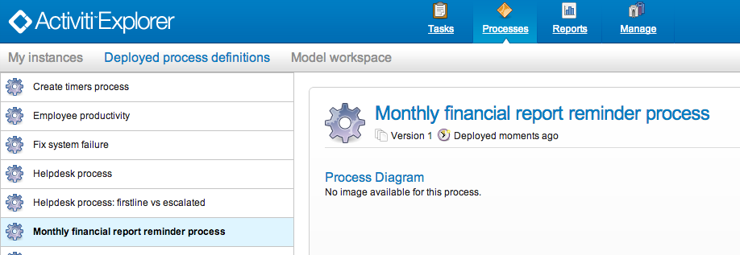
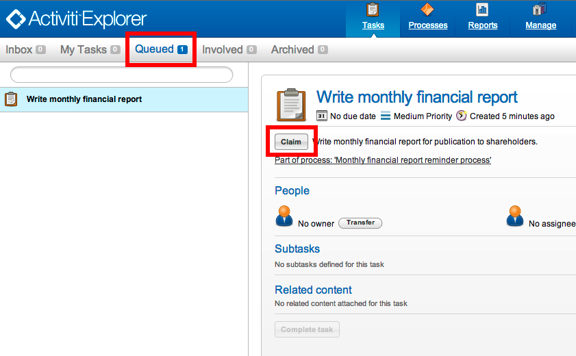

# Chapter 5\. Spring integration 集成 Spring

虽然没有 Spring 你也可以使用 Activiti，但是我们提供了一些非常不错的集成特性。这一章我们将介绍这些特性。

# ProcessEngineFactoryBean

## ProcessEngineFactoryBean

可以把 ProcessEngine 作为一个普通的 Spring bean 进行配置。 类 org.activiti.spring.ProcessEngineFactoryBean 是集成的切入点。 这个 bean 需要一个流程引擎配置来创建流程引擎。这也意味着在文档的配置这一章的介绍属性的创建和配置对于 Spring 来说也是一样的。对于 Spring 集成的配置和流程引擎 bean 看起来像这样：

```java
<bean id="processEngineConfiguration" class="org.activiti.spring.SpringProcessEngineConfiguration">
    ...
</bean>

<bean id="processEngine" class="org.activiti.spring.ProcessEngineFactoryBean">
  <property name="processEngineConfiguration" ref="processEngineConfiguration" />
</bean> 
```

注意现在 processEngineConfiguration 的 bean 是使用 org.activiti.spring.SpringProcessEngineConfiguration 类。

# Transactions 事务

## Transactions 事务

我们将会一步一步地解释在 Spring examples 中公布的 SpringTransactionIntegrationTest 下面是我们使用这个例子的 Spring 配置文件（你可以在 SpringTransactionIntegrationTestcontext.xml 找到它）以下展示的部分包括数据源（dataSource）， 事务管理器（transactionManager），流程引擎（processEngine）和 Activiti 引擎服务。

当把数据源（DataSource）传递给 SpringProcessEngineConfiguration （使用"dataSource"属性） 之后，Activiti 内部使用了一个 org.springframework.jdbc.datasource.TransactionAwareDataSourceProxy 代理来封装传递进来的数据源（DataSource）。这样做是为了确保从数据源（DataSource）获取的 SQL 连接能够与 Spring 的事物结合在一起发挥得更出色。这意味它不再需要在你的 Spring 配置中代理数据源（dataSource）了。 然而它仍然允许你传递一个 TransactionAwareDataSourceProxy 到 SpringProcessEngineConfiguration 中。在这个例子中并不会发生多余的包装。

**为了确保在你的 Spring 配置中申明的一个 TransactionAwareDataSourceProxy，你不能把使用它的应用交给 Spring 事物控制的资源。（例如 DataSourceTransactionManager 和 JPATransactionManager 需要非代理的数据源 ）**

```java
<beans  

       xsi:schemaLocation="http://www.springframework.org/schema/beans   http://www.springframework.org/schema/beans/spring-beans.xsd
                           http://www.springframework.org/schema/context http://www.springframework.org/schema/context/spring-context-2.5.xsd
                           http://www.springframework.org/schema/tx      http://www.springframework.org/schema/tx/spring-tx-3.0.xsd">

  <bean id="dataSource" class="org.springframework.jdbc.datasource.SimpleDriverDataSource">
    <property name="driverClass" value="org.h2.Driver" />
    <property name="url" value="jdbc:h2:mem:activiti;DB_CLOSE_DELAY=1000" />
    <property name="username" value="sa" />
    <property name="password" value="" />
  </bean>

  <bean id="transactionManager" class="org.springframework.jdbc.datasource.DataSourceTransactionManager">
    <property name="dataSource" ref="dataSource" />
  </bean>

  <bean id="processEngineConfiguration" class="org.activiti.spring.SpringProcessEngineConfiguration">
    <property name="dataSource" ref="dataSource" />
    <property name="transactionManager" ref="transactionManager" />
    <property name="databaseSchemaUpdate" value="true" />
    <property name="jobExecutorActivate" value="false" />
  </bean>

  <bean id="processEngine" class="org.activiti.spring.ProcessEngineFactoryBean">
    <property name="processEngineConfiguration" ref="processEngineConfiguration" />
  </bean>

  <bean id="repositoryService" factory-bean="processEngine" factory-method="getRepositoryService" />
  <bean id="runtimeService" factory-bean="processEngine" factory-method="getRuntimeService" />
  <bean id="taskService" factory-bean="processEngine" factory-method="getTaskService" />
  <bean id="historyService" factory-bean="processEngine" factory-method="getHistoryService" />
  <bean id="managementService" factory-bean="processEngine" factory-method="getManagementService" />

... 
```

Spring 配置文件的其余部分包含 beans 和我们将要在这个特有的例子中的配置：

```java
<beans>  
  ...
  <tx:annotation-driven transaction-manager="transactionManager"/>

  <bean id="userBean" class="org.activiti.spring.test.UserBean">
    <property name="runtimeService" ref="runtimeService" />
  </bean>

  <bean id="printer" class="org.activiti.spring.test.Printer" />

</beans> 
```

首先使用任意的一种 Spring 创建应用上下文的方式创建其 Spring 应用上下文。在这个例子中你可以使用类路径下面的 XML 资源来配置我们的 Spring 应用上下文：

```java
ClassPathXmlApplicationContext applicationContext = 
    new ClassPathXmlApplicationContext("org/activiti/examples/spring/SpringTransactionIntegrationTest-context.xml"); 
```

或者, 如果它是一个测试的话:

```java
@ContextConfiguration("classpath:org/activiti/spring/test/transaction/SpringTransactionIntegrationTest-context.xml") 
```

然后我们就可以得到 Activiti 的服务 beans 并且调用该服务上面的方 法。ProcessEngineFactoryBean 将会对该服务添加一些额外的拦截器，在 Activiti 服务上面的方法使用的是 Propagation.REQUIRED 事物语义。所以，我们可以使用 repositoryService 去部署一个流程，如下所示：

```java
RepositoryService repositoryService = (RepositoryService) applicationContext.getBean("repositoryService");
String deploymentId = repositoryService
  .createDeployment()
  .addClasspathResource("org/activiti/spring/test/hello.bpmn20.xml")
  .deploy()
  .getId(); 
```

其他相同的服务也是同样可以这么使用。在这个例子中，Spring 的事物将会围绕在 userBean.hello() 上 ，并且调用 Activiti 服务的方法也会加入到这个事物中。

```java
UserBean userBean = (UserBean) applicationContext.getBean("userBean");
userBean.hello(); 
```

这个 UserBean 看起来像这样。记得在上面 Spring bean 的配置中我们把 repositoryService 注入到 userBean 中。

```java
public class UserBean {

  /** injected by Spring */
  private RuntimeService runtimeService;

  @Transactional
  public void hello() {
    // here you can do transactional stuff in your domain model
    // and it will be combined in the same transaction as 
    // the startProcessInstanceByKey to the Activiti RuntimeService
    runtimeService.startProcessInstanceByKey("helloProcess");
  }

  public void setRuntimeService(RuntimeService runtimeService) {
    this.runtimeService = runtimeService;
  }
} 
```

# Expressions 表达式

## Expressions 表达式

当使用 ProcessEngineFactoryBean 时候，默认情况下，在 BPMN 流程中的所有[表达式](http://www.activiti.org/userguide/index.html#apiExpressions)都将会'看见'所有的 Spring beans。 它可以限制你在表达式中暴露出的 beans 或者甚至可以在你的配置中使用一个 Map 不暴露任何 beans。下面的例子暴露了一个单例 bean（printer），可以把 "printer" 当作关键字使用。**想要不暴露任何 beans，仅仅只需要在 SpringProcessEngineConfiguration 中传递一个空的 list 作为'beans'的属性。当不设置'beans'的属性时，在应用上下文中 Spring beans 都是可以使用的。**

```java
<bean id="processEngineConfiguration" class="org.activiti.spring.SpringProcessEngineConfiguration">
  ...
  <property name="beans">
    <map>
      <entry key="printer" value-ref="printer" />
    </map>
  </property>
</bean>

  <bean id="printer" class="org.activiti.examples.spring.Printer" /> 
```

现在暴露出来的 beans 就可以在表达式中使用：例如，在 SpringTransactionIntegrationTest 中的 hello.bpmn20.xml 展示的是如何使用 UEL 方法表达式去调用 Spring bean 的方法：

```java
<definitions id="definitions" ...>

  <process id="helloProcess">

    <startEvent id="start" />
    <sequenceFlow id="flow1" sourceRef="start" targetRef="print" />

    <serviceTask id="print" activiti:expression="#{printer.printMessage()}" />
    <sequenceFlow id="flow2" sourceRef="print" targetRef="end" />

    <endEvent id="end" />

  </process>

</definitions> 
```

这里的 Printer 看起来像这样：

```java
public class Printer {

  public void printMessage() {
    System.out.println("hello world");
  }
} 
```

并且 Spring bean 的配置（如上文所示）看起来像这样：

```java
<beans ...>
  ...

  <bean id="printer" class="org.activiti.examples.spring.Printer" />

</beans> 
```

# Automatic resource deployment 资源自动部署

## Automatic resource deployment 资源自动部署

Spring 的集成也有一个专门用于对资源部署的特性。在流程引擎的配置中，你可以指定一组资源。当流程引擎被创建的时候， 所有在这里的资源都将会被自动扫描与部署。在这里有过滤以防止资源重新部署，只有当这个资源真正发生改变的时候，它才会向 Activiti 使用的数据库创建新的部署。 这对于很多用例来说，当 Spring 容器经常重启的情况下（例如测试），使用它是非常不错的选择。

这里有一个例子：

```java
<bean id="processEngineConfiguration" class="org.activiti.spring.SpringProcessEngineConfiguration">
  ...
  <property name="deploymentResources" value="classpath*:/org/activiti/spring/test/autodeployment/autodeploy.*.bpmn20.xml" />
</bean>

<bean id="processEngine" class="org.activiti.spring.ProcessEngineFactoryBean">
  <property name="processEngineConfiguration" ref="processEngineConfiguration" />
</bean> 
```

默认，上面的配置会把所有匹配的资源发布到 Activiti 引擎的一个单独发布包下。用来检测防止未修改资源重复发布的机制会作用到整个发布包中。 有时候，这可能不是你想要的。比如，如果你发布了很多流程资源，但是只修改里其中某一个单独的流程定义， 整个发布包都会被认为变更了，导致整个发布包下的所有流程定义都会被重新发布， 结果就是每个流程定义都生成了新版本，虽然其中只有一个流程发生了改变。

为了定制发布方式，你可以为 SpringProcessEngineConfiguration 指定一个额外的参数 deploymentMode。 这个参数指定了匹配多个资源时的发布处理方式。默认下这个参数支持设置三个值：

*   default: 把所有资源放在一个单独的发布包中，对这个发布包进行重复检测。 这是默认值，如果你没有指定参数值，就会使用它。
*   single-resource: 为每个单独的资源创建一个发布包，并对这些发布包进行重复检测。 你可以单独发布每个流程定义，并在修改流程定义后只创建一个新的流程定义版本。
*   resource-parent-folder: 把放在同一个上级目录下的资源发布在一个单独的发布包中，并对发布包进行重复检测。 当需要多资源需要创建发布包，但是需要根据共同的文件夹来组合一些资源时，可以使用它。

这儿有一个例子来演示将 deploymentMode 参数配置为 single-resource 的情况：

```java
<bean id="processEngineConfiguration" class="org.activiti.spring.SpringProcessEngineConfiguration">
  ...
  <property name="deploymentResources" value="classpath*:/activiti/*.bpmn" />
  <property name="deploymentMode" value="single-resource" />
</bean> 
```

如果想使用上面三个值之外的参数值，你需要自定义处理发布包的行为。 你可以创建一个 SpringProcessEngineConfiguration 的子类，重写 getAutoDeploymentStrategy(String deploymentMode) 方 法。 这个方法中处理了对应 deploymentMode 的发布策略

# Unit testing 单元测试

## Unit testing 单元测试

当集成 Spring 时，使用标准的 Activiti 测试工具类是非常容易的对业务流程进行测试。 下面的例子展示了如何在一个典型的基于 Spring 单元测试测试业务流程：

```java
@RunWith(SpringJUnit4ClassRunner.class)
@ContextConfiguration("classpath:org/activiti/spring/test/junit4/springTypicalUsageTest-context.xml")
public class MyBusinessProcessTest {

  @Autowired
  private RuntimeService runtimeService;

  @Autowired
  private TaskService taskService;

  @Autowired
  @Rule
  public ActivitiRule activitiSpringRule;

  @Test
  @Deployment
  public void simpleProcessTest() {
    runtimeService.startProcessInstanceByKey("simpleProcess");
    Task task = taskService.createTaskQuery().singleResult();
    assertEquals("My Task", task.getName());

    taskService.complete(task.getId());
    assertEquals(0, runtimeService.createProcessInstanceQuery().count());

  }
} 
```

注意对于这种方式，你需要在 Spring 配置中（在上文的例子中它是自动注入的）定义一个 org.activiti.engine.test.ActivitiRulebean

```java
<bean id="activitiRule" class="org.activiti.engine.test.ActivitiRule">
  <property name="processEngine" ref="processEngine" />
</bean> 
```

# Annotation-based configuration 基于注解的配置

## Annotation-based configuration 基于注解的配置

[试验] @EnableActiviti 注解相对较新，未来可能会有变更。

除了基于 XML 的配置以外，还可以选择基于注解的方式来配置 Spring 环境。 这与使用 XML 的方法非常相似，除了要使用 @Bean 注解， 而且配置是使用 java 编写的。 它已经可以直接用于 Activiti-Spring 的集成了：

首先介绍（需要 Spring 3.0+ ）的是 @EnableActiviti 注解。 最简单的用法如下所示：

```java
@Configuration
  @EnableActiviti
  public static class SimplestConfiguration {

  } 
```

它会创建一个 Spring 环境，并对 Activiti 流程引擎进行如下配置

*   默认的内存 H2 数据库，启用数据库自动升级。
*   一个简单的 DataSourceTransactionManager
*   一个默认的 SpringJobExecutor
*   自动扫描 processes/ 目录下的 bpmn20.xml 文件。

在这样一个环境里，可以直接通过注入操作 Activiti 引擎：

```java
 @Autowired
  private ProcessEngine processEngine;

  @Autowired
  private RuntimeService runtimeService;

  @Autowired
  private TaskService taskService;

  @Autowired
  private HistoryService historyService;

  @Autowired
  private RepositoryService repositoryService;

  @Autowired
  private ManagementService managementService;

  @Autowired
  private FormService formService; 
```

当然，默认值都可以自定义。比如，如果配置了 DataSource，它就会代替默认创建的数据库配置。 事务管理器，job 执行器和其他组件都与之相同。 比如如下配置：

```java
 @Configuration
  @EnableActiviti
  public static class Config {

    @Bean
    public DataSource dataSource() {
        BasicDataSource basicDataSource = new BasicDataSource();
        basicDataSource.setUsername("sa");
        basicDataSource.setUrl("jdbc:h2:mem:anotherDatabase");
        basicDataSource.setDefaultAutoCommit(false);
        basicDataSource.setDriverClassName(org.h2.Driver.class.getName());
        basicDataSource.setPassword("");
        return basicDataSource;
    }

  } 
```

其他数据库会代替默认的。下面介绍了更加复杂的配置。注意 AbstractActivitiConfigurer 用法， 它暴露了流程引擎的 配置，可以用来对它的细节进行详细的配置。

```java
@Configuration
@EnableActiviti
@EnableTransactionManagement(proxyTargetClass = true)
class JPAConfiguration {

    @Bean
    public OpenJpaVendorAdapter openJpaVendorAdapter() {
        OpenJpaVendorAdapter openJpaVendorAdapter = new OpenJpaVendorAdapter();
        openJpaVendorAdapter.setDatabasePlatform(H2Dictionary.class.getName());
        return openJpaVendorAdapter;
    }

    @Bean
    public DataSource dataSource() {
        BasicDataSource basicDataSource = new BasicDataSource();
        basicDataSource.setUsername("sa");
        basicDataSource.setUrl("jdbc:h2:mem:activiti");
        basicDataSource.setDefaultAutoCommit(false);
        basicDataSource.setDriverClassName(org.h2.Driver.class.getName());
        basicDataSource.setPassword("");
        return basicDataSource;
    }

    @Bean
    public LocalContainerEntityManagerFactoryBean entityManagerFactoryBean(
        OpenJpaVendorAdapter openJpaVendorAdapter, DataSource ds) {
        LocalContainerEntityManagerFactoryBean emf = new LocalContainerEntityManagerFactoryBean();
        emf.setPersistenceXmlLocation("classpath:/org/activiti/spring/test/jpa/custom-persistence.xml");
        emf.setJpaVendorAdapter(openJpaVendorAdapter);
        emf.setDataSource(ds);
        return emf;
    }

    @Bean
    public PlatformTransactionManager jpaTransactionManager(
        EntityManagerFactory entityManagerFactory) {
        return new JpaTransactionManager(entityManagerFactory);
    }

    @Bean
    public AbstractActivitiConfigurer abstractActivitiConfigurer(
        final EntityManagerFactory emf,
        final PlatformTransactionManager transactionManager) {

        return new AbstractActivitiConfigurer() {

            @Override
            public void postProcessSpringProcessEngineConfiguration(SpringProcessEngineConfiguration engine) {
                engine.setTransactionManager(transactionManager);
                engine.setJpaEntityManagerFactory(emf);
                engine.setJpaHandleTransaction(false);
                engine.setJobExecutorActivate(false);
                engine.setJpaCloseEntityManager(false);
                engine.setDatabaseSchemaUpdate(ProcessEngineConfiguration.DB_SCHEMA_UPDATE_TRUE);
            }
        };
    }

    // A random bean
    @Bean
    public LoanRequestBean loanRequestBean() {
        return new LoanRequestBean();
    }
} 
```

# JPA with Hibernate 4.2.x

## JPA with Hibernate 4.2.x

在 Activiti 引擎的 serviceTask 或 listener 中使用 Hibernate 4.2.x JPA 时，需要添加 Spring ORM 这个额外的依赖。 Hibernate 4.1.x 及以下版本是不需要的。应该添加如下依赖：

```java
<dependency>
  <groupId>org.springframework</groupId>
  <artifactId>spring-orm</artifactId>
  <version>${org.springframework.version}</version>
</dependency> 
```

# Business archives 业务文档

## Business archives 业务文档

为了部署流程，它们不得不包装在一个业务文档中。一个业务文档是 Activiti 引擎部署的单元。一个业务文档相当与一个压缩文件，它包含 BPMN2.0 流程，任务表单，规则和其他任意类型的文件。 大体上，业务文档是包含命名资源的容器。

当一个业务文档被部署，它将会自动扫描以 .bpmn20.xml 或者.bpmn 作为扩展名的 BPMN 文件。每个那样的文件都将会被解析并且可能会包含多个流程定义。

*注意*

*业务归档中的 Java 类将**不能够添加到类路径下**。为了能够让流程运行，必须把存在于业务归档程中的流程定义使用的所有自定义的类（例如：Java 服务任务或者实现事件的监听器）放在 activiti 引擎的类路径下*

### Deploying programmatically 编程式部署

通过一个压缩文件部署业务归档，它看起来像这样：

```java
String barFileName = "path/to/process-one.bar";
ZipInputStream inputStream = new ZipInputStream(new FileInputStream(barFileName));

repositoryService.createDeployment()
    .name("process-one.bar")
    .addZipInputStream(inputStream)
    .deploy(); 
```

它也可以通过一个独立资源构建部署。 详细信息请查看 javadocs。

### Deploying with Activiti Explorer 通过 Activiti Explorer 控制台部署

Activiti web 控制台允许你通过 web 界面的用户接口上传一个 bar 格式的压缩文件（或者一个 bpmn20.xml 格式的文件）。 选择 Management 标签,点击 Deployment:


现在将会有一个弹出窗口允许你从电脑上面选择一个文件，或者你可以简单的拖拽到指定的区域（如果你的浏览器支持）。


# External resources 外部资源

## External resources 外部资源

流程定义保存在 Activiti 所支持的数据库中。当使用服务任务、执行监听器或者从 Activiti 配置文件中配置的 Spring beans 时，流程定义能够引用这些委托类。 这些类或者 Spring 配置文件对于所有流程引擎中可能执行的流程定义必须是可用的。

### Java classes

当流程实例被启动的时候，在流程中被使用的所有自定义类（例如：服务任务中使用的 JavaDelegates、事件监听器、任务监听器,...）应该存在与流程引擎的类路径下。

然后，在部署业务文档时，这些类不必都存在于类路径下。当使用 Ant 部署一个新的业务文档时，这意味着你的委托类不必存在与类路径下。

当你使用示例设置并添加你自定义的类，你应该添加包含自定义类的 jar 包到 activitiexplorer 控制台或者 activiti-rest 的 webapp lib 文件夹中。以及不要忽略包含你自定义类的依赖关系（如果有）。另外，你还可以包含你自己的依赖添加到你的 Tomcat 容器的安装目录中的 ${tomcat.home}/lib。

### Using Spring beans from a process 在流程中使用 Spring beans

当表达式或者脚本使用 Spring beans 时，这些 beans 对于引擎执行流程定义时必须是可用的。如果你将要构建你自己的 web 应用并且按照 Spring 集成这一章中描述那样在你的应用上下文配置流程引擎，这个看上去非常的简单。但是要记住，如果你也在使用 Activiti rest web 应用，那么也应该更新 Activiti rest web 应用的上下文。 你可以把在 activiti-rest/lib/activiti-cfg.jar 文件中的 activiti.cfg.xml 替换成你的 Spring 上下文配置的 activiti-context.xml 文件。

### Creating a single app 创建独立应用

你可以考虑把 Activiti rest web 应用加入到你的 web 应用之中，因此，就仅仅只需要配置一个 ProcessEngine，从而不用确保所有的流程引擎的所有委托类在类路径下面并且是否使用正确的 spring 配置。

# Versioning of process definitions 流程定义的版本

## Versioning of process definitions 流程定义的版本

BPMN 中并没有版本的概念，没有版本也是不错的，因为可执行的 BPMN 流程作为你开发项目的一部分存在版本控制系统的知识库中（例如 SVN,Git 或者 Mercurial ）。 而在 Activiti 中，流程定义的版本是在部署时创建的。在部署的时候，流程定义被存储到 Activiti 使用的数据 库之前，Activiti 将会自动给 流程定义 分配一个版本号。

对于业务文档中每一个的流程定义，都会通过下列部署执行初始化属性 key, version, name 和 id:

*   XML 文件中流程定义（流程模型）的 id 属性被当做是流程定义的 key 属性。
*   XML 文件中的流程模型的 name 属性被当做是流程定义的 name 属性。如果该 name 属性并没有指定，那么 id 属性被当做是 name。
*   带有特定 key 的流程定义在第一次部署的时候，将会自动分配版本号为 1，对于之后部署相同 key 的流程定义时候，这次部署的版本号将会设置为比当前最大的版本号大 1 的值。该 key 属性被用来区别不同的流程定义。
*   流程定义中的 id 属性被设置为 {processDefinitionKey}:{processDefinitionVersion}: {generated-id}, 这里的 generated-id 是一个唯一的数字被添加，用于确保在集群环境中缓存的流程定义的唯一性。

看下面示例

```java
<definitions id="myDefinitions" >
  <process id="myProcess" name="My important process" >
    ... 
```

当部署了这个流程定义之后，在数据库中的流程定义看起来像这样：

Table 6.1\.

| id | key | name | version |
| --- | --- | --- | --- |
| myProcess:1:676 | myProcess | My important process | 1 |

假设我们现在部署用一个流程的最新版本号（例如 改变用户任务），但是流程定义的 id 保持不变。 流程定义表将包含以下列表信息：

Table 6.2\.

| id | key | name | version |
| --- | --- | --- | --- |
| myProcess:1:676 | myProcess | My important process | 1 |
| myProcess:2:870 | myProcess | My important process | 2 |

当 runtimeService.startProcessInstanceByKey("myProcess") 方法被调用时，它将会使用流程定义版本号为 2 的，因为这是最新版本的流程定义。可以说每次流程定义创建流程实例时，都会默认使用最新版本的流程定义。

我们应该创建第二个流程，在 Activiti 中，如下,定义并且部署它，该流程定义会添加到流程定义表中

```java
<definitions id="myNewDefinitions" >
  <process id="myNewProcess" name="My important process" >
    ... 
```

表格如下：

Table 6.3\.

| id | key | name | version |
| --- | --- | --- | --- |
| myProcess:1:676 | myProcess | My important process | 1 |
| myProcess:2:870 | myProcess | My important process | 2 |
| myNewProcess:1:1033 | myNewProcess | My important process | 1 |

注意：为何新流程的 key 与我们的第一个流程是不同的。尽管流程定义的名称是相同的（当然，我们应该也是可以改变这一点的），Activiti 仅仅只考虑 id 属性判断流程。因此，新的流程定义部署的版本号为 1。

# Providing a process diagram 提供流程图

## Providing a process diagram 提供流程图

流程定义的流程图可以被添加到部署中，该流程图将会持久化到 Activiti 所使用的数据库中并且可以通过 Activiti 的 API 进行访问。该流程图也可以被用来在 Activiti Explorer 控制台中的流程中进行显示。 如果在我们的类路径下面有一个流程，org/activiti/expenseProcess.bpmn20.xml ，该流程定义有 一个流程 key 'expense'。 以下遵循流程定义图片的命名规范（按照这个特地顺序）：

*   如果在部署时一个图片资源已经存在，它是 BPMN2.0 的 XML 文件名后面是流程定义的 key 并且是一个图片的后缀。那么该图片将被使用。在我们的例子中， 这应该是 org/activiti/expenseProcess.expense.png（或者 jpg/gif）。如果你在一个 BPMN2.0 XML 文件中定义多个流 程定义图片，这种方式更有意义。每个流程定义图片的文件名中都将会有一个流程定义 key。
*   如果并没有这样的图片存在，部署的时候寻找与匹配 BPMN2.0 XML 文件的名称的图片资 源。在我们的例子中，这应该是 org/activiti/expenseProcess.png. 注意：这意味着在同一个 BPMN2.0 XML 文件夹中的**每个流程定义**都会有相同的流程定义图片。因此，在每一个 BPMN 2.0 XML 文件夹中仅仅只有一个流程定义，这绝对是不会有问题的。

当使用编程式的部署方式：

```java
repositoryService.createDeployment()
  .name("expense-process.bar")
  .addClasspathResource("org/activiti/expenseProcess.bpmn20.xml")
  .addClasspathResource("org/activiti/expenseProcess.png")
  .deploy(); 
```

接下来，可以通过 API 来获取流程定义图片资源：

```java
ProcessDefinition processDefinition = repositoryService.createProcessDefinitionQuery()
                                                         .processDefinitionKey("expense")
                                                         .singleResult();

  String diagramResourceName = processDefinition.getDiagramResourceName();
  InputStream imageStream = repositoryService.getResourceAsStream(processDefinition.getDeploymentId(), diagramResourceName); 
```

# Generating a process diagram 生成流程图

## Generating a process diagram 生成流程图

在部署时没有提供图片的情况下，在 上一节中描述,如果流程定义中包含必要的'图像交换'信息时，Activiti 流程引擎竟会自动生成一个图像。

该资源可以按照部署时 提供流程图片完全相同的方式获取。


如果，因为某种原因，在部署的时候，并不需要或者不必要生成流程定义图片，那么就需要在流程引擎配置的属性中使用 isCreateDiagramOnDeploy：

```java
<property name="createDiagramOnDeploy" value="false" /> 
```

现在图就不会生成了

# Category 类别

## Category 类别

部署和流程定义都是用户定义的类别。流程定义类别在 BPMN 文件中属性的初始化的值 <definitions ... targetNamespace="yourCategory" ... 部署类别是可以直接使用 API 进行指定的看起来想这样：

```java
repositoryService
    .createDeployment()
    .category("yourCategory")
    ...
    .deploy(); 
```

# What is BPMN? 什么是 BPMN

## What is BPMN 什么是 BPMN

见[FAQ 中关于 BPMN 2.0 部分](http://activiti.org/faq.html#WhatIsBpmn20)

# Defining a process 定义流程

## Defining a process 定义流程

*注意*

*文章假设你在使用 Eclipse IDE [[http://eclipse.org/]来创建和编辑文件。](http://eclipse.org/]来创建和编辑文件。) 不过，其中只用到了 Eclipse 很少的特性。你可以使用喜欢的任何工具来创建包含 BPMN 2.0 的 xml 文件。*

创建一个新的 XML 文件（右击任何项目选择“新建”->“其他”->“XML-XML 文件”）并命名。 确认文件后缀为 **.bpmn20.xml 或 .bpmn**， 否则引擎无法发布。


BPMN 2.0 根节点是 definitions 节点。 这个元素中，可以定义多个流程定义（不过我们建议每个文件只包含一个流程定义， 可以简化开发过程中的维护难度）。 一个空的流程定义看起来像下面这样。注意，definitions 元素 最少也要包含 xmlns 和 targetNamespace 的声明。targetNamespace 可以是任意值，它用来对流程实例进行分类。

```java
<definitions 

  targetNamespace="Examples">

  <process id="myProcess" name="My First Process">
    ..
  </process>

</definitions> 
```

你也可以选择添加线上的 BPMN 2.0 格式位置， 下面是 ecilpse 中的 xml 配置。

```java
 xsi:schemaLocation="http://www.omg.org/spec/BPMN/20100524/MODEL 
                    http://www.omg.org/spec/BPMN/2.0/20100501/BPMN20.xsd 
```

process 元素有两个属性：

*   id：这个属性是必须的， 它对应着 Activiti ProcessDefinition 对象的 key 属性。id 可以用来启动流程定义的流程实例，通过 RuntimeService 的 startProcessInstanceByKey 方法。这个方法会一直使用最新发布版本的流程定义(译者注：实际中一般都使用这种方式启动流程)。

    ProcessInstance processInstance = runtimeService.startProcessInstanceByKey("myProcess");

注意，它和 startProcessInstanceById 方法不同。 这个方法期望使用 Activiti 引擎在发布时自动生成的 id。可以通过调用 processDefinition.getId() 方法获得这个值。 生成的 id 的格式为'key:version'， 最大长度限制为 64 个字符， 如果你在启动时抛出了一个 ActivitiException，说明生成的 id 太长了， 需要限制流程的 key 的长度。

*   name：这个属性是可选的，对应 ProcessDefinition 的 name 属性。 引擎自己不会使用这个属性，它可以用来在用户接口显示便于阅读的名称。

# Getting started 10 minute tutorial 快速开始-十分钟教程

## Getting started 10 minute tutorial 快速开始-十分钟教程

这张我们会演示一个（非常简单）的业务流程，我们会通过它介绍一些基本的 Activiti 概念和 API。

### Prerequisites 前提

教程假设你已经能安装并运行 Activiti demo， 并且你使用了独立运行的 H2 服务器。修改 db.properties，设置其中的 jdbc.url=jdbc:h2:tcp://localhost/activiti，然后根据 [H2 的文档](http://www.h2database.com/html/tutorial.html#using_server)启动独立服务器。

### Goal 目标

教程的目标是学习 Activiti 和一些基本的 BPMN 2.0 概念。 最终结果是一个简单的 Java SE 程序可以发布流程定义， 通过 Activiti 引擎 API 操作流程。 我们也会使用一些 Activiti 相关的工具。当然，我们在教程中所学的 也可以用于你构建自己的业务流程 web 应用。

### Use case 用例

用例很直接：我们有一个公司，就叫 BPMCorp。 在 BPMCorp 中，每个月都要给公司领导一个金融报表。 由会计部门负责。 当报表完成时，一个上级领导需要审批文档， 然后才能发给所有领导。

### Process diagram 流程图

上面描述的业务流程可以用 Activiti Designer 进行可视化设计。 然后，为了这个教程，我们会手工编 写 XML，这样可以学到更多知识细节。 我们流程的图形化 BPMN 2.0 标记看起来像这样：


我们看到有[空开始事件](http://activiti.org/userguide/index.html#bpmnNoneStartEvent)（左侧圆圈）, 后面是两个[用户任务](http://activiti.org/userguide/index.html#bpmnUserTask)： “制作月度财报”和 “验证月度财报”，最后是 [空结束事件](http://activiti.org/userguide/index.html#bpmnNoneEndEvent)（右侧粗线圆圈）

### XML representation 内容

业务流程的 XML 内容（FinancialReportProcess.bpmn20.xml）如下所示： 很容易找到流程的主要元素（点击链接可以了解 BPMN 2.0 结构的详细信息）：

*   （空）[开始事件](http://activiti.org/userguide/index.html#bpmnNoneStartEvent) 是我们流程的入口。
*   个[用户任务](http://activiti.org/userguide/index.html#bpmnUserTask)是流程中与操作者相关的任务声明。 注意第一个任务分配给 accountancy 组， 第二个任务分配给 management 组。 [参考用户任务分配章节](http://activiti.org/userguide/index.html#bpmnUserTaskAssignment) 了解更多关于用户任务分配人员和群组的问题。
*   当流程达到[空结束事件](http://activiti.org/userguide/index.html#bpmnNoneEndEvent)就会结束。
*   这些元素都使用[连线连接](http://activiti.org/userguide/index.html#bpmnSequenceFlow)。 这些连线拥有 source 和 target 属性， 定义了连线的方向

    <definitions id="definitions" targetnamespace="http://activiti.org/bpmn20" class="calibre27"><process id="financialReport" name="Monthly financial report reminder process" class="calibre27"><startevent id="theStart" class="calibre27"><sequenceflow id="flow1" targetref="writeReportTask" sourceref="theStart" class="calibre27"><usertask id="writeReportTask" name="Write monthly financial report" class="calibre27"><documentation class="calibre27">Write monthly financial report for publication to shareholders.</documentation> <potentialowner class="calibre27"><resourceassignmentexpression class="calibre27"><formalexpression class="calibre27">accountancy</formalexpression></resourceassignmentexpression></potentialowner></usertask> <sequenceflow id="flow2" targetref="verifyReportTask" sourceref="writeReportTask" class="calibre27"><usertask id="verifyReportTask" name="Verify monthly financial report" class="calibre27"><documentation class="calibre27">Verify monthly financial report composed by the accountancy department. This financial report is going to be sent to all the company shareholders.</documentation> <potentialowner class="calibre27"><resourceassignmentexpression class="calibre27"><formalexpression class="calibre27">management</formalexpression></resourceassignmentexpression></potentialowner></usertask></sequenceflow></sequenceflow></startevent></process></definitions>

### Starting a process instance 启动一个流程实例

现在我们创建好了业务流程的流程定义。 有了这个流程定义，我们可以创建流程实例了。这时，一个流程实例对应了特定月度财报的创建和审批。 所有流程实例都共享同一个流程定义。

为了使用流程定义创建流程实例， 首先要发布业务流程， 这意味着两方面：

*   流程定义会保存到持久化的数据存储里， 是为你的 Activiti 引擎特别配置。所以部署好你的业务流程， 我们就能确认引擎重启后还能找到流程定义。
*   BPMN 2.0 流程文件会解析成内存对象模型， 可以通过 Activiti API 操作。可以通过发布章节获得关于发布的更多信息。 就像章节里描述的一样，有很多种方式可以进行发布。 一种方式是通过下面的 API。注意所有与 Activiti 引擎的交互都是通过 services。

    Deployment deployment = repositoryService.createDeployment()

    ```java
    .addClasspathResource("FinancialReportProcess.bpmn20.xml")
    .deploy(); 
    ```

现在我们可以启动一个新流程实例， 使用我们定义在流程定义里的 id（对应 XML 文件中的 process 元素）。 注意这里的 id 对于 Activiti 来说， 应该叫做 key（译者注：一般在流程模型中使用的 ID，在 Activiti 中都是 Key，比如任务 ID 等...）。

```java
ProcessInstance processInstance = runtimeService.startProcessInstanceByKey("financialReport"); 
```

这会创建一个流程实例，首先进入开始事件。 开始事件之后，它会沿着所有的外出连线（这里只有一条）执行， 到达第一个任务（“制作月度财报”）。 Activiti 会把一个任务保存到数据库里。 这时，分配到这个任务的用户或群组会被解析，也会保存到数据库里。 需要注意，Activiti 引擎会继续执行流程的环节，除非遇到一个 等待状态，比如用户任务。 在等待状态下，当前的流程实例的状态会保存到数据库中。 直到用户决定完成任务才能改变这个状态。这时，引擎会继续执行， 直到遇到下一个等待状态，或流程结束。 如果中间引擎重启或崩溃， 流程状态也会安全的保存在数据库里。

任务创建之后，startProcessInstanceByKey 会在到达用户任务 这个等待状态之后才会返回。这时，任务分配给了一个组， 这意味着这个组是执行这个任务的候选组。

我们现在把所有东西都放在一起，来创建一个简单的 java 程序。 创建一个 eclipse 项目，把 Activiti 的 jar 和依赖放到 classpath 下。 （这些都可以在 Activiti 发布包的 libs 目录下找到）。 在调用 Activiti 服务之前，我们必须构造一个 ProcessEngine， 它可以让我们访问服务。这里我们使用'单独运行'的配置， 这会使用 demo 安装时的数据库来构建 ProcessEngine。

你可以在[这里](http://activiti.org/userguide/images/FinancialReportProcess.bpmn20.xml)下载流程定义 XML。 这个文件包含了上面介绍的 XML，也包含了必须的 BPMN 图像交换信息 以便在 Activiti 工具中能编辑流程。

```java
public static void main(String[] args) {

  // Create Activiti process engine
  ProcessEngine processEngine = ProcessEngineConfiguration
    .createStandaloneProcessEngineConfiguration()
    .buildProcessEngine();

  // Get Activiti services
  RepositoryService repositoryService = processEngine.getRepositoryService();
  RuntimeService runtimeService = processEngine.getRuntimeService();

  // Deploy the process definition
  repositoryService.createDeployment()
    .addClasspathResource("FinancialReportProcess.bpmn20.xml")
    .deploy();

  // Start a process instance
  runtimeService.startProcessInstanceByKey("financialReport");
} 
```

### Task lists 任务列表

我们现在可以通过 TaskService 来获得任务了，添加以下逻辑：

```java
List<Task> tasks = taskService.createTaskQuery().taskCandidateUser("kermit").list(); 
```

注意我们传入的用户必须是 accountancy 组的一个成员， 要和流程定义中向对应：

```java
<potentialOwner>
    <resourceAssignmentExpression>
        <formalExpression>accountancy</formalExpression>
    </resourceAssignmentExpression>
</potentialOwner> 
```

我们也可以使用群组名称，通过任务查询 API 来获得相关的结果。 现在可以在代码中添加如下逻辑：

```java
TaskService taskService = processEngine.getTaskService();
List<Task> tasks = taskService.createTaskQuery().taskCandidateGroup("accountancy").list(); 
```

因为我们配置的 ProcessEngine 使用了与 demo 相同的数据， 我们可以登录到 [Activiti Explorer](http://localhost:8080/activiti-explorer/)。 默认，accountancy（会计）组里没有任何人。使用 kermit/kermit 登录，点击组，并创建一个新组。 然后点击用户，把组分配给 fozzie。现在使 用 fozzie/fozzie 登录，现在我们就可以启动我们的业务流程了， 选择 Processes 页，在'月度财报'的'操作'列 点击'启动流程'。



和上面介绍的那样，流程会执行到第一个用户任务。因为我们以 kermit 登录， 在启动流程实例之后，就可以看到有了一个新的待领任务。 选择任务页来查看这条新任务。 注意即使流程被其他人启动，任务还是会被会计组里的所有人作为一个候选任务看到。


### Claiming the task 领取任务

现在一个会计要认领这个任务。 认领以后，这个用户就会成为任务的执行人 ， 任务会从 accountancy 组的其他成员的任务列表中消失。 认领任务的代码如下所示：

```java
taskService.claim(task.getId(), "fozzie"); 
```

任务会进入认领任务人的个人任务列表中。

```java
List<Task> tasks = taskService.createTaskQuery().taskAssignee("fozzie").list(); 
```

在 Activiti Explorer UI 中，点击认领按钮，会执行相同的操作。 任务会移动到登录用户的个人任务列表。 你也会看到任务的执行人已经变成当前登陆的用户



### Completing the task 完成任务

现在会计可以开始进行财报的工作了。报告完成后，他可以完成任务，意味着任务所需的所有工作都完成了

```java
taskService.complete(task.getId()); 
```

对于 Activiti 引擎，需要一个外部信息来让流程实例继续执行。 任务会把自己从运行库中删除。 流程会沿着单独一个外出连线执行，移动到第二个任务（'审批报告'）。 与第一个任务相同的机制会使用到第二个任务上， 不同的是任务是分配给 management 组。

在 demo 中，完成任务是通过点击任务列表中的完成按钮。 因为 Fozzie 不是会计，我们先从 Activiti Explorer 注销 然后使用 kermit 登陆（他是经理）。 第二个任务会进入未分配任务列表。

### Ending the process 结束流程

审批任务可以像之前介绍的一样查询和领取。 完成第二个任务会让流程执行到结束事件，就会结束流程实例。 流程实例和所有相关的运行数据都会从数据库中删除。

登录 Activiti Explorer 就可以进行验证， 可以看到保存流程运行数据的表中已经没有数据了。


通过程序，你也可以使用 historyService 判断流程已经结束了。

```java
HistoryService historyService = processEngine.getHistoryService();
HistoricProcessInstance historicProcessInstance = 
historyService.createHistoricProcessInstanceQuery().processInstanceId(procId).singleResult();
System.out.println("Process instance end time: " + historicProcessInstance.getEndTime()); 
```

### Code overview 代码总结

把上述代码组合在一起，获得的代码如下所示 （这些代码考虑到你可能会在 Activiti Explorer UI 中启动一些流程实例。 这样，它会获得多个任务，而不是一个， 所以代码可以一直正常运行）：

```java
public class TenMinuteTutorial {

  public static void main(String[] args) {

    // Create Activiti process engine
    ProcessEngine processEngine = ProcessEngineConfiguration
      .createStandaloneProcessEngineConfiguration()
      .buildProcessEngine();

    // Get Activiti services
    RepositoryService repositoryService = processEngine.getRepositoryService();
    RuntimeService runtimeService = processEngine.getRuntimeService();

    // Deploy the process definition
    repositoryService.createDeployment()
      .addClasspathResource("FinancialReportProcess.bpmn20.xml")
      .deploy();

    // Start a process instance
    String procId = runtimeService.startProcessInstanceByKey("financialReport").getId();

    // Get the first task
    TaskService taskService = processEngine.getTaskService();
    List<Task> tasks = taskService.createTaskQuery().taskCandidateGroup("accountancy").list();
    for (Task task : tasks) {
      System.out.println("Following task is available for accountancy group: " + task.getName());

      // claim it
      taskService.claim(task.getId(), "fozzie");
    }

    // Verify Fozzie can now retrieve the task
    tasks = taskService.createTaskQuery().taskAssignee("fozzie").list();
    for (Task task : tasks) {
      System.out.println("Task for fozzie: " + task.getName());

      // Complete the task
      taskService.complete(task.getId());
    }

    System.out.println("Number of tasks for fozzie: " 
            + taskService.createTaskQuery().taskAssignee("fozzie").count());

    // Retrieve and claim the second task
    tasks = taskService.createTaskQuery().taskCandidateGroup("management").list();
    for (Task task : tasks) {
      System.out.println("Following task is available for accountancy group: " + task.getName());
      taskService.claim(task.getId(), "kermit");
    }

    // Completing the second task ends the process
    for (Task task : tasks) {
      taskService.complete(task.getId());
    }

    // verify that the process is actually finished
    HistoryService historyService = processEngine.getHistoryService();
    HistoricProcessInstance historicProcessInstance = 
      historyService.createHistoricProcessInstanceQuery().processInstanceId(procId).singleResult();
    System.out.println("Process instance end time: " + historicProcessInstance.getEndTime());
  }

} 
```

这段代码包含在实例中的一个单元测试中（是的，你可以运行单元测试来测试你的流程。 参考单元测试章节来了解更多信息）

### Future enhancements 未来的增强

可以看到业务流程相对于现实来说太简单了。 然而，你可以了解 Activiti 中的 BPMN 2.0 结构， 你可以考虑对业务流程进行以下方面的加强：

*   定义**网关**来实现决策环节。 这样，经理可以驳回财报， 重新给会计创建一个任务。
*   考虑使用**变量**， 这样我们可以保存或引用报告， 把它显示到表单中。
*   在流程最后加入**服务任务**， 把报告发给每个领导。
*   其它