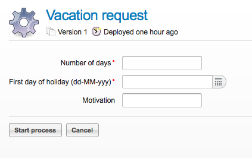

# Chapter 9\. Forms 表单

Activiti 提供了一种方便而且灵活的方式在业务流程中以手工方式添加表单。我们对表单的 支持有 2 种方式： 通过表单属性对内置表单进行渲染和外置表单进行渲染。

# Form properties 表单属性

## Form properties 表单属性

业务流程相关联的所有信息要么是包含自身的流程变量，要么是通过流程变量的引用。Activiti 支持存储复杂的 Java 对象作为流程变量，如 Serializable（序列化）对象， Jpa 实体对象或者整个 XML 文档作为字符串。

用户是在启动一个流程和完成用户任务时，与流程进行交互的。表单需要某个 UI 技术渲染之后才能够与用户进行交互。为了能够使用不同 UI 技术变得容易，流程定义包含一个对流程变量中复杂的 Java 类型对象到一个`properties`的 `Map<String,String>`类型的转换逻辑。

使用 Activiti API 的方法查看公开的属性信息。然后，任意 UI 技术都能够在这些属性上面构建一个表单。该属性专门（并且更多局限性）为流程变量提供了一个视图。 表单所需要显示的属性可以从下面例子中的返回值 FormData 中获取。

```java
StartFormData FormService.getStartFormData(String processDefinitionId) 
```

或者

```java
TaskFormdata FormService.getTaskFormData(String taskId) 
```

在默认情况下，内置的表单引擎，这些属性就像对流程变量一样。如果任务表单属性和流程变量是一对一的关系，那么任务表单属性就不需要进行申明了，例如，下面的申明：

```java
<startEvent id="start" /> 
```

当执行到开始事件时，所有的流程变量都是可用的，但

```java
formService.getStartFormData(String processDefinitionId).getFormProperties() 
```

会是一个空值，因为没有定义具体的映射。

在上面的实例中，所有被提交的属性都将会作为流程变量被存储在 Activiti 使用的数据库中。这意味着在一个表单中新添加一个简单的 input 输入字段，也会作为一个新的变量被存储。

属性来自于流程变量，但不一定非要作为流程变量存储起来，例如，一个流程变量可能是 JPA 实体如类 Address。在某种 UI 技术中使用的表单属性 StreetName 可能会关联到一个表达式`#{address.street}`。

类似的，用户提交的表单属性应该作为流程变量进行存储或者使用 UEL 值表达式将其作为流程变量的一个嵌套属性进行存储，例如`#{address.street}`。

同样的，提交的表单属性默认的行为是作为流程变量进行存储，除非一个 `formProperty` 申明了其他的规则。

类型转换同样也可以应用于表单数据和流程变量之间处理的一部分。

举例

```java
<userTask id="task">
  <extensionElements>
    <activiti:formProperty id="room" />
    <activiti:formProperty id="duration" type="long"/>
    <activiti:formProperty id="speaker" variable="SpeakerName" writable="false" />
    <activiti:formProperty id="street" expression="#{address.street}" required="true" />
  </extensionElements>
</userTask> 
```

*   表单属性 room 将会被映射为 String 类型流程变量 room。
*   表单属性 duration 将会被映射为 java.lang.Long 类型流程变量 duration。
*   表单属性 speaker 将会被映射为流程变量 SpeakerName。它只能够在 TaskFormData 对象中使用。如果 属性 speaker 提交，将会抛出一个 ActivitiException 的异常。类似的，将其属性设置为 readable="false",该属性就会在 FormData 进行排除，但是在提交后仍然会对其进行处理。
*   表单属性 street 将会映射为 Java Bean address 的属性 street 作为 String 类型的流程变量。 当提交的表单属性并没有提供并且 required="true" 时，那么就会抛出一个异常。

表单数据也可以作为 FormData 的一部分提供类型元数据。该 FormData 可以从 StartFormData FormService.getStartFormData(String processDefinitionId)和 TaskFormdata FormService.getTaskFormData(String taskId) 方法的返回值中获取。

我们支持以下的几种表单属性类型：

*   string (org.activiti.engine.impl.form.StringFormType
*   long (org.activiti.engine.impl.form.LongFormType)
*   enum (org.activiti.engine.impl.form.EnumFormType)
*   date (org.activiti.engine.impl.form.DateFormType)
*   boolean (org.activiti.engine.impl.form.BooleanFormType)

对于申明每一个表单属性，以下的 FormProperty 信息可以通过 List <formproperty class="calibre27">formService.getStartFormData(String processDefinitionId).getFormProperties() 和 List <formproperty class="calibre27">formService.getTaskFormData(String taskId).getFormProperties() 获取。</formproperty></formproperty>

```java
public interface FormProperty {
  /** the key used to submit the property in {@link FormService#submitStartFormData(String, java.util.Map)}
   * or {@link FormService#submitTaskFormData(String, java.util.Map)} */
  String getId();
  /** the display label */
  String getName();
  /** one of the types defined in this interface like e.g. {@link #TYPE_STRING} */
  FormType getType();
  /** optional value that should be used to display in this property */
  String getValue();
  /** is this property read to be displayed in the form and made accessible with the methods
   * {@link FormService#getStartFormData(String)} and {@link FormService#getTaskFormData(String)}. */
  boolean isReadable();
  /** is this property expected when a user submits the form? */
  boolean isWritable();
  /** is this property a required input field */
  boolean isRequired();
} 
```

举例

```java
<startEvent id="start">
  <extensionElements>
    <activiti:formProperty id="speaker"
      name="Speaker"
      variable="SpeakerName"
      type="string" />

    <activiti:formProperty id="start"
      type="date"
      datePattern="dd-MMM-yyyy" />

    <activiti:formProperty id="direction" type="enum">
      <activiti:value id="left" name="Go Left" />
      <activiti:value id="right" name="Go Right" />
      <activiti:value id="up" name="Go Up" />
      <activiti:value id="down" name="Go Down" />
    </activiti:formProperty>

  </extensionElements>
</startEvent> 
```

所有的表单属性的信息都是可以通过 API 进行访问的。可以通过 formProperty.getType().getName() 获取类型的名称。 甚至可以通过 formProperty.getType().getInformation("datePattern") 获取日期的匹配方式。通过 formProperty.getType().getInformation("values") 可以获取到枚举值。

Activiti 控制台支持表单属性并且可以根据表单定义对表单进行渲染。例如下面的 XML 片段

```java
<startEvent>
  <extensionElements>
    <activiti:formProperty id="numberOfDays" name="Number of days" value="${numberOfDays}" type="long" required="true"/>
    <activiti:formProperty id="startDate" name="First day of holiday (dd-MM-yyy)" value="${startDate}" datePattern="dd-MM-yyyy hh:mm" type="date" required="true" />
    <activiti:formProperty id="vacationMotivation" name="Motivation" value="${vacationMotivation}" type="string" />
  </extensionElements>
</userTask> 
```

当使用 Activiti 控制台时，它将会被渲染成流程的启动表单。



# External form rendering 外部表单的渲染

## External form rendering 外部表单的渲染

该 API 同样也允许你执行 Activiti 流程引擎之外的方式渲染你自己的任务表单。这些步骤说明你可以用你自己的方式对任务表单进行渲染。

本质上，所有需要渲染的表单属性都是通过 2 个服务方法中的一个进行装配的： StartFormData FormService.getStartFormData(String processDefinitionId) 和 TaskFormdata FormService.getTaskFormData(String taskId)

表单属性可以通过 ProcessInstance FormService.submitStartFormData(String processDefinitionId,Map <stringu0002cstring class="calibre27">properties) 和 void FormService.submitStartFormData(String taskId,Map <stringu0002cstring class="calibre27">properties)2 种方式进行提交。</stringu0002cstring></stringu0002cstring>

想要了解更多表单属性如何映射为流程变量，可以查看 第 9.1 节 “表单属性”

你可以将任何表单模版资源放进你要部署的业务文档之中（如果你想要将它们按照流程的版本进行存储）。它将会在部署中作为一种可用的资源。你可以使用 String ProcessDefinition.getDeploymentId() 和 InputStream RepositoryService.getResourceAsStream(String deploymentId, String resourceName); 获取部署上去的表单模版。这样就可以获取你的表单模版定义文件 ，那么你就可以在你自己的应用中渲染/显示你的表单。

你也可以使用该功能获取任务表单之外的其他的部署资源用于其他的目的。 属性`<userTask activiti:formKey="..."`通过 API String FormService.getStartFormData(String processDefinitionId).getFormKey() 和 String FormService.getTaskFormData(String taskId).getFormKey()暴 露出来的。 你可以使用这个存储你部署的模版中的全名（例如`org/activiti/example/form/mycustom-form.xml`）,但是这并不是必须的。 例如，你可以在表单属性中存储一个通用的 key，然后运用一种算法或者换转去得到你实际使用的模版。当你想要通过不同 UI 技术渲染不能的表 单，这可能更加方便，例如，使用正常屏幕大小的 web 应用程序的表单，移动手机小屏幕的表单和甚至可能是 IM 表单和 email 表单模版。