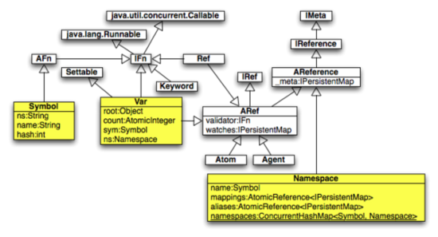

# 命名空间

## 命名空间

Java 用 class 来组织方法， 用包来组织 class。Clojure 用名字空间来组织事物。“事物”包括 Vars, Refs, Atoms, Agents, 函数, 宏 以及名字空间本身。

符号(Symbols)是用来给函数、宏以及 binding 来分配名字的。符号被划分到名字空间里面去了。 任何时候总有一个默认的名字空间，初始化的时候这个默认的名字空间是“user”，这个默认的名字空间的值被保存在特殊符号 `*ns*` .里面。默认的名字空间可以通过两种方法来改变。 `in-ns` 函数只是改变它而已. 而 `ns` 宏则做得更多。其中一件就是它会使得 `clojure.core` 名字空间里面的符号在新的名字空间里面都可见 (使用 `refer` 命令). `ns` 宏的其它一些特性我们会在后面介绍。

"user" 这个名字空间提供对于 `clojure.core` 这个名字空间里面所有符号的访问。同样道理对于那些通过 `ns` 宏来改变成默认名字空间的名字空间里面也是可以看到 clojure.core 里面的所有的函数的。

如果要访问哪些不在默认名字空间里面的符号、函数， 那么你必须要指定全限定的完整名字。比如 clojure.string 包里面定义了一个 `join` 函数。它把多个字符串用一个分隔符隔开然后连起来，返回这个连起来的字符串。它的全限定名是 `clojure.string/join` .

`require` 函数可以加载 Clojure 库。它接受一个或者多一个名字空间的名字(注意前面的单引号)

```java
(require 'clojure.string) 
```

这个只会加载这个类库。这里面的名字还必须是一个全限定的报名， 包名之间用.分割。注意，clojure 里面名字空间和方法名之间的分隔符是/而不是 java 里面使用的. 。比如：

```java
(clojure.string/join "$" [1 2 3]) ; -> "1$2$3" 
```

`alias` 函数给一个名字空间指定一个别名以减少我们打字工作。当然这个别名的定义只在当前的名字空间里面有效。比如：

```java
(alias 'su 'clojure.string)
(su/join "$" [1 2 3]) ; -> "1$2$3" 
```

`refer` 函数使得指定的名字空间里面的函数在当前名字空间里面可以访问(不用使用全限定名字)。一个特例就是如果当前名字空间有那个名字空间一样的名字， 那么你访问的时候还是要制定名字空间的。看例子：

```java
(refer 'clojure.string) 
```

现在，上面的代码可以写成。

```java
(join "$" [1 2 3]) ; -> "1$2$3" 
```

我们通常把 `require` 和 `refer` 结合使用, 所以 clojure 提供了一个 `use` ， 它相当于 require 和 refer 的简洁形式。

```java
(use 'clojure.string) 
```

`ns` 宏, 可以改变当前的默认名字空间。我们通常在一个源代码的最上面指定这个。它支持这些指令： `:require` , `:use` 和 `:import` (用来加载 Java 类的) 这些其实是它们对应的函数的另外一种方式。我们鼓励使用这些指令而不是那些函数。 在下面的例子里面 注意 `:as` 给名字空间创建了一个别名。同时注意使用 `:only` 指令来加载 Clojure 库的一部分。

```java
(ns com.ociweb.demo
  (:require 1)
  ; assumes this dependency: [org.clojure/math.numeric-tower "0.0.1"]
  (:use 1)
  (:import (java.text NumberFormat) (javax.swing JFrame JLabel)))

(println (su/join "$" [1 2 3])) ; -> 1$2$3
(println (gcd 27 72)) ; -> 9
(println (sqrt 5)) ; -> 2.23606797749979
(println (.format (NumberFormat/getInstance) Math/PI)) ; -> 3.142

; See the screenshot that follows this code.
(<a name="doto">doto</a> (JFrame. "Hello")
  (.add (JLabel. "Hello, World!"))
  (.pack)
  (.setDefaultCloseOperation JFrame/EXIT_ON_CLOSE)
  (.setVisible true)) 
```


`create-ns` 函数可以创建一个新的名字空间。但是不会把它变成默认的名字空间。 `def` 在当前名字定义一个符号，你同时还可以给它一个初始值。 `intern` 函数在一个指定名字空间里面定义一个符号(如果这个符号不存在的话) ， 同时还可以给它指定一个默认值。注意在 `intern` 里面符号的名字要括起来，但是在 `def` 里面不需要。这是因为 `def` 是一个 special form, special form 不会 evaluate 它的参数, 而 `intern` 是一个函数， 它会 evaluate 它的参数。看例子：

```java
(def foo 1)
(create-ns 'com.ociweb.demo)
(intern 'com.ociweb.demo 'foo 2)
(println (+ foo com.ociweb.demo/foo)) ; -> 3 
```

`ns-interns` 函数返回一个指定的名字空间的所有的符号的 map(这个名字空间一定要在当前名字空间里面加载了), 这个 map 的 key 是符号的名字， value 是符号所对应的 `Var` 对象， 这个对象表示的可能是函数，宏或者 binding。 比如：

```java
(ns-interns 'clojure.math.numeric-tower) 
```

`all-ns` 函数返回一个包含当前所有的已经加载了的名字空间的集合。下面这些名字空间是默认加载的: `clojure.core` , `clojure.main` , `clojure.set` , `clojure.xml` , `clojure.zip` 以及 `user` . 而如果是在用 REPL 的话， 那么下面这些名字空间也会被加载： `clojure.repl` 和 `clojure.java.javadoc` .

`namespace` 函数返回一个给定符号或者关键字的名字空间。

其它一些在这里没有讨论的名字空间相关的函数还包括 `ns-aliases` , `ns-imports` , `ns-map` , `ns-name` , `ns-publics` , `ns-refers` , `ns-unalias` , `ns-unmap` 和 `remove-ns` .

# Some Fine Print

### Some Fine Print

`Symbol` 对象有一个 `String` 类型的名字以及一个 `String` 类型的名字空间名字(叫做 `ns` ), 但是没有值。它使用一个字符串的名字空间而不是一个名字空间对象使得它可以指向一个还不存在的名字空间。 `Var` 对象有一个执行 `Symbol` 对象的引用 (叫做 `sym` ), 一个指向 `Namespace` 对象的引用 (叫做 `ns` ) 以及一个 `Object` 类型的对象(也就是它的 root value, 叫做 `root` ). `Namespace` 对象 bjects 有一个指向 `Map` 的引用， 这个 map 维护 `Symbol` 对象和 `Var` 对象的对应关系 (叫做 `mappings` )。同时它还有一个 map 来维护 `Symbol` 别名和 `Namespace` 对象之间的关系 (叫做 `namespaces` ). 下面这个类图显示了 Java 里面的类和接口在 Clojure 里面的实现。在 Clojure 里面 "interning" 这个单词一般指的是添加一个 `Symbol` 到 `Var` 的对应关系到一个 `Namespace` 里面去。

