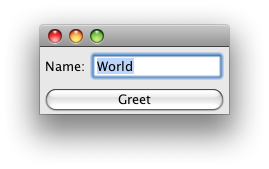

# 桌面应用

## 桌面应用

Clojure 可以创建基于 Swing 的 GUI 程序。下面是一个简单的例子， 用户可以输入他们的名字，然后点击“Greet：按钮，然后它会弹出一个对话框显示一个欢迎信息。可以关注一下这里我们使用了 `proxy` 宏来创建一个集成某个指定类 ( `JFrame` )并且实现了一些 java 接口 (这里只有 `ActionListener` 一个接口)的对象。.

 

```java
(ns com.ociweb.swing
  (:import
    (java.awt BorderLayout)
    (java.awt.event ActionListener)
    (javax.swing JButton JFrame JLabel JOptionPane JPanel JTextField)))

(defn message
  "gets the message to display based on the current text in text-field"
  1
  (str "Hello, " (.getText text-field) "!"))

; Set the initial text in name-field to "World"
; and its visible width to 10.
(let [name-field (JTextField. "World" 10)
      greet-button (JButton. "Greet")
      panel (JPanel.)
      frame (proxy [JFrame ActionListener]
        [] ; superclass constructor arguments
        (actionPerformed [e] ; nil below is the parent component
          (JOptionPane/showMessageDialog nil (message name-field))))]
  (doto panel
    (.add (JLabel. "Name:"))
    (.add name-field))
  (doto frame
    (.add panel BorderLayout/CENTER)
    (.add greet-button BorderLayout/SOUTH)
    (.pack)
    (.setDefaultCloseOperation JFrame/EXIT_ON_CLOSE)
    (.setVisible true))
  ; Register frame to listen for greet-button presses.
  (.addActionListener greet-button frame)) 
```