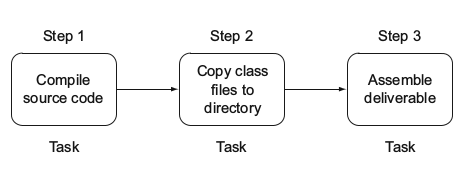
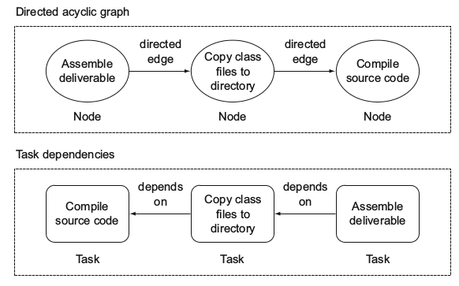
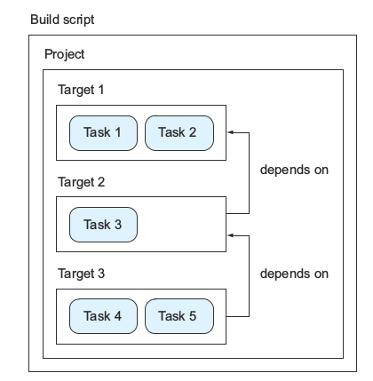

# 一、项目自动化简介

**想象一下没有自动化构建工具的场景**

大部分的软件开发者都会面临下面的情形：

*   让 IDE 完成所有的工作. 用 IDE 来编码，导航到源代码、实现新特性、编译代码、重构代码、运行单元测试，一旦代码写完了，就按下编译按钮。一旦 IDE 提示没有编译错误测试通过，然后就把代码放入版本控制系统中以便与其他人分享。IDE 是非常强大的工具，但是每个人都要安装一套标准的版本来执行上面介绍的任务，当你需要使用一个只有新版 IDE 才有的特性时，你就不得不更新到新版的 IDE。

*   我的电脑上运行正常. 由于时间比较紧，Joe 检查版本控制的代码发现编译不了，似乎是源代码中缺少了某个类，因此他联系了 Tom，TOm 非常困惑怎么代码在 Joe 的电脑上没办法编译成功，和 Joe 讨论完之后，他意识到自己忘记提交一个类到版本控制当中，所以无法编译成功，接下来整个团队都阻塞在这一步，直到 Tom 提交缺失的那个类上去。

*   代码集成简直就是个灾难. Acem 有两个开发小组，一个集中于开发基于 web 的用户接口，另一小组集中开发服务器后台程序，当两个小组的人集中在一起测试整个程序时，发现程序的某些功能没有按照预期那样运行，一些链接无法解析或者直接返回错误的结果。

*   测试过程慢的像蜗牛. QA 小组非常急切的接收第一版的 app，可想而知，他们对低质量的程序是没什么耐心的，每次程序修改之后，都要进行相同的测试过程。小组停下来检查每次提交的改变，最新的版本是通过 IDE 构建的，代码传递到测试服务器，但是整个团队都在等待测试结果。

这时候你就需要一个自动化的构建工具。

**项目自动化的优势**

1.  避免手工介入
2.  创建可重复的构建过程
3.  使得构建非常便捷

**构建过程**

大多数情况，用户在命令行执行一个脚本，脚本定义了任务执行的顺序，比如：编译源代码、从 A 路径复制文件到 B 路径、装配交付，这种自动化构建过程一天可能执行数次。

## 构建工具

你需要的就是一套工具，能把你自动化构建的需求表示成可执行的顺序的任务(tasks)，比如编译源代码，拷贝生成的 class 文件，组装交付。每一个任务都是一个工作单元，任务的顺序很重要，我们把任务和相互之间的依赖建模成一种有向无环图，比如下面这个：

**有向无环图**

包含两个部分：

*   节点(node)：一个工作单元，在这里就是一个任务，比如编译源代码
*   边(edge): 一个有方向的边，表示相邻节点之间的依赖关系，如果一个任务定义了依赖，这个依赖的任务要在这个任务之前执行。

**构建工具的组成**

1.  Build File. 包含构建需要的配置，定义了项目的依赖关系，比如第三方库的，以及以任务的形式存在的指令，定义了任务之间的先后顺序。

2.  Build inpus and outputs: 任务把输入经过一系列步骤后产生输出。

    
3.  依赖管理。

    

## java 构建工具

**Ant**

Ant 是 Apache 组织下的一个跨平台的项目构建工具，它是一个基于任务和依赖的构建系统，是过程式的。开发者需要显示的指定每一个任务，每个任务包含一组由 XML 编码的指令，必须在指令中明确告诉 Ant 源码在哪里，结果字节码存储在哪里，如何将这些字节码打包成 JAR 文件。Ant 没有生命周期，你必须定义任务和任务之间的依赖，还需要手工定义任务的执行序列和逻辑关系。这就无形中造成了大量的代码重复。

**maven**

Maven 是 Apache 组织下的一个跨平台的项目管理工具，它主要用来帮助实现项目的构建、测试、打包和部署。Maven 提供了标准的软件生命周期模型和构建模型，通过配置就能对项目进行全面的管理。它的跨平台性保证了在不同的操作系统上可以使用相同的命令来完成相应的任务。Maven 将构建的过程抽象成一个个的生命周期过程，在不同的阶段使用不同的已实现插件来完成相应的实际工作，这种设计方法极大的避免了设计和脚本编码的重复，极大的实现了复用。

Maven 不仅是一个项目构建工具还是一个项目管理工具。它有约定的目录结构（表 1）和生命周期，项目构建的各阶段各任务都由插件实现，开发者只需遵照约定的目录结构创建项目，再配置文件中生命项目的基本元素，Maven 就会按照顺序完成整个构建过程。Maven 的这些特性在一定程度上大大减少了代码的重复。