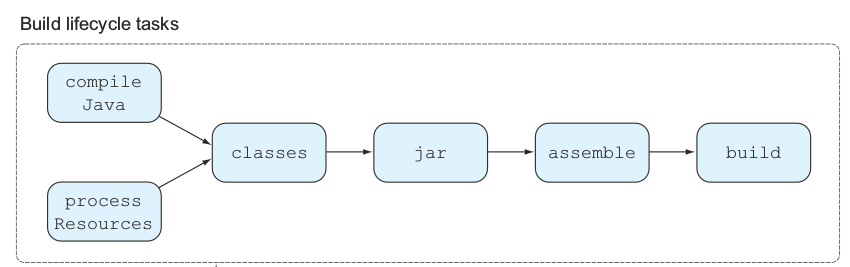
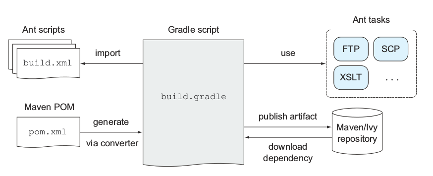
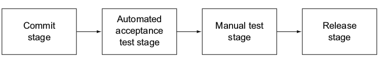

# 二、Gradle 下一代构建工具

## 为什么选择 Gradle

如果你曾经使用过构建工具，你可能会对遇到的问题感到很沮丧，构建工具不是应该自动帮你完成项目的构建吗？你不得不向性能、扩展性等妥协。

比如你在构建一个项目的发布版本时，你要把一个文件拷贝到指定的位置，你在项目的元数据那里添加了版本的描述，如果版本号匹配一个特定的数字时，就把文件从 A 拷贝到 B 处。如果你依赖 XML 来构建，你要实现这个任务就像噩梦一样，你只能通过非标准的机制来添加一些脚本到构建中，结果就是把 XML 和脚本混在一起，随着时间的推移，你会添加越来越多的自定义的代码，结果就是项目越来越复杂很难维护。为什么不考虑用表达式的语言来定义你的构建逻辑呢？

另外一个例子，Maven 跟随约定优于配置的规范，引入了标准化的项目布局和构建生命周期，给很多项目确保一个统一的结构这是个不错的方法。然而你手上的项目刚好和传统的约定不一样。Maven 的一个严格的约定就是每个项目都要生成一个 artifact，比如 jar 文件，但是你怎么从同一个源代码结构中创建两个不同的 JAR 文件,因此你不得不分开创建两个项目。

### Java 构建工具的发展

最早出现的是 Ant，Ant 里的每一个任务（target）都可以互相依赖，Ant 的最大缺点就是依赖的外部库也要添加到版本控制系统中，因为 Ant 没有一个机制来把这些 jar 文件放在一个中央库里面，结果就是不断的拷贝和粘贴代码。

随后 Maven 在 2004 年出现了，Maven 引入了标准的项目和路径结构，还有依赖管理，不幸的是自定义的逻辑很难实现，唯一的方法就是引入插件。

随后 Ant 通过 Apache Ivy 引入依赖管理来跟上 Maven 的脚步，Ant 和 Ivy 集成实现了声明式的依赖，比如项目的编译和打包过程

Gradle 的出现满足了很多现在构建工具的需求，Gradle 提供了一个 DSL(领域特定语言)，一个约定优于配置的方法，还有更强大的依赖管理，Gradle 使得我们可以抛弃 XML 的繁琐配置，引入动态语言 Groovy 来定义你的构建逻辑。

* * *

### 为什么要选择 Gradle

假如你是一个开发者，项目自动构建是你每天工作的一部分，难道你就不想让你的构建代码和你写的源代码一样可以扩展、测试和维护？Gradle 的构建脚本是声明式的、可读的，可以清晰的表达意图。使用 Groovy 代替 XML 来写代码大大减少了构建代码的大小。更重要的是，Gradle 集成了其他构建工具，比如 Ant 和 Maven，使得原来的项目很容易迁徙到 Gradle。

## Gradle 强大的特性

Gradle 提供了一些默认的 Tasks 给 Java 项目，比如，编译源代码、运行测试、打包 JAR.每一个 Java 项目都有一个标准的路径布局，这个布局定义了去哪里找项目的源代码、资源文件和测试代码，你也可以在配置中修改这些默认位置。

Gradle 的约定类似于 Maven 的约定优于配置的实现，Maven 的约定就是一个项目只包含一个 Java 源代码路径，只产生一个 JAR 文件，对于企业级开发来讲这样是显然不够的，Gradle 允许你打破传统的观念，Gradle 的构建生命周期如下图：



### 和其他构建工具集成

Gradle 完全兼容 Ant、Maven，你可以很容易的从 Ant 或 Maven 迁移到 Gradle，Gradle 并不强迫你完全把你的 Build 逻辑迁移过来，它允许你复用已有的 Ant 构建逻辑。Gradle 完全兼容 Maven 和 Ivy 仓库，你可以从中检索依赖也可以发布你的文件到仓库中，Gradle 提供转换器能把 Maven 的构建逻辑转换成 Gradle 的构建脚本。

#### 从 Ant,Maven 迁移到 Gradle

现有的 Ant 脚本可以无缝的导入到 Gradle 项目中，Ant 的 Target 在运行时直接映射成 Gradle 的任务，Gradle 有一个 AntBuilder 可以把你的 Ant 脚本混成 Gradle 的 DSL（领域特定语言），这些脚本看起来像是 Ant 的 XML，但是去掉了尖括号，对于 Ant 用户来说非常方便，不需要担心过渡到 Gradle 的学习周期。

Gradle 能够解析现有的 Maven POM，从而得到传递性依赖的信息，并且引入到当前项目中，在此基础上，它也支持排除传递性依赖或者干脆关闭传递性依赖，这一点是 Maven 所不具备的特性。 Gradle 项目使用 Maven 项目生成的资源已经不是个问题了，接着需要反过来考虑，Maven 用户是否能够使用 Gradle 生成的资源呢？或者更简单点问，Gradle 项目生成的构件是否可以发布到 Maven 仓库中供人使用呢？这一点非常重要，因为如果做不到这一点，你可能就会丢失大量的用户。幸运的是 Gradle 再次给出了令人满意的答案。使用 Gradle 的 Maven Plugin，用户就可以轻松地将项目构件上传到 Maven 仓库中：

```java
    apply plugin: 'maven'
    ...
    uploadArchives {
        repositories.mavenDeployer {
        repository(url: "http://localhost:8088/nexus/content/repositories/snapshots/") {
            authentication(userName: "admin", password: "admin123")
            pom.groupId = "com.juvenxu"
            pom.artifactId = "account-captcha"
        }
        }
    }
```

在上传的过程中，Gradle 能够基于 build.gradle 生成对应的 Maven POM 文件，用户可以自行配置 POM 信息，比如这里的 groupId 和 artifactId，而诸如依赖配置这样的内容，Gradle 是会自动帮你进行转换的。由于 Maven 项目之间依赖交互的直接途径就是仓库，而 Gradle 既能够使用 Maven 仓库，也能以 Maven 的格式将自己的内容发布到仓库中，因此从技术角度来说，即使在一个基于 Maven 的大环境中，局部使用 Gradle 也几乎不会是一个问题。



## 连续传递的特性

编译源代码只是整个过程的一个方面，更重要的是，你要把你的软件发布到生产环境中来产生商业价值，所以，你要运行测试，构建分布、分析代码质量、甚至为不同目标环境提供不同版本，然后部署。整个过程进行自动化操作是很有必要的。 整个过程可以参考下图：



整个过程可以分成以下几个步骤：

*   编译源代码
*   运行单元测试和集成测试
*   执行静态代码分析、生成分析报告
*   创建发布版本
*   部署到目标环境
*   部署传递过程
*   执行冒烟测试和自动功能测试

## 安装 Gradle

Gradle 的安装非常方便，下载 ZIP 包，解压到本地目录，设置 GRADLE_HOME 环境变量并将 GRADLE_HOME/bin 加到 PATH 环境变量中，安装就完成了。用户可以运行 gradle -v 命令验证安装，这些初始的步骤和 Maven 没什么两样。我这里安装的 Gradle 版本是 1.10，详细信息见下：

```java
    ᐅ gradle -v

    ------------------------------------------------------------
    Gradle 1.10
    ------------------------------------------------------------
    Build time:   2013-12-17 09:28:15 UTC
    Build number: none
    Revision:     36ced393628875ff15575fa03d16c1349ffe8bb6
    Groovy:       1.8.6
    Ant:          Apache Ant(TM) version 1.9.2 compiled on July 8 2013
    Ivy:          2.2.0
    JVM:          1.7.0_45 (Oracle Corporation 24.45-b08)
    OS:           Mac OS X 10.9.2 x86_64
```

## Gradle 起步

Gradle 目前的版本是 2.4，根据[其 Wiki 上的 Roadmap](http://wiki.gradle.org/display/GRADLE/Roadmap)，Gradle 有着[让很多成熟项目都汗颜的文档](http://gradle.org/documentation.html)，其包括了安装指南、基本教程、以及一份近 300 页的全面用户指南。这对于用户来说是非常友好的，同时也说明了 Gradle 的开发者对这个项目非常有信心，要知道编写并维护文档可不是件轻松的工作，对于 Gradle 这样未来仍可能发生很大变动的项目来说尤为如此。

类似于 Maven 的`pom.xml`文件，每个 Gradle 项目都需要有一个对应的`build.gradle`文件，该文件定义一些任务（task）来完成构建工作，当然，每个任务是可配置的，任务之间也可以依赖，用户亦能配置缺省任务，就像这样：

```java
defaultTasks 'taskB'

task taskA &lt;&lt; {
    println &quot;i'm task A&quot;
}

task taskB &lt;&lt; {
    println &quot;i'm task B, and I depend on &quot; + taskA.name
}

taskB.dependsOn taskA
```

运行命令**$ gradle -q**之后（参数 q 让 Gradle 不要打印错误之外的日志），就能看到如下的预期输出：

```java
i'm task A
i'm task B, and I depend on taskA
```

这不是和 Ant 如出一辙么？的确是这样，这种“任务”的概念与用法与 Ant 及其相似。Ant 任务是 Gradle 世界的第一公民，Gradle 对 Ant 做了很好的集成。除此之外，由于 Gradle 使用的 Grovvy 脚本较 XML 更为灵活，因此，即使我自己不是 Ant 用户，我也仍然觉得 Ant 用户会喜欢上 Gradle。

### 依赖管理和集成 Maven 仓库

我们知道依赖管理、仓库、约定优于配置等概念是 Maven 的核心内容，抛开其实现是否最优不谈，概念本身没什么问题，并且已经被广泛学习和接受。那 Gradle 实现了这些优秀概念了么？答案是肯定的。

先看依赖管理，我有一个简单的项目依赖于一些第三方类库包括 SpringFramework、JUnit、Kaptcha 等等。原来的 Maven POM 配置大概是这样的（篇幅关系，省略了部分父 POM 配置）：

```java
    &lt;properties&gt;
        &lt;kaptcha.version&gt;2.3&lt;/kaptcha.version&gt;
    &lt;/properties&gt;

    &lt;dependencies&gt;
        &lt;dependency&gt;
            &lt;groupId&gt;com.google.code.kaptcha&lt;/groupId&gt;
            &lt;artifactId&gt;kaptcha&lt;/artifactId&gt;
            &lt;version&gt;${kaptcha.version}&lt;/version&gt;
            &lt;classifier&gt;jdk15&lt;/classifier&gt;
        &lt;/dependency&gt;
        &lt;dependency&gt;
            &lt;groupId&gt;org.springframework&lt;/groupId&gt;
            &lt;artifactId&gt;spring-core&lt;/artifactId&gt;
        &lt;/dependency&gt;
        &lt;dependency&gt;
            &lt;groupId&gt;org.springframework&lt;/groupId&gt;
            &lt;artifactId&gt;spring-beans&lt;/artifactId&gt;
        &lt;/dependency&gt;
        &lt;dependency&gt;
            &lt;groupId&gt;org.springframework&lt;/groupId&gt;
            &lt;artifactId&gt;spring-context&lt;/artifactId&gt;
        &lt;/dependency&gt;
        &lt;dependency&gt;
            &lt;groupId&gt;junit&lt;/groupId&gt;
            &lt;artifactId&gt;junit&lt;/artifactId&gt;
        &lt;/dependency&gt;
    &lt;/dependencies&gt;
```

然后我将其转换成 Gradle 脚本，结果是惊人的：

```java
dependencies {
    compile('org.springframework:spring-core:2.5.6')
    compile('org.springframework:spring-beans:2.5.6')
    compile('org.springframework:spring-context:2.5.6')
    compile('com.google.code.kaptcha:kaptcha:2.3:jdk15')
    testCompile('junit:junit:4.7')
}
```

注意配置从原来的 28 行缩减至 7 行！这还不算我省略的一些父 POM 配置。依赖的 groupId、artifactId、 version，scope 甚至是 classfier，一点都不少。较之于 Maven 或者 Ant 的 XML 配置脚本，Gradle 使用的 Grovvy 脚本杀伤力太大了，爱美之心，人皆有之，相比于七旬老妇松松垮垮的皱纹，大家肯定都喜欢少女紧致的脸蛋，XML 就是那老妇的皱纹。

<

p>关于 Gradle 的依赖管理起初我有一点担心，就是它是否有传递性依赖的机制呢？经过文档阅读和实际试验后，这个疑虑打消了，Gradle 能够解析现有的 Maven POM 或者 Ivy 的 XML 配置，从而得到传递性依赖的信息，并且引入到当前项目中，这实在是一个聪明的做法。在此基础上，它也支持排除传递性依赖或者干脆关闭传递性依赖，其中第二点是 Maven 所不具备的特性。

自动化依赖管理的基石是仓库，Maven 中央仓库已经成为了 Java 开发者不可或缺的资源，Gradle 既然有依赖管理，那必然也得用到仓库，这当然也包括了 Maven 中央仓库，就像这样：

```java
repositories {
    mavenLocal()
    mavenCentral()
    mavenRepo urls: &quot;http://repository.sonatype.org/content/groups/forge/&quot;
}
```

这段代码几乎不用解释，就是在 Gradle 中配置使用 Maven 本地仓库、中央仓库、以及自定义地址仓库。在我实际构建项目的时候，能看到终端打印的下载信息，下载后的文件被存储在 `USER_HOME/.gradle/cache/` 目录下供项目使用，这种实现的方法与 Maven 又是及其类似了，可以说 Gradle 不仅最大限度的继承 Maven 的很多理念，仓库资源也是直接拿来用。

Gradle 项目使用 Maven 项目生成的资源已经不是个问题了，接着需要反过来考虑，Maven 用户是否能够使用 Gradle 生成的资源呢？或者更简单点问，Gradle 项目生成的构件是否可以发布到 Maven 仓库中供人使用呢？这一点非常重要，因为如果做不到这一点，你可能就会丢失大量的用户。幸运的是 Gradle 再次给出了令人满意的答案。使用 Gradle 的 Maven Plugin，用户就可以轻松地将项目构件上传到 Maven 仓库中：

```java
apply plugin: 'maven'
...
uploadArchives {
    repositories.mavenDeployer {
        repository(url: &quot;http://localhost:8088/nexus/content/repositories/snapshots/&quot;) {
            authentication(userName: &quot;admin&quot;, password: &quot;admin123&quot;)
            pom.groupId = &quot;com.juvenxu&quot;
            pom.artifactId = &quot;account-captcha&quot;
        }
    }
}
```

在上传的过程中，Gradle 能够基于`build.gradle`生成对应的 Maven POM 文件，用户可以自行配置 POM 信息，比如这里的 groupId 和 artifactId，而诸如依赖配置这样的内容，Gradle 是会自动帮你进行转换的。由于 Maven 项目之间依赖交互的直接途径就是仓库，而 Gradle 既能够使用 Maven 仓库，也能以 Maven 的格式将自己的内容发布到仓库中，因此从技术角度来说，即使在一个基于 Maven 的大环境中，局部使用 Gradle 也几乎不会是一个问题。

### 约定优于配置

如同 Ant 一般，Gradle 给了用户足够的自由去定义自己的任务，不过同时 Gradle 也提供了类似 Maven 的约定优于配置方式，这是通过 Gradle 的 Java Plugin 实现的，从文档上看，Gradle 是推荐这种方式的。Java Plugin 定义了与 Maven 完全一致的项目布局：

*   src/main/java

*   src/main/resources

*   src/test/java

*   src/test/resources

区别在于，使用 Groovy 自定义项目布局更加的方便：

```java
sourceSets {
    main {
        java {
            srcDir 'src/java'
        }
        resources {
            srcDir 'src/resources'
        }
    }
}
```

Gradle Java Plugin 也定义了构建生命周期，包括编译主代码、处理资源、编译测试代码、执行测试、上传归档等等任务：

[](http://www.infoq.com/resource/news/2011/04/xxb-maven-6-gradle/zh/resources/javaPluginTasks.png)

[](http://www.infoq.com/resource/news/2011/04/xxb-maven-6-gradle/zh/resources/javaPluginTasks.png)[](http://www.infoq.com/resource/news/2011/04/xxb-maven-6-gradle/zh/resources/javaPluginTasks.png)

**Figure 1\. Gradle 的构建生命周期**

相对于 Maven 完全线性的生命周期，Gradle 的构建生命周期略微复杂，不过也更为灵活，例如 jar 这个任务是用来打包的，它不像 Maven 那样依赖于执行测试的 test 任务，类似的，从图中可以看到，一个最终的 build 任务也没有依赖于 uploadArchives 任务。这个生命周期并没有将用户限制得很死，举个例子，我希望每次 build 都发布 SNAPSHOT 版本到 Maven 仓库中，而且我只想使用最简单的**$ gradle clean build**命令，那只需要添加一行任务依赖配置即可：

```java
build.dependsOn 'uploadArchives'
```

由于 Gradle 完全是基于灵活的任务模型，因此很多事情包括覆盖现有任务，跳过任务都非常易于实现。而这些事情，在 Maven 的世界中，实现起来就比较的麻烦，或者说 Maven 压根就不希望用户这么做。

### 小结

一番体验下来，Gradle 给我最大的感觉是两点。其一是简洁，基于 Groovy 的紧凑脚本实在让人爱不释手，在表述意图方面也没有什么不清晰的地方。其二是灵活，各种在 Maven 中难以下手的事情，在 Gradle 就是小菜一碟，比如修改现有的构建生命周期，几行配置就完成了，同样的事情，在 Maven 中你必须编写一个插件，那对于一个刚入门的用户来说，没个一两天几乎是不可能完成的任务。

不过即使如此，Gradle 在未来能否取代 Maven，在我看来也还是个未知数。它的一大障碍就是 Grovvy，几乎所有 Java 开发者都熟悉 XML，可又有几个人了解 Groovy 呢？学习成本这道坎是很难跨越的，很多人抵制 Maven 就是因为学起来不容易，你现在让因为一个构建工具学习一门新语言（即使这门语言和 Java 非常接近），那得到冷淡的回复几乎是必然的事情。 Gradle 的另外一个问题就是它太灵活了，虽然它支持约定优于配置，不过从本文你也看到了，破坏约定是多么容易的事情。人都喜欢自由，爱自定义，觉得自己的需求是多么的特别，可事实上，从 Maven 的流行来看，几乎 95%以上的情况你不需要自行扩展，如果你这么做了，只会让构建变得难以理解。从这个角度来看，自由是把双刃剑，Gradle 给了你足够的自由，约定优于配置只是它的一个选项而已，这初看起来很诱人，却也可能使其重蹈 Ant 的覆辙。Maven 在 Ant 的基础上引入了依赖管理、仓库以及约定优于配置等概念，是一个很大的进步，不过在我现在看来，Gradle 并没有引入新的概念，给我感觉它是一个结合 Ant 和 Maven 理念的优秀实现。

如果你了解 Groovy，也理解 Maven 的约定优于配置，那试试 Gradle 倒也不错，尤其是它几乎能和现有的 Maven 系统无缝集成，而且你也能享受到简洁带来的极大乐趣。其实说到简洁，也许在不久的将来 Maven 用户也能直接享受到，Polyglot Maven 在这方面已经做了不少工作。

## 使用命令行操作

我们可以用 Gradle 命令来执行特定的任务，运行一个任务需要你知道该任务的名称，如果 Gradle 能够告诉你有哪些任务可以执行那岂不是很棒？Gradle 提供了一个辅助的任务 tasks 来检查你的构建脚本，然后显示所有的任务，包含一个描述性的消息。

```java
    $ gradle -q tasks
```

输出如下：

```java
    All tasks runnable from root project

    Build Setup tasks

    setupBuild - Initializes a new Gradle build. [incubating]
    wrapper - Generates Gradle wrapper files. [incubating]

    Help tasks
    ----------
    dependencies - Displays the dependencies of root project'grouptherapy'.
    dependencyInsight - Displays the insight into a specific dependency in root
    ➥ project 'grouptherapy'.
    help - Displays a help message
    projects - Displays the sub-projects of root project 'grouptherapy'.
    properties - Displays the properties of root project 'grouptherapy'.
    tasks - Displays the tasks runnable from root project 'grouptherapy' (some of
    ➥ the displayed tasks may belong to subprojects).

    Other tasks
    -----------
    groupTherapy

    To see all tasks and more detail, run with --all.
```

Gradle 提供任务组的概念，简而言之就是将一些任务归为一组，你可以执行这个组里面所有的任务，没有分组的任务在 Other tasks，任务分组后面会讲到。

### 任务执行

要执行一个任务，只需要输入 gradle + 任务名，Gradle 确保这个任务和它所依赖的任务都会执行，要执行多个任务只需要在后面添加多个任务名。

#### 任务名称缩写

Gradle 提高效率的一个办法就是能够在命令行输入任务名的驼峰简写，当你的任务名称非常长的时候这很有用，当时你要确保你的简写必须是唯一确定那个任务，比如下面的情况：

```java
    task groupTherapy << {
    ...
    }
    task generateTests << {
    ...
    }
```

这时候你使用 gradle gT 的时候 Gradle 就会报错，因为有多个任务匹配到 gT

```java
    $ gradle yG0 gT
    FAILURE: Could not determine which tasks to execute.
    * What went wrong:
    Task 'gT' is ambiguous in root project 'grouptherapy'. Candidates are:
    ➥ 'generateTests', 'groupTherapy'.
    * Try:
    Run gradle tasks to get a list of available tasks.

    BUILD FAILED
```

#### 运行的时候排除一个任务

比如运行的时候你要排除 yayGradle0,你可以使用-x 命令来完成

```java
    $ gradle groupTherapy -x yayGradle0
    :yayGradle1
    Gradle rocks
    :yayGradle2
    Gradle rocks
    :groupTherapy
```

运行的时候 Gradle 排除了 yayGradle0 任务和它依赖的任务 startSession。

### 命令行选项

*   -i:Gradle 默认不会输出很多信息，你可以使用-i 选项改变日志级别为 INFO
*   -s:如果运行时错误发生打印堆栈信息
*   -q:只打印错误信息
*   -?-h,--help:打印所有的命令行选项
*   -b,--build-file:Gradle 默认执行 build.gradle 脚本，如果想执行其他脚本可以使用这个命令，比如 gradle -b test.gradle
*   --offline:在离线模式运行 build,Gradle 只检查本地缓存中的依赖
*   -D, --system-prop:Gradle 作为 JVM 进程运行，你可以提供一个系统属性比如：-Dmyprop=myValue
*   -P,--project-prop:项目属性可以作为你构建脚本的一个变量，你可以传递一个属性值给 build 脚本，比如：-Pmyprop=myValue

* * *

*   tasks:显示项目中所有可运行的任务
*   properties:打印你项目中所有的属性值