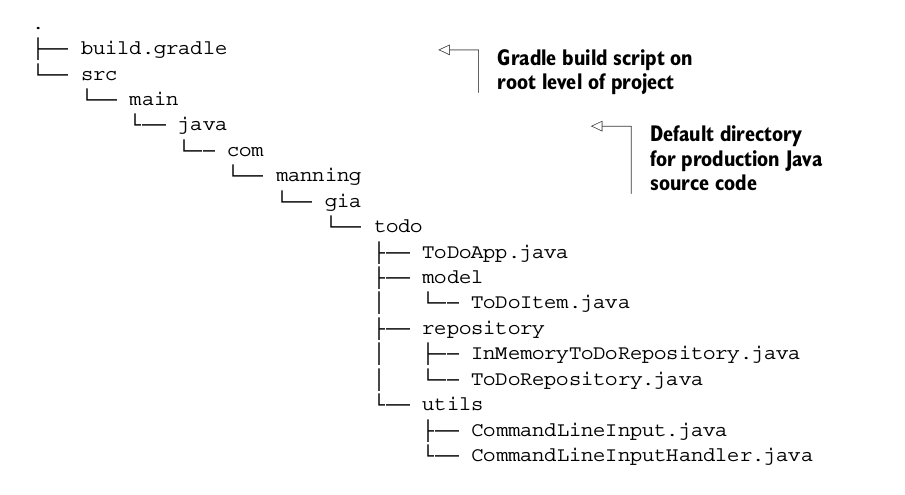
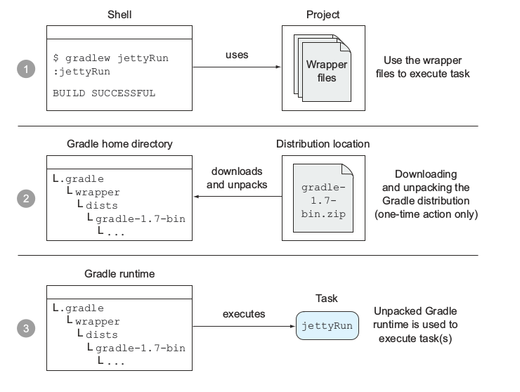

# 三、开始你的第一个 Gradle 项目

## 介绍这个 Gradle 项目

### 第一个 Gradle 项目

这一章将通过一个例子来介绍 Gradle 的强大特性，你将从中学到怎么用 Gradle 的标准插件来引导、配置和运行你的应用，这章结束的时候你应该对 Gradle 的工作机制有个清晰的认识。

### The To Do Application

我们经常需要同时管理多个项目，有时候会发现多个项目很难维护达到了难以控制的地步，为了摆脱这个困惑，我们可以维护一个 to-do 列表，显然你可以把你所有要完成的任务写在一张纸上，当时如果能够随时随地查询你要完成的任务岂不更方便？

#### 任务管理的情形

现在你知道了你的最终目的，每一个任务管理系统都是由一系列的任务组成的，任务通常有一个标题，任务可以添加到任务列表中，可以标记任务的完成状态以及删除任务，如下图所示：


#### 实现用户交互功能

我们发现这个 TO DO 应用包含典型的创建、读取、更新、删除操作(CRUD)，要持久化数据，你需要用一个模型来给任务建模，我们创建一个叫 ToDoItem 的 Java 类，一个 POJO 对象，为了简化这个应用，我们这里不采用数据库来存储，而是把数据存储在内存中，这很容易实现。实现存储接口的类是 InMemoryToDoRespository,缺点就是你的应用程序关闭之后你就无法持久化数据了，后面我们会继续完善这个应用。

每一个标准的 Java 应用都有一个 Main Class，应用程序的入口。这里的 main class 是 ToDoApp,我们将会展现一栏的命令给用户选择，每一个命令被映射成一个枚举类型 CommandLineInput,ComandLineInputHandler 类用来处理用户输入执行相应的任务。

下图显示了整个流程：


### 搭建应用的每一个模块

*表示 Todo 模型的类 ToDoItem*

```java
    package com.manning.gia.todo.model;

    public class ToDoItem implements Comparable<ToDoItem> {
       private Long id;
          private String name;
       private boolean completed;
       (...)
    }
```

*模型持久化接口 ToDoRepository*

```java
    package com.manning.gia.todo.repository;

    import com.manning.gia.todo.model.ToDoItem;
    import java.util.Collection;

    public interface ToDoRepository {
        List<ToDoItem> findAll();
        ToDoItem findById(Long id);
        Long insert(ToDoItem toDoItem);
        void update(ToDoItem toDoItem);
        void delete(ToDoItem toDoItem);
    }
```

接下来创建一个可扩展的、线程安全的实现：

```java
    package com.manning.gia.todo.repository;

    public class InMemoryToDoRepository implements ToDoRepository {
        private AtomicLong currentId = new AtomicLong();
        private ConcurrentMap<Long, ToDoItem> toDos = new ConcurrentHashMap<Long, ToDoItem>();

        @Override
        public List<ToDoItem> findAll() {
            List<ToDoItem> toDoItems = new ArrayList<ToDoItem>(toDos.values());
            Collections.sort(toDoItems);
            return toDoItems;

        }

        @Override
        public ToDoItem findById(Long id) {
            return toDos.get(id);
        }

        @Override
        public Long insert(ToDoItem toDoItem) {
            Long id = currentId.incrementAndGet();
            toDoItem.setId(id);
            toDos.putIfAbsent(id, toDoItem);
            return id;
        }

    @Override
    public void update(ToDoItem toDoItem) {
        toDos.replace(toDoItem.getId(), toDoItem);
    }

    @Override
    public void delete(ToDoItem toDoItem) {
       toDos.remove(toDoItem.getId());
    }

    }
```

*应用程序的入口*

```java
    package com.manning.gia.todo;
    import com.manning.gia.todo.utils.CommandLineInput;
    import com.manning.gia.todo.utils.CommandLineInputHandler;

    public class ToDoApp {
        public static final char DEFAULT_INPUT = '\u0000';
        public static void main(String args[]) {
            CommandLineInputHandler commandLineInputHandler = new
            CommandLineInputHandler();
            char command = DEFAULT_INPUT;

            while(CommandLineInput.EXIT.getShortCmd() != command) {
                commandLineInputHandler.printOptions();
                String input = commandLineInputHandler.readInput();
                char[] inputChars = input.length() == 1 ? input.toCharArray()
                char[] { DEFAULT_INPUT };
                command = inputChars[0];
                CommandLineInput commandLineInput = CommandLineInput.getCommandLineInputForInput(command);
                commandLineInputHandler.processInput(commandLineInput);
            }

        }
    }
```

到目前为止我们讨论了应用的组件和用户交互。接下来就要用 Gradle 实现项目的自动化构建，编译源代码、打包 JAR 文件、运行应用。

## 构建 Java 项目

上一节我们简要介绍了如何编写一个单机的 To Do 应用，接下来要打包部署成可执行的应用，我们需要编译源代码，生成的 class 文件需要打包到 JAR 文件中。JDK 提供了 javac 和 jar 工具帮助你实现这些任务，但是你也不想每次源代码发生变化时你都手动去执行这些任务吧。

Gradle 插件能够自动化完成这些任务，插件引入了一些领域特有的观念，其中一个 Gradle 插件就是 java 插件，Java 插件不仅仅只有编译和打包的功能，它给你的项目安排了一个标准布局，并确保你所有的任务都是按序执行，现在该应用 java 插件来构建你的 build 脚本了。

### 使用 java 插件

每个 Gradle 项目都会创建一个 build.gradle 文件，如果你想使用 java 插件只需要添加下面这行代码：

```java
    apply plugin: 'java'
```

这一行代码足以构建你的项目，但是 Gradle 怎么知道你的源代码放在哪个位置呢？java 插件的一个约定就是源代码的位置，默认情况下插件搜索 src/main/java 路径下的文件，你的包名 com.manning.gia.todo 会转换成源代码根目录下的子目录，创建 build 脚本之后你的项目结构应该是这样的：



### 构建项目

现在你可以构建你的项目了，java 插件添加了一个 build 任务到你项目中，build 任务编译你的代码、运行测试然后打包成 jar 文件，所有都是按序执行的。运行 gradle build 之后你的输出应该是类似这样的：

```java
    $ gradle build
    :compileJava
    :processResources UP-TO-DATE
    :classes
    :jar
    :assemble
    :compileTestJava UP-TO-DATE
    :processTestResources UP-TO-DATE
    :testClasses UP-TO-DATE
    :test
    :check
    :build
```

输出的每一行都表示一个可执行的任务，你可能注意到有一些任务标记为 UP_TO-DATE,这意味着这些任务被跳过了，gradle 能够自动检查哪些部分没有发生改变，就把这部分标记下来，省的重复执行。在大型的企业项目中可以节省不少时间。执行完 gradle build 之后项目结构应该是类似这样的：


在项目的根目录你可以找到一个 build 目录，这里包含了所有的输出，包含 class 文件，测试报告，打包的 jar 文件，以及一些用来归档的临时文件。如果你之前使用过 maven,它的标准输出是 target，这两个结构应该很类似。jar 文件目录 build/libs 下可以直接运行，jar 文件的名称直接由项目名称得来的，这里是 todo-app。

### 运行项目

你只需要使用 JDK 的 java 命令就可以执行这个应用了：

```java
    $ java -cp build/classes/main com.manning.gia.todo.ToDoApp
    --- To Do Application ---
    Please make a choice:
    (a)ll items
    (f)ind a specific item
    (i)nsert a new item
    (u)pdate an existing item
    (d)elete an existing item
    (e)xit
    >
```

接下来我们会学习如何自定义项目结构。

### 自定义你的项目

Java 插件是一个非常固执的框架，对于项目很多的方面它都假定有默认值，比如项目布局，如果你看待世界的方法是不一样的，Gradle 给你提供了一个自定义约定的选项。想知道哪些东西是可以配置的？可以参考这个手册：[`www.gradle.org/docs/current/dsl/`](http://www.gradle.org/docs/current/dsl/)，之前提到过，运行命令行 gradle properties 可以列出可配置的标准和插件属性以及他们的默认值。

**修改你的项目和插件属性**

接下来你将学习如何指定项目的版本号、Java 源代码的兼容级别，前面你用的 java 命令来运行应用程序，你需要通过命令行选项-cp build/classes/main 指定 class 文件的位置给 Java 运行时。但是要从 JAR 文件中启动应用，你需要在 manifest 文件 MANIFEST.MF 中包含首部 Main-Class。看下面的脚本你就明白怎么操作了：

```java
    //Identifies project’sversion through a number scheme
    version = 0.1

    //Sets Java version compilation compatibility to 1.6
    sourceCompatibility = 1.6

    //Adds Main-Class header to JAR file’s manifest

    jar {
    manifest {
        attributes 'Main-Class': 'com.manning.gia.todo.ToDoApp'
    }
    }
```

打包成 JAR 之后，你会发现 JAR 文件的名称变成了 todo-app-0.1.jar，这个 jar 包含了 main-class 首部，你就可以通过命令 java -jar build/libs/todo-app-0.1.jar 运行了。

接下来学习如何改变项目的默认布局：

```java
    //Replaces conventional source code directory with list of different directories

    sourceSets {
        main {
            java {
                srcDirs = ['src']
            }
        }
    //Replaces conventional test source code directory with list of different directories    

        test {
            java {
                srcDirs = ['test']
                }
            }
    }

    //Changes project output property to directory out

    buildDir = 'out'
```

**配置和使用外部依赖**

在 Java 世界里，依赖是分布的以 JAR 文件的形式存在，许多库都从仓库里获得，比如一个文件系统或中央服务器。Gradle 需要你指定至少一个仓库作为依赖下载的地方，比如 mavenCentral： //Shortcut notation for configuring Maven Central 2 repository accessible under http://repo1.maven.org/maven2

```java
    repositories {
        mavenCentral()
    }
```

**定义依赖**

接下来就是定义依赖，依赖通过 group 标识，name 和 version 来确定，比如下面这个：

```java
    dependencies {
        compile group: 'org.apache.commons', name: 'commons-lang3', version: '3.1'
    }
```

Gradle 是通过配置来给依赖分组，Java 插件引入的一个配置是 compile，你可以很容易区分这个配置定义的依赖是用来编译源代码的。

**解析依赖**

Gradle 能够自动检测并下载项目定义的依赖：

```java
    $ gradle build
    :compileJava
    Download http://repo1.maven.org/maven2/org/apache/commons/commons-lang3/3.1/commons-lang3-3.1.pom

    Download http://repo1.maven.org/maven2/org/apache/commons/commons-parent/22/commons-parent-22.pom

    Download http://repo1.maven.org/maven2/org/apache/apache/9/apache-9.pom
    Download http://repo1.maven.org/maven2/org/apache/commons/commons-lang3/3.1/commons-lang3-3.1.jar

    :processResources UP-TO-DATE
    ...
    :build
```

## 用 Gradle 开发 Web 项目

Java 服务端的 Web 组件(JavaEE)提供动态扩展能力允许你在 web 容器或者应用服务器中运行你的程序，就像 Servlet 这个名字的意思，接收客户端的请求返回响应，在 MVC 架构中充当控制器的角色，Servlet 的响应通过视图组件--JSP 来渲染，下图展示了一个典型的 MVC 架构的 Java 应用。


WAR(web application archive)用来捆绑 Web 组件、编译生成的 class 文件以及其他资源文件如部署描述符、HTML、JavaScript 和 CSS 文件，这些文件组合在一起就形成了一个 Web 应用，要运行 Java Web 应用，WAR 文件需要部署在一个服务器环境---Web 容器。

Gradle 提供拆箱插件用来打包 WAR 文件以及部署 Web 应用到本地的 Servlet 容器，接下来我们就来学习怎么把 Java 应用编程 Web 应用。

**添加 Web 组件**

接下来我们将创建一个 Servlet，ToDoServlet，用来接收 HTTP 请求，执行 CRUD 操作，并将请求传递给 JSP。你需要写一个 todo-list.jsp 文件，这个页面知道怎么去渲染 todo items，提供一些 UI 组件比如按钮和指向 CURD 操作的链接，下图是用户检索和渲染 todo items 的流程：


**Web 控制器**

下面这个就是 web 控制器 ToDoServlet，用来处理所有的 URL 请求：

```java
    package com.manning.gia.todo.web;

    public class ToDoServlet extends HttpServlet {
        private ToDoRepository toDoRepository = new InMemoryToDoRepository();

        @Override
        protected void service(HttpServletRequest request, HttpServletResponse response) throws ServletException, IOException {
            String servletPath = request.getServletPath();
            String view = processRequest(servletPath, request);
            RequestDispatcher dispatcher = request.getRequestDispatcher(view);
            dispatcher.forward(request, response);

        }

        private String processRequest(String servletPath, HttpServletRequest request) {

            if(servletPath.equals("/all")) {
                List<ToDoItem> toDoItems = toDoRepository.findAll();
                request.setAttribute("toDoItems", toDoItems);
                return "/jsp/todo-list.jsp";
            }
            else if(servletPath.equals("/delete")) {
                   (...)
            }
            (...)
            return "/all";
        }

    }
```

对于每一个接收的请求，获取 Servlet 路径，基于 CRUD 操作在 processRequest 方法中处理请求，然后通过请求分派器请求传递给 todo-list.jsp。

**使用 War 和 Jetty 插件**

Gradle 支持构建和运行 Web 应用，接下来我将介绍两个 web 应用开发的插件 War 和 Jetty，War 插件继承了 Java 插件用来给 web 应用开发添加一些约定、支持打包 War 文件。Jetty 是一个很受欢迎的轻量级的开源 Web 容器，Gradle 的 Jetty 插件继承 War 插件，提供部署应用程序到嵌入的容器的任务。

既然 War 插件继承了 Java 插件，所有你在应用了 War 插件后无需再添加 Java 插件，即使你添加了也没有负面影响，应用插件是一个非幂等的操作，因此对于一个指定的插件只运行一次。添加下面这句到你的 build.gradle 脚本中： apply plugin: 'war'

除了 Java 插件提供的约定外，你的项目现在多了 Web 应用的源代码目录，将打包成 war 文件而不是 jar 文件，Web 应用默认的源代码目录是 src/main/webapp,如果所有的源代码都在正确的位置，你的项目布局应该是类似这样的：


你用来实现 Web 应用的帮助类不是 java 标准的一部分，比如 javax.servlet.HttpServlet,在运行 build 之前，你应该确保你声明了这些外部依赖，War 插件引入了两个新的依赖配置，用于 Servlet 依赖的配置是 providedCompile，这个用于那些编译器需要但是由运行时环境提供的依赖，你现在的运行时环境是 Jetty，因此用 provided 标记的依赖不会打包到 WAR 文件里面，运行时依赖比如 JSTL 这些在编译器不需要，但是运行时需要，他们将成为 WAR 文件的一部分。

```java
    dependencies {
       providedCompile 'javax.servlet:servlet-api:2.5'
       runtime 'javax.servlet:jstl:1.1.2'
    }
```

build Web 项目和 Java 项目一样，运行 gradle build 后打包的 WAR 文件在目录 build/libs 下，输出如下：

```java
    $ gradle build
    :compileJava
    :processResources UP-TO-DATE
    :classes
    :war
    :assemble
    :compileTestJava UP-TO-DATE
    :processTestResources UP-TO-DATE
    :testClasses UP-TO-DATE
    :test
    :check
    :build
```

War 插件确保打包的 WAR 文件符合 JAVA EE 规范，war 任务拷贝 web 应用源目录 src/main/webapp 到 WAR 文件的根目录，编译的 class 文件保存在 WEB-INF/classes,运行时依赖的库放在 WEB-INF/libs,下面显示了 WAR 文件 todo-webapp-0.1.war 的目录结构：


### 自定义 WAR 插件

假设你把所有的静态文件放在 static 目录，所有的 web 组件放在 webfiles，目录结构如下：


```java
    //Changes web application source directory

    webAppDirName = 'webfiles'

    //Adds directories css and jsp to root of WAR file archive
    war {
    from 'static'
    }
```

**在嵌入的 Web 容器中运行**

嵌入式的 Servlet 容器完全不知到你的应用程序知道你提供准确的 classpath 和源代码目录，你可以手工编程提供，Jetty 插件给你完成了所有的工作，你只需要添加下面一条命令： apply plugin: 'jetty'

运行 Web 应用需要用到的任务是 jettyRun,启动 Jetty 容器并且无需创建 WAR 文件，这个命令的输出应该类似这样的：

```java
    $ gradle jettyRun
    :compileJava
    :processResources UP-TO-DATE
    :classes
    > Building > :jettyRun > Running at http://localhost:8080/todo-webapp-jetty
```

最后一行 Jetty 插件给你提供了一个 URL 用来监听 HTTP 请求，打开浏览器输入这个链接就能看到你编写的 Web 应用了。

Jetty 插件默认监听的端口是 8080，上下文路径是 todo-webapp-jetty,你也可以自己配置成想要的：

```java
    jettyRun {
       httpPort = 9090
       contextPath = 'todo'
    }
```

这样你就把监听端口改成了 9090,上下文目录改成了 todo。

## Gradle 包装器

你把你的 Web 应用给你的同伴 Mike 看，他看完之后觉得很有意思想加入你给项目添加一些高级特性。你把代码添加到版本控制系统当中（VCS）,因此它可以下载代码，由于 Mike 从来没有用过 Gradle 构建工具，所以他问你用的哪个版本的 Gradle 以及怎么安装 Gradle，他也不知道怎么去配置 Gradle，从以往的经验来看，Mike 清醒的知道不同版本的构建工具或者运行环境对对构建的影响有多大。对于在一个机器上可以运行，另一个机器无法运行的情况他看的太多了，经常是由于运行时环境不兼容的原因。

对于这个问题 Gradle 提供了一个非常方便和实用的方法：Gradle 包装器，包装器是 Gradle 的一个核心特性，它允许你的机器不需要安装运行时就能运行 Gradle 脚本，而且她还能确保 build 脚本运行在指定版本的 Gradle。它会从中央仓库中自动下载 Gradle 运行时，解压到你的文件系统，然后用来 build。终极目标就是创建可靠的、可复用的、与操作系统、系统配置或 Gradle 版本无关的构建。

### 配置 Gradle 包装器

在设置你的包装器之前，你需要做两件事情：创建一个包装任务，执行这个任务生成包装文件。为了能让你的项目下载压缩的 Gradle 运行时，定义一个 Wrapper 类型的任务 在里面指定你想使用的 Gradle 版本：

```java
    task wrapper(type: Wrapper) {
        gradleVersion = '1.7'
    }
```

然后执行这个任务：

```java
    $ gradle wrapper
    :wrapper
```

整个过程如下图：


执行完之后，你就能看到下面这个 wrapper 文件和你的构建脚本：


记住你只需要运行 gradle wrapper 一次，以后你就能用 wrapper 来执行你的任务，下载下来的 wrapper 文件会被添加到版本控制系统中。如果你的系统中已经安装了 Gradle 运行时，你就不需要再添加一个 gradle wrapper 任务，你可以直接运行 gradle wrapper 任务，这个任务会使用你的 Gradle 当前版本来生成包装文件。

### 使用包装器

上面生成了两个执行脚本，一个是运行在*nix 系统上的 gradlew，另一个是运行在 Windows 系统上的 gradlew.bat,你只需要根据你的系统环境来执行对应的那一个脚本，比如上面提到的 Mike 执行了 gradlew.bat jettyRun 任务，下面是输出：

```java
    > gradlew.bat jettyRun

    Downloading http://services.gradle.org/distributions/gradle-1.7-bin.zip
    ...
    //Unzips compressed wrapper file to predefined local directory
    Unzipping C:\Documents and Settings\Mike\.gradle\wrapper\dists\gradle-1.7- bin\35oej0jnbfh6of4dd05531edaj\gradle-1.7-bin.zip to C:\Documents andSettings\Mike\.gradle\wrapper\dists\gradle-1.7-bin\35oej0jnbfh6of4dd05531edaj

    Set executable permissions for: C:\Documents and Settings\Mike\.gradle\wrapper\dists\gradle-1.7- bin\35oej0jnbfh6of4dd05531edaj\gradle-1.7\bin\gradlew.bat    

    :compileJava
    :processResources UP-TO-DATE
    :classes

    > Building > :jettyRun > Running at http://localhost:9090/todo
```

整个过程如下：



### 自定义包装器

一些公司的安全措施非常严格，特别是当你给政府工作的时候，你能够访问外网的能力是被限制的，在这种情况下你怎么让你的项目使用 Gradle 包装器？所以你需要修改默认配置：

```java
    task wrapper(type: Wrapper) {
        //Requested Gradle version
        gradleVersion = '1.2'
        //Target URL to retrieve Gradle wrapper distribution
        distributionUrl = 'http://myenterprise.com/gradle/dists'
        //Path where wrapper will be unzipped relative to Gradle home directory
        distributionPath = 'gradle-dists'         
    }
```

非常直接明显对不对？你还可以了解更多的特性，如果你想了解更多关于 Gradle 包装器 DSL 的信息，可以查看这个网址：[`gradle.org/docs/current/dsl/org.gradle.api.tasks.wrapper.Wrapper.html`](http://gradle.org/docs/current/dsl/org.gradle.api.tasks.wrapper.Wrapper.html)