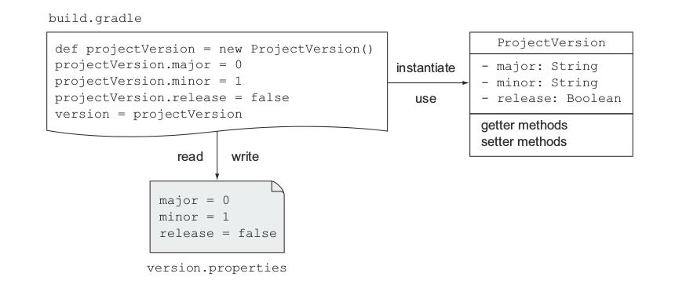
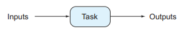
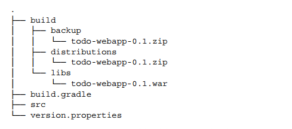
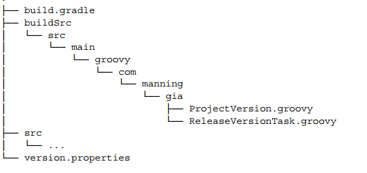
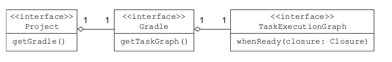

# 四、简介

在第三章，我们在 Gradle 核心插件的帮助下构建了一个 Java Web 项目，我们了解到这些插件都是可以自定义来适应自己的非标准化的构建需求、给你的项目添加可执行的构建逻辑来配置 tasks。

在这一章，我们来学习 Gradle 构建的基本构建块(blocks),比如项目和任务，以及他们是如何对应到 Gradle API 的类中，通过这些类的方法你可以获得一些属性来控制构建过程，你也将学习到如何使用属性来控制构建行为。

你将学习到如何定义简单的任务，更复杂一点的是编写自定义的任务类，接下来我们会接触到像访问任务属性、定义显式和隐式的依赖、添加递增的构建支持以及使用 Gradle 自带的任务类型。我们也会了解到 Gradle 的构建生命周期来更好的理解构建是怎么配置和执行的。

## 构建块

每个 Gradle 构建都包括三个基本的构建块：项目(projects)、任务(tasks)和属性(properties)，每个构建至少包括一个项目，项目包括一个或者多个任务，项目和任务都有很多个属性来控制构建过程。

Gradle 运用了领域驱动的设计理念（DDD）来给自己的领域构建软件建模，因此 Gradle 的项目和任务都在 Gradle 的 API 中有一个直接的 class 来表示，接下来我们来深入了解每一个组件和它对应的 API。

### 项目

在 Gradle 术语里项目表示你想构建的一个组件(比如一个 JAR 文件)，或者你想完成的一个目标(比如打包 app)，如果你以前使用过 Maven，你应该听过类似的概念。与 Maven pom.xml 相对应的是 build.gradle 文件，每个 Gradle 脚本至少定义了一个项目。当开始构建过程后，Gradle 基于你的配置实例化 org.gradle.api.Project 这个类以及让这个项目通过 project 变量来隐式的获得。下图列出了 API 接口和最重要的方法。


一个项目可以创建新任务、添加依赖和配置、应用插件和其他脚本，许多属性比如 name 和 description 都是可以通过 getter 和 setter 方法来访问。

Project 实例允许你访问你项目所有的 Gradle 特性，比如任务的创建和依赖了管理，记住一点当访问你项目的属性和方法时你并不需要显式的使用 project 变量--Gradle 假定你的意思是 Project 实例，看看下面这个例子：

```java
    //没有使用 project 变量来设置项目的描述
    setDescription("myProject")
    //使用 Grovvy 语法来访问名字和描述
    println "Description of project $name: " + project.description
```

在之前的章节，我们只处理到单个 peoject 的构建，Gradle 支持多项目的构建，软件设计一个很重要的概念是模块化，当一个软件系统变得越复杂，你越想把它分解成一个个功能性的模块，模块之间可以相互依赖，每个模块有自己的 build.gradle 脚本。

### 任务

我们在第二章的时候就创建了一些简单的任务，你应该了解两个概念：任务动作(actions)和任务依赖，一个动作就是任务执行的时候一个原子的工作，这可以简单到打印 hello world,也可以复杂到编译源代码。很多时候一个任务需要在另一个任务之后执行，尤其是当一个任务的输入依赖于另一个任务的输出时，比如项目打包成 JAR 文件之前先要编译成 class 文件，让我们来看看 Gradle API 中任务的表示：org.gradle.api.Task 接口。


### 属性

每个 Project 和 Task 实例都提供了 setter 和 getter 方法来访问属性，属性可以是任务的描述或者项目的版本号，在后续的章节，你会在具体例子中读取和修改这些属性值，有时候你要定义你自己的属性，比如，你想定义一个变量来引用你在构建脚本中多次使用的一个文件，Gradle 允许你通过外部属性来定义自己的变量。

#### 外部属性

外部属性一般存储在键值对中，要添加一个属性，你需要使用 ext 命名空间，看一个例子：

```java
    //Only initial declaration of extra property requires you to use ext namespace
    project.ext.myProp = 'myValue'
    ext {
       someOtherProp = 123
    }

    //Using ext namespace to access extra property is optional
    assert myProp == 'myValue'
    println project.someOtherProp
    ext.someOtherProp = 567
```

相似的，外部属性可以定义在一个属性文件中： 通过在<user_home>/.gradle 路径或者项目根目录下的 gradle.properties 文件来定义属性可以直接注入到你的项目中，他们可以通过 project 实例来访问，注意<user_home>/.gradle 目录下只能有一哥 Gradle 属性文件即使你有多个项目，在属性文件中定义的属性可以被所有的项目访问，假设你在你的 gradle.properties 文件中定义了下面的属性：</user_home></user_home>

```java
    exampleProp = myValue
    someOtherProp = 455
```

你可以在项目中访问这两个变量：

```java
    assert project.exampleProp == 'myValue'

    task printGradleProperty << {
       println "Second property: $someOtherProp"
    }
```

**定义属性的其他方法**

你也可以通过下面的方法来定义属性：

*   通过-P 命令行选项来定义项目属性
*   通过-D 命令行选项来定义系统属性
*   环境属性遵循这个模式： `ORG_GRADLE_PROJECT_propertyName=someValue`

## 管理任务

每个新创建的任务都是 org.gradle.api.DefaultTask 类型，org.gradle.api.Task 的标准实现，DefaultTask 所有的域都是私有的，意味着他们只能通过 setter 和 getter 方法来访问，庆幸的是 Groovy 提供了一些语法糖来允许你通过名字来使用域。

### 管理项目的版本

许多公司或者开源组织有他们自己的发布版本的措施，一般用主版本号和次版本号来表示，也会用 SNAPSHOT 来表示项目正在开发中，版本号是通过 String 类型来表示，如果你想准确获得项目的主版本号，那应该怎么办？使用正则表达式匹配点号然后过滤得到主版本号和次版本号？如果我们用一个类来表示是不是更简单？

你可以很简单的通过类的域来设置、查询和修改你的版本号的某个部分，甚至你可以把版本信息直接保存在一个文件里，比如一个文件或者数据库里，避免通过修改构建脚本来更改版本号，如下图所示：



通过编程来控制版本对于自动化项目生命周期很有必要，比如：你的代码通过了单元测试准备交付了，当前的版本是 1.3-SNAPSHOT,在打包成 war 文件之前你想把它变成发布版本 1.3 然后自动部署到服务器中，这些步骤可以划分为多个任务：一个用来修改项目的版本号另一个用于打包 WAR 文件。

### 声明任务的动作(actions)

动作就是在你的任务中放置构建逻辑的地方，Task 接口提供了两个方法来声明任务的动作：

doFirst 和 doLast，当任务执行的时候，定义在闭包里的动作逻辑就按顺序执行。

接下来我们会写一个简单的任务 printVersion,任务的作用就是打印项目的版本号，在任务 的最后一个动作定义这个逻辑。

```java
    version = '0.1-SNAPSHOT'

    task printVersion {
        doLast {
        println "Version: $version"
        }
    }
```

前面我们讲过左移操作符是方法 doLast 的快捷键，他们的作用是一样的，当你执行 gradle printVersion,你应该得到下面的输出：

```java
    gradle printVersion
    :printVersion
    Version: 0.1-SNAPSHOT
```

如果你用 doFirst 方法的话输出的结果是一样的：

```java
    task printVersion {
        doFirst {
        println "Version: $version"
        }
    }
```

**给已经存在的任务添加动作**

到目前为止，你只是给 printVersion 这个任务添加了单个动作，要么是第一个或者最后一个，对于每个任务可以有多个动作，实际上，当任务创建的时候你可以添加任意多个动作，每一个任务都有一个动作清单，他们在运行的时候是执行的，接下来我们来修改之前的例子：

```java
    task printVersion {
    //任务的初始声明可以添加 first 和 last 动作
        doFirst {
        println "Before reading the project version"
        }

        doLast {
        println "Version: $version"
        }
    }
```

//你可以在任务的动作列表的最前面添加其他任务，比如：

```java
    printVersion.doFirst { println "First action" }
```

由此可知，我们可以添加额外的动作给已经存在的任务，当你想添加动作的那个任务不是你自己写的时候这会非常有用，你可以添加一些自定义的逻辑，比如你可以添加 doFirst 动作到 compile-Java 任务来检查项目是否包含至少一个 source 文件。

**访问任务属性**

接下来我们来改善一下输出版本号的方法，Gradle 提供一个基于 SLF4J 库的日志实现，除了实现了基本的日志级别（DEBUG, ERROR, INFO, TRACE, WARN)）外，还添加了额外的级别，日志实例可以通过任务的方法来直接访问，接下来，你将用 QUIET 级别打印项目的版本号：

```java
    task printVersion << {
        logger.quiet "Version: $version"
    }
```

访问任务的属性是不是很容易？接下来我将给你展示两个其他的属性，group 和 description，两个都是 documentation 任务的一部分，description 属性简短的表示任务的目的，group 表示任务的逻辑分组。

```java
    task printVersion(group: 'versioning', description:     'Prints project version.') << {
        logger.quiet "Version: $version"
    }
```

你也可以通过 setter 方法来设置属性：

```java
    task printVersion {
        group = 'versioning'
        description = 'Prints project version.'
        doLast {
        logger.quiet "Version: $version"
        }
    }
```

当你运行 gradle tasks,你会看到任务显示在正确的分组里和它的描述信息：

```java
    gradle tasks
    :tasks
    ...
    Versioning tasks
    ----------------
    printVersion - Prints project version.
    ...
```

### 定义任务依赖

dependsOn 方法用来声明一个任务依赖于一个或者多个任务，接下来通过一个例子来讲解运用不同的方法来应用依赖：

```java
    task first << { println "first" }
    task second << { println "second" }

    //声明多个依赖
    task printVersion(dependsOn: [second, first]) << {
    logger.quiet "Version: $version"
    }

    task third << { println "third" }
    //通过任务名称来声明依赖
    third.dependsOn('printVersion')
```

你可以通过命令行调用 third 任务来执行这个任务依赖链：

```java
    $ gradle -q third
    first
    second
    Version: 0.1-SNAPSHOT
    third
```

仔细看这个执行顺序，你有没用发现 printVersion 声明了对 second 和 first 任务的依赖，但是 first 在 second 任务前执行了，Gradle 里面任务的执行顺序并不是确定的。

**任务依赖执行顺序**

Gradle 并不保证依赖的任务能够按顺序执行，dependsOn 方法只是定义这些任务应该在这个任务之前执行，但是这些依赖的任务具体怎么执行它并不关心，如果你习惯用命令式的构建工具来定义依赖（比如 ant）这可能会难以理解。在 Gradle 里面，执行顺序是由任务的输入输出特性决定的，这样做有很多优点，比如你想修改构建逻辑的时候你不需要去了解整个任务依赖链，另一方面，因为任务不是顺序执行的，就可以并发的执行来提高性能。

### 终结者任务

在实际情况中，你可能需要在一个任务执行之后进行一些清理工作，一个典型的例子就是 Web 容器在部署应用之后要进行集成测试，Gradle 提供了一个 finalizer 任务来实现这个功能，你可以用 finalizedBy 方法来结束一个指定的任务：

```java
    task first << { println "first" }
    task second << { println "second" }
    //声明 first 结束后执行 second 任务
    first.finalizedBy second
```

你会发现任务 first 结束后自动触发任务 second：

```java
    $ gradle -q first
    first
    second
```

### 添加随意的代码

接下来我们来学习怎么在 build 脚本中定义一些随机的代码，在实际情况下，如果你熟悉 Groovy 的语法你可以编写一些类或者方法，接下来你将会创建一个表示版本的类，在 Java 中一个 class 遵循 bean 的约定（POJO），就是添加 setter 和 getter 方法来访问类的域，到后面发现手工写这些方法很烦人，Groovy 有个对应的概念叫 POGO(plain-old Groovy object),他们的 setter 和 getter 方法在生成字节码的时候自动添加，因此运行的时候可以直接访问，看下面这个例子：

```java
    version = new ProjectVersion(0, 1)

    class ProjectVersion {
        Integer major
        Integer minor
        Boolean release

        ProjectVersion(Integer major, Integer minor) {
            this.major = major
            this.minor = minor
            this.release = Boolean.FALSE
        }

        ProjectVersion(Integer major, Integer minor,     Boolean release) {
            this(major, minor)
            this.release = release
        }

        @Override
        String toString() {
            //只有 release 为 false 的时候才添加后缀 SNAPSHOT
            "$major.$minor${release ? '' : '-SNAPSHOT'}"
        }
    }
```

当运行这个修改的脚本之后，你可以看到 printVersion 的输出和之前一样，但是你还是得手工修改 build 脚本来更改版本号，接下来你将学习如何把版本号存储在一个文件里然后配置你的脚本去读取这个配置。

### 任务的配置

在你写代码之前，你要新建一个属性文件 version.properties,内容如下：

```java
    major = 0
    minor = 1
    release = false
```

**添加任务配置块**

接下来我们将声明一个任务 loadVersion 来从属性文件中读取版本号并赋给 ProjectVersion 实例，第一眼看起来和其他定义的任务一样，仔细一看你会注意到你没有定义动作或者使用左移操作符，在 Gradle 里称之为任务配置块(task configuration)。

```java
    ext.versionFile = file('version.properties')
    //配置任务没有左移操作符
    task loadVersion {
        project.version = readVersion()
    }

    ProjectVersion readVersion() {
        logger.quiet 'Reading the version file.'
        //如果文件不存在抛出异常
        if(!versionFile.exists()) {
            throw new GradleException("Required version file does not exist:$versionFile.canonicalPath")
        }

    Properties versionProps = new Properties()

    //groovy 的 file 实现了添加方法通过新创建的流来读取

    versionFile.withInputStream { stream ->
    versionProps.load(stream)
    }
    //在 Groovy 中如果这是最后一个语句你可以省略 return 关键字
    new ProjectVersion(versionProps.major.toInteger(),
     versionProps.minor.toInteger(), versionProps.release.toBoolean())
    }
```

接下来运行 printVersion，你会看到 loadVersion 任务先执行了：

```java
    $ gradle printVersion
    Reading the version file.
    :printVersion
    Version: 0.1-SNAPSHOT
```

你也许会很奇怪这个任务是怎么调用的，你没有声明依赖，也没有在命令行中调用它。**任务配置块总是在任务动作之前执行的**，理解这个行为的关键就是 Gradle 的构建生命周期，我们来看下 Gradle 的构建阶段：


**Gradle 的构建生命周期**

无论你什么时候执行一个 gradle build,都会经过三个不同的阶段：初始化、配置和执行。

在初始化阶段，Gradle 给你的项目创建一个 Project 实例，你的构建脚本只定义了单个项目，在多项目构建的上下文环境中，构建的阶段更为重要。根据你正在执行的项目，Gradle 找出这个项目的依赖。

下一个阶段就是配置阶段，Gradle 构建一些在构建过程中需要的一些模型数据，当你的项目或者指定的任务需要一些配置的时候这个阶段很有帮助。

**记住不管你执行哪个 build 哪怕是 gradle tasks 配置代码都会执行**

在执行阶段任务按顺序执行，执行顺序是通过依赖关系决定的，标记为 up-to-date 的任务会跳过，比如任务 B 依赖于任务 A，当你运行 gradle B 的时候执行顺序将是 A->B。

### 声明任务的输入和输出

Gradle 通过比较两次 build 之间输入和输出有没有变化来确定这个任务是否是最新的，如果从上一个执行之后这个任务的输入和输出没有发生改变这个任务就标记为 up-to-date，跳过这个任务。



输入可以是一个目录、一个或者多个文件或者随机的属性，任务的输出可以是路径或者文件，输入和输出在 DefaultTask 类中用域来表示。假设你想创建一个任务把项目的版本由 SNAPSHOT 改为 release，下面的代码定义一个新任务给 release 变量赋值为 true，然后把改变写入到文件中。

```java
    task makeReleaseVersion(group: 'versioning', description: 'Makes project a release version.') << {
        version.release = true
        //ant 的 propertyfile 任务提供很方便的方法来修改属性文件
        ant.propertyfile(file: versionFile) {
            entry(key: 'release', type:'string',operation: '=', value: 'true')
        }
    }
```

运行这个任务会修改版本属性并写入到文件中。

```java
    $ gradle makeReleaseVersion
    :makeReleaseVersion

    $ gradle printVersion
    :printVersion
    Version: 0.1
```

### 编写自定义的任务

makeReleaseVersion 的逻辑比较简单，你可能不用考虑代码维护的问题，随着构建逻辑越来越复杂，你添加了越来越多的简单的任务，这时候你就有需要用类和方法来结构化你的代码，你可以把你编写源代码的那一套代码实践搬过来。

**编写自定义任务类**

之前提到过，Gradle 会给每一个任务创建一个 DefaultTask 类型的实例，当你要创建一个自定义的任务时，你需要创建一个继承自 DefaultTask 的类，看看下面这个例子：

```java
    class ReleaseVersionTask extends DefaultTask {
        //通过注解声明任务的输入和输出    
        @Input Boolean release
        @OutputFile File destFile

        ReleaseVersionTask() {
            //在构造器里设置任务的分组和描述
            group = 'versioning'
            description = 'Makes project a release version.'
        }
        //通过注解声明要执行的任务
        @TaskAction
        void start() {
            project.version.release = true
            ant.propertyfile(file: destFile) {
            entry(key: 'release', type: 'string', operation: '=', value: 'true')
        }
        }
    }
```

**通过注解来表达输入和输出**

任务输入和输出注解给你的实现添加了语法糖，他们和调用 TasksInputs 和 TaskOutputs 方法是一样的效果，你一眼就知道任务期望什么样的输入数据以及会产生什么输出。我们使用@Input 注解来声明输入属性 release，用@OutputFile 来定义输出文件。

**使用自定义的任务**

上面我们实现了自定义的动作方法，但是我们怎么使用这个方法，你需要在 build 脚本中创建一个 ReleaseVersionTask 类型的任务，通过给属性赋值来设定输入和输出：

```java
    //定义一个 ReleaseVersionTask 类型的任务
    task makeReleaseVersion(type: ReleaseVersionTask) {
        //设定任务属性
        release = version.release
        destFile = versionFile
    }
```

**复用自定义的任务**

假设你在另一个项目中想使用前面这个自定义的任务，在另一个项目中需求又不太一样，用来表示版本的 POGO 有不同的域，比如下面这个：

```java
    class ProjectVersion {
        Integer min
        Integer maj
        Boolean prodReady

        @Override
        String toString() {
        "$maj.$min${prodReady? '' : '-SNAPSHOT'}"
        }
    }
```

此外，你还想把版本文件名改为 project-version.properties,需要怎么做才能复用上面那个自定义的任务呢？

```java
    task makeReleaseVersion(type: ReleaseVersionTask) {
        release = version.prodReady
        //不同的版本文件
        destFile = file('project-version.properties')
    }
```

### Gradle 自带的任务类型

Gradle 自带的任务类型继承自 DefaultTask，Gradle 提供了很多自带的任务类型，这里我只介绍两个，Zip 和 copy 用在发布项目中。

//eg.使用任务类型来备份发布版本

```java
    task createDistribution(type: Zip, dependsOn:     makeReleaseVersion) {
        //引用 war 任务的输出
        from war.outputs.files
        //把所有文件放进 ZIP 文件的 src 目录
        from(sourceSets*.allSource) {
        into 'src'
        }
        //添加版本文件
        from(rootDir) {
        include versionFile.name
        }
    }

    task backupReleaseDistribution(type: Copy) {
            //引用 createDistribution 的输出
            from createDistribution.outputs.files
            into "$buildDir/backup"
        }

        task release(dependsOn: backupReleaseDistribution)     << {
            logger.quiet 'Releasing the project...'
    }
```

**任务依赖推导**

你可能注意到上面通过 dependsOn 方法来显示声明两个任务之间的依赖，可是，一些任务并不是直接依赖于其他任务(比如上面 createDistribution 依赖于 war)。Gradle 怎么知道在任务之前执行哪个任务？通过使用一个任务的输出作为另一个任务的输入，依赖就推导出来了，结果依赖的任务自动执行了，我们来看一下完整的执行图：

```java
    $ gradle release
    :makeReleaseVersion
    :compileJava
    :processResources UP-TO-DATE
    :classes
    :war
    :createDistribution
    :backupReleaseDistribution
    :release
    Releasing the project...
```

运行 build 之后你可以在 build/distribution 目录找到生成的 ZIP 文件，这是打包任务的默认输出目录，下面这个图是生成的目录树：



### 在 buildSrc 目录创建代码

在前面我们创建了两个类，ProjectVersion 和 ReleaseVersionTask，这些类可以移动到你项目的 buildSrc 目录，buildSrc 目录是一个放置源代码的可选目录，你可以很容易的管理你的代码。Gradle 采用了标准的项目布局，java 代码在 src/main/java 目录，Groovy 代码应该在 src/main/groovy 目录，在这些目录的任何代码都会自动编译然后放置到项目的 classpath 目录。这里你是在处理 class，你可以把他们放到指定的包里面，假如 com.manning.gia,下面显示了 Groovy 类在项目中的目录结构：



不过要记住把这些类放在源代码目录需要额外的工作，这和在脚本文件中定义有点不一样，你需要导入 Gradle 的 API，看看下面这个例子：

```java
    package com.manning.gia
    import org.gradle.api.DefaultTask
    import org.gradle.api.tasks.Input
    import org.gradle.api.tasks.OutputFile
    import org.gradle.api.tasks.TaskAction

    class ReleaseVersionTask extends DefaultTask {
        (...)
    }
```

反过来，你的构建脚本需要从 buildSrc 中导入编译的 classes(比如 com.manning.gia.ReleaseVersionTask)，下面这个是编译任务输出：

```java
    $ gradle makeReleaseVersion
    :buildSrc:compileJava UP-TO-DATE
    :buildSrc:compileGroovy
    :buildSrc:processResources UP-TO-DATE
    :buildSrc:classes
    :buildSrc:jar
    :buildSrc:assemble
    :buildSrc:compileTestJava UP-TO-DATE
    :buildSrc:compileTestGroovy UP-TO-DATE
    :buildSrc:processTestResources UP-TO-DATE
    :buildSrc:testClasses UP-TO-DATE
    :buildSrc:test
    :buildSrc:check
    :buildSrc:build
    :makeReleaseVersion UP-TO-DATE
```

到此为止你学习了简单任务的创建，自定义的 task 类，指定 Gradle API 提供的 task 类型，查看了任务动作和任务配置的区别，以及他们的使用情形，任务配置和任务动作是在不同阶段执行的。

## 掌握构建生命周期

作为一个构建脚本的开发者，你不应该局限于编写任务动作或者配置逻辑，有时候你想在指定的生命周期事件发生的时候执行一段代码。生命周期事件可以在指定的生命周期之前、之中或者之后发生，在执行阶段之后发生的生命周期事件就该是构建的完成了。

假设你希望在构建失败时能够在开发阶段尽早得到反馈，给构建生命周期事件添加回调有两种方法：一是通过闭包，二是实现 Gradle API 的一个监听接口，Gradle 并没有要求你监听生命周期事件，这完全决定于你，通过监听器实现的优势就是可以给你的类写单元测试，看看下面这幅图会有一点直观的印象：


在配置阶段，Gradle 决定在任务在执行阶段的执行顺序，依赖关系的内部结构是通过直接的无环图(DAG)来表示的，图中的每一个任务称为一个节点，每一个节点通过边来连接，你很有可能通过 dependsOn 或者隐式的依赖推导来创建依赖关系。记住 DAG 图从来不会有环，就是说一个已经执行的任务不会再次执行，下面这幅图将要的展示了这个过程：


回想一下之前我们实现的 makeReleaseVersion 任务是在 release 任务之前执行的，我们可以编写一个生命周期回调方法来取代之前写一个任务来执行版本修改任务。构建系统准确知道在执行之前应该运行哪些任务，你可以查询任务图来查看它是否存在，下面这幅图展示了访问任务执行图的相关接口：



接下来我们来添加相应的监听方法，下面这段代码通过调用 whenReady 方法来注册回调接口，当任务图创建的时候这个回调会自动执行，你知道这个逻辑会在任何任务之前执行，所以你可以移除 makeReleaseVersion 任务。

```java
    gradle.taskGraph.whenReady { TaskExecutionGraph taskGraph ->
       //检查任务图是否包括 release 任务
        if(taskGraph.hasTask(release)) {

            if(!version.release) {

            version.release = true

            ant.propertyfile(file: versionFile) {
                 entry(key: 'release', type: 'string', operation: '=',
                 value: 'true')
            }
        }
        }
    }
```

你也可以实现一个监听器来实现同样的效果，首先在构建脚本中编写一个实现指定监听器的类，然后在构建中注册这个实现，监听任务执行图的接口是 TaskExecutionGraphListener，编写的时候你只需要实现 graphPopulate(TaskExecutionGraph)方法，下图表示了这个过程：


下面是编程实现：

```java
    class ReleaseVersionListener implements TaskExecutionGraphListener  {
        final static String releaseTaskPath = ':release'

        @Override

        void graphPopulated(TaskExecutionGraph taskGraph) {
            //查看是否包含 release 任务
            if(taskGraph.hasTask(releaseTaskPath)) {
                List<Task> allTasks = taskGraph.allTasks
                //查找 release 任务
                Task releaseTask = allTasks.find {it.path == releaseTaskPath }
                Project project = releaseTask.project

                if(!project.version.release) {

                    project.version.release = true
                    project.ant.propertyfile(file: project.versionFile) {
                    entry(key: 'release', type: 'string', operation: '=',
                    ➥ value: 'true')
            }
          }
         }
        }
    }
    def releaseVersionListener = new ReleaseVersionListener()
    //注册监听器
    gradle.taskGraph.addTaskExecutionGraphListener(releaseVersionListener)
```