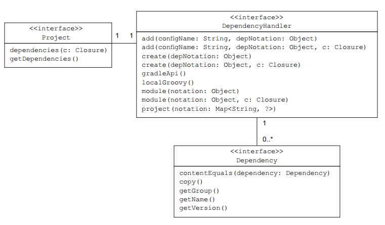
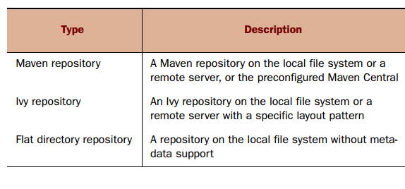
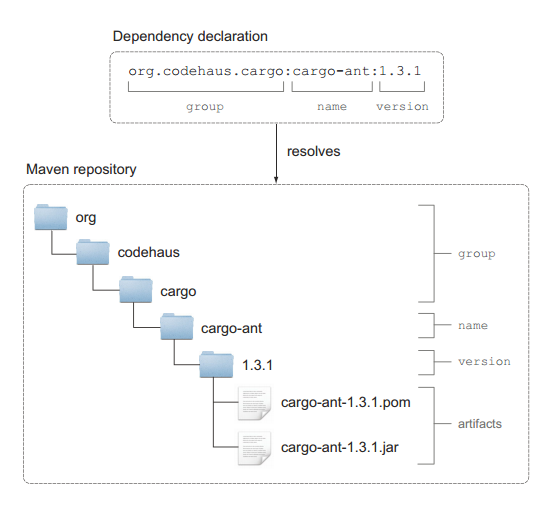

# 五、简介

在第三章我们在构建 To Do 应用的时候学习到了怎么声明对 Servlet ApI 的依赖，Gradle 的领域特定语言使得声明依赖和仓库变得很简单，你只需要在 dependencies 脚本中声明你所依赖的库，然后你需要告诉构建系统要从哪个仓库里下载依赖。提供了这两个信息，Gradle 就能自动解析、下载依赖到你的电脑上，如果有需要会存储在本地缓存中必备以后需要。

这一章我们将介绍 Gradle 对依赖管理的强大支持，学习依赖分组和定位不同类型仓库的 DSL 元素。依赖管理看起来很容易，但是当出现依赖解析冲突时就会很棘手，复杂的依赖关系可能导致构建中依赖一个库的多个版本。Gradle 通过分析依赖树得到依赖报告，你将很容易找到一个指定的依赖的来源，为什么选择这个版本来处理版本冲突。

Gradle 有自己的依赖管理实现，为了避免其他依赖管理软件比如 Ivy 和 Maven 的缺点，Gradle 关心的是性能、可靠性和复用性。

## 简要概述依赖管理

几乎所有基于 JVM 的项目都会或多或少依赖其他库，假设你在开发一个基于 web 的项目，你很可能会依赖很受欢迎的开源框架比如 Spring MVC 来提高效率。Java 的第三方库一般以 JAR 文件的形式存在，一般用库名加版本号来标识。随着开发的进行依赖的第三方库增多小的项目变的越来越大，组织和管理你的 JAR 文件就很关键。

### 不算完美的依赖管理技术

由于 Java 语言并没提供依赖管理的工具，所以你的团队需要自己开发一套存储和检索依赖的想法。你可能会采取以下几种常见的方法：

*   手动复制 JAR 文件到目标机器，这是最原始的很容易出错的方法。
*   使用一个共享的存储介质来存储 JAR 文件(比如共享的网盘)，你可以加载网络硬盘或者通过 FTP 检索二进制文件。这种方法需要开发者事先建立好与仓库的连接，手动添加新的依赖到仓库中。
*   把依赖的 JAR 文件同源代码都添加到版本控制系统中。这种方法不需要任何额外的步骤，你的同伴在拷贝仓库的时候就能检索依赖的改变。另一方面，这些 JAR 文件占用了不必要的空间，当你的项目存在相互之间依赖的时候你需要频繁的 check-in 的检查源代码是否发生了改变。

### 自动管理依赖的重要性

尽管上面的方法都能用，但是这距离理想的解决方案差远了，因为他们没有提供一个标准化的方法来命名和管理 JAR 文件。至少你得需要开发库的准确版本和它依赖的库(传递依赖)，这个为什么这么重要？

**准确知道依赖的版本**

如果在项目中你没有准确声明依赖的版本这将会是一个噩梦，如果没有文档你根本无法知道这个库支持哪些特性，是否升级一个库到新的版本就变成了一个猜谜游戏因为你不知道你的当前版本。

**管理传递依赖**

在项目的早期开发阶段传递依赖就会是一个隐患，这些库是第一层的依赖需要的，比如一个比较常见的开发方案是将 Spring 和 Hibernate 结合起来这会引入超过 20 个其他的开发库，一个库需要很多其他库来正常工作。下图展示了 Hibernate 核心库的依赖图：


如果没有正确的管理依赖，你可以会遇到没想到过的编译期错误和运行期类加载问题。我们可以总结到我们需要一个更好的方式来管理依赖，一般来讲你想在项目元数据中声明你的依赖和它的版本号。作为一个项目自动化的过程，这个版本的库会自动从中央仓库下载、安装到你的项目中，我们来看几个现有的开源解决方案。

**使用自动化的依赖管理**

在 Java 领域里支持声明的自动依赖管理的有两个项目：Apache Ivy(Ant 项目用的比较多的依赖管理器)和 Maven(在构建框架中包含一个依赖管理器)，我不再详细介绍这两个的细节而是解释自动依赖管理的概念和机制。

Ivy 和 Maven 是通过 XML 描述文件来表达依赖配置，配置包含两部分：依赖的标识加版本号和中央仓库的位置(可以是一个 HTTP 链接)，依赖管理器根据这个信息自动定位到需要下载的仓库然后下载到你的机器中。库可以定义传递依赖，依赖管理器足够聪明分析这个信息然后解析下载传递依赖。如果出现了依赖冲突比如上面的 Hibernate core 的例子，依赖管理器会试着解决。库一旦被下载就会存储在本地的缓存中，构建系统先检查本地缓存中是否存在需要的库然后再从远程仓库中下载。下图显示了依赖管理的关键元素：


Gradle 通过 DSL 来描述依赖配置，实现了上面描述的架构。

### 自动依赖管理面临的挑战

虽然依赖管理器简化了手工的操作，但有时也会遇到问题。你会发现你的依赖图中会依赖同个库的不同版本，使用日志框架经常会遇到这个问题，依赖管理器基于一个特定的解决方案只选择其中一个版本来避免版本冲突。如果你想知道某个库引入了什么版本的传递依赖，Gradle 提供了一个非常有用的依赖报告来回答这个问题。下一节我会通过一个例子来讲解。

### 依赖管理实战

在前面我们学习了怎么使用 Jetty 插件来使用自带的 Jetty 容器来部署一个 TODo 应用，Jetty 是一个轻量级的开发容器，启动非常快。很多企业级的应用都使用其他的 Web 容器来部署应用，假设你使用的是 Apache Tomcat。

## 声明依赖

DSL 配置 block dependencies 用来给配置添加一个或多个依赖，你的项目不仅可以添加外部依赖，下面这张表显示了 Gradle 支持的各种不同类型的依赖。


这一章直接扫外部模块依赖和文件依赖，我们来看看 Gradle APi 是怎么表示依赖的。

**理解依赖的 API 表示**

每个 Gradle 项目都有一个 DependencyHandler 的实例，你可以通过 getDependencies()方法来获取依赖处理器的引用，上表中每一种依赖类型在依赖处理器中都有一个相对应的方法。每一个依赖都是 Dependency 的一个实例，group, name, version, 和 classifier 这几个属性用来标识一个依赖，下图清晰的表示了项目(Project)、依赖处理器(DependencyHandler)和依赖三者之间的关系：



### 外部模块依赖

在 Gradle 的术语里，外部库通常是以 JAR 文件的形式存在，称之为外部模块依赖，代表项目层次外的一个模块，这种类型的依赖是通过属性来唯一的标识，接下来我们来介绍每个属性的作用。

**依赖属性**

当依赖管理器从仓库中查找依赖时，需要通过属性的结合来定位，最少需要提供一个 name。

*   group： 这个属性用来标识一个组织、公司或者项目，可以用点号分隔，Hibernate 的 group 是 org.hibernate。
*   name： name 属性唯一的描述了这个依赖，hibernate 的核心库名称是 hibernate-core。
*   version： 一个库可以有很多个版本，通常会包含一个主版本号和次版本号，比如 Hibernate 核心库 3.6.3-Final。
*   classifier： 有时候需要另外一个属性来进一步的说明，比如说明运行时的环境，Hibernate 核心库没有提供 classifier。

**依赖的写法**

你可以使用下面的语法在项目中声明依赖：

```java
    dependencies {
        configurationName dependencyNotation1,     dependencyNotation2, ...
    }
```

你先声明你要给哪个配置添加依赖，然后添加依赖列表，你可以用 map 的形式来注明，你也可以直接用冒号来分隔属性，比如这样的：


```java
    //声明外部属性
    ext.cargoGroup = 'org.codehaus.cargo'
    ext.cargoVersion = '1.3.1'

    dependencies {
        //使用映射声明依赖
        compile group: cargoGroup, name: 'cargo-core-uberjar',version: cargoVersion
        //用快捷方式来声明，引用了前面定义的外部属性
        cargo "$cargoGroup:cargo-ant:$cargoVersion"
    }
```

如果你项目中依赖比较多，你把一些共同的依赖属性定义成外部属性可以简化 build 脚本。

Gradle 没有给项目选择默认的仓库，当你没有配置仓库的时候运行 deployTOLocalTomcat 任务的时候回出现如下的错误：

```java
    $ gradle deployToLocalTomcat
    :deployToLocalTomcat FAILED
    FAILURE: Build failed with an exception.

    Where: Build file '/Users/benjamin/gradle-in-action/code/chapter5/cargo-configuration/build.gradle' line: 10

    What went wrong:
    Execution failed for task ':deployToLocalTomcat'.
    > Could not resolve all dependencies for configuration ':cargo'.
        > Could not find group:org.codehaus.cargo, module:cargo-core-uberjar, version:1.3.1.
        Required by:
            :cargo-configuration:unspecified
    > Could not find group:org.codehaus.cargo, module:cargo-ant,version:1.3.1.
        Required by:
        :cargo-configuration:unspecified

到目前为止还没讲到怎么配置不同类型的仓库，比如你想使用 MavenCentral 仓库，添加下面的配置代码到你的 build 脚本中：

    repositories {
        mavenCentral()
    }
```

**检查依赖报告**

当你运行 dependencies 任务时，这个依赖树会打印出来，依赖树显示了你 build 脚本声明的顶级依赖和它们的传递依赖：


仔细观察你会发现有些传递依赖标注了*号，表示这个依赖被忽略了，这是因为其他顶级依赖中也依赖了这个传递的依赖，Gradle 会自动分析下载最合适的依赖。

**排除传递依赖**

Gradle 允许你完全控制传递依赖，你可以选择排除全部的传递依赖也可以排除指定的依赖，假设你不想使用 UberJar 传递的 xml-api 的版本而想声明一个不同版本，你可以使用 exclude 方法来排除它：

```java
    dependencies {
        cargo('org.codehaus.cargo:cargo-ant:1.3.1') {
            exclude group: 'xml-apis', module: 'xml-apis'
        }
        cargo 'xml-apis:xml-apis:2.0.2'
    }
```

exclude 属性值和正常的依赖声明不太一样，你只需要声明 group 和(或)module，Gradle 不允许你只排除指定版本的依赖。

有时候仓库中找不到项目依赖的传递依赖，这会导致构建失败，Gradle 允许你使用 transitive 属性来排除所有的传递依赖：

```java
    dependencies {
        cargo('org.codehaus.cargo:cargo-ant:1.3.1') {
        transitive = false
        }
        // 选择性的声明一些需要的库
    }
```

**动态版本声明**

如果你想使用一个依赖的最新版本，你可以使用 latest.integration，比如声明 Cargo Ant tasks 的最新版本，你可以这样写 `org.codehaus .cargo:cargo-ant:latest-integration`，你也可以用一个+号来动态的声明：

```java
    dependencies {
        //依赖最新的 1.x 版本
        cargo 'org.codehaus.cargo:cargo-ant:1.+'
    }
```

Gradle 的 dependencies 任务可以清晰的看到选择了哪个版本，这里选择了 1.3.1 版本：

```java
    $ gradle –q dependencies
    ------------------------------------------------------------
    Root project
    ------------------------------------------------------------
    Listing 5.4 Excluding a single dependency
    Listing 5.5 Excluding all transitive dependencies
    Listing 5.6 Declaring a dependency on the latest Cargo 1.x version
    Exclusions can be
    declared in a shortcut
    or map notation.
    120 CHAPTER 5 Dependency management
    cargo - Classpath for Cargo Ant tasks.
    \--- org.codehaus.cargo:cargo-ant:1.+ -> 1.3.1
    \--- ...
```

### 文件依赖

如果你没有使用自动的依赖管理工具，你可能会把外部库作为源代码的一部分或者保存在本地文件系统中，当你想把项目迁移到 Gradle 的时候，你不想去重构，Gradle 很简单就能配置文件依赖。下面这段代码复制从 Maven 中央仓库解析的依赖到 libs/cargo 目录。

```java
    task copyDependenciesToLocalDir(type: Copy) {
        //Gradle 提供的语法糖
        from configurations.cargo.asFileTree
        into "${System.properties['user.home']}/libs/cargo"
    }
```

运行这个任务之后你就可以在依赖中声明 Cargo 库了，下面这段代码展示了怎么给 cargo 配置添加 JAR 文件依赖：

```java
    dependencies {
        cargo fileTree(dir: "${System.properties['user.home']}/libs/cargo",include: '*.jar')
    }
```

## 配置远程仓库

Gradle 支持下面三种不同类型的仓库：



下图是配置不同仓库对应的 Gradle API：


下面以 Maven 仓库来介绍，Maven 仓库是 Java 项目中使用最为广泛的一个仓库，库文件一般是以 JAR 文件的形式存在，用 XML(POM 文件)来来描述库的元数据和它的传递依赖。所有的库文件都存储在仓库的指定位置，当你在构建脚本中声明了依赖时，这些属性用来找到库文件在仓库中的准确位置。group 属性标识了 Maven 仓库中的一个子目录，下图展示了 Cargo 依赖属性是怎么对应到仓库中的文件的：



RepositoryHandler 接口提供了两个方法来定义 Maven 仓库，mavenCentral 方法添加一个指向仓库列表的引用，mavenLocal 方法引用你文件系统中的本地 Maven 仓库。

**添加 Maven 仓库**

要使用 Maven 仓库你只需要调用 mavenCentral 方法，如下所示：

```java
    repositories {
        mavenCentral()
    }
```

**添加本地仓库**

本地仓库默认在 <user_home>/.m2/repository 目录下，只需要添加如下脚本来引用它：</user_home>

```java
    repositories {
        mavenLocal()
    }
```

**添加自定义 Maven 仓库**

如果指定的依赖不存在与 Maven 仓库或者你想通过建立自己的企业仓库来确保可靠性，你可以使用自定义的仓库。仓库管理器允许你使用 Maven 布局来配置一个仓库，这意味着你要遵守 artifact 的存储模式。你也可以添加验证凭证来提供访问权限，Gradle 的 API 提供两种方法配置自定义的仓库：maven()和 mavenRepo()。下面这段代码添加了一个自定义的仓库，如果 Maven 仓库中不存在相应的库会从自定义仓库中查找：

```java
    repositories {
        mavenCentral()
        maven {
        name 'Custom Maven Repository',
        url 'http://repository.forge.cloudbees.com/release/')
        }
    }
```