# 六、简介

每一个活跃的项目会随着时间慢慢增长的，一开始可能只是个很小的项目到后面可能包含很多包和类。为了提高可维护性和解藕的目的，你可能想把项目根据逻辑和功能来划分成一个个模块。模块通常按照等级来组织，相互之间可以定义依赖。

Gradle 给项目模块化提供了强大的支持，在 Gradle 中每个模块都是一个项目，我们称之为多项目构建，这一章介绍 Gradle 的多项目构建。

## 项目模块化

在企业项目中，包层次和类关系比较负责，把代码拆分成模块是一个比较困难的任务，因为这需要你清晰的划分功能的边界，比如把业务逻辑和数据持久化拆分开来。

### 解耦和聚合

但你的项目符合高内聚低耦合时，模块化就变得很容易，这是一条非常好的软件开发实践。一个很好的模块化的例子就是 Spring 框架，spring 框架提供了很多服务，比如 MVC web 框架、事务管理器、JDBC 数据库连接等，下图展示了 Spring3.x 的模块间的关系：

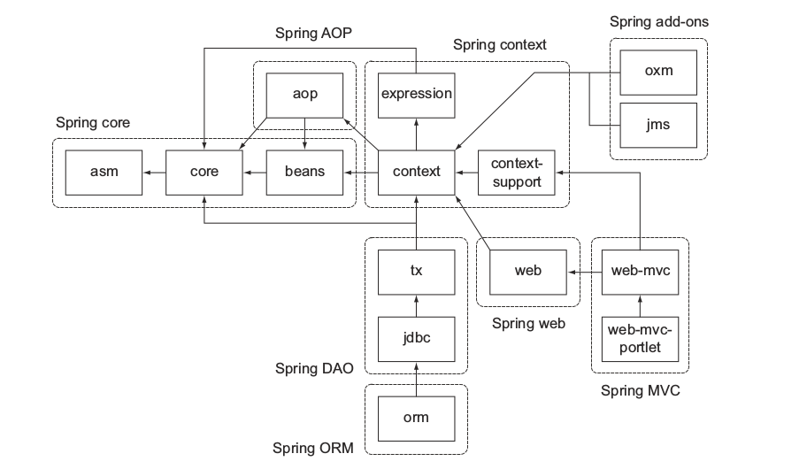

看起来这个架构非常的庞大吓人，定义了非常多的组件相互间的依赖关系比较复杂，在实际使用过程中你并不需要导入整个框架到你的项目中，你可以选择你需要使用的服务。幸运的是模块之间的依赖都是通过元数据指定的，Gradle 的依赖管理很容易解析它的传递依赖。

### 区分模块

下面我们还是继续之前那个 ToDo 的例子，我们来把它拆分为多个模块。

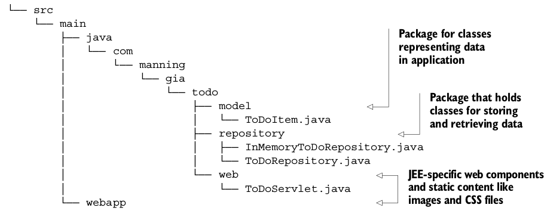

你已经根据类的功能把它们拆分成一个个包，基本上分为下面几个功能：

*   模型: 用来表示数据
*   仓库: 检索和存储数据
*   Web: 用来处理 HTTP 请求、渲染页面的 Web 组件

虽然这是一个非常小的项目，这些模块之间也有依赖关系：

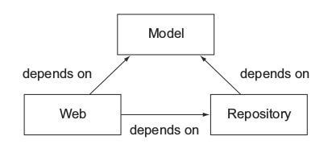

### 重构成模块

现在很容易把存在的项目结构重构成几个模块，对于每个模块，使用合适的名称创建一个子目录，把相关的代码移动到里面。默认的源代码路径 src/main/java 还是毫发无损，Web 模块需要默认的 web 应用源代码目录 src/main/webapp,下面显示了模块化的项目布局：

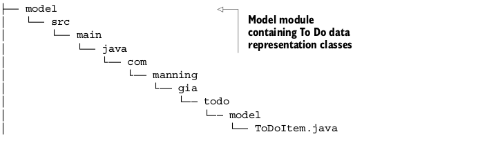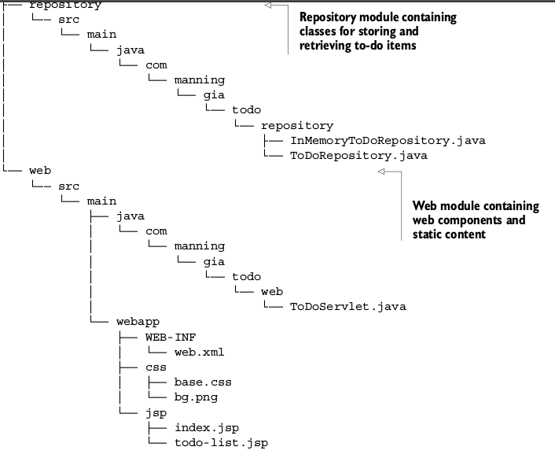

## 多项目打包

上一节你给你的项目定义了一个层次化的目录结构，整个项目包含一个根目录和每个模块一个子目录，这一节你将学习怎么用 Gradle 来构建这样一个项目结构。

首先在你的根目录新建一个 build.gradle 文件，创建一个空的 build 脚本然后运行 gradle projects:

```java
    $ gradle projects
    :projects
    ------------------------------------------------------------
    Root project
    ------------------------------------------------------------
    Root project 'todo'
    No sub-projects
```

接下来学习怎么通过 settings.gradle 来定义项目的子项目。

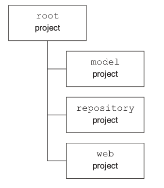

### 介绍设置文件

设置文件用来表示项目的层次结构，默认的设置文件名称是 settings.gradle,对于你想添加的每一个子项目，调用 include 方法来添加。

```java
    //参数是项目路径，不是文件路径
    include 'model'
    include 'repository', 'web'
```

提供的项目路径是相对于根目录，记住冒号：是用来分隔目录层次，比如你想表示 model/todo/items 这个目录，在 gradle 里面是 model:todo:items 这样表示。接下来执行 gradle projects 任务：

```java
    $ gradle projects
    :projects
    ------------------------------------------------------------
    Root project
    ------------------------------------------------------------
    Root project 'todo'
    +--- Project ':model'
    +--- Project ':repository'
    +--- Project ':web'
```

通过添加当个设置文件，你就创建了一个多项目的构建包含一个根项目和三个子项目，不需要额外的配置。

### 理解 settings 的 API 表示

在 Gradle 开始执行构建之前，它创建一个 Settings 类型的实例，Settings 接口直接用来表示 settings 文件，主要目的是通过代码来动态添加项目参与到多项目构建中，下图是你可以访问的 Gradle API。

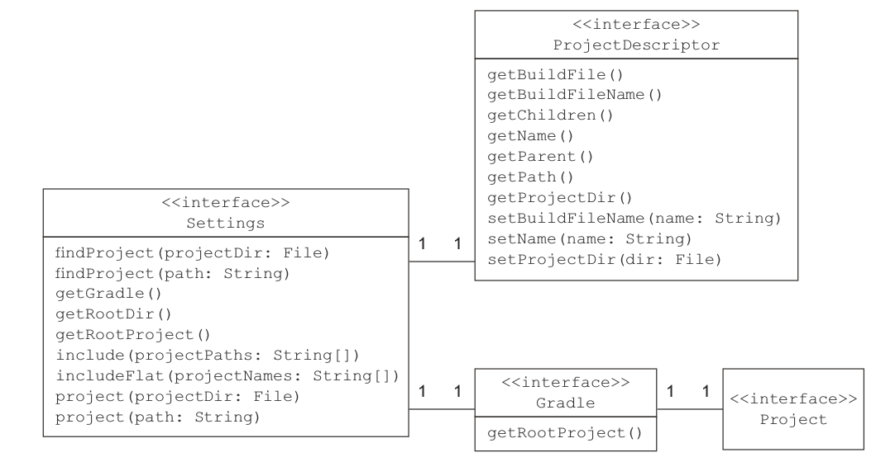

之前我们介绍过 Gradle 有三个生命周期，实例化阶段->配置阶段->执行阶段，Settings 处于实例化阶段，Gradle 自动找出一个子项目是否处在一个多项目构建中。

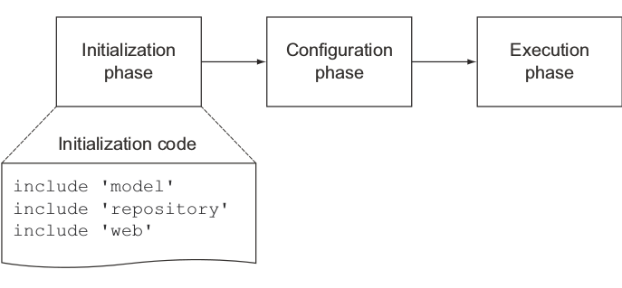

### 设置文件解析

Gradle 允许你从根目录或者任何子目录中运行构建任务，只要它包含一个 build 脚本，Gradle 怎么知道一个子项目是不是一个多项目构建的一部分呢？他需要查找 settings 文件，Gradle 通过两步来查找设置文件。

1.  Gradle 查找和当前目录具有相同嵌套级别的 master 目录下的设置文件
2.  如果第一步没有找到设置文件，Gradle 从当前目录开始逐步查找父目录

如果找到了 settings 文件，项目包含在另一个项目中，这个项目就当成是多项目构建的一部分。整个过程如下所示：

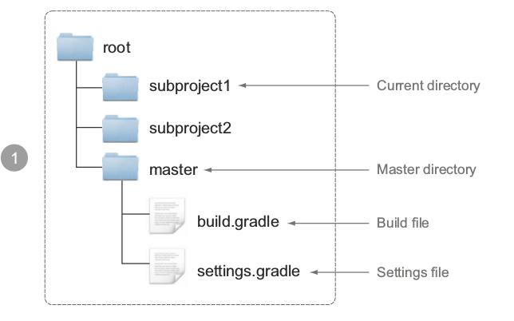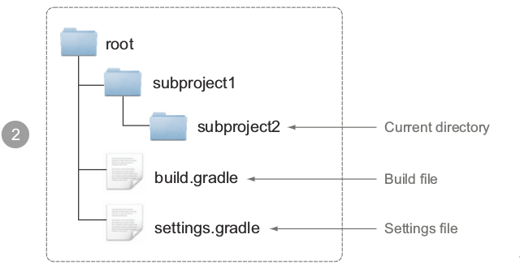

## 配置子项目

到目前为止你已经把 ToDo 项目根据功能拆分成多个模块，接下来可以用之前的方法来定义构建逻辑，下面有几点需要主要：

*   根目录和子目录使用相同的 group 和 version 属性值
*   所有的子目录都是 Java 项目需要 Java 插件来正常工作，所以你只需要在子项目中应用 Java 插件
*   web 子项目是唯一一个依赖外部库的项目，它需要打包成 WAR 而不是 JAR
*   子项目之间可以定义模块依赖

接下来你将学习如何定义特定的和共有的构建逻辑，怎么样去避免重复的配置。有些子项目可能依赖其他项目的源代码，比如 repository 项目依赖 model 项目，通过声明项目依赖可以避免拷贝源代码。

### 理解项目的 API 表示

之前我介绍过项目 Project 可能会用到的一些 API，接下来还有一些 API 用在多项目构建中。project 方法用于声明指定项目的构建代码，需要提供项目的路径，比如:model。有时候你想给所有的项目或者只有子项目定义一些逻辑，你可以使用 allprojects 和 subprojects 方法，比如你想给所有的子项目添加 Java 插件，你需要使用 subprojects 方法。

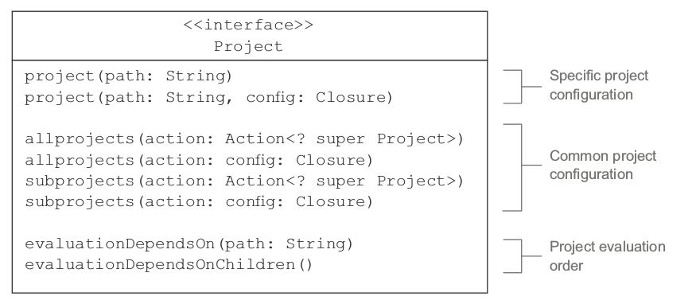

### 定义项目特有的行为

指定项目的行为通过 project 方法来定义，为了给三个子项目 model、repository、web 定义构建逻辑，你需要给它们分别创建一个配置块。下面 build.gradle 文件：

```java
    ext.projectIds = ['group': 'com.manning.gia', 'version': '0.1']

    group = projectIds.group
    version = projectIds.version

    project(':model') {
        group = projectIds.group
        version = projectIds.version
        apply plugin: 'java'
    }

    project(':repository') {
        group = projectIds.group
        version = projectIds.version
        apply plugin: 'java'
    }

    project(':web') {
        group = projectIds.group
        version = projectIds.version
        apply plugin: 'java'
        apply plugin: 'war'
        apply plugin: 'jetty'

    repositories {
        mavenCentral()
    }

    dependencies {
        providedCompile 'javax.servlet:servlet-api:2.5'
        runtime 'javax.servlet:jstl:1.1.2'
    }

    }
```

从整个项目的根目录那里，你可以执行子项目的任务，需要记住项目路径是通过冒号分隔，比如你想执行 model 子项目的 build 任务，在命令行中执行 gradle :modle:build 就可以，如下所示：

```java
    $ gradle :model:build
    :model:compileJava
    :model:processResources UP-TO-DATE
    :model:classes
    :model:jar
    :model:assemble
    :model:compileTestJava UP-TO-DATE
    :model:processTestResources UP-TO-DATE
    :model:testClasses UP-TO-DATE
    :model:test
    :model:check
    :model:build
```

### 声明项目依赖

声明项目依赖和声明外部依赖非常类似，只需要在 dependencies 配置块中声明，如下所示：

```java
    project(':model') {
    ...
    }

    project(':repository') {
    ...

    dependencies {
        //声明编译期依赖项目 model
        compile project(':model')

    }

    }

    project(':web') {
    ...

    dependencies {
        //声明编译期依赖项目 repository
        compile project(':repository')
        providedCompile 'javax.servlet:servlet-api:2.5'
        runtime 'javax.servlet:jstl:1.1.2'
    }

    }
```

这样就定义了我们的项目依赖，注意当一个项目依赖于另一个项目时，另一个项目的项目依赖和外部依赖同样会被添加进来，在构建周期的初始化阶段，Gradle 决定项目的执行顺序。

从根目录的执行顺序是这样的：

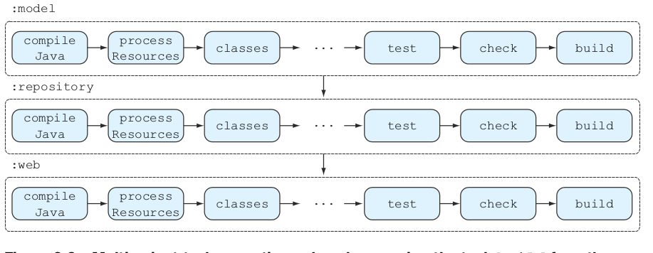

有时候你并不需要重新构建那些并未改变的项目，Gradle 提供了部分构建 partial builds 的选项，通过命令行选项-a 或者--no-rebuild。比如你只改变了 repository 项目不想重新构建 model 子项目，你可以这样做：gralde :repository:build -a,如下所示：

```java
    $ gradle :repository:build -a
    :repository:compileJava
    :repository:processResources UP-TO-DATE
    :repository:classes
    :repository:jar
    :repository:assemble
    :repository:compileTestJava UP-TO-DATE
    :repository:processTestResources UP-TO-DATE
    :repository:testClasses UP-TO-DATE
    :repository:test
    :repository:check
    :repository:build
```

### 定义共同的行为

上面你在所有的子项目中添加了 Java 插件，给所有的项目添加了一个外部属性 ProjectIds,当你的子项目变得比较多的时候这样子做可能是个问题，接下来你可以通过 allprojects 和 subprojects 方法来改善你的构建代码。

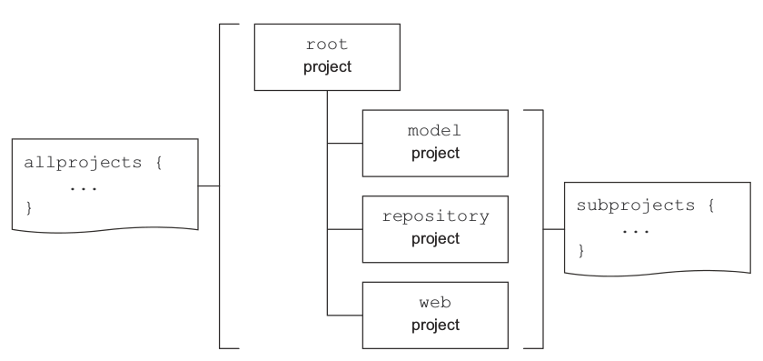

这是什么意思？这意味着你可以用 allprojects 方法给所有的项目添加 group 和 version 属性，由于根项目不需要 Java 插件，你可以使用 subprojects 给所有子项目添加 Java 插件，如下所示：

```java
    allprojects {
        group = 'com.manning.gia'
        version = '0.1'
    }

    subprojects {
        apply plugin: 'java'
    }

    project(':repository') {
        dependencies {
            compile project(':model')
        }
    }

    project(':web') {
        apply plugin: 'war'
        apply plugin: 'jetty'

        repositories {
            mavenCentral()
        }

        dependencies {
            compile project(':repository')
            providedCompile 'javax.servlet:servlet-api:2.5'
            runtime 'javax.servlet:jstl:1.1.2'
        }
    }
```

## 拆分项目文件

到目前为止我们自定义了一个 build.gradle 和 settings.gradle 文件，随着你添加越来越多的子项目和任务到 build.gradle 中，代码的维护性将会下降。通过给每个子项目建立一个单独的 build.gradle 文件可以解决这个问题。

接下来我们在每个子项目的目录下创建一个 build.gradle 文件，目录如下：

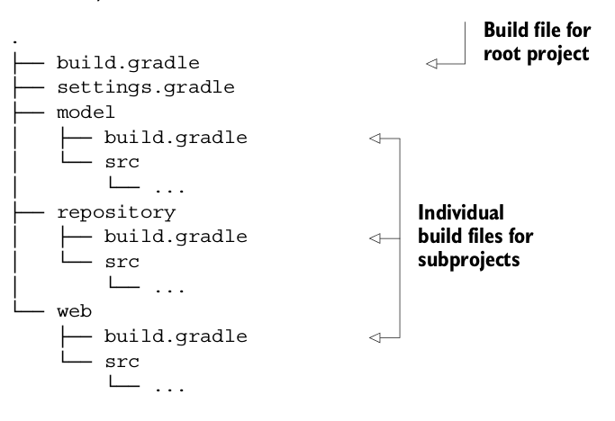

现在你可以把构建逻辑从原先的 build 脚本中拆分开来放到合适的位置。

### 定义根项目的构建代码

移除了那些与特定子项目相关的代码后，根项目的内容变得非常简单，只需要保留 allprojects 和 subprojects 配置块，如下所示：

```java
    allprojects {
        group = 'com.manning.gia'
        version = '0.1'
    }

    subprojects {
        apply plugin: 'java'
    }
```

### 定义子项目的构建代码

接下来你只需要把与特定项目相关的构建代码移到相应的 build.gradle 文件里就可以了，如下所示：

repository 子项目的构建代码：

```java
    dependencies {
        compile project(':model')
    }
```

web 子项目的构建代码：

```java
    apply plugin: 'war'
    apply plugin: 'jetty'

    repositories {
        mavenCentral()
    }

    dependencies {
        compile project(':repository')
        providedCompile 'javax.servlet:servlet-api:2.5'
        runtime 'javax.servlet:jstl:1.1.2'
    }
```

运行这个多项目构建和之前单独的一个 build 脚本的结果完全一样，当时你该上了构建代码的可读性和维护性。

## 自定义脚本

Gradle 构建脚本的标准名称是 build.gradle，在一个多项目构建的环境中，你想自定义你的构建脚本名称来显得高大上一点，因为多个项目有相同的构建脚本名称可能会混淆，接下来介绍如何使用自定义的脚本名称。

还是之前那个例子，假设所有的子项目路径都是以 todo-开头，比如 web 子项目就是在 todo-web 目录下，构建脚本名称应该清晰的表示它的作用，如下图所示：

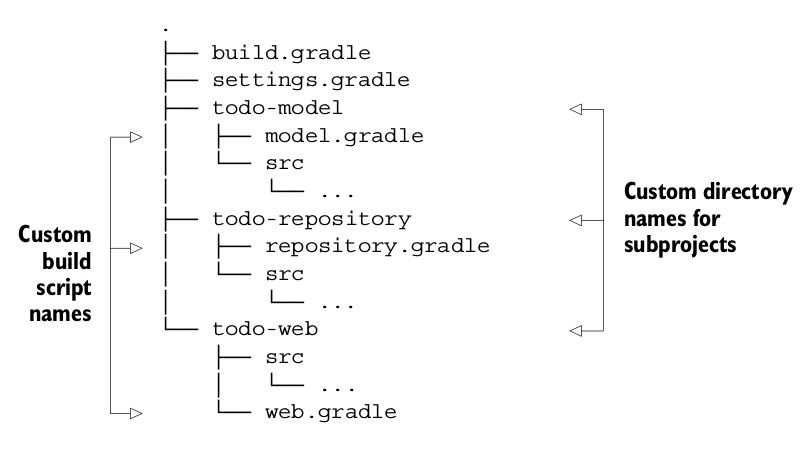

要使这个结构起作用关键点就是 settings 文件，它提供了除了包含哪个子目录的其他功能，实际上设置文件是一个构建脚本，它会在构建生命周期的评估阶段执行，通过 Gradle 提供的 API 来添加自定义的逻辑，如下所示：

```java
    //通过目录来添加子项目
    include 'todo-model', 'todo-repository', 'todo-web'

    //设置根项目的名字
    rootProject.name = 'todo'

    //迭代访问所有根目录下的子项目，设置自定义的构建脚本名称
    rootProject.children.each {
        it.buildFileName = it.name + '.gradle' - 'todo-'
    }
```