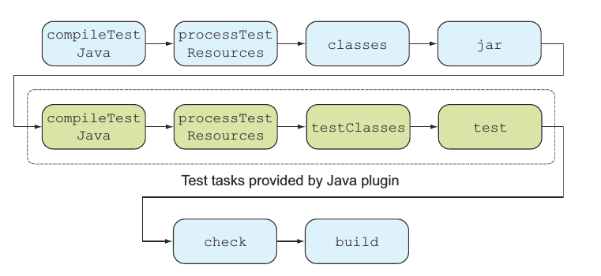

# 七、简介

在之前的章节我们实现了一个简单但是功能齐全的 web 项目、学习了如何使用 Gradle 来构建和运行这个项目。测试代码是软件开发周期中非常重要的一环，能够确保软件的行为能符合预期。这一章我将讲述如何使用 Gradle 来组织、配置和执行测试代码，学习如何写单元测试、集成测试和功能测试并把他们集成到项目构建中。

Gradle 集成了很多 Java 和 Groovy 测试框架，在本章的最后你会用 JUnit、TestNG 和 Spock 来编写和执行测试，学习控制测试日志的输出、监听测试生命周期事件，以及如何提高测试性能。

## 自动化测试

如果你想构建可靠的高质量的软件，自动化测试将是你工具箱里面非常关键的一个部分，它帮助你减少手工测试的代价，提高你的开发小组重构已有代码的能力。

### 自动化测试的类型

　并非所有的自动化测试都是相似的，他们通常在作用域、实现方式和执行时间上有所差异，我把他们分成三种类型的测试：单元测试、集成测试和功能测试。

*   单元测试用于测试你代码的最小单元，在基于 java 的项目中这个单元就是一个方法(method)，在单元测试中你会避免与其他类或者外部的系统打交道。单元测试很容易编写，执行起来非常快速，能够在开发阶段给你代码的正确性提供反馈。
*   集成测试用于测试某一个组件或者子系统。你想确保不同类之间的交互能够按照预期一样，一个典型的情况就是逻辑层需要和数据库打交道。因此相关的子系统、资源文件和服务层必须在测试执行阶段是可访问的。集成测试通常比单元测试运行更慢，更难维护，出现错误时也比较难诊断。
*   功能测试用于测试一个应用的功能，包括和外部系统的交互。功能测试是最难实现也是运行最慢的，因为他们需要模仿用户交互的过程，在 web 开发的情况，功能测试应该包括用户点击链接、输入数据或者在浏览窗口提交表单这些情形，因为用户接口可能随着时间改变，功能测试的维护将会很困难。

### 自动化测试金字塔

你可能想知道到底哪一种测试最适合你的项目，在现实环境中你可能会混合使用这几种测试方法来确保你的代码在不同架构层面都是正确的。你需要写多少测试取决于编写和维护测试的时间消耗。测试越简单就越容易执行，一般来讲你的项目应该包含很多单元测试，少量的集成测试以及更少的功能测试。

## 测试 Java 应用

一些开源的测试框架比如 JUnit,TestNG 能够帮助你编写可复用的结构化的测试，为了运行这些测试，你要先编译它们，就像编译源代码一样。测试代码的作用仅仅用于测试的情况，你可不想把你的测试代码发布到生产环境中，把源代码和测试代码混在一起可不是个好主意。通常你会把源代码和测试代码分开来，比如 Gradle 的标准项目布局 src/main/java 和 src/test/java。

### 项目布局

在前面我们讲到默认的项目布局，源代码是 src/main/java，资源文件是在 src/main/resources,测试源代码路径也是这样，你把测试代码放在 src/test/java，资源文件放在 src/test/resources，编译之后测试的 class 文件在 build/classes/test 下。

所有的测试框架都会生成至少一个文件用来说明测试执行的结果，最普遍的格式就是 XML 格式，你可以在 build/test-results 路径下找到这些文件，XML 文件的可读性比较差，许多测试框架都允许把测试结果转换成报告，比如 JUnit 可以生成 HTML 格式的报告，Gradle 把测试报告放在 build/reports/test。下图清晰的显示了项目的布局：


上面讲了这么多测试框架，Gradle 怎么知道你想使用哪一个呢?你需要声明对外部库的依赖。

### 测试配置

Java 插件引入了两个配置来声明测试代码的编译期和运行期依赖:testCompile 和 testRuntime，我们来看一下怎么声明一个对 JUnit 框架的编译期依赖：

```java
    dependencies {
        testCompile　'junit:junit:4.11'
    }
```

另外一个配置 testRuntime 用来声明那些编译期用不着但是在运行期需要的依赖，记住用于测试的依赖不会影响你源代码的 classpath，换句话说他们不会用在编译或打包过程。然而，对于处理依赖来讲测试配置继承了源代码相关配置，比如 testCompile 继承了 compile 配置的依赖，testRuntime 继承了 runtime 和 testCompile 和他们的父类，他们父类的依赖会自动传递到 testCompile 或 testRuntime 中。如下图所示：


### 测试任务

在之前的任务我们可能注意到任务图一直有四个任务是 up-to-date 的然后被跳过了，这是因为你没有编写任何测试代码 Gradle 就不需要编译或执行。下图显示了这四个任务在任务图中的位置：



从图中可以看到测试编译和测试执行阶段是在源代码被编译和打包之后的，如果你想避免执行测试阶段你可以在命令行执行 gradle jar 或者让你的任务依赖 jar 任务。

### 自动测试检查

对于 build/classes/test 目录下的所有编译的测试类，Gradle 怎么知道要执行哪一个呢？答案就是所有匹配下面几条描述的都会被检查：

*   任何继承自 junit.framework.TestCase 或 groovy.util.GroovyTestCase 的类
*   任何被@RunWith 注解的子类
*   任何至少包含一个被@Test 注解的类

如果没有找到符合条件的，测试就不会执行，接下来我们会使用不同框架来编写单元测试。

## 单元测试

作为一个 Java 开发者，你有很多个测试框架可选，这一节我将介绍传统的 JUnit 和 TestNG,如果你没有接触过这些框架，你可以先看看他们的在线文档。

### 使用 JUnit

你将给你之前的 ToDo 应用的存储类 InMemoryToDoRepository.java 编写单元测试，为了突出不同框架的相同和不同之处，所有的单元测试都会验证同一个类的功能。接下来你给子项目 repository 编写测试，放置测试代码的正确位置是在测试的标准布局里，在 src/test/java 目录下创建一个名叫 InMemoryToDoRepositoryTest.java 的类，你可以学习测试驱动开发的相关理论，在代码中添加适当的断言语句，下面这段代码用来测试插入功能的正确性。

```java
    import com.manning.gia.todo.model.ToDoItem;
    import org.junit.Before;
    import org.junit.Test;
    import java.util.List;
    import static org.junit.Assert.*;

    public class InMemoryToDoRepositoryTest {
        private ToDoRepository inMemoryToDoRepository;
        //用这个注解标识的都会在类的所有测试方法之前执行
        @Before
        public void setUp() {
            inMemoryToDoRepository = new InMemoryToDoRepository();
        }
        //用这个注解的都会作为测试用例
        @Test
        public void insertToDoItem() {
            ToDoItem newToDoItem = new ToDoItem();        　
            newToDoItem.setName("Write unit tests");
            Long newId = inMemoryToDoRepository.insert(newToDoItem);        //错误的断言会导致测试失败　
            assertNull(newId);
            ToDoItem persistedToDoItem = inMemoryToDoRepository.findById(newId);
            assertNotNull(persistedToDoItem);
            assertEquals(newToDoItem, persistedToDoItem);
        }
    }
```

接下来你需要在依赖配置中添加 JUnit 的依赖：

```java
    project(':repository')repositories {
        mavenCentral()
    }
    {
    }
    dependencies {
        compile project(':model')
        testCompile 'junit:junit:4.11'
    }
```

之前我们讲过 test 任务会先编译源代码，生成 Jar 文件，然后编译测试代码最后执行测试，下面的命令行输出显示了有一个断言出错的情况：

```java
    $ gradle :repository:test
    :model:compileJava
    :model:processResources UP-TO-DATE
    :model:classes
    :model:jar
    :repository:compileJava
    :repository:processResources UP-TO-DATE
    :repository:classes
    :repository:compileTestJava
    :repository:processTestResources UP-TO-DATE
    :repository:testClasses
    :repository:test

    com.manning.gia.todo.repository.InMemoryToDoRepositoryTest
    > testInsertToDoItem FAILED//出错方法的名字
    java.lang.AssertionError at InMemoryToDoRepositoryTest.java:24
    //测试结果概括
    1 test completed, 1 failed
    :repository:test FAILED

    FAILURE: Build failed with an exception.

    * What went wrong:
    Execution failed for task ':repository:test'.
    > There were failing tests. See the report at:
    ➥ file:///Users/ben/dev/gradle-in-action/code/chapter07/junit-test-
    ➥ failing/repository/build/reports/tests/index.html
```

从输出可以看出一个断言失败了，这正是你想看到的，显示的信息并没有告诉你为什么测试失败了，指示告诉你第２４行的断言失败了，如果你有很多个测试，你需要打开测试报告才能找到出错的原因，你可以在任务使用-i 选项打印日志输出：

```java
    $ gradle :repository:test –i
    ...
    com.manning.gia.todo.repository.InMemoryToDoRepositoryTest
    > testInsertToDoItem FAILED
    java.lang.AssertionError: expected null, but was:<1>
    at org.junit.Assert.fail(Assert.java:88)
    at org.junit.Assert.failNotNull(Assert.java:664)
    at org.junit.Assert.assertNull(Assert.java:646)
    at org.junit.Assert.assertNull(Assert.java:656)
    at com.manning.gia.todo.repository.InMemoryToDoRepositoryTest
    ➥ .testInsertToDoItem(InMemoryToDoRepositoryTest.java:24)
    ...
```

在堆栈树我们可以找到出错的原因是 newId 的值我们假定是 null 的实际上为１，所以断言出错了，修改之后再运行可以看到所有测试都通过了：

```java
    $ gradle :repository:test
    :model:compileJava
    :model:processResources UP-TO-DATE
    :model:classes
    :model:jar
    :repository:compileJava
    :repository:processResources UP-TO-DATE
    :repository:classes
    :repository:compileTestJava
    :repository:processTestResources UP-TO-DATE
    :repository:testClasses
    :repository:test
```

Gradle 可以生成更加视觉化的测试报告，你可以在 build/reports/test 目录下找到 HTML 文件，打开 HTML 文件你应该可以看到类似这样的东西：


### 使用其他测试框架

你可能在你的项目中想使用其他的测试框架比如 TestNG 和 Spock

**使用 testNG**

比如你想用 testNG 来编写相同的测试类，相似的，你用 testNG 指定的注解来标识相应的方法，要想你的构建执行 testNG 测试，你需要做两件测试：

1.  声明对 testNG 库的依赖
2.  调用 Test#useTestNG()方法来声明测试过程使用 testNG 框架

如下图所示来配置脚本文件：

```java
    project(':repository'){
        repositories {
            mavenCentral()
        }

        dependencies {
            compile project(':model')
            testCompile 'org.testng:testng:6.8'
        }
        //设置使用 testNG 来测试
        test.useTestNG()

    }
```

更多信息请访问 [`wiki.jikexueyuan.com/project/gradleIn-action/`](http://wiki.jikexueyuan.com/project/gradleIn-action/)