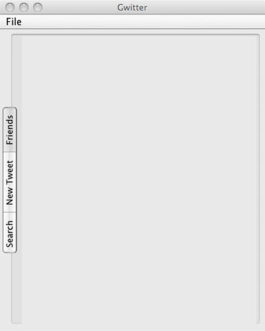
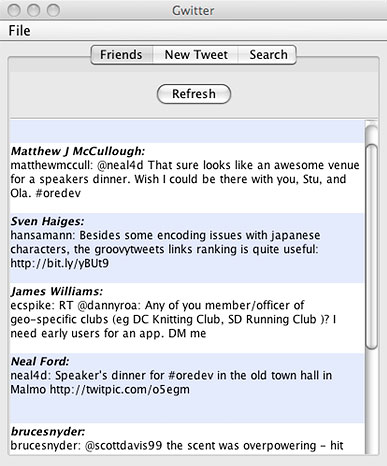

# 实战 Groovy: SwingBuilder 和 Twitter API，第 2 部分

*使用 HTTP 基本身份验证和 ConfigSlurper*

在本期 [*实战 Groovy*](http://www.ibm.com/developerworks/cn/java/j-pg/) 文章中，Scott Davis 将继续构建 [第 1 部分](http://www.ibm.com/developerworks/cn/java/j-groovy09299/) 中的 Groovy Twitter 客户机：Gwitter。这次，他将解决 HTTP Basic 身份验证问题，并使用 Groovy 的 `ConfigSlurper` 读入配置设置。

在 “[SwingBuilder 和 Twitter API，第 1 部分](http://www.ibm.com/developerworks/cn/java/j-groovy09299/)” 中，我使用 Groovy 的 `SwingBuilder` 建立了一个简单 Swing GUI ，从而创建了一个 Twitter 客户机（名称为 Gwitter）。我展示了通用的 Twitter Search API，它可以方便地绕过对身份验证的需求。但是 Twitter 的典型使用模式是获取所关注的人（在 Twitter 中为*朋友*）的 tweet，并发表自己的 tweet。要能够读取朋友的 tweet，Twitter 必须首先知道您是谁。因此，您必须能够使用 Twitter API 以编程的方式*登录*。

## 关于本系列

Groovy 是一种新兴的运行于 Java™ 平台之上的编程语言。它提供与已有 Java 代码的无缝集成，并引入了一些强大的新特性，比如闭包和元编程。简单来讲，Groovy 就是在 21 世纪 Java 语言的的效果。

将任何新工具整合进开发工具包中的关键是知道何时使用它以及何时保留它。Groovy 有时非常强大，但仅仅适用于一些适当的场景。因此，*实战 Groovy* 系列将探索 Groovy 的实际使用，从而帮助您了解如何成功地应用它们。

在本文中，您将向 Gwitter 添加身份验证功能，并使 Gwitter 能够请求和解析您的朋友时间轴。与上次一样，您首先将了解基本的命令行概念，在确认它能独立工作之后，将它整合到 Gwitter 中 — 并对 Gwitter UI 进行一些增强。要获取本文的完整源代码，请参见 下载 小节。

## Twitter 中的身份验证

Twitter 支持两种身份验证方法：OAuth 和 HTTP Basic 身份验证。Twitter 开发团队在文档中明确表明建议您首选 OAuth 机制（参见 参考资料）。但他们也承认 “针对桌面客户机的传统 OAuth 流程有时非常麻烦”。因此，我将使用 Groovy 中最为简单的 HTTP Basic 身份验证方式，相信大家也不会感到奇怪。

## 您自己的 Twitter 帐户

要让本文中的示例正常运行，您需要提供自己的 Twitter 用户名和密码。如果还没有帐户，请访问 [`twitter.com/signup。`](https://twitter.com/signup。)

HTTP Basic 身份验证的流行归因于它的的实例非常简单（参见 参考资料）。您只需要使用冒号来连接用户名和密码，然后对结果执行 Base64 编码。可以使用最朴实的语言来描述它的安全性：它可以防止纯文本凭证通过线路传递出去。但是，与 Web 开发相关的任何编程语言都可以使用 Base64 编码和解码。

在 Groovy 中，Base64 编码的 Twitter 用户名和密码如下所示：

```java
def authString = "username:password".getBytes().encodeBase64().toString() 
```

创建身份验证字符串仅仅是整个问题中的一小部分。为了能够读取朋友的 tweet，您需要向 [`twitter.com/statuses/friends_timeline.atom`](http://twitter.com/statuses/friends_timeline.atom) 发出一个 REST 式请求，并在 HTTP GET 请求的 `Authorization` 头部中传入 Base6 编码的字符串（参见 参考资料）。

创建一个名称为 friends.groovy 文件。添加如清单 1 所示的代码：

1.  以 Atom 文档的形式请求朋友时间轴。
2.  使用 `XmlSlurper` 解析它。
3.  向控制台打印输出结果。

（要回顾如何使用 Groovy `XmlSlurper` 来解析 XML，请阅读 “[实战 Groovy：构建和解析 XML](http://www.ibm.com/developerworks/cn/java/j-pg05199/)”。）

##### 清单 1\. 在 Twitter 中请求朋友时间轴

```java
def addr = "http://twitter.com/statuses/friends_timeline.atom"
def authString = "username:password".getBytes().encodeBase64().toString()
def conn = addr.toURL().openConnection()
conn.setRequestProperty("Authorization", "Basic ${authString}")
if(conn.responseCode == 200){
  def feed = new XmlSlurper().parseText(conn.content.text)
  feed.entry.each{entry->
    println entry.author.name
    println entry.title
    println "-"*20
  }
}else{
  println "Something bad happened."
  println "${conn.responseCode}: ${conn.responseMessage}"
} 
```

在命令行中输入 `groovy friends`。输出应该类似于清单 2。当然，您的输出将根据传递给 Twitter 的凭证以及所关注的朋友而有所不同。

##### 清单 2\. friends.groovy 的 Twitter 输出

```java
--------------------
Scott Davis
scottdavis99: @neal4d Is the Bishop's Arms *diagonally* adjacent
to your hotel? Or is it two doors over and one door up?
--------------------
Neal Ford
neal4d: At the Bishop's Arms, the pub adjacent our hotel, with
a shocking number of single-malt scotches. I need to spend some
quality time here.
-------------------- 
```

## `cURL`

`cURL` 是一个用于发起 HTTP GET、POST、PUT 和 DELETE 请求的命令行实用工具。它是 UNIX®、Linux® 和 Mac OS X 系统上的标准工具，并且可以下载到 Windows® 中（参见 参考资料）。（有关使用 `cURL` 与 REST 式 Web 服务交互的更多信息，请阅读 “[精通 Grails：RESTful Grails](http://www.ibm.com/developerworks/cn/java/j-grails09168/)”。）

要掌握原始 Atom 输出，可以在命令行中发起一个 cURL 请求。清单 3 给出了一个示例：

##### 清单 3\. 使用 `cURL` 从 Twitter 获取原始 Atom

```java
$ curl -u scottdavis99:password
    http://twitter.com/statuses/friends_timeline.atom

<?xml version="1.0" encoding="UTF-8"?>
<feed xml:lang="en-US" >
  <title>Twitter / scottdavis99 with friends</title>
  <updated>2009-11-03T22:15:45+00:00</updated>

  <entry>
    <title>scottdavis99: @neal4d Is the Bishop's Arms *diagonally*
      adjacent to your hotel? Or is it two doors over and one door up?
    </title>
    <id>tag:twitter.com,2007:
       http://twitter.com/scottdavis99/statuses/5402041984</id>
    <published>2009-11-03T21:23:43+00:00</published>
    <updated>2009-11-03T21:23:43+00:00</updated>
    <author>
      <name>Scott Davis</name>
      <uri>http://thirstyhead.com</uri>
    </author>
  </entry>

  <entry />
  <entry />
  <entry />
</feed> 
```

这样，现在您已经确定可以使用 Basic 身份验证来发起 HTTP GET 请求并解析结果了。但是，源代码中硬编码的用户名和密码会生成一个红色标记。较好的方法是将身份验证信息重构到外部属性文件中。

* * *

## 使用 Groovy 的 `ConfigSlurper` 读取 Java 属性

在 Java 应用程序中存储外部信息的一种最常用的方法是使用属性文件。属性文件是存储在纯文本中的简单键值对。属性文件是平面文件 — 它们并未提供任何形式的键嵌套和分组 — 但是您可以通过创建具有相同前缀的带点名称来对您的键实现虚假嵌套。

创建一个名称为 config.properties 的文件，并添加如清单 4 所示的内容：

##### 清单 4\. 一个简单的 Java 属性文件

```java
login.username=fred
login.password=wordpass 
```

读取属性文件的一种方法是使用 `java.util.Properties` 类。创建一个名称为 PropertiesTest.groovy 的文件并编写如清单 5 所示的单元测试：

##### 清单 5\. 读取 Java 属性文件的简单单元测试

```java
class PropertiesTest extends GroovyTestCase{
  void testReadingProperties(){
    Properties properties = new Properties();
    try{
      properties.load(new FileInputStream("config.properties"));
      assertEquals("fred", properties.getProperty("login.username"));
      assertEquals("wordpass", properties.getProperty("login.password"));
    }catch (IOException e) {
      fail(e.getMessage());
    }
  }
} 
```

要运行单元测试，在命令行中键入 `groovy PropertiesTest`。每个测试方法应该都有一个点，并且在运行完成后会显示 `OK (1 test)`。

您已经了解了使用 `XmlSlurper` 来剖析 XML 是多么地简单。Groovy 提供了一个类似的类 — `groovy.util.ConfigSlurper` — 用于读入属性文件。 `ConfigSlurper` 使读取 Java 属性文件变得非常简单。

向 PropertiesTest.groovy 添加一个新测试，如清单 6 所示：

##### 清单 6\. 通过 `ConfigSlurper` 读取 Java 属性文件

```java
void testReadingPropertiesWithConfigSlurper(){
  Properties properties = new Properties();
  properties.load(new FileInputStream("config.properties"));
  def config = new ConfigSlurper().parse(properties);
  assertEquals "fred", config.login.username
  assertEquals "wordpass", config.login.password
} 
```

如您所见，`ConfigSlurper` 允许您使用相同的点表示来遍历 Java 属性（`XmlSlurper` 支持的 XML 方式）。`ConfigSlurper GPath` 语法要比 清单 5 的测试中所使用的 `properties.getProperty("login.username")` 简单很多。

但是，`ConfigSlurper` 的益处已经超越了语法的可读性。您可以使用一组非常类似于 Groovy 的嵌套配置块在配置文件中存储您的值。

* * *

## 使用 `ConfigSlurper` 读取 Groovy 配置

几乎可以说 Groovy 配置文件是用于存储配置设置的域相关语言 (DSL)。您可以将相似的设置分组到一个块中，并且可以将一些块嵌入到任意深度。这种嵌套方式既可以减少重复键入，又可以确保相关设计的清晰性。

创建一个名称为 config.groovy 的文件并添加如清单 7 所示的代码 ：

##### 清单 7\. Groovy 配置文件

```java
login{
  username = "fred"
  password = "wordpass"
} 
```

向 PropertiesTest.groovy 再添加一个测试，用于读入 Groovy 配置文件，如清单 8 所示：

##### 清单 8\. 使用 `ConfigSlurper` 读取 Groovy 配置文件

```java
void testConfigSlurper(){
  def config = new ConfigSlurper().parse(new File("config.groovy").text)
  assertEquals "fred", config.login.username
  assertEquals "wordpass", config.login.password
} 
```

由于过载的解析方法可以接受一个简单的 `String`，因此在一个单元测试中模拟配置设置很繁琐。Groovy 的三重引用可以很好地解决此问题，如清单 9 所示：

##### 清单 9\. 创建模拟设置

```java
void testMockConfig(){
  def mockConfig = """
    smtp{
      server = "localhost"
      port = 25
      auth{
        user = "testuser"
        password = "testpass"
      }
    }
  """

  def config = new ConfigSlurper().parse(mockConfig)
  assertEquals "testuser", config.smtp.auth.user
} 
```

结合使用 Groovy 配置文件（而不是 Java 属性文件）与 `ConfigSlurper` 将提供更加具体的收益。您可以根据预定义的环境，比如 `development`、`production` 和 `testing`，来切换各值。这可以极大的提高可测试性。

* * *

## 通过 `ConfigSlurper` 来使用环境

如果在 Groovy 配置文件中创建了一个特别命名的块 —`environments`，那么可以选择性地覆盖配置设置。如果您是一名 Grails 用户，则应该清楚它在 grails-app/conf/DataSource.groovy 中的工作原理，如清单 10 所示：

##### 清单 10\. 使用 `ConfigSlurper` 管理数据库连接的 Grails

```java
dataSource {
   pooled = true
   driverClassName = "org.hsqldb.jdbcDriver"
   username = "sa"
   password = ""
}

// environment specific settings
environments {
   development {
      dataSource {
         dbCreate = "create-drop" // one of 'create', 'create-drop','update'
         url = "jdbc:hsqldb:mem:devDB"
      }
   }
   test {
      dataSource {
         dbCreate = "update"
         url = "jdbc:hsqldb:mem:testDb"
      }
   }
   production {
      dataSource {
         dbCreate = "update"
         url = "jdbc:hsqldb:file:prodDb;shutdown=true"
      }
   }
} 
```

在清单 10 中，`ConfigSlurper` 传回的最后一个 `dataSource` 配置对象是顶部 `dataSource` 块中的全局值与 `development`、`test` 或 `production` 块中的环境相关设置的组合。您在 `environments` 块中设置的值将覆盖全局值。

最外层的块必须被命名为 `environments`，但您可以将内层块命名为任何名称。在 config.groovy 中添加如清单 11 所示的代码，然后在 PropertiesTest.groovy 中测试它：

##### 清单 11\. 在 Groovy 配置文件中使用环境

```java
//config.groovy
login{
  username = "fred"
  password = "wordpass"
}

environments{
  qa{
    login{
      username = "testuser"
      password = "testpass"
    }
  }
}

//PropertiesTest.groovy
void testWithEnvironment(){
  def config = new ConfigSlurper("qa").parse(new File("config.groovy").text)
  assertEquals "testuser", config.login.username
  assertEquals "testpass", config.login.password
} 
```

现在，您已经具备了一定的 `ConfigSlurper` 经验。接下来，结合它与之前运行的朋友时间轴示例，将它们添加到 Gwitter Swing 应用程序中。首先，您需要切换为分页界面，以便于显示新的信息。

* * *

## 向 Gwitter 添加一个 `TabbedPane`

在 [第 1 部分](http://www.ibm.com/developerworks/cn/java/j-groovy09299/) 结束时，您创建了一个单窗格的应用程序，如图 1 所示：

##### 图 1\. 单窗格 Gwitter 应用程序


要显示朋友时间轴，您需要切换为分页视图。应该还记得 Groovy 的 `SwingBuilder` 可以脱离典型的 Java 语法 `JTabbedPane tabpane = new JTabbedPane();`，而只需向 `SwingBuilder.frame` 添加一个嵌套的 `tabbedPane` 闭包。（类似于 Groovy 配置文件和 `ConfigBuilder`，不是吗？）向 Gwitter 添加一个新的 `tabbedPane`，如清单 12 所示：

##### 清单 12\. 向 Gwitter 添加一个 `tabbedPane`

```java
swingBuilder.frame(title:"Gwitter",
                   defaultCloseOperation:JFrame.EXIT_ON_CLOSE,
                   size:[400,500],
                   show:true) {
  customMenuBar()
  tabbedPane{
    panel(title:"Friends")
    panel(title:"New Tweet")
    panel(title:"Search"){
      searchPanel()
      resultsPanel()
    }
  }
} 
```

可以预见，`title` 属性将显示在选项卡中。在命令行中键入 `groovy Gwitter`，应该能够看到如图 2 所示的选项卡：

##### 图 2\. 带有新分页界面的 Gwitter


再次强调，`SwingBuilder` 仅仅在传统 Java Swing 上添加了一层语法。所有原 Java 技巧仍然适用于 Groovy。举例来说，无需使用在一行中实例化 `JTabbedPane` 并在第二行中调用 `setTabPlacement()` 这样的 setter 方法，您可以在一行中完成这两个任务，如清单 13 所示：

##### 清单 13\. 在分页面板的其余部分放置些选项卡

```java
swingBuilder.frame(title:"Gwitter",
                   defaultCloseOperation:JFrame.EXIT_ON_CLOSE,
                   size:[400,500],
                   show:true) {
  customMenuBar()
  tabbedPane(tabPlacement:JTabbedPane.LEFT){
    panel(title:"Friends")
    panel(title:"New Tweet")
    panel(title:"Search"){
      searchPanel()
      resultsPanel()
    }
  }
} 
```

如您所料，这将在面板左侧对齐选项卡，如图 3 所示：

##### 图 3\. 在分页窗格左侧对齐选项卡



运行应用程序并确认其他 `tabPlacement` 可正常工作之后，删除将选项卡返回到面板顶部的默认位置的设置。

* * *

## 填充 Friends 选项卡

现在，您将使用 Twitter API 中的实时数据来填充空的 Friends 选项卡

首先，在与 Gwitter.groovy 相同的目录中创建一个 gwitterConfig.groovy 文件。添加如清单 14 所示的代码（记住要将凭证更改为您的 Twitter 用户名和密码）：

##### 清单 14\. gwitterConfig.groovy 文件

```java
login{
  username = "username"
  password = "password"
} 
```

接下来，在相同目录中创建一个 FriendsTimeline.groovy 文件。添加如清单 15 所示的代码：

##### 清单 15\. FriendsTimeline.groovy 文件

```java
class FriendsTimeline{
  static final String addr = "http://twitter.com/statuses/friends_timeline.atom"

  static Object[] refresh(){
    def results = []

    def configFile = new File("gwitterConfig.groovy")
    if(configFile.exists()){
      def config = new ConfigSlurper().parse(configFile.text)

      //NOTE: this should be a single line in your code
      def authString = "${config.login.username}:${config.login.password}"
        .getBytes().encodeBase64().toString()
      def conn = addr.toURL().openConnection()
      conn.setRequestProperty("Authorization", "Basic ${authString}")
      if(conn.responseCode == 200){
        def feed = new XmlSlurper().parseText(conn.content.text)
        feed.entry.each{entry->
          def tweet = new Tweet()
          tweet.author = entry.author.name
          tweet.published = entry.published
          tweet.content = entry.title
          results << tweet
        }
      }else{
        println "Something bad happened."
        println "${conn.responseCode}: ${conn.responseMessage}"
      }
    }else{
      println "Cannot find ${configFile.name}."
    }

    return results as Object[]
  }
} 
```

清单 15 几乎与 Search.groovy 中的代码相同（参见 [第 1 部分](http://www.ibm.com/developerworks/cn/java/j-groovy09299/)）。区别在于，FriendsTimeline.groovy 中使用 `ConfigSlurper` 并使用 HTTP Basic 身份验证来读取 gwitterConfig.groovy 中的值。在 Search.groovy 中，您发起了一个简单的无需身份验证的 HTTP GET 请求。

您将 `FriendsTimeline` 类整合到了主 `Gwitter` 类中，这与 [第 1 部分中](http://www.ibm.com/developerworks/cn/java/j-groovy09299/) 整合 `Search` 类的方法如出一辙。首先，为 `friendsList` 添加一个字段，如清单 16 所示：

##### 清单 16\. 向 Gwitter 添加一个 `friendsList` 字段

```java
class Gwitter{
  def searchField
  def resultsList
  def friendsList

  // snip...
} 
```

接下来，为 Refresh 按钮以及 `FriendsTimeline.refresh()` 方法调用的结果添加一个面板，如清单 17 所示：

##### 清单 17\. 向 Gwitter 添加两个新面板

```java
class Gwitter{
  def searchField
  def resultsList
  def friendsList

  void show(){
    // snip...

    def friendsRefreshPanel = {
      swingBuilder.panel(constraints: BorderLayout.NORTH){
        button(text:"Refresh", actionPerformed:{
          doOutside{
            friendsList.listData = FriendsTimeline.refresh()
          }
        } )
      }
    }

    def friendsPanel = {
      swingBuilder.scrollPane(constraints: BorderLayout.CENTER){
        friendsList = list(fixedCellWidth: 380,
                           fixedCellHeight: 75,
                           cellRenderer:new StripeRenderer())
      }
    }

  }
} 
```

最后，在 Friends 选项卡中呈现 `friendsRefreshPanel` 和 `friendsPanel`，如清单 18 所示：

##### 清单 18\. 在 Friends 选项卡中呈现两个面板

```java
swingBuilder.frame(title:"Gwitter",
                   defaultCloseOperation:JFrame.EXIT_ON_CLOSE,
                   size:[400,500],
                   show:true) {
  customMenuBar()
  tabbedPane{
    panel(title:"Friends"){
      friendsRefreshPanel()
      friendsPanel()
    }
    panel(title:"New Tweet")
    panel(title:"Search"){
      searchPanel()
      resultsPanel()
    }
  }
} 
```

在命令行中键入 `groovy Gwitter`，并单击 Refresh 按钮。结果应该如图 4 所示：

##### 图 4\. 显示朋友时间轴的 Gwitter



* * *

## 结束语

在本文中，您学习如何使用 Basic 身份验证发起 HTTP GET 请求。您还了解了如何创建大多数 Groovy 配置文件和 `groovy.util.ConfigSlurper`。最后，您向 Gwitter 添加了一个分页界面，用于显示 REST 式 Twitter API 调用的结果， 以便于返回朋友时间轴。

下一期，您将发起 HTTP POST 请求来添加自己的 tweet。在此过程中，您还将了解 `JTextArea` 字段以及如何使用 `DocumentSizeFilter` 来限制输入的具体字符数量（比如说 140）。最后，我希望您可以掌握 Groovy 的大量实际应用。

* * *

## 下载

| 描述 | 名字 | 大小 |
| --- | --- | --- |
| 源代码 | [j-pg11179.zip](http://www.ibm.com/developerworks/apps/download/index.jsp?contentid=461633&filename=j-pg11179.zip&method=http&locale=zh_CN) | 21KB |