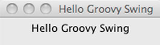
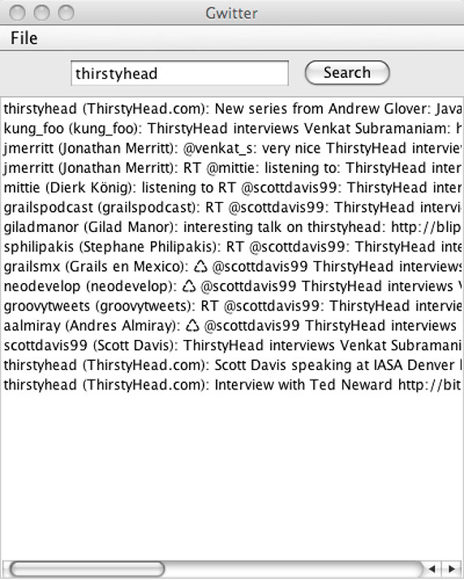
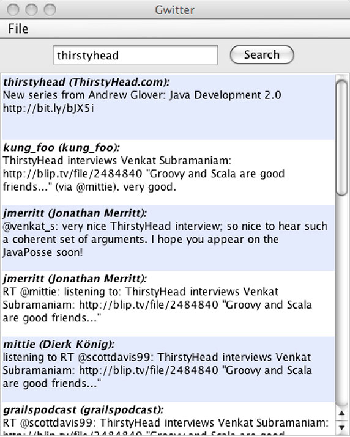

# 实战 Groovy: SwingBuilder 和 Twitter API，第 1 部分

*构建基于 Swing 的 GUI 从未如此简便*

在这一期 [*实战 Groovy*](http://www.ibm.com/developerworks/cn/java/j-pg/) 中，Scott Davis 要讨论一个令大多数服务器端 Java™ 开发人员畏惧的主题：Swing。Groovy 的 `SwingBuilder` 可以让这个强大但复杂的 GUI 框架使用起来简单一些。

我最近会见了 Ted Neward，他是 IBM developerWorks 文章系列 [*面向 Java 开发人员的 Scala 指南*](http://www.ibm.com/developerworks/cn/java/j-scala/) 的作者（见 参考资料）。我们讨论了他在这个系列中构建的一个有意思的 Twitter 库，Scitter (Scala + Twitter)。Scitter 的重点在于 Scala 的 Web 服务和 XML 解析功能，Ted 承认他不太关心为这个 API 提供前端。当然，这启发我考虑用 Groovy 编写一个 Twitter GUI 会怎么样？*Gwitter* (Groovy + Twitter) 是个不错的名字吧？

在本文中我不打算讨论 Scala 和 Groovy 的集成，尽管在这两种语言之间确实有许多协作的可能性。相反，我要讨论 Java 领域中常常被 Java 开发人员忽视的一个主题：Swing。但是，在此之前，我先谈谈 Groovy 的 `XmlSlurper` 如何简化 Twitter 的 Atom feed。

## Twitter Search API

看一下 Twitter Search API 的在线文档（见 参考资料）。文档表明可以通过发出简单的 HTTP GET 请求搜索 Twitter。查询通过查询字符串中的 `q` 参数传递，结果以 Atom（一种 XML 联合格式）或 JavaScript Object Notation (JSON) 的形式返回。因此，要想以 Atom 的形式得到所有提到 *thirstyhead* 的条目，需要发出下面这样的 HTTP GET 请求：`http://search.twitter.com/search.atom?q=thirstyhead`。

如清单 1 所示，返回的结果是嵌套在 `&lt;feed&gt;` 元素中的一系列 `&lt;entry&gt;` 元素：

##### 清单 1\. Twitter 搜索 Atom 结果

```java
<feed xml:lang="en-US" >
  <entry>
    <title>thirstyhead: New series from Andrew Glover: Java Development 2.0
           http://bit.ly/bJX5i</title>
    <content type="html">thirstyhead: New series from Andrew Glover: Java
                         Development 2.0 http://bit.ly/bJX5i</content>
    <id>tag:twitter.com,2007:
        http://twitter.com/thirstyhead/statuses/3419507135</id>
    <published>2009-08-20T02:54:54+00:00</published>
    <updated>2009-08-20T02:54:54+00:00</updated>
    <link type="text/html" rel="alternate"
          href="http://twitter.com/thirstyhead/statuses/3419507135"/>
    <link type="image/jpeg" rel="image"
          href="http://s3.amazonaws.com/twitter_production/profile_images/
          73550313/flame_normal.jpg"/>
    <author>
      <name>ThirstyHead.com</name>
      <uri>http://www.thirstyhead.com</uri>
    </author>
  </entry>

  <entry>...</entry>
  <entry>...</entry>  
  <!-- snip -->
</feed> 
```

在 “[实战 Groovy：构建和解析 XML](http://www.ibm.com/developerworks/cn/java/j-pg05199/)” 中，可以看到很容易使用 Groovy 的 `XmlSlurper` 处理 XML 结果。既然了解了这些结果的形式，就来创建一个名为 searchCli.groovy 的文件，见清单 2：

##### 清单 2\. 解析 Atom 结果的 Groovy 脚本

```java
if(args){
 def username = args[0]
 def addr = "http://search.twitter.com/search.atom?q=${username}"
 def feed = new XmlSlurper().parse(addr)
 feed.entry.each{
   println it.author.name
   println it.published
   println it.title
   println "-"*20
 }  
}else{
 println "USAGE: groovy searchCli <query>"
} 
```

在命令行上输入 `groovy searchCli thirstyhead`，就会显示简洁的 Atom 结果，见清单 3：

##### 清单 3\. 运行 searchCli.groovy 脚本

```java
$ groovy searchCli thirstyhead

thirstyhead (ThirstyHead.com)
2009-08-20T02:54:54Z
New series from Andrew Glover:
Java Development 2.0 http://bit.ly/bJX5i
--------------------
kung_foo (kung_foo)
2009-08-18T12:33:32Z
ThirstyHead interviews Venkat Subramaniam:
http://blip.tv/file/2484840 "Groovy and Scala are good friends..."
(via @mittie). very good.

//snip 
```

* * *

## 创建最初的 Gwitter 类

Groovy 脚本很适合编写非正式的实用程序和证实概念，但是编写 Groovy 类也不太困难。另外，可以编译 Groovy 类并从 Java 代码调用它们。

例如，可以编写清单 4 所示的 Tweet.groovy：

##### 清单 4\. Tweet.groovy

```java
class Tweet{
  String content
  String published
  String author

  String toString(){
    return "${author}: ${content}"
  }
} 
```

这是一个 Plain Old Groovy Object (POGO)，是非常复杂的 Plain Old Java Object (POJO) 的替代品。

现在，把 清单 2 中的搜索脚本转换为 Search.groovy，见清单 5：

##### 清单 5\. Search.groovy

```java
class Search{
  static final String addr = "http://search.twitter.com/search.atom?q="

  static Object[] byKeyword(String query){
    def results = []
    def feed = new XmlSlurper().parse(addr + query)
    feed.entry.each{entry->
      def tweet = new Tweet()
      tweet.author = entry.author.name
      tweet.published = entry.published
      tweet.content = entry.title
      results << tweet
    }
    return results as Object[]    
  }
} 
```

通常情况下，我会让结果保持 `java.util.ArrayList` 的形式。但是，本文后面使用的 `javax.swing.JList` 需要一个 `Object[]`，所以这里提前做一些准备。

注意，我在 Search.groovy 中去掉了 `main()` 方法。现在如何与这个类交互呢？当然可以通过单元测试！创建 SearchTest.groovy，见清单 6：

##### 清单 6\. SearchTest.groovy

```java
class SearchTest extends GroovyTestCase{
  void testSearchByKeyword(){
    def results = Search.byKeyword("thirstyhead")
    results.each{
      assertTrue it.content.toLowerCase().contains("thirstyhead") ||
                 it.author.toLowerCase().contains("thirstyhead")
    }    
  }
} 
```

如果在命令提示上输入 `groovy SearchTest`，然后看到 `OK (1 test)`（见清单 7），就说明已经成功地把搜索脚本转换为可重用的类了：

##### 清单 7\. 成功测试的运行结果

```java
$ groovy SearchTest
.
Time: 4.64

OK (1 test) 
```

现在底层基础结构已经就位了，下一步是开始为它提供漂亮的前端。

* * *

## `SwingBuilder` 简介

Swing 是一个极其强大的 GUI 工具集。但糟糕的是，有时候其复杂性会影响开发人员挥发它的能力。如果您刚接触 Swing，会觉得像是在学习开波音 747，而您实际上只需要开单引擎的 Cessna 或滑翔机。

Groovy 的 `SwingBuilder` 并不能降低各种任务内在的复杂性，比如选择适当的 `LayoutManager` 或处理线程问题。它降低的是语法复杂性。Groovy 的命名参数/变量参数构造器非常适合需要实例化的各种 `JComponent`，然后马上可以为它们配置一系列设置器。（关于 `SwingBuilder` 的更多信息，请参见 参考资料）。

但是，同样有价值的是 Groovy 对闭包的使用。对于 Swing，我长期关注的问题是自然的层次结构似乎在实现细节中消失了。在 Java 代码中，会得到一组相互脱节的组件，看不出哪个组件属于哪个组件。可以以任意次序声明 `JFrame`、`JPanel` 和 `JLabel`。在代码中，它们看起来是平等的；但是，实际上 `JFrame` 包含 `JPanel`，`JPanel` 进而包含 `JLabel`。清单 8 给出一个示例：

##### 清单 8\. HelloJavaSwing.java

```java
import javax.swing.*;

public class HelloJavaSwing {
  public static void main(String[] args) {
    JPanel panel = new JPanel();
    JLabel label = new JLabel("Hello Java Swing");

    JFrame frame = new JFrame("Hello Java Swing");
    panel.add(label);
    frame.add(panel);
    frame.setDefaultCloseOperation(JFrame.EXIT_ON_CLOSE);
    frame.setSize(200,300);
    frame.setVisible(true);
  }
} 
```

编译这段代码 (`javac HelloJavaSwing.java`) 并运行它 (`java HelloJava`)，应该会显示图 1 所示的应用程序：

##### 图 1\. `HelloJavaSwing`


清单 9 给出用 Groovy 编写的同一个应用程序。可以看到 `SwingBuilder` 使用了闭包，这让我们可以清晰地看出拥有关系链。

##### 清单 9\. HelloGroovySwing.groovy

```java
import groovy.swing.SwingBuilder
import javax.swing.*

def swingBuilder = new SwingBuilder()
swingBuilder.frame(title:"Hello Groovy Swing",
                   defaultCloseOperation:JFrame.EXIT_ON_CLOSE,
                   size:[200,300],
                   show:true) {
  panel(){
    label("Hello Groovy Swing")    
  }
} 
```

输入 `groovy HelloGroovySwing` 会看到图 2 所示的应用程序：

##### 图 2\. `HelloGroovySwing`



注意，在 清单 9 中，所有组件名去掉了开头的 `J`，方法名中也去掉了多余的 `get` 和 `set`。接下来，注意 `frame` 的命名参数构造器。在幕后，Groovy 调用无参数构造器，然后调用设置器方法，这与前面的 Java 示例没有区别。但是，设置器方法都集中在构造器中，代码更简洁了，去掉 `set` 前缀和末尾的圆括号也大大减少了视觉干扰。

如果您不了解 Swing，这段代码看起来可能仍然比较复杂。但是，如果您具备哪怕最粗浅的 Swing 经验，就可以看出它具有 Swing 的特征：干净、清晰和高效。

正如在前一节中所做的，通过脚本了解概念，然后把脚本转换为类。创建文件 Gwitter.groovy，见清单 10。这是 Groovy + Twitter 客户机 UI 的起点。

##### 清单 10\. Gwitter UI 的骨架

```java
import groovy.swing.SwingBuilder
import javax.swing.*
import java.awt.*

class Gwitter{   
  static void main(String[] args){
    def gwitter = new Gwitter()
    gwitter.show()
  }

  void show(){
    def swingBuilder = new SwingBuilder()  
    swingBuilder.frame(title:"Gwitter",
                       defaultCloseOperation:JFrame.EXIT_ON_CLOSE,
                       size:[400,500],
                       show:true) {
    }    
  }  
} 
```

输入 `groovy Gwitter`，确认会出现空的框架。如果一切正常，下一步是在应用程序中添加一个简单的菜单。

* * *

## 添加菜单栏

在 Swing 中创建菜单提供另一个具有自然层次结构的组件示例。创建一个 `JMenuBar`，它包含一个或多个 `JMenu`，`JMenu` 进而包含一个或多个 `JMenuItem`。

为了创建包含 `Exit` 菜单项的 `File` 菜单，在 Gwitter.groovy 中添加清单 11 中的代码：

##### 清单 11\. 在 Gwitter 中添加 `File` 菜单

```java
import groovy.swing.SwingBuilder
import javax.swing.*
import java.awt.*

class Gwitter{   
  static void main(String[] args){
    def gwitter = new Gwitter()
    gwitter.show()
  }

  void show(){
    def swingBuilder = new SwingBuilder()  

    def customMenuBar = {
      swingBuilder.menuBar{
        menu(text: "File", mnemonic: 'F') {
          menuItem(text: "Exit", mnemonic: 'X', actionPerformed: { dispose() })
        }
      }  
    }    

    swingBuilder.frame(title:"Gwitter",
                       defaultCloseOperation:JFrame.EXIT_ON_CLOSE,
                       size:[400,500],
                       show:true) {
      customMenuBar()                         
    }    
  }  
} 
```

请注意 `customMenuBar` 闭包的嵌套层次结构。为了便于阅读，这里添加了换行和缩进，但是同样很容易在同一行中定义它。定义这个闭包之后，在 `frame` 闭包中调用它。再次输入 `groovy Gwitter`，确认会出现 `File` 菜单，见图 4。选择 **File > Exit**，关闭这个应用程序。

##### 图 4\. Gwitter 的 File 菜单


再看看 清单 11。注意，`actionPerformed` 处理函数定义为闭包，而不是匿名类。与相应的 Java 代码相比，这样的代码更干净、更容易阅读。

现在，添加一些表单元素以执行搜索。

* * *

## 添加搜索面板

经验丰富的 Swing 开发人员善于用单独的 `JPanel` 组装出最终的应用程序。这些容器组件可以方便地把相似、相关的组件分组在一起。

例如，Gwitter 需要一个 `JTextField`（让用户能够输入搜索条件）和一个 `JButton` （用于提交请求）。把这两个组件分组在一个 `searchPanel` 闭包中是有意义的，见清单 12：

##### 清单 12\. 添加搜索面板

```java
import groovy.swing.SwingBuilder
import javax.swing.*
import java.awt.*

class Gwitter{   
  def searchField

  static void main(String[] args){
    def gwitter = new Gwitter()
    gwitter.show()
  }

  void show(){
    def swingBuilder = new SwingBuilder()  

    def customMenuBar = {
      swingBuilder.menuBar{
        menu(text: "File", mnemonic: 'F') {
          menuItem(text: "Exit", mnemonic: 'X', actionPerformed: {dispose() })
        }
      }  
    }    

    def searchPanel = {
      swingBuilder.panel(constraints: BorderLayout.NORTH){
        searchField = textField(columns:15)
        button(text:"Search", actionPerformed:{ /* TODO */ } )
      }
    }

    swingBuilder.frame(title:"Gwitter",
                       defaultCloseOperation:JFrame.EXIT_ON_CLOSE,
                       size:[400,500],
                       show:true) {
      customMenuBar()                         
      searchPanel()
    }    
  }  
} 
```

开始处理面板之后，就要选择适当的 `LayoutManger`。在默认情况下，`JPanel` 使用 `FlowLayout`。这意味着 `textField` 和 `button` 挨着水平排列。

`JFrame` 的 `contentPane` 不太一样 — 它在默认情况下使用 `BorderLayout`。这意味着在框架中添加 `searchPanel` 时需要指定它应该出现在哪个区域：`NORTH`、`SOUTH`、`EAST`、`WEST` 或 `CENTER`。（如果您的地理知识实在糟糕，也可以使用 `PAGE_START`、`PAGE_END`、`LINE_START`、`LINE_END` 和 `CENTER`）。关于 Swing 中可用的各种 `LayoutManager` 的更多信息，请参见 参考资料。

注意，`searchField` 变量是在类级声明的。因此，按钮等其他组件也可以访问它。其他组件都是匿名的。快速浏览一下类属性，就会看出某些组件比较重要。

您可能已经注意到按钮的 `actionPerformed` 监听器目前没有做任何事情。现在实际上还不需要它做什么。在实现它之前，需要在应用程序中添加另一个面板：用来显示搜索结果的面板。

* * *

## 添加结果面板

如清单 13 所示，像对待 `searchPanel` 那样，在嵌套的闭包中定义 `resultsPanel`。但是，这一次在这个面板中嵌套另一个容器：`JScrollPane`。这个组件可以根据需要显示和隐藏水平和垂直滚动条。`Search.byKeyword()` 方法调用的结果显示在名为 `resultsList` 的 `JList` 中。（`JList.setListData()` 方法接受一个 `Object[]`— 这就是 `Search.byKeyword()` 方法返回的结果）。

##### 清单 13\. 添加 `resultsPanel`

```java
import groovy.swing.SwingBuilder
import javax.swing.*
import java.awt.*

class Gwitter{   
  def searchField
  def resultsList

  static void main(String[] args){
    def gwitter = new Gwitter()
    gwitter.show()
  }

  void show(){
    def swingBuilder = new SwingBuilder()  

    def customMenuBar = {
      swingBuilder.menuBar{
        menu(text: "File", mnemonic: 'F') {
          menuItem(text: "Exit", mnemonic: 'X', actionPerformed: {dispose() })
        }
      }  
    }    

    def searchPanel = {
      swingBuilder.panel(constraints: BorderLayout.NORTH){
        searchField = textField(columns:15)
        button(text:"Search", actionPerformed:{
          resultsList.listData = Search.byKeyword(searchField.text) } )
      }
    }

    def resultsPanel = {
      swingBuilder.scrollPane(constraints: BorderLayout.CENTER){
        resultsList = list()
      }
    }    

    swingBuilder.frame(title:"Gwitter",
                       defaultCloseOperation:JFrame.EXIT_ON_CLOSE,
                       size:[400,500],
                       show:true) {
      customMenuBar()                         
      searchPanel()
      resultsPanel()
    }    
  }  
} 
```

注意，与 `searchField` 一样，`resultsList` 变量是在类级定义的。`searchPanel` 中按钮的 `actionPerformed` 处理函数使用这两个变量。

添加 `resultsPanel` 之后，Gwitter 现在有实际功能了。在命令提示上输入 `groovy Gwitter`，检查它是否工作正常。搜索 *thirstyhead* 应该会产生图 5 所示的结果：

##### 图 5\. 搜索结果



现在可以宣布成功了，但是我想先解决两个问题。第一个问题是搜索按钮的 `actionPerformed` 处理函数可能会引起线程问题。另一个问题是这个应用程序太一般了。下面两节解决这些问题。

* * *

## 事件分派线程

Swing 的缺点在于，它期望图形设计师能够应付多线程问题，而这是应该由软件工程师处理的，或者期望软件工程师理解图形设计和易用性问题。

我不可能在短短几段文字中讨论 Swing 应用程序中的线程问题这么复杂的主题。只需指出基本的 Swing 应用程序本质上是单线程的。所有活动都在事件分派线程 (EDT) 上进行。当用户抱怨 Swing 应用程序反应迟缓或完全没有反应时，往往是因为某个开发新手在 EDT 上执行长时间的计算密集型的数据库查询或 Web 服务调用 — 这个线程也负责处理屏幕刷新、菜单单击等。我们无意中在搜索按钮的 `actionPerformed` 处理函数上犯了同样的错误。（您可以看出多么容易犯这种错误）。

好在 `javax.swing.SwingUtilities` 类提供了几个方便的方法 — `invokeAndWait()` 和 `invokeLater()`，它们可以消除某些线程问题。可以使用这两个方法在 EDT 上同步或异步地执行操作。（关于 `SwingUtilities` 类的更多信息见 参考资料）。`SwingBuilder` 让我们很容易调用这两个方法，还提供了第三个选择：可以简便地生成新线程以执行处理时间长的操作。

要想在 EDT 上执行同步调用 (`SwingUtilities.invokeAndWait()`)，可以把调用放在 `edt{}` 闭包中。要想在 EDT 上执行异步调用 (`SwingUtilities.invokeLater()`)，就把调用放在 `doLater{}` 闭包中。但是，我想让您体验一下第三个选择：生成新线程来处理 `Search.byKeyword()` 方法调用。为此，需要把代码放在 `doOutside{}` 闭包中，见清单 14：

##### 清单 14\. 使用 `doOutside` 闭包

```java
def searchPanel = {
  swingBuilder.panel(constraints: BorderLayout.NORTH){
    searchField = textField(columns:15)
    button(text:"Search", actionPerformed:{
      doOutside{
        resultsList.listData = Search.byKeyword(searchField.text)
      }
    } )
  }
} 
```

在像 Gwitter 这样简单的应用程序中，在 EDT 上执行 Web 服务调用很可能没什么不好的效果。但是，如果把这样的代码拿给 Swing 专家看，他们会用鄙视的目光看您，就像是您在快车道里慢慢地开车，或者把车停在商店停车场的残疾人专用车位上了。因为通过使用 `SwingBuilder` 很容易正确地处理线程，完全没有理由不这么做。

既然解决了线程问题，下面就让这个应用程序更漂亮一些。

* * *

## 给列表增加条纹效果

坦率地说，Gwitter 目前很难看。我要使用一些 HTML 代码做两个简单的改进，让外观和感觉好一些。`JLabel` 可以显示基本的 HTML。按清单 15 调整 Tweet.groovy 的 `toString()` 方法。`JList` 调用 `toString()` 方法显示结果。

##### 清单 15\. 在 `toString()` 方法中返回 HTML

```java
class Tweet{
  String content
  String published
  String author

  String toString(){
    //return "${author}: ${content}"

    return """<html>
         <body>
           <p><b><i>${author}:</i></b></p>
           <p>${content}</p>
         </body>
       </html>"""
  }
} 
```

下一个改进略微有点复杂。一种常用的 GUI 技巧是给长的列表或表格加上条纹效果。用不同的颜色显示奇数行和偶数行，这样读者更容易阅读。我在搜索引擎中搜索了 *JList stripes*，采纳了找到的第一篇文章中的建议。作者建议创建一个定制的 `DefaultListCellRenderer`。我完全赞同他的意见并按原样借用他的示例代码（完整的文章见 参考资料）。

因为 Groovy 语法是 Java 语法的超集，所以可以把 Java 代码复制到 Groovy 文件中，不需要修改。如果有功能全面的构建系统，可以编译 Java 和 Groovy 代码，那么只需把这段代码留在 Java 文件中。但是，通过把代码文件的扩展名改为 .groovy，我可以运行所有未编译的 Gwitter 代码。我再次利用了 Java 语言和 Groovy 之间的无缝集成。可以在 Groovy 应用程序中不加修改地使用任何 Java 解决方案。

创建文件 StripeRenderer.groovy，添加清单 16 中的代码：

##### 清单 16\. 创建有条纹效果的 `CellRenderer`

```java
import java.awt.*;
import javax.swing.*;

class StripeRenderer extends DefaultListCellRenderer {
    public Component getListCellRendererComponent(JList list, Object value,
            int index, boolean isSelected, boolean cellHasFocus) {
        JLabel label = (JLabel) super.getListCellRendererComponent(list, value,
                index, isSelected, cellHasFocus);

        if(index%2 == 0) {
            label.setBackground(new Color(230,230,255));
        }

        label.setVerticalAlignment(SwingConstants.TOP);
        return label;
    }
} 
```

有了 `StripeRenderer` 类之后，最后需要让 `JList` 使用它。按清单 17 调整 `resultsPanel`：

##### 清单 17\. 在 `JList` 中添加定制的 `CellRenderer`

```java
def resultsPanel = {
  swingBuilder.scrollPane(constraints: BorderLayout.CENTER){
    //resultsList = list()
    resultsList =
       list(fixedCellWidth: 380, fixedCellHeight: 75, cellRenderer:new StripeRenderer())
  }
} 
```

在命令提示上再次输入 `groovy Gwitter`。搜索 *thirstyhead* 应该会产生图 16 所示的结果：

##### 图 6\. 有条纹效果的结果



我可以花更多时间美化 Gwitter 的外观和感觉，但是我希望您对大约 50 行 Swing 代码（当然不包括支持类）所实现的效果印象深刻。

* * *

## 结束语

正如本文中指出的，Groovy 并不能降低 Swing 内在的复杂性，但是它可以显著降低语法复杂性。这让您能够留出时间应付更重要的问题。

如果本文引起了您对 Groovy 和 Swing 的兴趣，您应该好好研究一下 Griffon 项目（见 参考资料）。它提供许多优于 Grails 项目的功能和惯例，但是它基于 `SwingBuilder` 和 Groovy 而不是 Spring MVC 和 Hibernate。这个项目仍然处于早期阶段（到编写本文时最新版本是 0.2），但是它已经很出色了，在 JavaOne 2009 上赢得了 Scripting Bowl for Groovy。另外，它提供的示例项目之一是 Greet，这是一个用 Groovy 实现的完整的 Twitter 客户机。

下一次，我将在 Gwitter 中添加一些必备特性：发布新 Tweet 的功能。在此过程中，您将学习如何处理基本的 HTTP 身份验证、执行 HTTP POST 以及使用与 `XmlSlurper` 相似的 `ConfigSlurper`。在此之前，我希望您探索应用 Groovy 的各种可能性。

* * *

## 下载

| 描述 | 名字 | 大小 |
| --- | --- | --- |
| 文章示例的源代码 | [j-groovy09299.zip](http://www.ibm.com/developerworks/apps/download/index.jsp?contentid=447453&filename=j-groovy09299.zip&method=http&locale=zh_CN) | 24KB |