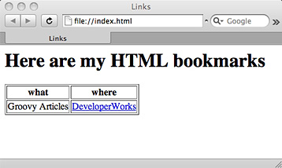

# 实战 Groovy: 构建和解析 XML

*简易 XML 操作*

通过本文，您将了解使用 Groovy 分解 XML 是多么地容易。在本期的 [*实战 Groovy*](http://www.ibm.com/developerworks/cn/java/j-pg/) 中，作者 Scott Davis 演示了无论您是使用 `MarkupBuilder` 和 `StreamingMarkupBuilder` 创建 XML，还是使用 `XmlParser` 和 `XmlSlurper` 解析 XML，Groovy 都提供了一系列用于处理这类流行数据格式的工具。

XML 似乎已经由来已久。实际上，XML 在 2008 年迎来了它的 10 年庆典（参见 参考资料）。由于 Java™ 语言只比 XML 早几年出现，因此有人认为对于 Java 开发人员来说，XML *是* 始终存在的。

## 关于本系列

Groovy 是在 Java 平台上运行的一种现代编程语言。它提供与已有 Java 代码的无缝集成，同时引入了各种生动的新特性，比如说闭包和元编程。简单来讲，Groovy 是 Java 语言的 21 世纪版本。

将任何新工具整合到开发工具包中的关键是知道何时使用它以及何时将它留在工具包中。Groovy 的功能可以非常强大，但惟一的条件是正确应用于适当的场景。因此，[*实战 Groovy*](http://www.ibm.com/developerworks/cn/java/j-pg/) 系列将探究 Groovy 的实际应用，以便帮助您了解何时以及如何成功使用它们。

Java 语言创始人 Sun Microsystems 一直是 XML 的积极支持者。毕竟，XML 的平台独立性承诺能与 Java 语言的 “编写一次，随处运行” 的口号完美契合。由于这两种技术具备一些相同的特性，您可能会认为 Java 语言和 XML 能很好地相处。事实上，在 Java 语言中解析和生成 XML 不但奇特而且还复杂。

幸运的是，Groovy 引入了一些全新的、更加合理的方法来创建和处理 XML。在一些示例的帮助下（均可通过 下载 获取），本文向您展示了如何通过 Groovy 简化 XML 的构建和解析。

## 比较 Java 和 Groovy XML 解析

在 “[for each 剖析](http://www.ibm.com/developerworks/cn/java/j-pg04149.html)” 的结束部分，我提供了一个如清单 1 所示的简单 XML 文档。（这次，我添加了 `type` 属性，稍微增加了它的趣味性。）

##### 清单 1\. XML 文档，其中列出了我知道的语言

```java
<langs type="current">
  <language>Java</language>
  <language>Groovy</language>
  <language>JavaScript</language>
</langs> 
```

在 Java 语言中解析这个简单的 XML 文档却丝毫不简单，如清单 2 所示。它使用了 30 行代码来解析 5 行 XML 文件。

##### 清单 2\. 在 Java 中解析 XML 文件

```java
import org.xml.sax.SAXException;
import org.w3c.dom.*;
import javax.xml.parsers.*;
import java.io.IOException;

public class ParseXml {
  public static void main(String[] args) {
    DocumentBuilderFactory dbf = DocumentBuilderFactory.newInstance();
    try {
      DocumentBuilder db = dbf.newDocumentBuilder();
      Document doc = db.parse("src/languages.xml");

      //print the "type" attribute
      Element langs = doc.getDocumentElement();
      System.out.println("type = " + langs.getAttribute("type"));

      //print the "language" elements
      NodeList list = langs.getElementsByTagName("language");
      for(int i = 0 ; i < list.getLength();i++) {
        Element language = (Element) list.item(i);
        System.out.println(language.getTextContent());
      }
    }catch(ParserConfigurationException pce) {
      pce.printStackTrace();
    }catch(SAXException se) {
      se.printStackTrace();
    }catch(IOException ioe) {
      ioe.printStackTrace();
    }
  }
} 
```

比较清单 2 中的 Java 代码和清单 3 中相应的 Groovy 代码：

##### 清单 3\. 在 Groovy 中解析 XML

```java
def langs = new XmlParser().parse("languages.xml")
println "type = ${langs.attribute("type")}"
langs.language.each{
  println it.text()
}

//output:
type = current
Java
Groovy
JavaScript 
```

Groovy 代码最出色的地方并不是它要比相应的 Java 代码简短很多 — 虽然使用 5 行 Groovy 代码解析 5 行 XML 是一个压倒性的优势。Groovy 代码最让我欣喜的一个地方就是它更具表达性。在编写 `langs.language.each` 时，我的感觉就像是在直接操作 XML。在 Java 版本中，您再也看不到 XML。

* * *

## 字符串变量和 XML

当您将 XML 存储在 `String` 变量而不是文件中时，在 Groovy 中使用 XML 的好处会变得更加明显。Groovy 的三重引号（在其他语言中通常称作 `HereDoc`）使得在内部存储 XML 变得非常轻松，如清单 4 所示。这与清单 3 中的 Groovy 示例之间的惟一区别就是将 `XmlParser` 方法调用从 `parse()`（它处理 `File`、`InputStreams`、`Reader` 和 `URI`）切换到 `parseText()`。

##### 清单 4\. 将 XML 存储在 Groovy 内部

```java
def xml = """
<langs type="current">
  <language>Java</language>
  <language>Groovy</language>
  <language>JavaScript</language>
</langs>
"""

def langs = new XmlParser().parseText(xml)
println "type = ${langs.attribute("type")}"
langs.language.each{
  println it.text()
} 
```

注意，三重引号可以轻松地处理多行 XML 文档。`xml` 变量是一个真正的普通旧式（plain-old）`java.lang.String` — 您可以添加 `println xml.class` 自己进行验证。三重引号还可以处理 `type="current"` 的内部引号，而不会强制您像在 Java 代码中那样使用反斜杠字符手动进行转义。

比较清单 4 中简洁的 Groovy 代码与清单 5 中相应的 Java 代码：

##### 清单 5\. 在 Java 代码内部存储 XML

```java
import org.xml.sax.SAXException;
import org.w3c.dom.*;
import javax.xml.parsers.*;
import java.io.*;

public class ParseXmlFromString {
  public static void main(String[] args) {
    String xml = "<langs type=\"current\">\n" +
            "  <language>Java</language>\n" +
            "  <language>Groovy</language>\n" +
            "  <language>JavaScript</language>\n" +
            "</langs>";

    byte[] xmlBytes = xml.getBytes();
    InputStream is = new ByteArrayInputStream(xmlBytes);

    DocumentBuilderFactory dbf = DocumentBuilderFactory.newInstance();
    try {
      DocumentBuilder db = dbf.newDocumentBuilder();
      Document doc = db.parse(is);

      //print the "type" attribute
      Element langs = doc.getDocumentElement();
      System.out.println("type = " + langs.getAttribute("type"));

      //print the "language" elements
      NodeList list = langs.getElementsByTagName("language");
      for(int i = 0 ; i < list.getLength();i++) {
        Element language = (Element) list.item(i);
        System.out.println(language.getTextContent());
      }
    }catch(ParserConfigurationException pce) {
      pce.printStackTrace();
    }catch(SAXException se) {
      se.printStackTrace();
    }catch(IOException ioe) {
      ioe.printStackTrace();
    }
  }
} 
```

注意，`xml` 变量受到了针对内部引号和换行符的转义字符的污染。然而，更糟的是需要将 `String` 转换成一个 `byte` 数组，然后再转换成 `ByteArrayInputStream` 才能进行解析。`DocumentBuilder` 未提供将简单 `String` 作为 XML 解析的直观方法。

* * *

## 通过 `MarkupBuilder` 创建 XML

Groovy 相对 Java 语言最大的优势体现于在代码中创建 XML 文档。清单 6 显示了创建 5 行 XML 代码段所需的 50 行 Java 代码：

##### 清单 6\. 使用 Java 代码创建 XML

```java
import org.w3c.dom.*;
import javax.xml.parsers.*;
import javax.xml.transform.*;
import javax.xml.transform.dom.DOMSource;
import javax.xml.transform.stream.StreamResult;
import java.io.StringWriter;

public class CreateXml {
  public static void main(String[] args) {
    DocumentBuilderFactory dbf = DocumentBuilderFactory.newInstance();
    try {
      DocumentBuilder db = dbf.newDocumentBuilder();
      Document doc = db.newDocument();

      Element langs = doc.createElement("langs");
      langs.setAttribute("type", "current");
      doc.appendChild(langs);

      Element language1 = doc.createElement("language");
      Text text1 = doc.createTextNode("Java");
      language1.appendChild(text1);
      langs.appendChild(language1);

      Element language2 = doc.createElement("language");
      Text text2 = doc.createTextNode("Groovy");
      language2.appendChild(text2);
      langs.appendChild(language2);

      Element language3 = doc.createElement("language");
      Text text3 = doc.createTextNode("JavaScript");
      language3.appendChild(text3);
      langs.appendChild(language3);

      // Output the XML
      TransformerFactory tf = TransformerFactory.newInstance();
      Transformer transformer = tf.newTransformer();
      transformer.setOutputProperty(OutputKeys.INDENT, "yes");
      StringWriter sw = new StringWriter();
      StreamResult sr = new StreamResult(sw);
      DOMSource source = new DOMSource(doc);
      transformer.transform(source, sr);
      String xmlString = sw.toString();
      System.out.println(xmlString);
    }catch(ParserConfigurationException pce) {
      pce.printStackTrace();
    } catch (TransformerConfigurationException e) {
      e.printStackTrace();
    } catch (TransformerException e) {
      e.printStackTrace();
    }
  }
} 
```

我知道一些人会立刻抱怨。许多第三方库都可以简化此代码 — JDOM 和 dom4j 是其中最流行的两个。但是，任何 Java 库都无法与使用 Groovy `MarkupBuilder` 的简洁性相比，如清单 7 所示：

##### 清单 7\. 使用 Groovy 创建 XML

```java
def xml = new groovy.xml.MarkupBuilder()
xml.langs(type:"current"){
  language("Java")
  language("Groovy")
  language("JavaScript")
} 
```

注意到这与 XML 代码的比率又重新回到了将近 1:1。更加重要的是，我可以再次查看 XML。当然，尖括号已经被替换为大括号，并且属性使用冒号（Groovy 的 `HashMap` 符号）而不是等号，但其基本结构在 Groovy 或 XML 中都是可以辨认的。它几乎类似于一个用于构建 XML 的 DSL，您认为呢？

Groovy 能够实现这种 `Builder` 魔法，因为它是一种动态的语言。另一方面，Java 语言则是静态的：Java 编译器将确保所有方法在您调用它们之前都是确实存在的。（如果您尝试调用不存在的方法，Java 代码甚至不进行编译，更不用说运行了。）但是，Groovy 的 `Builder` 证明，某种语言中的 bug 正是另一种语言的特性。如果您查阅 API 文档中的 `MarkupBuilder` 相关部分，您会发现它没有 `langs()` 方法、`language()` 方法或任何其他元素名称。幸运的是，Groovy 可以捕获这些不存在的方法调用，并采取一些有效的操作。对于 `MarkupBuilder` 的情况，它使用 phantom 方法调用并生成格式良好的 XML。

清单 8 对我刚才给出的简单的 `MarkupBuilder` 示例进行了扩展。如果您希望在 `String` 变量中捕获 XML 输出，则可以传递一个 `StringWriter` 到 `MarkupBuilder` 的构造函数中。如果您希望添加更多属性到 `langs` 中，只需要在传递时使用逗号将它们分开。注意，`language` 元素的主体是一个没有前置名称的值。您可以在相同的逗号分隔的列表中添加属性和主体。

##### 清单 8\. 经过扩展的 `MarkupBuilder` 示例

```java
def sw = new StringWriter()
def xml = new groovy.xml.MarkupBuilder(sw)
xml.langs(type:"current", count:3, mainstream:true){
  language(flavor:"static", version:"1.5", "Java")
  language(flavor:"dynamic", version:"1.6.0", "Groovy")
  language(flavor:"dynamic", version:"1.9", "JavaScript")
}
println sw

//output:
<langs type='current' count='3' mainstream='true'>
  <language flavor='static' version='1.5'>Java</language>
  <language flavor='dynamic' version='1.6.0'>Groovy</language>
  <language flavor='dynamic' version='1.9'>JavaScript</language>
</langs> 
```

通过这些 `MarkupBuilder` 技巧，您可以实现一些有趣的功能。举例来说，您可以快速构建一个格式良好的 HTML 文档，并将它写出到文件中。清单 9 显示了相应的代码：

##### 清单 9\. 通过 `MarkupBuilder` 构建 HTML

```java
def sw = new StringWriter()
def html = new groovy.xml.MarkupBuilder(sw)
html.html{
  head{
    title("Links")
  }
  body{
    h1("Here are my HTML bookmarks")
    table(border:1){
      tr{
        th("what")
        th("where")
      }
      tr{
        td("Groovy Articles")
        td{
          a(href:"http://ibm.com/developerworks", "DeveloperWorks")
        }
      }
    }
  }
}

def f = new File("index.html")
f.write(sw.toString())

//output:
<html>
  <head>
    <title>Links</title>
  </head>
  <body>
    <h1>Here are my HTML bookmarks</h1>
    <table border='1'>
      <tr>
        <th>what</th>
        <th>where</th>
      </tr>
      <tr>
        <td>Groovy Articles</td>
        <td>
          <a href='http://ibm.com/developerworks'>DeveloperWorks</a>
        </td>
      </tr>
    </table>
  </body>
</html> 
```

图 1 显示了清单 9 所构建的 HTML 的浏览器视图：

##### 图 1\. 呈现的 HTML



* * *

## 使用 `StreamingMarkupBuilder` 创建 XML

`MarkupBuilder` 非常适合用于同步构建简单的 XML 文档。对于更加高级的 XML 创建，Groovy 提供了一个 `StreamingMarkupBuilder`。通过它，您可以添加各种各样的 XML 内容，比如说处理指令、名称空间和使用 `mkp` 帮助对象的未转义文本（非常适合 `CDATA` 块）。清单 10 展示了有趣的 `StreamingMarkupBuilder` 特性：

##### 清单 10\. 使用 `StreamingMarkupBuilder` 创建 XML

```java
def comment = "<![CDATA[<!-- address is new to this release -->]]>"
def builder = new groovy.xml.StreamingMarkupBuilder()
builder.encoding = "UTF-8"
def person = {
  mkp.xmlDeclaration()
  mkp.pi("xml-stylesheet": "type='text/xsl' href='myfile.xslt'" )
  mkp.declareNamespace('':'http://myDefaultNamespace')
  mkp.declareNamespace('location':'http://someOtherNamespace')
  person(id:100){
    firstname("Jane")
    lastname("Doe")
    mkp.yieldUnescaped(comment)
    location.address("123 Main")
  }
}
def writer = new FileWriter("person.xml")
writer << builder.bind(person)

//output:
<?xml version="1.0" encoding="UTF-8"?>
<?xml-stylesheet type='text/xsl' href='myfile.xslt'?>
<person id='100'
        xmlns='http://myDefaultNamespace'
        xmlns:location='http://someOtherNamespace'>
  <firstname>Jane</firstname>
  <lastname>Doe</lastname>
  <![CDATA[<!-- address is new to this release -->]]>
  <location:address>123 Main</location:address>
</person> 
```

注意，`StreamingMarkupBuilder` 直到您调用 `bind()` 方法时才会生成最终的 XML，该方法将接受标记和所有指令。这允许您异步构建 XML 文档的各个部分，并同时输出它们。（参见 参考资料 了解更多信息。）

* * *

## 理解 `XmlParser`

Groovy 为您提供了两种生成 XML — `MarkupBuilder` 和 `StreamingMarkupBuilder` 的方式 — 它们分别具备不同的功能。解析 XML 也同样如此。您可以使用 `XmlParser` 或者 `XmlSlurper`。

`XmlParser` 提供了更加以程序员为中心的 XML 文档视图。如果您习惯于使用 `List` 和 `Map`（分别对应于 `Element` 和 `Attribute`）来思考文档，则应该能够适应 `XmlParser`。清单 11 稍微解析了 `XmlParser` 的结构：

##### 清单 11\. `XmlParser` 详细视图

```java
def xml = """
<langs type='current' count='3' mainstream='true'>
  <language flavor='static' version='1.5'>Java</language>
  <language flavor='dynamic' version='1.6.0'>Groovy</language>
  <language flavor='dynamic' version='1.9'>JavaScript</language>
</langs>
"""

def langs = new XmlParser().parseText(xml)
println langs.getClass()
// class groovy.util.Node

println langs
/*
langs[attributes={type=current, count=3, mainstream=true};
      value=[language[attributes={flavor=static, version=1.5};
                      value=[Java]],
             language[attributes={flavor=dynamic, version=1.6.0};
                      value=[Groovy]],
             language[attributes={flavor=dynamic, version=1.9};
                      value=[JavaScript]]
            ]
]
*/ 
```

注意，`XmlParser.parseText()` 方法返回了一个 `groovy.util.Node` — 在本例中是 XML 文档的根 `Node`。当您调用 `println langs` 时，它会调用 `Node.toString()` 方法，以便返回调试输出。要获取真实数据，您需要调用 `Node.attribute()` 或者 `Node.text()`。

* * *

## 使用 `XmlParser` 获取属性

如前所述，您可以通过调用 `Node.attribute("key")` 来获取单独的属性。如果您调用 `Node.attributes()`，它会返回包含所有 `Node` 的属性的 `HashMap`。使用您在 “[for each 剖析](http://www.ibm.com/developerworks/cn/java/j-pg04149.html)” 一文中所掌握的 `each` 闭包，遍历每个属性简直就是小菜一碟。清单 12 显示了一个相应的例子。（参见 参考资料，获取关于 `groovy.util.Node` 的 API 文档。）

##### 清单 12\. `XmlParser` 将属性作为 HashMap 对待

```java
def langs = new XmlParser().parseText(xml)

println langs.attribute("count")
// 3

langs.attributes().each{k,v->
  println "-" * 15
  println k
  println v
}

//output:
---------------
type
current
---------------
count
3
---------------
mainstream
true 
```

与操作属性相类似，`XmlParser` 为处理元素提供了更好的支持。

* * *

## 使用 `XmlParser` 获取元素

`XmlParser` 提供了一种直观的查询元素的方法，称作 `GPath`。（它与 `XPath` 类似，仅在 Groovy 中得到了实现。）举例来说，清单 13 演示了我之前使用的 `langs.language` 结构返回了包含查询结构的 `groovy.util.NodeList`。`NodeList` 扩展了 `java.util.ArrayList`，因此它基本上就是一个赋予了 `GPath` 超级权限的 `List`。

##### 清单 13\. 使用 `GPath` 和 `XmlParser` 进行查询

```java
def langs = new XmlParser().parseText(xml)

// shortcut query syntax
// on an anonymous NodeList
langs.language.each{
  println it.text()
}

// separating the query
// and the each closure
// into distinct parts
def list = langs.language
list.each{
  println it.text()
}

println list.getClass()
// groovy.util.NodeList 
```

当然，`GPath` 是对 `MarkupBuilder` 的补充。它所采用的技巧与调用不存在的 phantom 方法相同，区别仅在于它用于查询已有的 XML 而不是动态地生成 XML。

知道 `GPath` 查询的结果是 `List` 之后，您可以让您的代码更加简练。Groovy 提供了一个 spread-dot 运算符。在单行代码中，它基本上能迭代整个列表并对每个项执行方法调用。结果将作为 `List` 返回。举例来说，如果您只关心对查询结果中的各个项调用 `Node.text()` 方法，那么清单 14 展示了如何在一行代码中实现它：

##### 清单 14\. 结合 spread-dot 运算符与 `GPath`

```java
// the long way of gathering the results
def results = []
langs.language.each{
  results << it.text()
}

// the short way using the spread-dot operator
def values = langs.language*.text()
// [Java, Groovy, JavaScript]

// quickly gathering up all of the version attributes
def versions = langs.language*.attribute("version")
// [1.5, 1.6.0, 1.9] 
```

和功能强大的 `XmlParser` 一样，`XmlSlurper` 也实现了更高级别的处理。

* * *

## 使用 `XmlSlurper` 解析 XML

在 清单 2 中，我说过 Groovy 给我的感觉是在直接操作 XML。`XmlParser` 的功能相当不错，但它只允许您以编程的方式来操作 XML。您可以使用由 `Node` 组成的 `List` 以及由 `Attribute` 组成的 `HashMap`，并且仍然需要调用 `Node.attribute()` 和 `Node.text()` 等方法才能获取核心数据。`XmlSlurper` 将删除方法调用的最后痕迹，让您感觉就像是在直接处理 XML。

从技术上说，`XmlParser` 返回 `Node` 和 `NodeList`，而 `XmlSlurper` 返回一个 `groovy.util.slurpersupport.GPathResult`。但既然您已经知道，因此我希望您能忘记之前提到的 `XmlSlurper` 的实现细节。如果您能忽略其内部原理，那么将更好地领略其魔力。

清单 15 同时展示了一个 `XmlParser` 和一个 `XmlSlurper`：

##### 清单 15\. `XmlParser` 和 `XmlSlurper`

```java
def xml = """
<langs type='current' count='3' mainstream='true'>
  <language flavor='static' version='1.5'>Java</language>
  <language flavor='dynamic' version='1.6.0'>Groovy</language>
  <language flavor='dynamic' version='1.9'>JavaScript</language>
</langs>
"""

def langs = new XmlParser().parseText(xml)
println langs.attribute("count")
langs.language.each{
  println it.text()
}

langs = new XmlSlurper().parseText(xml)
println langs._cnnew1@count
langs.language.each{
  println it
} 
```

注意，`XmlSlurper` 忽略了任何方法调用的概念。您并没有调用 `langs.attribute("count")`，而是调用了 `langs.@count`。`@` 符号是从 `XPath` 借过来的，但其结果是，您感觉像是在直接操作属性（与调用 `attribute()` 方法相反）。您没有调用 `it.text()`，而仅仅调用了 `it`。我们假设您希望直接操作元素的内容。

* * *

## 现实中的 `XmlSlurper`

除了 `langs` 和 `language` 之外，这里还提供了实际的 `XmlSlurper` 示例。Yahoo! 以 RSS 提要的方式按 ZIP 码提供天气情况信息。当然，RSS 是 XML 中的一种专门术语。在 Web 浏览器中键入 `http://weather.yahooapis.com/forecastrss?p=80020`。可以随意将 Broomfield, Colorado 的 ZIP 码换成您自己的。清单 16 显示了最终 RSS 提要的简单版本：

##### 清单 16\. 显示最新天气情况的 Yahoo! RSS 提要

```java
<rss version="2.0"

     >
  <channel>
    <title>Yahoo! Weather - Broomfield, CO</title>
    <yweather:location city="Broomfield" region="CO"   country="US"/>
    <yweather:astronomy sunrise="6:36 am"   sunset="5:50 pm"/>

    <item>
      <title>Conditions for Broomfield, CO at 7:47 am MST</title>
      <pubDate>Fri, 27 Feb 2009 7:47 am MST</pubDate>
      <yweather:condition text="Partly Cloudy"
                          code="30"  temp="25"
                          date="Fri, 27 Feb 2009 7:47 am MST" />
    </item>
  </channel>
</rss> 
```

您要做的第一件事就是通过编程来使用这个 RSS。创建一个名称为 weather.groovy 的文件，并添加如清单 17 所示的代码：

##### 清单 17\. 以编程的方式获取 RSS

```java
def baseUrl = "http://weather.yahooapis.com/forecastrss"

if(args){
  def zip = args[0]
  def url = baseUrl + "?p=" + zip
  def xml = url.toURL().text
  println xml
}else{
  println "USAGE: weather zipcode"
} 
```

在命令行中键入 `groovy weather 80020`，确定您可以看到原始 RSS。

此脚本最重要的部分是 `url.toURL().text`。`url` 变量是一个格式良好的 `String`。Groovy 在所有 `String` 中都添加了一个 `toURL()` 方法，用于将它们转换成 `java.net.URL`。然后，Groovy 在所有 `URL` 中又添加了一个 `getText()` 方法，用于执行 `HTTP GET` 请求并将结构作为 `String` 返回。

现在，您已经将 RSS 存储在了 `xml` 变量中，并通过 `XmlSlurper` 实现了一些有趣的功能，如清单 18 所示：

##### 清单 18\. 使用 `XmlSlurper` 解析 RSS

```java
def baseUrl = "http://weather.yahooapis.com/forecastrss"

if(args){
  def zip = args[0]
  def url = baseUrl + "?p=" + zip
  def xml = url.toURL().text

  def rss = new XmlSlurper().parseText(xml)
  println rss.channel.title
  println "Sunrise: ${rss.channel.astronomy.@sunrise}"
  println "Sunset: ${rss.channel.astronomy.@sunset}"
  println "Currently:"
  println "\t" + rss.channel.item.condition.@date
  println "\t" + rss.channel.item.condition.@temp
  println "\t" + rss.channel.item.condition.@text
}else{
  println "USAGE: weather zipcode"
}

//output:
Yahoo! Weather - Broomfield, CO
Sunrise: 6:36 am
Sunset: 5:50 pm
Currently:
   Fri, 27 Feb 2009 7:47 am MST
   25
   Partly Cloudy 
```

`XmlSlurper` 让您可以自然地处理 XML，不是吗？您通过直接引用 `&lt;title&gt;` 元素来打印它 — `rss.channel.title`。您使用一个简单的 `rss.channel.item.condition.@temp` 来去除 `temp` 属性。这与编程的感觉不同。它更像是在直接操作 XML。

您是否注意到 `XmlSlurper` 甚至忽略了名称空间？您在构造函数中启用名称空间感知，但我很少这样做。非常简单，`XmlSlurper` 能像切黄油那样分解 XML。

* * *

## 结束语

要在如今成为一名成功的开发人员，您需要一系列能简化 XML 处理的工具。Groovy 的 `MarkupBuilder` 和 `StreamingMarkupBuilder` 可以非常轻松地动态创建 XML。`XmlParser` 能为您提供由 `Element` 组成的 `List` 以及由 `Attribute` 组成的 `HashMap`，并且 `XmlSlurper` 可以让代码全部消失，让您感觉是在直接操作 XML。

如果没有 Groovy 的动态功能，XML 处理的强大功能将不可能实现。在下一章文章中，我将更加深入地探索 Groovy 的动态特性。您将了解元编程在 Groovy 中的工作原理，从标准 JDK 类（如 `String.toURL()` 和 `List.each()`）中添加的出色方法到您自己添加的自定义方法。在阅读了这两篇文章之后，我希望您能充分了解 Groovy 的 实际应用。

* * *

## 下载

| 描述 | 名字 | 大小 |
| --- | --- | --- |
| 本文示例的源代码 | [j-pg05199.zip](http://www.ibm.com/developerworks/apps/download/index.jsp?contentid=398765&filename=j-pg05199.zip&method=http&locale=zh_CN) | 6KB |