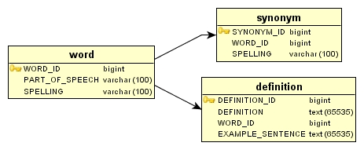

# 实战 Groovy: 关于 MOP 和迷你语言

*Groovy 让元对象协议从实验室走进应用程序*

将耳朵贴到地上仔细听 —— MOP 正在前进！了解一下元对象协议（Meta Object Protocol，MOP）吧，这是一种将应用程序、语言和应用程序构建 *为*语言的翻新方法。

在最近的一次采访中，Groovy 项目经理 Guillaume Laforge 提到，他最喜欢的 Groovy 特性是它实现了 *元对象协议（Meta Object Protocol）*或称 MOP。在运行时向一个对象传递方法，或者 *消息*时，这个协议使对象可以作出影响它自己的状态或者行为的特定选择。正如在 PARC Software Design Area 项目主页上所描述的（请参阅 参考资料）：

> 元对象协议方法……基于这样一种想法，即人们可以并且应当使语言开放，使用户可以根据他们的特定需要调整设计和实现。换句话说，鼓励用户参与语言设计过程。

显然，这种大胆的思路提出了构建更智能的应用程序、甚至 *语言*的令人激动的可能性。在本月的专栏中，我将展示 Groovy 是如何实现 MOP 的，然后用一个实际的例子介绍它最令人激动的实际应用：作为一种迷你语言的字典！

在 下载一节中提供了字典应用程序示例的源代码。下面的例子中需要下载 DbUnit，请参阅 参考资料。

## 关于本系列

在自己的开发工作中引入任何工具的关键是知道什么时候使用它、什么时候将它放回工具箱。脚本（或者 *动态*）语言会为您的工具箱加入特别强大的工具，前提是在适合的场景正确地使用它。在这方面，*实战 Groovy*是专门探讨 Groovy 的实际使用、并教给您什么时候以及如何成功地使用它们的系列文章。

## 魔术般的 MOP

元对象协议不是 Groovy 独有的，它也不是由 Groovy 发明者发明的。事实上，它的身世可追溯到 LISP 和 AOP 背后的一些人。考虑到这种身世，MOP 受到 Groovy 的见多识广的创造者们的欢迎就毫不奇怪了。

在 Groovy 中可以实现 MOP 是因为，在 *Groovyland*中每一个对象都隐式地实现 `groovy.lang.GroovyObject`，它定义了 `invokeMethod()`和 `getProperty()`两个方法。在运行时，如果向一个对象传递消息，而这个对象不是作为类或者其子类中定义的属性或者方法存在，那么就调用 `getProperty()`或者 `invokeMethod()`方法。

在清单 1 中，我定义了 Groovy 类 `MOPHandler`，它实现了 `invokeMethod()`和 `getProperty()`。当创建了 `MOPHandler`的一个实例后，可以调用任意数量的方法或者属性，并看到它打印出说明调用了什么的消息。

##### 清单 1\. MOP 得到调用的句柄

```java
 class MOPHandler {     

  def invokeMethod(String method, Object params) {     
    println "MOPHandler was asked to invoke ${method}"
    if(params != null){
     params.each{ println "\twith parameter ${it}" }
    }
  }

  def getProperty(String property){
     println "MOPHandler was asked for property ${property}"
  }  
 }
 def hndler = new MOPHandler()
 hndler.helloWorld()
 hndler.createUser("Joe", 18, new Date())
 hndler.name 
```

继续，运行清单 1 中的代码，就会看到如清单 2 所示的输出。

##### 清单 2\. 您不相信我，是不是？

```java
 aglover@glove-ubutu:~/projects/groovy-mop$ groovy
  ./src/groovy/com/vanward/groovy/MOPHandler1.groovy
 MOPHandler was asked to invoke helloWorld
 MOPHandler was asked to invoke createUser
        with parameter Joe
        with parameter 18
        with parameter Sun Sep 04 10:32:22 EDT 2005
 MOPHandler was asked for property name 
```

是不是很不错？ MOP 就像一个安全网，捕捉传递错误的消息，但是这不是它最妙的功能。用它创建可以以 *一般的方式*智能地对传递进来的任何消息作出响应的智能对象，才是它的最大亮点。

* * *

## 让我成为一种迷你语言

用 MOP 可以做的一件有趣的事情是创建伪领域专用语言，或者称为 *迷你语言*。这些是专门用于解决特定问题的独特语言。与像 Java、C# 或者甚至 Groovy 这样的流行语言不同，它们被看成是用来解决任何问题的一般性语言，而迷你语言只针对特定问题。需要一个例子？请考虑 Unix 及其 shell，如 Bash。

只是为了练习 —— 并且这样可以真正 _ 感受 _MOP —— 我将在本文的其余部分创建一个字典应用程序，它本身实际就是一个迷你语言。这个应用程序将提供一个查询字典的界面。它让用户可以创建新的单词项、得到给定单词的定义、得到给定单词的同义字、查询单词的词性以及删除单词。表 1 总结了这个迷你语言。

##### 表 1\. 字典迷你语言的语义

这个字典应用程序语言有以下语义（按从最特殊到最一般排列）：

| 1\. 词性 | 要查询单词的词性，消息应该以 `is`打头，后跟这个单词，然后是 `a`或者 `an`，然后是词性。 |
| --- | --- |
| 2\. 同义词 | 要查询一个单词的同义词，消息应该以 `synonymsOf`打头，然后是这个单词。 |
| 3\. 删除单词 | 要从字典中删除一个单词，消息应该以 `remove`或 `delete`打头，然后是这个单词。 |
| 4\. 创建单词 | 要在字典中创建一个新单词，可将单词作为方法，并将其定义、词性和可选的一组同义词作为参数传递。 |
| 5\. 获取定义 | 要查询一个单词的定义，可将这个单词作为属性或者方法传递。 |

* * *

## 字典应用程序

字典应用程序基于表结构如图 1 所示的数据库。如果您经常读我们的文章，那么您可能会看出这个表结构源自专栏文章“Mark it up with Groovy Builders”。

##### 图 1\. 字典的简单数据库模型



*注意：我将忽略 `definition`的 `EXAMPLE_SENTENCE`这一列。*

我将创建一个简单的 facade，它将作为用户与数据库之间的接口。这个 facade 将通过提供 `invokeMethod`和 `getProperty`的实现来利用 Groovy 的 MOP 特性。`invokeMethod`方法将确定命令并将责任委派给相应的内部 `private`方法。

### 一些前提条件

因为这个应用程序依赖于数据库，在继续之前，可能需要复习一下 GroovySql。我还会使用 Groovy 的正则表达式（在 感受 Groovy 中介绍）来确定传递给 facade 的消息。

我会在写这个 facade 时，_ 用 _Groovy 测试它，因此需要回顾 Groovy 的单元测试能力，请参阅我的“Unit test your Java code faster with Groovy”。

最后，在测试过程中，我将用 DbUnit 管理数据库状态。因为在本系列中没有写过 DbUnit 的内容，我将在继续之前简单介绍在 Groovy 中使用 DbUnit。

* * *

## DbUnit，结合 Groovy

DbUnit 是一项 JUnit 扩展，它在每一次运行测试之前，使数据库处于一种已知状态。在 Groovy 中使用 DbUnit 非常简单，因为 DbUnit 提供了一个 API，可以在测试用例中进行委派。为了使用 DbUnit，需要向它提供一个数据库连接和一个包含作为数据库种子的文件。将它们插入到 JUnit 的 fixture 机制中（即 `setUp()`）后，就可以继续了！ 清单 3 显示了字典应用程序的开始测试类。

##### 清单 3\. 字典应用程序的开始测试类

```java
 package test.com.vanward.groovy
 import com.vanward.groovy.SimpleDictionary
 import groovy.util.GroovyTestCase
 import java.io.File
 import java.sql.Connection
 import java.sql.DriverManager
 import org.dbunit.database.DatabaseConnection
 import org.dbunit.database.IDatabaseConnection
 import org.dbunit.dataset.IDataSet
 import org.dbunit.dataset.xml.FlatXmlDataSet
 import org.dbunit.operation.DatabaseOperation
 class DictionaryTest extends GroovyTestCase{  
   def dictionary

   void setUp() {        
      this.handleSetUpOperation()  
      dictionary = new SimpleDictionary()    
   }

   def handleSetUpOperation() {
      def conn = this.getConnection()
      def data = this.getDataSet()       
      try{
          DatabaseOperation.CLEAN_INSERT.execute(conn, data)
      }finally{
          conn.close()
      }
    }

    def getDataSet()  {
      return new FlatXmlDataSet(new File("test/conf/words-seed.xml"))
    }

    def getConnection()  {
       Class.forName("org.gjt.mm.mysql.Driver")
       def jdbcConnection = DriverManager.
             getConnection("jdbc:mysql://localhost/words",
                    "words", "words")             
       return new DatabaseConnection(jdbcConnection)
    }  
 } 
```

在清单 3 中，我创建了类 shell，它作为在编写字典应用程序时的测试类。调用测试时，JUnit 会调用 `setUp()`，它又会调用 DbUnit 的 API。DbUnit 会将在文件 test/conf/words-seed.xml 中找到的数据插入到数据库中。文件 test/conf/words-seed.xml 的内容可见清单 4。

##### 清单 4\. 示例种子文件

```java
 <?xml version='1.0' encoding='UTF-8'?>
 <dataset>
 <word WORD_ID="1" SPELLING="pugnacious" PART_OF_SPEECH="Adjective"/>   
 <definition DEFINITION_ID="10"
             DEFINITION="Combative in nature; belligerent."
             WORD_ID="1" />
 <synonym SYNONYM_ID="20" WORD_ID="1" SPELLING="belligerent"/>
 <synonym SYNONYM_ID="21" WORD_ID="1" SPELLING="aggressive"/>  
 <word WORD_ID="2" SPELLING="glib" PART_OF_SPEECH="Adjective"/>
 <definition DEFINITION_ID="11"
                DEFINITION="Performed with a natural, offhand ease"
             WORD_ID="2" />             
 <definition DEFINITION_ID="12"
            DEFINITION="Marked by ease and fluency of speech or
            writing that often suggests or stems from insincerity,
            superficiality, or deceitfulness"
         WORD_ID="2" />              
 <synonym SYNONYM_ID="30" WORD_ID="2" SPELLING="artful"/>
 <synonym SYNONYM_ID="31" WORD_ID="2" SPELLING="suave"/>  
 <synonym SYNONYM_ID="32" WORD_ID="2" SPELLING="insincere"/>  
 <synonym SYNONYM_ID="33" WORD_ID="2" SPELLING="urbane"/>  

 <word WORD_ID="3" SPELLING="rowel" PART_OF_SPEECH="Verb"/>  
 <definition DEFINITION_ID="50"
             DEFINITION="to vec, trouble"
             WORD_ID="13" />
 </dataset> 
```

种子文件的 XML 元素（如清单 4 所示）匹配表名。元素的属性匹配对应的表列。

* * *

## 构建一种迷你语言

定义了测试类后，就可以开始开发（并测试）这个应用程序了。我将按 表 1 的排列顺序处理每一项特性。

## 正则表达式组

正则表达式组在字典例子中起了主要作用。在 Groovy 中，可以通过 `=~`语法创建一个普通 Java `Matcher`实例。可以用 `Matcher`实例，通过调用 `group()`方法获得 `String`代码段。使用括号在一个正则表达式中创建组。例如，正则表达式 `(synonymsOf)(.*)`创建两个组。一个组完全匹配 `String`*"synonymsOf"*，而另一个匹配 *"synonymsOf"*后面的 *任何*字符。不过要记住，在要获得组值之前，首先必须调用 `Matcher`的 `matches()`方法。

### 1\. 词性

如果用户想要查询一个单词的词性，他或者她可以在消息中传递像 `isRowelAVerb`或者 `isEstivalAnAdjective`这样的内容。（注意，我使用了 camel-case 语义，并通过同时允许 `a`和 `an`以尽量符合正规的英语。）回答问题的智能逻辑就变成了确定正确的单词，在第一种情况下它是 *Rowel*，而在第二种情况下是 *Estival*。还必须确定词性，在本例中分别为 *Verb*和 *Adjective*。

使用正则表达式，逻辑就变得简单了。模式成为 `is(.*)(An|A)(Verb|Adjective|Adverb|Noun)`。我只对第一和第三组感兴趣（单词和词性）。有了这些，就可以编写一个简单的数据库查询，以获取词性并比较问题和答案，如清单 5 所示。

##### 清单 5\. 确定词性

```java
 private determinePartOfSpeech(question){
  def matcher = question =~ 'is(.*)(An|A)(Verb|Adjective|Adverb|Noun)'
  matcher.matches()
  def word = matcher.group(1)
  def partOfSpeech = matcher.group(3)
  def row = sql.firstRow("select part_of_speech from word
       where spelling=?", [word])     
  return row[0] == partOfSpeech
 } 
```

清单 5 看起来很简单，但是我为它编写了几个测试用例，看看会是什么情况。

##### 清单 6\. 测试单词词性的确定

```java
 void testPartOfSpeechFalse() {
  def val = dictionary.isPugnaciousAVerb()
  assertFalse("pugnacious is not a verb", val)
 }     
 void testPartOfSpeechTrue() {
  def val = dictionary.isPugnaciousAnAdjective()
  assertTrue("pugnacious is an Adjective", val)
 } 
```

再看看清单 4 中的 XML。因为我用 DbUnit 让数据库在每次测试之前处于一种已知状态，因此可以假定单词 *pugnacious*是有效的，且其词性设置为 *Adjective*。在清单 6 中，我在 `DictionaryTest`中加入了两个简单的测试（请参阅 清单 3），以确保逻辑正确地工作。

### 2\. 同义词

查询同义词的语义模式如下：`synonymsOfBloviate`，其中所要查的单词（*Bloviate*）跟在 `synonymsOf`后面。正则表达式更简单：`(synonymsOf)(.*)`。找到所需要的单词后，逻辑就进行一个数据库查询，该查询会连接 `word`和 `synonym`表。返回的同义词加入到一个 `List`中并返回，如清单 7 所示。

##### 清单 7\. getSynonyms 实现

```java
 private getSynonyms(question){
  def matcher = question =~ '(synonymsOf)(.*)'
  matcher.matches()
  def word = matcher.group(2).toLowerCase()
  def syns = []     
  sql.eachRow("select synonym.spelling from synonym, word " +
      "where synonym.word_id = word.word_id and " +
      "word.spelling = ?", [word]){ arow ->
          syns << arow.spelling
       }        
  return syns         
 } 
```

清单 8 中的测试验证了，定义了同义词的单词可以正确地返回同义词，而没有同义词的单词（*Rowel*）返回一个空 `List`。

##### 清单 8\. 不要忘记测试这个方法！

```java
 void testSynonymsForWord() {
  def val = dictionary.synonymsOfPugnacious()
  def expect = ["belligerent","aggressive"]
  assertEquals("should be: " + expect, expect, val)
 }
 void testNoSynonymsForWord() {
  def val = dictionary.synonymsOfRowel()
  def expect = []
  assertEquals("should be: " + expect, expect, val)
 } 
```

### 3\. 删除单词

清单 9 中的删除逻辑是灵活的，因为我允许使用 `remove`或者 `delete`后面加单词的命令。例如，`removeGlib`和 `deleteGlib`都是有效的命令。因此正则表达式变成：`(remove|delete)(.*)`，而逻辑是一个 SQL `delete`。

##### 清单 9\. 删除单词

```java
 private removeWord(word){
  def matcher = word =~ '(remove|delete)(.*)'
  matcher.matches()
  def wordToRemove = matcher.group(2).toLowerCase()     
  sql.execute("delete from word where spelling=?" , [wordToRemove])     
 } 
```

当然，这种灵活意味着我必须为删除单词编写 *至少*两个测试用例，如清单 10 所示。要验证单词真的被删除了，我要获取它们的定义（更多信息请参阅 5\. 获取单词的定义）并确定没有返回任何东西。

##### 清单 10\. 测试这两种情况

```java
 void testDeleteWord() {
  dictionary.deleteGlib()
  def val =  dictionary.glib()
  def expect = []
  assertEquals("should be: " + expect, expect, val)
 }
 void testRemoveWord() {
  dictionary.removePugnacious()
  def val =  dictionary.pugnacious()
  def expect = []
  assertEquals("should be: " + expect, expect, val)
 } 
```

### 4\. 创建单词

创建一个新单词的语义是一个不匹配任何查询模式并且包含一个参数清单的消息。例如，一个像 `echelon("Noun", ["a level within an organization"])`这样的消息就符合这种模式。单词是 *echelon*，第一个参数是词性，然后是包含定义的 `List`，还有可选的第三个参数，它可以是同义词的 `List`。

如清单 11 所示，在数据库中创建一个新单词就是在正确的表（`word`和 `definition`）中插入这个单词及其定义，而且，如果有同义词 `List`的话，那么要把它们都要加入。

##### 清单 11\. 创建一个单词

```java
 private createWord(word, defsAndSyms){
  def wordId = id++
  def definitionId = wordId + 10
  sql.execute("insert into word
       (word_id, part_of_speech, spelling) values (?, ?, ?)" ,
    [wordId, defsAndSyms[0], word])
  for(definition in defsAndSyms[1]){     
    sql.execute("insert into definition
         (definition_id, definition, word_id) " +
      "values (?, ?, ?)" , [definitionId, definition, wordId])
    }
  //has a list of synonyms has been passed in
  if(defsAndSyms.length > 2){
    def synonyms = defsAndSyms[2]
    synonyms.each{ syn ->
      sql.execute("insert into synonym
           (synonym_id, word_id, spelling) values (?, ?, ?)" ,
        [id++, wordId, syn])
      }
    }
 } 
```

在清单 11 中，主键逻辑过于简单了，不过我可以用几个测试证明我的信心。

##### 清单 12\. 创建单词逻辑的测试用例

```java
 void testCreateWord() {     
  dictionary.bloviate("Verb",
       ["To discourse at length in a pompous or boastful manner"],
    ["orate", "gabble", "lecture"])
  def val = dictionary.bloviate()
  def expect = "To discourse at length in a pompous or boastful manner"
  assertEquals("should be: " + expect, expect, val[0])
 }
 void testCreateWordNoSynonyms() {     
  dictionary.echelon("Noun", ["a level within an organization"])
  def val = dictionary.echelon()
  def expect = "a level within an organization"
  assertEquals("should be: " + expect, expect, val[0])
 } 
```

与通常一样，我在清单 12 中编写了几个测试用例以验证它按预想的那样工作。创建单词后，我查询这个单词的 `dictionary`实例以确认它被加入了数据库。

### 5\. 获取单词的定义

任何传递给字典应用程序的、不匹配前面任何查询类型（词性和同义词）、并且不包含任何参数的消息都被认为是定义查询。例如，一个像 `.glib`或者 `.glib()`的消息会返回 *glib*的定义。

##### 清单 13\. 查单词的定义并不困难！

```java
 private getDefinitions(word){     
  def definitions = []                      
  sql.eachRow("select definition.definition from definition, word " +
    "where definition.word_Id = word.word_id and " +
    "word.spelling = ?", [word]){ arow ->
      definitions << arow.definition
    }        
  return definitions     
 } 
```

因为我同时允许让方法调用和属性调用作为定义查询，因此在清单 14 中必须编写至少两个测试。就像在清单 6 中一样，可以假定 *pugnacious*已经在数据库中了。DbUnit 是不是很方便？

##### 清单 14\. 测试两种情况 —— 方法调用和属性

```java
 void testFindWord() {
  def val = dictionary.pugnacious()
  def expect = "Combative in nature; belligerent."
  assertEquals("should be: " + expect, expect, val[0])
 }
 void testFindWordAsProperty() {
  def val = dictionary.pugnacious
  def expect = "Combative in nature; belligerent."
  assertEquals("should be: " + expect, expect, val[0])
 } 
```

这就是字典应用程序的语义。现在让我们更深入地分析应用程序背后的逻辑。

* * *

## MOP 逻辑

字典应用程序的关键是 `invokeMethod`和 `getProperty`的实现。 我要在这些方法中做出智能的决定，即在向应用程序传递消息之后，应该如何继续。决定是通过一组条件语句而确定的，它们进行 `String`操作以确定消息的类型。

清单 15 中 *惟一*麻烦的条件就是第一条，它要验证消息是一个定义查询而不是其他可能的组合，如 `is...`、`remove...`、`delete...`或者 `synonymOf...`。

##### 清单 15\. MOP 的核心逻辑

```java
 def invokeMethod(String methodName, Object params) {     
  if(isGetDefinitions(methodName, params)){
    return getDefinitions(methodName)
  }else if (params.length > 0){      
    createWord(methodName, params)
  }else if(methodName[0..1] == 'is'){
    return determinePartOfSpeech(methodName)
  }else if
  (methodName[0..5] == 'remove' || methodName[0..5] == 'delete'){     
       removeWord(methodName)
  }else if (methodName[0..9] == 'synonymsOf'){
    return getSynonyms(methodName)
  }
 }

 private isGetDefinitions(methodName, params){
  return !(params.length > 0) &&
    ( (methodName.length() <= 5
    && methodName[0..1] != 'is' ) ||
    (methodName.length() <= 10
    && isRemoveDeleteIs(methodName) ) ||
    (methodName.length() >= 10
    && methodName[0..9] != 'synonymsOf'
    && isRemoveDeleteIs(methodName)))     
 }

 private isRemoveDeleteIs(methodName){
     return (methodName[0..5] != 'remove'
      && methodName[0..5] != 'delete'
      && methodName[0..1] != 'is')
  } 
```

`isGetDefinitions`方法做了很多工作，其中一些工作依赖于 `isRemoveDeleteIs`。当它确定一个消息不符合定义查询时，逻辑就变得简单多了。

清单 16 中的 `getProperty`方法很简单，因为我规定用户只能按属性查询定义，因此，调用 `getProperty`时，我调用 `getDefinitions`方法。

##### 清单 16\. 太好了，属性很简单！

```java
 def getProperty(String property){
  return getDefinitions(property)
 } 
```

就是这样了！真的。清单 5 到 16 中的逻辑创建了一个应用程序，它给予用户相当的灵活性，同时又不会太复杂。当然，如前所述，应用程序中的主键逻辑并不是很保险。在这方面有多种改进方法，从数据库序列到像 Hibernate 这样的框架都可以，Hibernate 框架用于相当得体地处理 ID。

眼见为实，清单 17 展示了字典应用程序的语言的实际能力。（如果在使用 SAT 之前有这样的东西该多好！）

##### 清单 17\. 字典展示

```java
 import com.vanward.groovy.SimpleDictionary
 def dict = new SimpleDictionary()  
 dict.vanward("Adjective", ["Being on, or towards the front"],
     ["Advanced"])
 dict.pulchritude("Noun", ["Great physical beauty and appeal"])
 dict.vanward             //prints "Being on, or towards the front"
 dict.pulchritude()       //prints "Great physical beauty and appeal"
 dict.synonymsOfVanward() //prints "Advanced"
 dict.isVanwardANoun()    //prints "false"
 dict.removeVanward()
 dict.deletePulchritude() 
```

* * *

## MOP 的好处

现在，您可能会问 *有什么好处？*我本可以轻易地公开这些 `private`方法，重新安排几项内容，就可以给出一个正常工作的应用程序（即，可以公开 `getDefinition`方法、`createWord`方法等），而无需使用 MOC。

让我们分析这种提议 —— 假定我要不使用 Goovy 的 MOC 实现来创建完全相同的字典应用程序。我需要重新定义 `createWord()`方法的参数清单，使它变成类似 `def createWord(word, partOfSpeech, defs, syns=[]){}`的样子。

可以看出，第一步是去掉 `private`修饰符，用 `def`替换它，这与将方法声明为 `public`是一样的。然后，要定义参数，并让最后一个参数为可选的（`syns=[]`）。

还要定义一个 `delete`方法，它至少要调用 `remove`方法以同时支持 remove 和 delete。词性查询也应该修改。可以加入另一个参数，这样它看起来像 `determinePartOfSpeech(word, partOfSpeech)`这样。

实际上，经过以上步骤，字典应用程序的概念复杂性就从 MOP 实现转移到了静态 API 上了。这就带来了这个问题 —— *这样做*的好处是什么？当然您可以看出由于实现 MOP，我为应用程序的使用者提供了无可比拟的灵活性。得到的 API 是一组静态定义的方法，灵活完全比不上 *语言*本身！

* * *

## 结束语

如果现在头有些发晕了，那么想一下这个：如果可以构建这样一个字典应用程序，使用户可以随意创建查询会怎么样呢？例如，`findAllWordsLikeGlib`或者 `findAllWordsWithSynonymGlib`等等，这些语义对于 MOP 来说这只是文字解析罢了，而对用户来说，则是强大的查询功能！

现在再进一步：如果可以创建另一种迷你语言，它对一项业务更有用一些，比如针对股市交易的迷你语言，那会怎么样呢？如果更进一步，将这个应用程序构建为有友好的控制台呢？不用编写脚本，用户使用的是 Groovy 的 shell。（记住我是怎么说 Bash 的？）

如果您认为这种“炼金术”工具只是痴迷于 Emacs 扩展的古怪的 LISP 家伙们用的，那就错了！只要看看马路对面那些喧嚷的 Ruby on Rails 老手们就会知道这种平台是多么的令人激动。深入了解您就会看到当 MOP 发挥作用时，只要 *遵守命名规范*，不用深入 SQL 就可创建很好的查询。谁在那儿乐呢？

* * *

## 下载

| 描述 | 名字 | 大小 |
| --- | --- | --- |
| Sample code | [j-groovy-mop.tar.gz](http://www.ibm.com/developerworks/apps/download/index.jsp?contentid=96398&filename=j-groovy-mop.tar.gz&method=http&locale=zh_CN) | 5 KB |