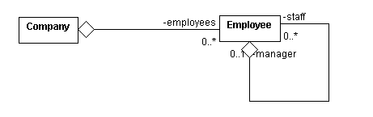

# 实战 Groovy: 用 curry 过的闭包进行函数式编程

*Groovy 日常的编码构造到达了闭包以前没有到过的地方*

在 Groovy 中处处都是闭包，Groovy 闭包惟一的问题是：当每天都使用它们的时候，看起来就有点平淡了。在本文中，客座作者 Ken Barclay 和 John Savage 介绍了如何对标准的闭包（例如闭包复合和 Visitor 设计模式）进行 curry 处理。`curry()` 方法是由 Haskell Curry 发明的，在 JSR 标准发布之前就已经在 Groovy 语言中了。

几乎从一年前*实战 Groovy* 系列开始，我就已经提供了多个让您了解闭包的机会。在首次作为 *alt.lang.jre* 系列的一部分写 Groovy 时（“感受 Groovy”，2004 年 8 月），我介绍了 Groovy 的闭包语法，而且 就在上一期文章中，我介绍了最新的 JSR 标准对相同语法的更新。学习至今，您知道了 Groovy 闭包是代码块，可以被引用、带参数、作为方法参数传递、作为返回值从方法调用返回。而且，它们也可以作为其他闭包的参数或返回值。因为闭包是 `Closure` 类型的对象，所以它们也可以作为类的属性或集合的成员。

虽然这些技术都是很神奇的，但是本期文章要学习的闭包技术要比您迄今为止尝试过的都要更火辣一些。客座作者 John Savage 和 Ken Barclay 已经用 Groovy 闭包中的 `curry()` 方法做了一些有趣的实验，我们非常有幸可以见识他们的技艺。

## 关于本系列

把任何一个工具集成进开发实践的关键是，知道什么时候使用它而什么时候把它留在箱子中。脚本语言可以是工具箱中极为强大的附件，但是只有在恰当地应用到适当的场景中时才是这样。为了这个目标，*实战 Groovy* 是一系列文章，专门介绍 Groovy 的实际应用，并教您何时以及如何成功地应用它们。

Barclay 和 Savage 的 curry 过的闭包不仅会重新激起您对熟悉的操作（例如复合）和 Visitor 设计模式的兴奋，还会用 Groovy 打开函数式编程的大门。

## 进行 curry 处理

*curry 过的函数* 一般可在函数式编程语言（例如 ML 和 Haskell）中找得到（请参阅 参考资料）。*curry* 这个术语来自 Haskell Curry，这个数学家发明了局部函数的概念。*Currying* 指的是把多个参数放进一个接受许多参数的函数，形成一个新的函数接受余下的参数，并返回结果。令人兴奋的消息是，Groovy 的当前版本（在编写本文时是 jsr-02 版）支持在`闭包`上使用 `curry()` 方法 —— 这意味着，我们这些 Groovy 星球的公民，现在可以利用函数式编程的某些方面了！

您以前可能从未用过 `curry()`，所以我们先从一个简单的、熟悉的基础开始。清单 1 显示了一个叫做 `multiply` 的闭包。它有形式参数 `x` 和 `y`，并返回这两个值的乘积。假设没有歧义存在，然后代码演示了用于执行 `multiply` 闭包的两种方法：显式（通过 `call` 的方式）或隐式。后一种样式引起了函数调用方式。

##### 清单 1\. 简单的闭包

```java
def multiply = { x, y -> return x * y } // closure
def p = multiply.call(3, 4)             // explicit call
def q = multiply(4, 5)                  // implicit call
println "p: ${p}"                       // p is 12
println "q: ${q}"                       // q is 20 
```

这个闭包当然很好，但是我们要对它进行 curry 处理。在调用 `curry()` 方法时，不需要提供所有的实际参数。*curry 过的* 调用只引起了闭包的部分应用程序。闭包的 *部分应用程序* 是另一个 `Closure` 对象，在这个对象中有些值已经被修正。

清单 2 演示了对 `multiply` 闭包进行 curry 处理的过程。在第一个例子中，参数 `x` 的值被设置为 3。名为 `triple` 的闭包现在有效地拥有了 `triple = { y -&gt; return 3 * y }` 的定义。

##### 清单 2\. curry 过的闭包

```java
def multiply = { x, y -> return x * y }  // closure
def triple = multiply.curry(3)           // triple = { y -> return 3 * y }
def quadruple = multiply.curry(4) 
// quadruple = { y -> return 4 * y }
def p = triple.call(4)                   // explicit call
def q = quadruple(5)                     // implicit call
println "p: ${p}"                        // p is 12
println "q: ${q}"                        // q is 20 
```

可以看到，参数 `x` 已经从 `multiply` 的定义中删除，所有它出现的地方都被 3 这个值代替了。

### curry 过的数学 101

从基本数学可能知道，乘法运算符是*可交换的*（换句话说 `x * y = y * x`）。但是，减法运算符是不可交换的；所以，需要两个操作来处理减数和被减数。清单 3 为这个目的定义了闭包 `lSubtract` 和 `rSubtract`（分别在左边和右边），结果显示了 `curry` 函数的一个有趣的应用。

##### 清单 3\. 右和右操作数

```java
def lSubtract = { x, y -> return x - y }
def rSubtract = { y, x -> return x - y }
def dec = rSubtract.curry(1)            
 // dec = { x -> return x - 1 }
def cent = lSubtract.curry(100)          
// cent = { y -> return 100 - y }
def p = dec.call(5)                      // explicit call
def q = cent(25)                         // implicit call
println "p: ${p}"                        // p is 4
println "q: ${q}"                        // q is 75 
```

* * *

## 迭代和复合

您会回忆起这个系列以前的文章中，闭包一般用于在 `List` 和 `Map` 集合上应用的*迭代器方法* 上。例如，迭代器方法 `collect` 把闭包应用到集合中的每个元素上，并返回一个带有新值的新集合。清单 4 演示了把 `collect` 方法应用于 `List` 和 `Map`。名为 `ages` 的 `List` 被发送给 `collect()` 方法，使用单个闭包 `{ element -&gt; return element + 1 }` 作为参数。注意方法的最后一个参数是个闭包，在这个地方 Groovy 允许把它从实际参数列表中删除，并把它直接放在结束括号后面。在没有实际参数时，可以省略括号。用名为 `accounts` 的 `Map` 对象调用的 `collect()` 方法可以展示这一点。

##### 清单 4\. 闭包和集合

```java
def ages = [20, 30, 40]
def accounts = ['ABC123' : 200, 'DEF456' : 300, 'GHI789' : 400]
def ages1 = ages.collect({ element -> return element + 1 })
def accounts1 = accounts.collect 
  { entry -> entry.value += 10; return entry }
println "ages1: ${ages1}" 
// ages1: [21, 31, 41]
println "accounts1: ${accounts1}"
// accounts1: [ABC123=210, GHI789=410, DEF456=310]
def ages2 = ages.collect { element -> return dec(element) }
println "ages2: ${ages2}"
 // ages2: [19, 29, 39] 
```

最后一个例子搜集名为 `ages` 的 `List` 中的所有元素，并将 `dec` 闭包 （来自清单 3）应用于这些元素。

### 闭包复合

闭包更重要的一个特征可能就是*复合（composition）*，在复合中可以定义一个闭包，它的目的是组合其他闭包。使用复合，两个或多个简单的闭包可以组合起来构成一个更复杂的闭包。

清单 5 介绍了一个漂亮的 `composition` 闭包。现在请注意仔细阅读：参数 `f` 和 `g` 代表 *单个参数闭包*。到现在还不错？现在，对于某些参数值 `x`，闭包 `g` 被应用于 x，而闭包 `f` 被应用于生成的结果！哦，只对前两个闭包参数进行了 curry 处理，就有效地形成了一个组合了这两个闭包的效果的新闭包。

清单 5 组合了闭包 `triple` 和 `quadruple`，形成闭包 `twelveTimes`。当把这个闭包应用于实际参数 3 时，返回值是 36。

##### 清单 5\. 超级闭包复合

```java
def multiply = { x, y -> return x * y }    
// closure
def triple = multiply.curry(3)            
// triple = { y -> return 3 * y }
def quadruple = multiply.curry(4) 
// quadruple = { y -> return 4 * y }
def composition = { f, g, x -> return f(g(x)) }
def twelveTimes = composition.curry(triple, quadruple)
def threeDozen = twelveTimes(3)
println "threeDozen: ${threeDozen}"         
// threeDozen: 36 
```

非常漂亮，是么？

* * *

## 五星计算

现在我们来研究闭包的一些更刺激的方面。我们先从一个机制开始，用这个机制可以表示包含*计算模式* 的闭包，计算模式是一个来自函数式编程的概念。计算模式的一个例子就是用某种方式把 `List` 中的每个元素进行转换。因为这些模式发生得如此频繁，所以我们开发了一个叫做 `Functor` 的类，把它们封装成 `static Closure`。清单 6 显示了一个摘要。

##### 清单 6\. Functor 封装了一个计算模式

```java
package fp
abstract class Functor {
 //  arithmetic (binary, left commute and right commute)
 public static Closure bMultiply     = { x, y -> return x * y }
 public static Closure rMultiply     = { y, x -> return x * y }
 public static Closure lMultiply     = { x, y -> return x * y }

 // ...
 // composition
 public static Closure composition   = { f, g, x -> return f(g(x)) }

 // lists
 public static Closure map    = 
   { action, list -> return list.collect(action) }

 public static Closure apply  = { action, list -> list.each(action) }

 public static Closure forAll = { predicate, list ->
                                  for(element in list) {
                                    if(predicate(element) == false) {
                                        return false
                                    }
                                  }
                                  return true
                               }
    // ...
} 
```

在这里可以看到名为 `map` 的闭包，不要把它与 `Map` 接口混淆。`map` 闭包有一个参数 `f` 代表闭包，还有一个参数 `list` 代表（不要惊讶）`List`。它返回一个新 `List`，其中 `f` 已经映射到 `list` 中的每个元素。当然，Groovy 已经有了用于 `Lists` 的 `collect()` 方法，所以我们在我们的实现中也使用了它。

在清单 7 中，我们把事情又向前进行了一步，对 `map` 闭包进行了 *curry* 处理，形成一个块，会将指定列表中的所有元素都乘以 12。

##### 清单 7\. 添加一些 curry，并乘以 12

```java
import fp.*
def twelveTimes = { x -> return 12 * x }
def twelveTimesAll = Functor.map.curry(twelveTimes)
def table = twelveTimesAll([1, 2, 3, 4])
println "table: ${table}"        
// table: [12, 24, 36, 48] 
```

现在，*这* 就是我们称之为五星计算的东西！

* * *

## 业务规则用 curry 处理

关于闭包的技艺的讨论很不错，但是更关注业务的人会更欣赏下面这个例子。在考虑计算特定 `Book` 条目净值的问题时，请考虑商店的折扣和政府的税金（例如 *增值税*）。如果想把这个逻辑作为 `Book` 类的一部分包含进来，那么形成的解决方案可能是个难缠的方案。因为书店可能会改变折扣，或者折扣只适用于选定的存货，所以这样一个解决方案可能会太刚性了。

但是猜猜情况如何。变化的业务规则非常适合于使用 curry 过的闭包。可以用一组简单的闭包来表示单独的业务规则，然后用复合把它们以不同的方式组合起来。最后，可以用 *计算模式* 把它们映射到集合。

清单 8 演示了书店的例子。闭包 `rMultiply` 是个局部应用程序，通过使用一个不变的第二操作数，把二元乘法改变成一元闭包。两个图书闭包 `calcDiscountedPrice` 和 `calcTax` 是 `rMultiply` 闭包的实例，为乘数值设置了值。闭包 `calcNetPrice` 是计算净价的算法：先计算折扣价格，然后在折扣价格上计算销售税。最后， `calcNetPrice` 被应用于图书价格。

##### 清单 8\. 图书业务对象

```java
import fp.*
class Book {
    @Property name
    @Property author
    @Property price
    @Property category
}
def bk = new Book(name : 'Groovy', author : 
  'KenB', price : 25, category : 'CompSci')
// constants
def discountRate = 0.1
def taxRate = 0.17
//  book closures
def calcDiscountedPrice = Functor.rMultiply.curry(1 - discountRate)
def calcTax = Functor.rMultiply.curry(1 + taxRate)
def calcNetPrice = 
  Functor.composition.curry(calcTax, calcDiscountedPrice)
//  now calculate net prices
def netPrice = calcNetPrice(bk.price)
println "netPrice: ${netPrice}"        // netPrice: 26.325 
```

* * *

## 更加 groovy 的访问者

已经看到了如何把 curry 过的闭包应用于函数模式，所以现在我们来看看在使用相似的技术重新访问重要的面向对象设计模式时发生了什么。对于面向对象系统来说，必须遍历对象集合并在集合中的每个元素上执行某个操作，是非常普通的使用情况。假设一个不同的场景，系统要遍历相同的集合，但是要执行不同的操作。通常，需要用 *Visitor 设计模式*（请参阅 参考资料）来满足这一需求。`Visitor` 接口引入了处理集合元素的动作协议。具体的子类定义需要的不同行为。方法被引进来遍历集合并对每个元素应用 `Visitor` 动作。

如果到现在您还没猜出来，那么可以用闭包实现同的效果。这种方法的一个抽象是：使用闭包，不需要开发访问者类的层次结构。而且，可以有效地使用闭包复合和映射来定义集合的动作和效果遍历。

例如，考虑用来表示图书馆库存的类 `Library` 和类 `Book` 之间的一对多关系。可以用 `List` 或 `Map` 实现这个关系；但是 `Map` 提供的优势是它能提供快速的查询，也就是说用图书目录编号作为键。

清单 9 显示了一个使用 `Map` 的简单的一对多关系。请注意 `Library` 类中的两个显示方法。引入访问者时，两者都是重构的目标。

##### 清单 9\. 图书馆应用程序

```java
class Book {    
    @Property title
    @Property author
    @Property catalogNumber
    @Property onLoan = false
    String toString() {
        return "Title: ${title}; author: ${author}"
    }
}
class Library {
    @Property name
    @Property stock = [ : ]

    def addBook(title, author, catalogNumber) {
        def bk = new Book(title : title, author : 
          author, catalogNumber : catalogNumber)
        stock[catalogNumber] = bk
    }

    def lendBook(catalogNumber) {
        stock[catalogNumber].onLoan = true
    }

    def displayBooksOnLoan() {
        println "Library: ${name}"
        println "Books on loan"
        stock.each { entry ->
            if(entry.value.onLoan == true) println entry.value
        }
    }

    def displayBooksAvailableForLoan() {
        println "Library: ${name}"
        println "Books available for loan"
        stock.each { entry ->
            if(entry.value.onLoan == false) println entry.value
        }
    }    
}
def lib = new Library(name : 'Napier')
lib.addBook('Groovy', 'KenB', 
  'CS123')
lib.addBook('Java', 'JohnS', 'CS456')
lib.addBook('UML', 'Ken and John', 
  'CS789')
lib.lendBook('CS123')
lib.displayBooksOnLoan()    // Title: Groovy; author: KenB
lib.displayBooksAvailableForLoan()    // Title: UML; author: Ken and John
    // Title: Java; author: JohnS 
```

清单 10 包含 `Library` 类中的几个闭包，模拟了访问者的用法。`action` 闭包（与 `map` 闭包有点相似）把 `action` 闭包应用于 `List` 的每个元素。如果某本书被借出，则闭包 `displayLoanedBook` 显示它；如果某本书未被借出，则闭包 `displayAvailableBook` 显示它。两者都扮演访问者和相关的动作。用 `displayLoanedBook` 对 `apply` 闭包进行 curry 处理，会形成闭包 `displayLoanedBooks`，它为处理图书集合做好了准备。类似的方案也用来生成可供借阅的图书显示，如清单 10 所示。

##### 清单 10\. 修订后的图书馆访问者

```java
import fp.*
class Book {
    @Property title
    @Property author
    @Property catalogNumber
    @Property onLoan = false
    String toString() {
        return "    Title: ${title}; author: ${author}"
    }

}
class Library {      
    @Property name
    @Property stock = [ : ]
    def addBook(title, author, catalogNumber) {
        def bk = new Book(title : title, author : 
          author, catalogNumber : catalogNumber)
        stock[catalogNumber] = bk
    }

    def lendBook(catalogNumber) {
        stock[catalogNumber].onLoan = true
    }

    def displayBooksOnLoan() {
        println "Library: ${name}"
        println "Books on loan"
        displayLoanedBooks(stock.values())
    }

    def displayBooksAvailableForLoan() {
        println "Library: ${name}"
        println "Books available for loan"
        displayAvailableBooks(stock.values())
    }

    private displayLoanedBook = { bk -> if(bk.onLoan == true) 
      println bk }
    private displayAvailableBook = { bk -> if(bk.onLoan == false) 
      println bk }

    private displayLoanedBooks = 
      Functor.apply.curry(displayLoanedBook)
    private displayAvailableBooks = 
      Functor.apply.curry(displayAvailableBook)
}
def lib = new Library(name : 'Napier')
lib.addBook('Groovy', 'KenB', 
  'CS123')
lib.addBook('Java', 'JohnS', 'CS456')
lib.addBook('UML', 'Ken and John', 
  'CS789')
lib.lendBook('CS123')
lib.displayBooksOnLoan()    // Title: Groovy; author: KenB
lib.displayBooksAvailableForLoan() // Title: UML; author: Ken and John
                             // Title: Java; author: JohnS 
```

* * *

## 用闭包进行测试

在结束之前，我们来看一下 Groovy 闭包的一个附加用途。请考虑一个被建模为具有许多 `Employee` 的 `Company` 的应用程序。递归的关系在单个 `Employee`（团队领导）和许多 `Employee`（团队成员）之间进一步建立起一对多的聚合。图 1 是这样一个组织的类图。

##### 图 1\. Company 应用程序



可以用闭包来表述模型架构上的完整性。例如，在这个例子中，可能想确保每个员工都分配了一个经理。简单的闭包 `hasManager` 为每个员工表达了这个需求： `def hasManager = { employee -&gt; return (employee.manager != null) }`。

来自清单 6 的 `Functor` 类中的 `forAll` 闭包的局部应用程序能够描述架构的需求：`def everyEmployeeHasManager = Functor.forAll.curry(hasManager)`。

清单 11 演示了 curry 过的闭包的应用：测试系统架构的完整性。

##### 清单 11\. 用于测试架构完整性的闭包

```java
import fp.*
/**
 *  A company with any number of employees. 
 *  Each employee is responsible
 *  to a team leader who, in turn, manages a team of staff.
 */
import java.util.*
class Employee {
    @Property id
    @Property name
    @Property staff = [ : ]
    @Property manager = null
    String toString() {
        return "Employee: ${id} ${name}"
    }

    def addToTeam(employee) {
        staff[employee.id] = employee
        employee.manager = this
    }

}
class Company {
    @Property name
    @Property employees = [ : ]
    def hireEmployee(employee) {
        employees[employee.id] = employee
    }

    def displayStaff() {
        println "Company: ${name}"
        println "===================="
        employees.each { entry -> println "    
          ${entry.value}" }
    }

}
def co = new Company(name : 'Napier')
def emp1 = new Employee(id : 123, name : 'KenB')
def emp2 = new Employee(id : 456, name : 'JohnS')
def emp3 = new Employee(id : 789, name : 'JonK')
co.hireEmployee(emp1)
co.hireEmployee(emp2)
co.hireEmployee(emp3)
emp3.addToTeam(emp1)
emp3.addToTeam(emp2)
co.displayStaff()
//  Architectural closures
def hasManager = { employee -> return (employee.manager != null) }
def everyEmployeeHasManager = Functor.forAll.curry(hasManager)
def staff = new ArrayList(co.employees.values())
println "Every employee has a manager?: 
  ${everyEmployeeHasManager.call(staff)}"    // false 
```

* * *

## curry 是优秀的

在本文中您已看到了大量闭包，但是希望能激起您对更多闭包的渴望。在学习乘法例子时，curry 过的闭包使得实现计算的函数模式出奇得容易。一旦掌握了这些模式，就可以把它们部署到常见的企业场景中，例如我们在书店例子中把它们应用于业务规则。把闭包应用于函数模式是令人兴奋的，一旦这么做了之后，再把它们应用于面向对象设计模式，就不是什么大事情了。Curry 过的闭包可以用来模拟 Visitor 模式的基本元素，正如在 `Library` 例子中显示的。它们在软件测试期间执行完整性测试时也会有用，就像用 `Company` 例子所展示的。

本文中看到的全部例子都是企业系统常见的用例。看到 Groovy 闭包和 `curry` 方法能够如此流畅地应用于众多编程场景、函数模式和面向对象模式，真是激动人心。Haskell Curry 肯定发现了这个可怕的 *groovy*！