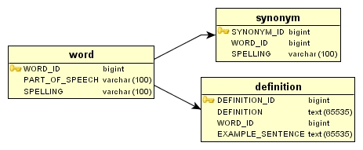

# 实战 Groovy: 用 Groovy 生成器作标记

*抛开标记语言的细节，聚焦应用程序的内容*

Groovy 生成器让您能够利用诸如 Swing 这样的框架来模拟标记语言（如 XML、HTML、Ant） 任务以及 GUI。它们对于快速原型化非常有 用，并且正像 Andrew Glover 这个月在“*实战 Groovy*”专栏中向您展示的那样，当您马上需要可消费的标记时，它们是数据绑定框架的一种便利的替代方案。

几个月前，当我最初撰写有关 实战 Groovy: 用 Groovy 进行 Ant 脚本编程的文章时，我提及了 Groovy 中的 *生成器*概念。在那篇文章里，我向您展示了，使用一个叫做 `AntBuilder`的 Groovy 类，构建富有表现力的 Ant 构建文件是多么容易。本文中，我将深入 Groovy 生成器的世界，向您展示您还能用这些强大的类做些什么。

## 用生成器进行构建

Groovy 生成器让您能够利用诸如 Swing 这样的框架来模拟标记语言（如 XML、HTML、Ant） 任务以及 GUI。使用生成器，您可以迅速地创 建复杂的标记（如 XML），而无须理会 XML 本身。

生成器的范例非常简单。生成器的实例的方法表示该标记（如 HTML 中的 `&lt;body&gt;`标 签）的元素。方法的创建于闭包中的对象表示子节点（例如，`&lt;body&gt;`标签中所包含的 `&lt;p&gt;`标签）。

为了便于您查看这一过程，我将创建一个简单的生成器，以程序方式来表示一个具有清单 1 所示结构的 XML 文档。

## 关于本系列文章

在开发实践中采用任何工具的关键是，了解何时使用这些工具，何时将其弃而不用。脚本语言可能是对工具包的一个功能强大的扩充，但是只有 在正确应用于适当的环境时才是如此。总之，*实战 Groovy*系列文章旨在展示 Groovy 的实际使用，以及何时和如何成功应用它。

##### 清单 1\. 简单 XML 结构

```java
 <person> 
   <name first="Megan" last="Smith"> 
     <age>32</age> 
     <gender>female</gender> 
   </name> 
   <friends> 
     <friend>Julie</friend> 
     <friend>Joe</friend> 
     <friend>Hannah</friend> 
   </friends> 
 </person> 
```

要表示这个结构非常简单。首先将 `person`方法连接到生成器实例，现在它表示 XML 的根节点，即 `&lt;person&gt;`。要创建子节点，我创建一个闭包并声明一个名叫 `name`的新对象（它接收 `map`形式的参数。顺便说一下，这些参数是元素的属性的基础。

接下来，在 `name`对象中，将两个附加对象连接到闭包，一个对象是 `age`，另 一个是 `gender`，它们对应于 `&lt;name&gt;`的类似子元素。您明白其中的诀窍了么？确实很简单。

`&lt;friends&gt;`元素是 `&lt;person&gt;`的兄弟元素，于是我跳出这个闭包，声明了一个 `friends`对象，当然，还附加了一个集合了多个 `friend`元素的闭包，如清单 2 所示。

##### 清单 2\. 生成器是如此的简单

```java
 import groovy.xml.* 
 import java.io.* 
 class XMLBuilder{ 

  static void main(args) { 

    writer = new StringWriter()          
    builder = new MarkupBuilder(writer) 
    friendnames = [ "Julie", "Joey", "Hannah"] 

     builder.person() { 
       name(first:"Megan", last:"Smith") { 
         age("33") 
         gender("female") 
       } 
       friends() { 
         for (e in friendnames) { friend(e) } 
       } 
    } 
    println writer.toString() 
  } 
 } 
```

如您所见，这里的 Groovy 表示非常优雅，且易于映射到相应的标记表示。在底层，Groovy 显然在处理烦人的标记元素（如 < and >），使我们可以将更多精力放在内容上，而不必过分在意结构的细节。

* * *

## 显示 HTML

生成器也可以有助于构建 HTML，这在开发 Groovlet 时可以派上用场。如同小菜一碟，假设我要创建一个如清单 3 所示的 HTML 页面。

##### 清单 3\. HTML 101

```java
 <html> 
  <head> 
   <title>Groov'n with Builders</title> 
  </head> 
  <body> 
   <p>Welcome to Builders 101\. As you can see this Groovlet is fairly simple.</p> 
  </body> 
 </html> 
```

我可以轻易地将它编码在 Groovy 中，清单 4 所示。

##### 清单 4\. HTML in Groovy 101

```java
 import groovy.xml.* 
 import java.io.* 
 class HTMLBuilderExample{ 

  static void main(args) { 
   writer = new StringWriter()          
   builder = new MarkupBuilder(writer) 

   builder.html(){ 
     head(){ 
       title("Groov'n with Builders"){} 
     } 
     body(){ 
       p("Welcome to Builders 101\. As you can see " + 
         "this Groovlet is fairly simple.") 
     } 
   } 
   println writer.toString() 
 } 
```

来点有意思的，让我们再看看用生成器建立一个成熟的 GUI 有多么容易。前面我曾提到过，Groovy 的 `SwingBuilder`使它能够以一种极为简单的方式构造 GUI。您可以查阅清单 5 中 `SwingBuilder`是如何工作的。

##### 清单 5\. Groovy 中的 GUI 生成器真的很“GROOVY”（很“棒”）

```java
 import java.awt.FlowLayout 
 import javax.swing.* 
 import groovy.swing.SwingBuilder 
 class SwingExample{ 

  static void main(args) { 
    swinger = new SwingBuilder() 
    langs = ["Groovy", "Ruby", "Python", "Pnuts"] 

     gui = swinger.frame(title:'Swinging with Groovy!', size:[290,100]) { 
      panel(layout:new FlowLayout()) { 
        panel(layout:new FlowLayout()) { 
          for (lang in langs) { 
            checkBox(text:lang) 
          } 
        } 
        button(text:'Groovy Button', actionPerformed:{ 
          swinger.optionPane(message:'Indubitably Groovy!')
              .createDialog(null, 'Zen Message').show()
        }) 
        button(text:'Groovy Quit', actionPerformed:{ System.exit(0)})
     } 
   } 
   gui.show() 
   } 
 } 
```

图 1 显示了上面的结果，还不错吧？

##### 图 1\. Groovy 中神奇的 GUI 编程


可以想像，对于原型化，`SwingBuilder`是一个多么强大的工具，不是么？

* * *

## 一些事实

这些例子虽然琐碎，却也有趣。我希望我能让您明白，Groovy 的生成器可以让您避免特定语言（如 XML）中的底层标记。显然，有时避免 XML 或 HTML 会更好，并且，那些标记协助器（facilitator）对 Java 平台来说并不陌生。例如，我最喜欢的 XML 协助框架是 JiBX。

使用 JiBX，您可以轻易地将 XML 结构映射到对象模型，*反之亦然*。绑定是个强大的范例，有不计其数的类似工具拥有此功能，如 JAXB、 Castor 和 Zeus 等。

绑定框架的惟一缺点是，它们 *恐怕*要耗费不少时间。幸运的是，您可以使用 Groovy 的生成器作为一个 *较简单的*解决方案，这在某些情况下是有效的。

* * *

## 用生成器进行伪绑定

假设有一个英文词典的简单数据库。有一个表用于 `word`，另一个表用于 `definition` ，最后还有一个表用于 `synonym`。图 2 是这个数据库的简单表示。

##### 图 2\. 词典数据库



如您所见，这个数据库非常直观：`word`与 `definition`和 `synonym`具有一对多的关系。

词典数据库拥有一个消费者，他在寻求一种表示数据库内容的关键方面的 XML 结构。所寻求的 XML 结构如清单 6 所示。

##### 清单 6\. 可采用的词典 XML

```java
 <words> 
  <word spelling="glib" partofspeech="adjective"> 
    <defintions> 
      <defintion>Performed with a natural, offhand ease.</defintion> 
      <defintion>Marked by ease and fluency of speech or writing that often suggests 
      or stems from insincerity, superficiality, or deceitfulness</defintion> 
    </defintions> 
    <synonyms> 
      <synonym spelling="artful"/> 
      <synonym spelling="urbane"/> 
    </synonyms> 
  </word>     
 </words> 
```

如果选择使用 JiBX 这样的绑定框架来解决这个问题，则很可能需要创建一些中间对象模型，以从关系模型到达最终的 XML 模型。然后必须将数据库内容读取到对象模型中，并请求底层框架将其内部的结构编组为 XML 格式。

这一过程内含了将对象结构映射到 XML 格式的步骤（使用所需的框架过程）。某些框架，如 JAXB，实际上是从 XML 和其他框架（如 JiBX ）生成 Java 对象，允许您自定义自己的 Java 对象到 XML 格式的映射。总之，这都需要大量的工作。

并且，这是一项宏伟的计划。我并不提倡避免使用绑定框架。这里，我要声明：我已经预先警告过您。我计划向您展示的是一个生成 XML 的便捷方式。

### 可消费的 XML 很简单

使用 Groovy 的 `MarkupBuilder`，结合新的数据库访问框架 GroovySql，您可以轻易地生成可消费的 XML。您 所要做的只是计算出所需的查询，并将结果映射到生成器实例 —— 然后，您马上就可以得到表示词典数据库内容的 XML 文档。

让我们逐步来了解这一过程。首先，创建一个生成器实例，在本例中是 `MarkupBuilder`，因为您想要生成 XML。最外面的 XML 元 素（也就是“根”）是 `words`，这样就创建了一个 `words`方法。在闭包里， 调用第一个查询，并在迭代中将查询结果映射到 `word`子节点。

接着，通过两个新的查询，创建 `word`的两个子节点。创建一个 `definitions`对象，并在迭代中映射它，接着用同样的方法处理 `synonyms`。

##### 清单 7\. 用生成器集合所有元素

```java
 import groovy.sql.Sql 
 import groovy.xml.MarkupBuilder 
 import java.io.File 
 import java.io.StringWriter 
 class WordsDbReader{ 
  static void main(args) { 
    sql = Sql.newInstance("jdbc:mysql://localhost/words", 
      "words", "words", "org.gjt.mm.mysql.Driver") 
    writer = new StringWriter()          
    builder = new MarkupBuilder(writer) 
    builder.words() { 
      sql.eachRow("select word_id, spelling, part_of_speech from word"){ row | 
        builder.word(spelling:row.spelling, partofspeech:row.part_of_speech){ 

         builder.definitions(){ 
            sql.eachRow("select definition from definition where word_id = 
              ${row.word_id}"){ defrow | 
              builder.definition(defrow.definition) 
            } 
         } 

         builder.synonyms(){                         
            sql.eachRow("select spelling from synonym where word_id = ${row.word_id}"){
              synrow | 
              builder.synonym(synrow.spelling) 
            }                                                   
         } 
       } 
      } 
    } 
   new File("dbouuput.xml").withPrintWriter{ pwriter | 
      pwriter.println writer.toString() 
   } 
 } 
 } 
```

### 结束语

这里，我向您展示的绑定解决方案似乎简单得让人难以置信，特别是以 Java 纯化论者的观点看来更是如此。尽管该解决方案不比使用绑定框架（如 JABX 和 JiBX） *更好*，但它确实更快一些 —— 而且，我主张使用这样较简单的方法。是不是我在 _ 简单的 _Java 代码中做一些类似的事情？是的，但我敢肯定，某些时候我也不得不处理 XML。

用 Groovy 生成器进行开发的速度和简易性，在调用标记的时候可大显神威。例如，就像在第二个例子里展示的那样，我可以马上加快数据库的 XML 表示。对于原型化，或者当需要以最少的开发时间和精力来产生可工作的解决方案时，生成器也是一个不错的选择。

在下个月的 *实战 Groovy*中我会讲些什么呢？哦，当然是在 Java 语言中使用 Groovy ！