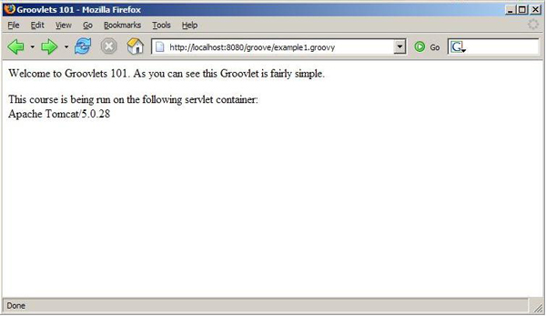
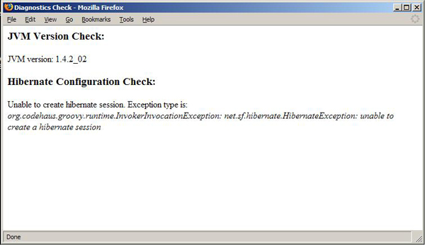
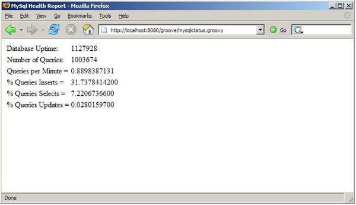

# 实战 Groovy: 用 Groovy 打造服务器端

*用 Groovlet 和 GSP 进行动态服务器端编程*

Groovlet 和 GroovyServer Pages（GSP）框架都是建立在 Java Servlet API 基础之上。不过，与 Strut 和 JSF 不同，Groovy 的服务器端实现不意味着适用于所有情况。相反，它提供了一种快速而又方便地开发服务器端应用程序的简化方法。下面请跟随 Groovy 的鼓吹者 Andrew Glover，听听他如何介绍这些框架，并展示它们的应用。

Java 平台为自己赢得了服务器端应用程序开发的首选平台的名声。Servlet 是服务器端 Java 技术的强大支柱，因此有无数的框架是围绕着 Servlet API 建立 起来的，其中包括 Strut、JavaServer Faces (JSF) 和 Tapestry。您可能已经猜到，Groovy 也是以 Servlet API 为基础建立起来的框架，不过，这个框架的目的是简化开发。

Groovlet 和 GroovyServer Pages（GSP）框架的目的是提供一种优雅而又简单的平台，将它用于构建复杂程度不高的 Web 应用程序。就像 GroovySql 不是数据库开发的惟一选择一样，Groovlet 框架也*不是* 像 Strut 那样具有更丰富功能的框架的替代品。Groovlet 只是 开发人员寻求容易配置和产生工作代码的快速方法时的一种选择。

例如，不久前，我需要 —— *快速地* —— 提供一个 stub 应用程序，以测试像 `xml-rpc` API 这样的客户端。显然可以用一个 servlet 快速编写出所需要的功能，但是我从没想过钻研 Strut，一秒钟也没有。我考虑过使用基本的普通 Java Servlet API 编写 servlet 及其相关的逻辑，但是由于需要尽快地使用这项功能，所以我选择了使用 Groovlet 快速完成它。

很快您就可看到，这种选择是显而易见的。

在深入研究使用 Groovlet 进行编程之前，我想简单介绍一个在示例代码中会用到的 Groovy 特性。 在几个月前的 alt.lang.jre: 感受 Groovy 一文中，我第一次介绍了 `def` 关键字。

## 关于本系列

将任何工具添加到开发实践中的关键是了解什么时候使用它和什么时候 不使用它。脚本语言可以为您增加特别强大的工具，但前提是在相关的场景 中正确地使用它。因此，*实战 Groovy* 的系列文章专门探讨 Groovy 的实际使用，并指导读者什么时候 以及如何成功地使用这些工具。

## 在脚本中定义函数

在普通 Java 编程中，方法必须存在于类对象中。事实上，所有行为都必须在类的上 下文中定义。不过在 Groovy 中，行为可以在*函数* 中定义，而函数可以在类定义之外定义 。

这些函数可以直接用名称引用，并且可以在 Groovy 脚本中定义，这样非常 有助于它们的重复使用。Groovy 函数需要 `def` 关键字， 可以将关键字想像为在脚本范围内可用的全局静态方法。因为 Groovy 是动态类型的语言，所以 `def` 不需要对参数作任何类型声明，`def` 也不需要 `return` 语句。

例如，在清单 1 中，我定义了一个简单的函数，它将输出一个集合的内容，而不管这个集合是 `list` 还是 `map`。然后我定义 一个 `list`，填充它，并调用我新定义的 `def`。之后，我创建一个 `map`，并对这个集合做了同样的操作。

##### 清单 1\. 这就是 def!

```java
def logCollection(coll){
  counter = 0;
  coll.each{ x | 
    println "${++counter} item: ${x}"
  }
}
lst = [12, 3, "Andy", 'c']
logCollection(lst)
mp = ["name" : "Groovy", "date" : new Date()]
logCollection(mp) 
```

`def` 不需要 `return` 语句，因此如果最后一行产生某个 值，那么这个值由 `def` 返回。例如，在清单 2 中，代码定义了一个 `def`，它返回传递进来的变量的名称。 我可以编写它，让它带有或者不带 `return` 语句，得到的结果是相同的。

##### 清单 2\. 在 def 中 return 语句是可选的

```java
def getJavaType(val){
  val.class.getName()
}
tst = "Test"
println getJavaType(tst) 
```

在编写简单的脚本时，`def` 关键字会非常好用。您很快就会看到，在开发 Groovlet 时，这个关键字也会派上用场。

* * *

## Groovlet 和 GSP

使用 Groovlet 和 GSP 的前提条件相当简单：需要一个 servlet 容器，以及最新、最伟大 版本的 Groovy。这些框架的好处是它们通过一个 web.xml 文件将所选模式的所有 URL 映射到特定的 servlet。因此， 建立 Groovlet 和 GSP 的实现的第一步是定义一个 Web 应用程序上下文，并更新它的相关 web.xml 文件。 这个文件将包括特定的 servlet 类定义以及它们对应的 URL 模式。

我将使用 Apache Jakarta Tomcat，并且已创建了一个名为 *groove* 的上下文。目录结构如清单 3 所示：

##### 清单 3\. groove 上下文的目录列表

```java
./groove:
drwxrwxrwx+   3 aglover  users        0 Jan 19 12:14 WEB-INF
./WEB-INF:
-rwxrwxrwx+   1 aglover  users      906 Jan 16 14:37 web.xml
drwxrwxrwx+   2 aglover  users        0 Jan 19 17:12 lib
./WEB-INF/lib:
-rwxrwxrwx+   1 aglover  users   832173 Jan 16 14:28 groovy-1.0-beta-9.jar
-rwxrwxrwx+   1 aglover  users    26337 Jan 16 14:29 asm-1.5.2.jar 
```

在 WEB-INF 目录中要有一个 web.xml 文件，它至少有一个清单 4 中的元素：

##### 清单 4\. 一个完全配置的 web.xml 文件

```java
<?xml version="1.0" encoding="ISO-8859-1"?>
<web-app 

    xsi:schemaLocation=
    "http://java.sun.com/xml/ns/j2ee
    http://java.sun.com/xml/ns/j2ee/web-app_2_4.xsd"
    version="2.4">
    <servlet>
      <servlet-name>GroovyServlet</servlet-name>
      <servlet-class>groovy.servlet.GroovyServlet</servlet-class>
    </servlet>
    <servlet>
        <servlet-name>GroovyTemplate</servlet-name>
        <servlet-class>groovy.servlet.TemplateServlet</servlet-class>    
    </servlet>
    <servlet-mapping>
        <servlet-name>GroovyServlet</servlet-name>
        <url-pattern>*.groovy</url-pattern>
    </servlet-mapping>
    <servlet-mapping>
        <servlet-name>GroovyTemplate</servlet-name>
        <url-pattern>*.gsp</url-pattern>
    </servlet-mapping>
</web-app> 
```

上述 web.xml 文件中的定义声明了以下内容：所有以 `.groovy` 结尾的请求（如 `http://localhost:8080/groove/hello.groovy`）都将发送给 类 `groovy.servlet.GroovyServlet`， 而所有以 `.gsp` 结尾的请求 都将送给类 `groovy.servlet.TemplateServlet`。

下一步是将两个 jar 放到 lib 目录中：groovy 发行版本的 jar（在这里是 groovy-1.0-beta-9.jar）和 对应的 `asm` jar （对于 groovy beta-9 来说是 asm-1.5.2.jar）。

瞧，就是这么简单 —— 我已经准备好了。

* * *

## Groovlet，请出场

编写 Groovlet 无疑很简单，因为 Groovy 只有很少的几个 对类继承扩展的要求。使用 Groovlet 不需要扩展 `javax.servlet.http.HttpServlet`、`javax.servlet.GenericServlet` 或者一些华而不实的 `GroovyServlet` 类。事实上，创建 Groovlet 就像创建一个 Groovy 脚本一样简单。甚至不必 创建一个类。在清单 5 中，我编写了一个简单的 Groovlet，它 做两件事：打印一些 HTML，然后提供一些关于它所在的容器的信息。

##### 清单 5\. 开始使用 Groovlet

```java
println """
<html><head>
<title>Groovlets 101</title>
</head>
<body>
<p>
Welcome to Groovlets 101\. As you can see
this Groovlet is fairly simple.
</p>
<p>
This course is being run on the following servlet container: </br>
${application.getServerInfo()}
</p>
</body>
</html>
""" 
```

如果在浏览器中观看这个 Groovy，它看起来与图 1 所示类似。

##### 图 1\. 简单 Groovlet 的输出



仔细观察清单 5 中的 Groovlet，会让您回想起第一次编写 Groovy 脚本的时候。 首先，没有 `main` 方法或者类定义，只有一些简单的代码。而且，Groovlet 框架隐式地提供实例变量，比如 `ServletRequest`、`ServletResponse`、`ServletContext` 和 `HttpSession`。注意我是如何通过 `application` 变量引用 `ServletContext` 的实例的。如果想获得 `HttpSession` 的实例，那么就要使用 `session` 变量名。与此类似，可以对 `ServletRequest` 和 `ServletResponse` 分别使用 `request` 和 `response`。

* * *

## 一个诊断 Groovlet

编写 Groovlet 不仅像创建一个 Groovy 脚本那样简单，而且还可以用 `def` 关键字定义函数，并在 Groovlet 中直接调用它们。为了展示这一点，我将 创建一个非凡的 Groovlet，它将对 Web 应用程序进行一些诊断。

假设您编写了一个 Web 应用程序，它被世界上不同的客户所购买。您有一个 大客户群，并且不断发布这个应用程序有一段时间了。从过去的支持问题中，您 注意到许多急切的客户电话都与错误的 JVM 版本和错误的对象关系映射（ORM）所导致的问题有关。

您很忙，所以让我拿出一个解决方案。我用 Groovlet *迅速地* 创建了一个简单的 诊断脚本，它将验证 VM 版本，并试图创建一个 Hibernate 会话（请参阅参考资料）。我首先创建 两个函数，并在浏览器连接脚本时调用它们。 清单 6 定义了这个诊断 Groovlet：

##### 清单 6\. 一个诊断 Groovlet

```java
import com.vanward.resource.hibernate.factory.DefaultHibernateSessionFactory
/**
 * Tests VM version from environment- note, even 1.5 will
 * cause an assertion error.
 */
def testVMVersion(){
  println "<h3>JVM Version Check: </h3>"
  vers = System.getProperty("java.version")
  assert vers.startsWith("1.4"): "JVM must be at least 1.4"
  println "<p>JVM version: ${vers} </p>"
}
/**
 * Attempts to create an instance of a hibernate session. If this
 * works we have a connection to a database; additionally, we 
 * have a properly configured hibernate instance.
 */
def testHibernate(){
  println "<h3>Hibernate Configuration Check: </h3>"
  try{
    sessFactory = DefaultHibernateSessionFactory.getInstance()
    session = sessFactory.getHibernateSession()
    assert session != null: "Unable to create hibernate session. 
    Session was null"
    println "<p>Hibernate configuration check was successful</p>"
  }catch(Throwable tr){
    println """
    <p>Unable to create hibernate session. Exception type is: <br/>
    <i>${tr.toString()} </i><br/>        
    </p>
    """
  }   
}
println """
<html><head>
<title>Diagnostics Check</title></head>
<body>
"""
testVMVersion()
testHibernate()
println """
</body></html>
""" 
```

这个 Groovlet 的验证逻辑非常简单，但是它可以完成这项工作。只要将 诊断脚本绑定到 web 应用程序即可，当客户服务台收到电话时，它们将指点客户用浏览器 访问 `Diagnostics.groovy` 脚本，并让这些脚本报告它们的发现。 结果可能看起来像图 2 这样。

##### 图 2\. 诊断 Groovlet 的输出



* * *

## 那些 GSP 呢？

到目前为止，我主要关注于编写 Groovlet。不过，正如您将会看到的那样， 很容易用 Groovy 的 GSP 页对 Groovlets 框架进行补充，就像 JSP 补充 Servlet API 一样。

表面上，GSP 看起来很像 JSP，实际上它们不可能有太大的差别，因为 GSP 框架其实就是一个模板引擎。如果不熟悉模板引擎，那么可能需要快速地 回顾一下上月的文章。

虽然 GSP 和 JSP 是根本不同的技术，但是 GSP 是加入表达 Web 应用程序的视图的很 好候选人，这一点它们是类似的。您可能会想起来，在上月的文章中，有一项促进视图的技术可以将应用程序的业务逻辑问题与其相应的视图分离。 如果快速查看一下清单 6 中的诊断 Groovlet，就可以看出 GSP 代码改进了哪些地方。

是的，Groovlet 有些简陋，不是吗？问题在于它混合了应用程序逻辑和大量输出 HTML 的 `println`。幸运的是，可以通过创建一个简单的 GSP 来补充这个 Groovlet，从而解决这个问题。

### 示例 GSP

创建 GSP 与创建 Groovlet 一样容易。GSP 开发的关键是认识到 GSP 实质上 是一个模板，因此，它最适合有限的逻辑。我将在清单 7 中创建一个 简单的 GSP 作为开始：

##### 清单 7\. 一个简单的 GSP

```java
<html>
<head><title>index.gsp</title></head>
<body>
<b><% println "hello gsp" %></b>
<p>
<% wrd = "Groovy"
   for (i in wrd){ 
 %>
 <h1> <%=i%> <br/>

 <%} %>
</p>
</body>
</html> 
```

观察上面的 GSP 可能很容易让您回想起标准 Groovy 模板开发。 像 JSP 一样，它使用 `&lt;%`， 但是， 与 Groovlet 框架类似，它允许您访问常用 servlet 对象，比如 `ServletRequest`、`ServletResponse`、`ServletContext` 和 `HttpSession` 对象。

* * *

## 重构应用程序 ...

在练习编程语言或者平台发展的时候，重构老的代码可以学到很多东西。我将重构一月份专栏中的简单报告应用程序，那时候您才刚开始学习 GroovySql。

您还记得吗，我构建了一个快速但不完善的报告应用程序，它可以在组织中有 多次使用。但结果是，它变成了研究公司数据库活动的相当流行的应用程序。 现在，非技术人员希望可以访问这个巨大的报告，但是他们不想很费事地在自已的 计算机上安装 Groovy 来运行它。

我多少预计到了这种情况的发生，解决方案*实际上* 是显而易见的：让报告应用程序支持 Web。很幸运，Groovlet 和 GSP 使重构变成小事一桩。

### 重构报告应用程序

首先，我将处理 > GroovySql 一文的清单 12 中的简单应用程序。重构这个应用程序很容易：只要将所有 `println` 替换成用 `setAttribute()` 方法，然后将实例变量放入 `HttpRequest` 对象的逻辑中即可。

下一步是用 `RequestDispatcher` 将 `request` 转发给 GSP，它会处理报告应用程序的视图部分。清单 8 定义了新的报告 Groovlet：

##### 清单 8\. 重构后的数据库报告应用程序

```java
import groovy.sql.Sql
/**
 * forwards to passed in page
 */
def forward(page, req, res){
  dis = req.getRequestDispatcher(page);
  dis.forward(req, res);
}
sql = Sql.newInstance("jdbc:mysql://yourserver.anywhere/tiger", "scott",
        "tiger", "org.gjt.mm.mysql.Driver")

uptime = null
questions = null
insertnum = null
selectnum = null
updatenum = null
sql.eachRow("show status"){ status |
  if(status.variable_name == "Uptime"){
         uptime =  status[1]
     request.setAttribute("uptime", uptime)
  }else if (status.variable_name == "Questions"){
         questions =  status[1]
     request.setAttribute("questions", questions)
  }
}
request.setAttribute("qpm", Integer.valueOf(questions) / 
Integer.valueOf(uptime) )
sql.eachRow("show status like 'Com_%'"){ status |
    if(status.variable_name == "Com_insert"){
         insertnum =  Integer.valueOf(status[1])
    }else if (status.variable_name == "Com_select"){
         selectnum =  Integer.valueOf(status[1])
    }else if (status.variable_name == "Com_update"){
          updatenum =  Integer.valueOf(status[1])
    }
}
request.setAttribute("qinsert", 100 * (insertnum / Integer.valueOf(uptime)))
request.setAttribute("qselect", 100 * (selectnum / Integer.valueOf(uptime)))
request.setAttribute("qupdate", 100 * (updatenum / Integer.valueOf(uptime)))
forward("mysqlreport.gsp", request, response) 
```

清单 8 中的代码应当是您相当熟悉的。我只是将以前应用程序中的所有 `println` 替换掉，并添加了 `forward` 函数来处理报告的视图部分。

### 添加视图部分

下一步是创建 GSP 来处理报告应用程序的视图。 因为我是工程师而不是一个艺术家，所以我的视图是相当 简单的 —— 一些 HTML 加上一个表，如清单 9 所示：

##### 清单 9\. 报告的视图部分

```java
<html><head>
<title>MySql Health Report</title>
</head>
<body>
<table>
<tr>
  <td>Database Uptime:</td><td><% println
  "${request.getAttribute("uptime")}" %></td>
</tr>
<tr>
  <td>Number of Queries:</td><td><% println
  "${request.getAttribute("questions")}" %></td>
</tr>
<tr>
  <td>Queries per Minute =</td><td><% println
  "${request.getAttribute("qpm")}" %></td>
</tr>
<tr>
  <td>% Queries Inserts =</td><td><% println
  "${request.getAttribute("qinsert")}" %></td>
</tr>
<tr>
  <td>% Queries Selects =</td><td><% println
  "${request.getAttribute("qselect")}" %></td>
</tr>
<tr>
  <td>% Queries Updates =</td><td><% println
  "${request.getAttribute("qupdate")}" %></td>
</tr>
</table>
</body>
</html> 
```

运行新的报告应当生成如图 3 所示的输出，数字会有变化。

##### 图 3\. 重构后的报告应用程序的输出



* * *

## 结束语

如您所见，当所需要的功能相当简单并且需要尽快完成时，Groovlet 和 GSP 是进行服务器端开发的当然之选。 这两个框架都特别灵活，并且其代码到视图的转化时间事实上是无可匹敌的。

不过，需要强调的是，Groovlet 不是 Strut 的替代品。GSP 框架不是*直接* 在速度上与其他产品竞争。GroovySql 不是 Hibernate 的替代品。而 Groovy 也不是 Java 语言的替代品。

无论如何，这些技术是补充，在大多数情况下，Groovy 是快速开发的更简单的一种选择。 就像 GroovySql 是直接使用 JDBC 的替代方法一样，Groovlet 和 GSP 实际上是直接使用 Servlet API 的替代品。

下个月，我将探讨 GroovyMarkup 的奇妙世界。