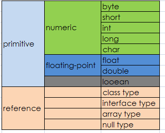
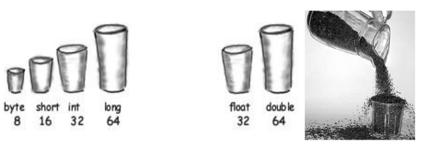
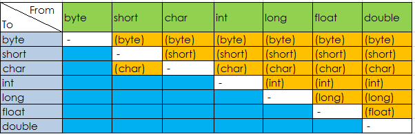

# 语言基础

本章介绍 Java 的语言基础。

# 变量（Variable）

前文也介绍了，对象的状态是存储在字段里面

```java
int cadence = 0;
int speed = 0;
int gear = 1; 
```

Java 里面的变量包含如下类型：

*   实例变量/非静态字段(Instance Variables/Non-Static Fields):从技术上讲，对象存储他们的个人状态在“非静态字段”，也就是没有 static 关键字声明的字段。非静态字段也被称为实例变量，因为它们的值对于类的每个实例来说是唯一的（换句话说，就是每个对象）; 自行车的当前速度独立于另一辆自行车的当前速度。
*   类变量/静态字段(Class Variables/Static Fields) ：类变量是用 static 修饰符声明的字段，也就是告诉编译器无论类被实例化多少次，这个变量的存在，只有一个副本。特定种类自行车的齿轮数目的字段可以被标记为 static，因为相同的齿轮数量将适用于所有情况。代码`static int numGears = 6;`将创建一个这样的静态字段。此外，关键字 final 也可以加入，以指示的齿轮的数量不会改变。
*   局部变量(Local Variables)：类似于对象存储状态在字段里，方法通常会存放临时状态在局部变量里。语法与局部变量的声明类似（例如，`int count = 0;`）。没有特殊的关键字来指定一个变量是否是局部变量，是由该变量声明的位置决定的。局部变量是类的方法中的变量。
*   参数（Parameters）：前文的例子中经常可以看到`public static void main(String[] args)`，这里的 args 变量就是这个方法参数。要记住的重要一点是，参数都归类为“变量（variable）”而不是“字段（field）”。

如果我们谈论的是“一般的字段”（不包括局部变量和参数），我们可以简单地说“字段”。如果讨论适用于上述所有情况，我们可以简单地说“变量”。如果上下文要求一个区别，我们将使用特定的术语（静态字段，局部变量，等等）。你也偶尔会看到使用术语“成员（member）”。 类型的字段、方法和嵌套类型统称为它的成员。

## 命名

每一个编程语言都有它自己的一套规则和惯例的各种名目的，Java 编程语言对于命名变量的规则和惯例可以概括如下：

*   变量名称是区分大小写的。变量名可以是任何合法的标识符 - 无限长度的 Unicode 字母和数字，以字母，美元符号`$`，或下划线`_`开头。但是惯例上推荐使用字母开头，而不是`$`或`_`。此外，按照惯例，美元符号从未使用过的。您可能会发现一些情况，自动生成的名称将包含美元符号，但你的变量名应该始终避免使用它。类似的约定存在下划线，不鼓励用“_”作为变量名开头。空格是不允许的。
*   随后的字符可以是字母，数字，美元符号，或下划线字符。惯例同样适用于这一规则。为变量命名，尽量是完整的单词，而不是神秘的缩写。这样做会使你的代码更容易阅读和理解，比如 cadence、speed 和 gear 会比缩写 c、s 和 g 更直观。同时请记住，您选择的名称不能是关键字或保留字。
*   如果您选择的名称只包含一个词，拼写单词全部小写字母。如果它由一个以上的单词，每个后续单词的第一个字母大写，如 gearRatio 和 currentGear。如果你的变量存储一个恒定值，使用`static final int NUM_GEARS = 6`，每个字母大写，并用以下划线分隔后续字符。按照惯例，下划线字符永远不会在其他地方使用。

详细的命名规范，可以参考《[Java 编码规范](https://github.com/waylau/java-code-conventions)》。

## 基本数据类型（Primitive Data Types）

Java 是静态类型（statically-typed）的语言，必须先声明再使用。基本数据类型之间不会共享状态。

主要有 8 种基本数据类型：



#### byte

byte 由 1 个字节 8 位表示，是最小的整数类型。主要用于节省内存空间关键。当操作来自网络、文件或者其他 IO 的数据流时，byte 类型特别有用。取值范围为:[-128, 127]. byte 的默认值为 (byte)0,如果我们试图将取值范围外的值赋给 byte 类型变量，则会出现编译错误，例如 `byte b = 128；`这个语句是无法通过编译的。一个有趣的问题，如果我们有个方法： public void test(byte b)。试图这么调用这个方法是错误的: test(0); 编译器会报错，类型不兼容！！！我们记得`byte b =0；`这是完全没有问题的，为什么在这里就出错啦？

这里涉及到一个叫字面值（literal）的问题，字面值就是表面上的值，例如整型字面值在源代码中就是诸如 5 ， 0， -200 这样的。如果整型子面子后面加上 L 或者 l，则这个字面值就是 long 类型，比如：1000L 代表一个 long 类型的值。如果不加 L 或者 l，则为 int 类型。基本类型当中的 byte short int long 都可以通过不加 L 的整型字面值（我们就称作 int 字面值吧）来创建，例如 byte b = 100； short s = 5；对于 long 类型，如果大小超出 int 所能表示的范围（32 bits），则必须使用 L 结尾来表示。整型字面值可以有不同的表示方式：16 进制【0X or 0x】、10 进制【nothing】、八进制【0】、2 进制【0B or 0b】等，二进制字面值是 JDK 7 以后才有的功能。在赋值操作中，int 字面值可以赋给 byte short int long，Java 语言会自动处理好这个过程。如果方法调用时不一样，调用 test（0）的时候，它能匹配的方法是 test（int），当然不能匹配 test（byte）方法，至于为什么 Java 没有像支持赋值操作那样支持方法调用，不得而知。注意区别包装器与原始类型的自动转换（anto-boxing，auto-unboxing）。`byte d = 'A'；`也是合法的，字符字面值可以自动转换成 16 位的整数。 对 byte 类型进行数学运算时，会自动提升为 int 类型，如果表达式中有 double 或者 float 等类型，也是自动提升。所以下面的代码是错误的：

```java
byte t s1 = 100;
byte s2 = 'a';
byte sum = s1 + s2;//should cast by (byte) 
```

#### short

用 16 位表示，取值范围为：[- 2¹⁵, 2¹⁵ - 1]。short 可能是最不常用的类型了。可以通过整型字面值或者字符字面值赋值，前提是不超出范围（16 bit）。short 类型参与运算的时候，一样被提升为 int 或者更高的类型。（顺序为 byte short int long float double).

#### int

32 bits, [- 2³¹, 2³¹ - 1].有符号的二进制补码表示的整数。常用语控制循环，注意 byte 和 short 在运算中会被提升为 int 类型或更高。Java 8 以后，可以使用 int 类型表示无符号 32 位整数[ 0, 2³¹ - 1]。

#### long

64 bits， [- 2⁶³, 2⁶³ - 1,默认值为 0L].当需要计算非常大的数时，如果 int 不足以容纳大小，可以使用 long 类型。如果 long 也不够，可以使用 BigInteger 类。

#### char

16 bits, [0, 65535], [0, 2¹⁶ -1],从'\u0000'到'\uffff'。无符号，默认值为'\u0000'。Java 使用 Unicode 字符集表示字符，Unicode 是完全国际化的字符集，可以表示全部人类语言中的字符。Unicode 需要 16 位宽，所以 Java 中的 char 类型也使用 16 bit 表示。 赋值可能是这样的：

```java
char ch1 = 88;
char ch2 = 'A'; 
```

ASCII 字符集占用了 Unicode 的前 127 个值。之所以把 char 归入整型，是因为 Java 为 char 提供算术运算支持，例如可以 ch2++;之后 ch2 就变成 Y。当 char 进行加减乘除运算的时候，也被转换成 int 类型，必须显式转化回来。

#### float

使用 32 bit 表示，对应单精度浮点数，遵循 IEEE 754 规范。运行速度相比 double 更快，占内存更小，但是当数值非常大或者非常小的时候会变得不精确。精度要求不高的时候可以使用 float 类型，声明赋值示例：

```java
float f1 =10;  
f1 = 10L;  
f1 = 10.0f;  //f1 = 10.0;默认为 double 
```

可以将 byte、short、int、long、char 赋给 float 类型，java 自动完成转换。

#### double

64 为表示，将浮点子面子赋给某个变量时，如果不显示在字面值后面加 f 或者 F，则默认为 double 类型。java.lang.Math 中的函数都采用 double 类型。

如果 double 和 float 都无法达到想要的精度，可以使用 BigDecimal 类。

#### boolean

boolean 类型只有两个值 true 和 false，默认为 false。boolean 与是否为 0 没有任何关系，但是可以根据想要的逻辑进行转换。许多地方都需要用到 boolean 类型。

除了上面列出的八种原始数据类型，Java 编程语言还提供了 [java.lang.String](https://docs.oracle.com/javase/8/docs/api/java/lang/String.html)用于字符串的特殊支持。双引号包围的字符串会自动创建一个新的 String 对象，例如`String s = "this is a string";`。String 对象是不可变的（immutable），这意味着一旦创建，它们的值不能改变。 String 类不是技术上的原始数据类型，但考虑由语言所赋予的特殊支持，你可能会倾向于认为它是这样的。更多关于 String 类的细节，可以参阅简单数据对象（Simple Data Objects）。

#### 默认值

在字段声明时，有时并不必要分配一个值。字段被声明但尚未初始化时，将会由编译器设置一个合理的默认值。一般而言，根据数据类型此的不同，默认将为零或为 null。但良好的的编程风格不应该依赖于这样默认值。

下面的图表总结了上述数据类型的默认值。

| 数据类型 | 字段默认值 |
| --- | --- |
| byte | 0 |
| short | 0 |
| int | 0 |
| long | 0L |
| float | 0.0f |
| double | 0.0d |
| char | '\u0000' |
| String (或任何对象) | null |
| boolean | false |

局部变量（Local Variable）略有不同，编译器不会指定一个默认值未初始化的局部变量。如果你不能初始化你声明的局部变量，那么请确保使用之前，给它分配一个值。访问一个未初始化的局部变量会导致编译时错误。

## 字面值（Literal）

在 Java 源代码中，字面值用于表示固定的值（fixed value），直接展示在代码里，而不需要计算。数值型的字面值是最常见的，字符串字面值可以算是一种，当然也可以把特殊的 null 当做字面值。字面值大体上可以分为整型字面值、浮点字面值、字符和字符串字面值、特殊字面值。

### 整型字面值

从形式上看是整数的字面值归类为整型字面值。例如： 10, 100000L, 'B'、0XFF 这些都可以称为字面值。整型字面值可以用十进制、16、8、2 进制来表示。十进制很简单，2、8、16 进制的表示分别在最前面加上 0B（0b）、0、0X（0x）即可，当然基数不能超出进制的范围，比如 09 是不合法的，八进制的基数只能到 7。一般情况下，字面值创建的是 int 类型，但是 int 字面值可以赋值给 byte short char long int，只要字面值在目标范围以内，Java 会自动完成转换，如果试图将超出范围的字面值赋给某一类型（比如把 128 赋给 byte 类型），编译通不过。而如果想创建一个 int 类型无法表示的 long 类型，则需要在字面值最后面加上 L 或者 l。通常建议使用容易区分的 L。所以整型字面值包括 int 字面值和 long 字面值两种。

*   十进制(Decimal)：其位数由数字 0〜9 组成;这是您每天使用的数字系统
*   十六进制(Hexadecimal)：其位数由数字 0 到 9 和字母 A 至 F 的组成
*   二进制(Binary)：其位数由数字 0 和 1 的（可以在 Java SE 7 和更高版本创建二进制字面值）

下面是使用的语法：

```java
// The number 26, in decimal
int decVal = 26;
//  The number 26, in hexadecimal
int hexVal = 0x1a;
// The number 26, in binary
int binVal = 0b11010; 
```

### 浮点字面值

浮点字面值简单的理解可以理解为小数。分为 float 字面值和 double 字面值，如果在小数后面加上 F 或者 f，则表示这是个 float 字面值，如 11.8F。如果小数后面不加 F（f），如 10.4。或者小数后面加上 D（d），则表示这是个 double 字面值。另外，浮点字面值支持科学技术法( E 或 e )表示。下面是一些例子：

```java
double d1 = 123.4;
// same value as d1, but in scientific notation
double d2 = 1.234e2;
float f1  = 123.4f; 
```

### 字符及字符串字面值

Java 中字符字面值用单引号括起来，如`@`，`1`。所有的 UTF-16 字符集都包含在字符字面值中。不能直接输入的字符，可以使用转义字符，如`\n`为换行字符。也可以使用八进制或者十六进制表示字符，八进制使用反斜杠加 3 位数字表示，例如`\141`表示字母 a。十六进制使用`\u`加上 4 为十六进制的数表示，如`\u0061`表示字符 a。也就是说，通过使用转义字符，可以表示键盘上的有的或者没有的所有字符。常见的转义字符序列有：

`\ddd(八进制)`、 `\uxxxx(十六进制 Unicode 字符)`、`\'（单引号）`、`\"（双引号）`、`\\ （反斜杠）\r（回车符） \n（换行符） \f（换页符） \t（制表符） \b（回格符）`

字符串字面值则使用双引号，字符串字面值中同样可以包含字符字面值中的转义字符序列。字符串必须位于同一行或者使用+运算符，因为 Java 没有续行转义序列。

### 在数值型字面值中使用下划线

Java SE 7 开始，可以在数值型字面值中使用下划线。但是下划线只能用于分隔数字，不能分隔字符与字符，也不能分隔字符与数字。例如 `int x = 123_456_789`，在编译的时候，下划线会自动去掉。可以连续使用下划线，比如`float f = 1.22___33__44`。二进制或者十六进制的字面值也可以使用下划线，记住一点，下划线只能用于数字与数字之间，初次以外都是非法的。例如 1._23 是非法的，_123、11000_L 都是非法的。

正确的用法：

```java
long creditCardNumber = 1234_5678_9012_3456L;
long socialSecurityNumber = 999_99_9999L;
float pi =  3.14_15F;
long hexBytes = 0xFF_EC_DE_5E;
long hexWords = 0xCAFE_BABE;
long maxLong = 0x7fff_ffff_ffff_ffffL;
byte nybbles = 0b0010_0101;
long bytes = 0b11010010_01101001_10010100_10010010; 
```

非法的用法：

```java
// Invalid: cannot put underscores
// adjacent to a decimal point
float pi1 = 3_.1415F;
// Invalid: cannot put underscores 
// adjacent to a decimal point
float pi2 = 3._1415F;
// Invalid: cannot put underscores 
// prior to an L suffix
long socialSecurityNumber1 = 999_99_9999_L;

// Invalid: cannot put underscores
// At the end of a literal
int x2 = 52_;

// Invalid: cannot put underscores
// in the 0x radix prefix
int x4 = 0_x52;
// Invalid: cannot put underscores
// at the beginning of a number
int x5 = 0x_52;
// Invalid: cannot put underscores
// at the end of a number
int x7 = 0x52_; 
```

## 基本类型之间的转换

我们看到，将一种类型的值赋给另一种类型是很常见的。在 Java 中，boolean 类型与所有其他 7 种类型都不能进行转换，这一点很明确。对于其他 7 中数值类型，它们之间都可以进行转换，但是可能会存在精度损失或者其他一些变化。转换分为自动转换和强制转换。对于自动转换（隐式），无需任何操作，而强制类型转换需要显式转换，即使用转换操作符（type）。首先将 7 种类型按下面顺序排列一下：

```java
byte <（short=char）< int < long < float < double 
```

如果从小转换到大，可以自动完成，而从大到小，必须强制转换。short 和 char 两种相同类型也必须强制转换。



### 自动转换

自动转换时发生扩宽（widening conversion）。因为较大的类型（如 int）要保存较小的类型（如 byte），内存总是足够的，不需要强制转换。如果将字面值保存到 byte、short、char、long 的时候，也会自动进行类型转换。注意区别，此时从 int（没有带 L 的整型字面值为 int）到 byte/short/char 也是自动完成的，虽然它们都比 int 小。在自动类型转化中，除了以下几种情况可能会导致精度损失以外，其他的转换都不能出现精度损失。

*   int--> float
*   long--> float
*   long--> double
*   float -->double without strictfp

除了可能的精度损失外，自动转换不会出现任何运行时（run-time）异常。

### 强制类型转换

如果要把大的转成小的，或者在 short 与 char 之间进行转换，就必须强制转换，也被称作缩小转换（narrowing conversion）,因为必须显式地使数值更小以适应目标类型。强制转换采用转换操作符（）。严格地说，将 byte 转为 char 不属于 （narrowing conversion），因为从 byte 到 char 的过程其实是 byte-->int-->char，所以 widening 和 narrowing 都有。强制转换除了可能的精度损失外，还可能使模（overall magnitude）发生变化。强制转换格式如下： （target-type） value

```java
int a=257;   
byte b;   
b = (byte)a;//1 
```

如果整数的值超出了 byte 所能表示的范围，结果将对 byte 类型的范围取余数。例如 a=256 超出了 byte 的[-128,127]的范围，所以将 257 除以 byte 的范围（256）取余数得到 b=1；需要注意的是，当 a=200 时，此时除了 256 取余数应该为-56，而不是 200. 将浮点类型赋给整数类型的时候，会发生截尾（truncation）。也就是把小数的部分去掉，只留下整数部分。此时如果整数超出目标类型范围，一样将对目标类型的范围取余数。

7 中基本类型转换总结如下图：



### 赋值及表达式中的类型转换：

#### 字面值赋值

在使用字面值对整数赋值的过程中，可以将 int literal 赋值给 byte short char int，只要不超出范围。这个过程中的类型转换时自动完成的，但是如果你试图将 long literal 赋给 byte，即使没有超出范围，也必须进行强制类型转换。例如 byte b = 10L；是错的，要进行强制转换。

#### 表达式中的自动类型提升

除了赋值以外，表达式计算过程中也可能发生一些类型转换。在表达式中，类型提升规则如下：

*   所有 byte/short/char 都被提升为 int。
*   如果有一个操作数为 long，整个表达式提升为 long。float 和 double 情况也一样。

## 数组（Array）

数组是一个容器对象，保存一个固定数量的单一类型的值。当数组创建时，数组的长度就确定了。创建后，其长度是固定的。下面是一个例子：


数据里面的每个项称为元素（element），每个元素都用一个数组下标（index）关联，下标是从 0 开始，如上图所示，第 9 个元素的下标是 8：

ArrayDemo 的示例：

```java
class ArrayDemo {
    /**
     * @param args
     */
    public static void main(String[] args) {
        // declares an array of integers
        int[] anArray;

        // allocates memory for 10 integers
        anArray = new int[10];

        // initialize first element
        anArray[0] = 100;
        // initialize second element
        anArray[1] = 200;
        // and so forth
        anArray[2] = 300;
        anArray[3] = 400;
        anArray[4] = 500;
        anArray[5] = 600;
        anArray[6] = 700;
        anArray[7] = 800;
        anArray[8] = 900;
        anArray[9] = 1000;

        System.out.println("Element at index 0: " + anArray[0]);
        System.out.println("Element at index 1: " + anArray[1]);
        System.out.println("Element at index 2: " + anArray[2]);
        System.out.println("Element at index 3: " + anArray[3]);
        System.out.println("Element at index 4: " + anArray[4]);
        System.out.println("Element at index 5: " + anArray[5]);
        System.out.println("Element at index 6: " + anArray[6]);
        System.out.println("Element at index 7: " + anArray[7]);
        System.out.println("Element at index 8: " + anArray[8]);
        System.out.println("Element at index 9: " + anArray[9]);
    }
} 
```

输出为：

```java
Element at index 0: 100
Element at index 1: 200
Element at index 2: 300
Element at index 3: 400
Element at index 4: 500
Element at index 5: 600
Element at index 6: 700
Element at index 7: 800
Element at index 8: 900
Element at index 9: 1000 
```

### 声明引用数组的变量

声明数组的类型，如下：

```java
byte[] anArrayOfBytes;
short[] anArrayOfShorts;
long[] anArrayOfLongs;
float[] anArrayOfFloats;
double[] anArrayOfDoubles;
boolean[] anArrayOfBooleans;
char[] anArrayOfChars;
String[] anArrayOfStrings; 
```

也可以将中括号放数组名称后面（但不推荐）

```java
// this form is discouraged
float anArrayOfFloats[]; 
```

### 创建、初始化和访问数组

ArrayDemo 的示例说明了创建、初始化和访问数组的过程。可以用下面的方式，简化 创建、初始化数组

```java
int[] anArray = { 
    100, 200, 300,
    400, 500, 600, 
    700, 800, 900, 1000
}; 
```

数组里面可以声明数组，即，多维数组 （multidimensional array）。如 MultiDimArrayDemo 例子：

```java
class MultiDimArrayDemo {
    /**
     * @param args
     */
    public static void main(String[] args) {
        String[][] names = { { "Mr. ", "Mrs. ", "Ms. " }, { "Smith", "Jones" } };
        // Mr. Smith
        System.out.println(names[0][0] + names[1][0]);
        // Ms. Jones
        System.out.println(names[0][2] + names[1][1]);
    }
} 
```

输出为：

```java
Mr. Smith
Ms. Jones 
```

最后，可以通过内建的 length 属性来确认数组的大小

```java
System.out.println(anArray.length); 
```

### 复制数组

System 类有一个 arraycopy 方法用于数组的有效复制：

```java
public static void arraycopy(Object src, int srcPos,
                             Object dest, int destPos, int length) 
```

下面是一个例子 ArrayCopyDemo，

```java
class ArrayCopyDemo {

    /**
     * @param args
     */
    public static void main(String[] args) {
        char[] copyFrom = { 'd', 'e', 'c', 'a', 'f', 'f', 'e', 'i', 'n', 'a', 't', 'e', 'd' };
        char[] copyTo = new char[7];

        System.arraycopy(copyFrom, 2, copyTo, 0, 7);
        System.out.println(new String(copyTo));
    }
} 
```

程序输出为：

```java
caffein 
```

### 数组操作

Java SE 提供了一些数组有用的操作。 ArrayCopyOfDemo 例子：

```java
class ArrayCopyOfDemo {

    /**
     * @param args
     */
    public static void main(String[] args) {
        char[] copyFrom = { 'd', 'e', 'c', 'a', 'f', 'f', 'e', 'i', 'n', 'a', 't', 'e', 'd' };

        char[] copyTo = java.util.Arrays.copyOfRange(copyFrom, 2, 9);

        System.out.println(new String(copyTo));
    }
} 
```

可以看到，使用 java.util.Arrays.copyOfRange 方法，代码量减少了。

其他常用操作还包括：

*   binarySearch ： 用于搜索
*   equals ： 比较两个数组是否相等
*   fill : 填充数组
*   sort : 数组排序，在 Java SE 8 以后，可以使用 parallelSort 方法，在多处理器系统的大数组并行排序比连续数组排序更快。

### 源码

该例子可以在 `com.waylau.essentialjava.array.arraydemo` 包下找到。

# 运算符

靠近表顶部的运算符，其优先级最高。具有较高优先级的运算符在相对较低的优先级的运算符之前被评估。在同一行上的运算符具有相同的优先级。当在相同的表达式中出现相同优先级的运算符时，必须首先对该规则进行评估。除了赋值运算符外，所有二进制运算符进行评估从左到右，赋值操作符是从右到左。

运算符优先级表：

| 运算符 | 优先级 |
| --- | --- |
| 后缀（postfix） | `expr++ expr--` |
| 一元运算（unary） | `++expr --expr +expr -expr ~ !` |
| 乘法（multiplicative） | `* / %` |
| 加法（additive） | `+ -` |
| 移位运算（shift） | `<< >> >>>` |
| 关系（relational） | `< > <= >= instanceof` |
| 相等（equality） | `== !=` |
| 与运算（bitwise AND） | `&` |
| 异或运算（bitwise exclusive OR） | `^` |
| 或运算（bitwise inclusive OR） | ` | ` |
| 逻辑与运算（logical AND） | `&&` |
| 逻辑或运算（logical OR） | ` |  | ` |
| 三元运算（ternary） | `? :` |
| 赋值运算（assignment） | `= += -= *= /= %= &= ^= | = <<= >>= >>>=` |

## 赋值运算符

赋值运算符是最常用和最简单的运算符就是`=`，如下：

```java
int cadence = 0;
int speed = 0;
int gear = 1; 
```

该运算符也用于对象的引用关联。

## 算术运算符

算术运算符包括：

| 运算符 | 描述 |
| --- | --- |
| + | 加 (也用于 String 的连接) |
| - | 减 |
| * | 乘 |
| / | 除 |
| % | 取余 |

ArithmeticDemo 的例子

```java
class ArithmeticDemo {

    /**
     * @param args
     */
    public static void main(String[] args) {
        int result = 1 + 2;
        // result is now 3
        System.out.println("1 + 2 = " + result);
        int original_result = result;

        result = result - 1;
        // result is now 2
        System.out.println(original_result + " - 1 = " + result);
        original_result = result;

        result = result * 2;
        // result is now 4
        System.out.println(original_result + " * 2 = " + result);
        original_result = result;

        result = result / 2;
        // result is now 2
        System.out.println(original_result + " / 2 = " + result);
        original_result = result;

        result = result + 8;
        // result is now 10
        System.out.println(original_result + " + 8 = " + result);
        original_result = result;

        result = result % 7;
        // result is now 3
        System.out.println(original_result + " % 7 = " + result);
    }

} 
```

输出为：

```java
1 + 2 = 3
3 - 1 = 2
2 * 2 = 4
4 / 2 = 2
2 + 8 = 10
10 % 7 = 3 
```

`+` 用于字符串连接的例子 ConcatDemo ：

```java
class ConcatDemo {

    /**
     * @param args
     */
    public static void main(String[] args) {
        String firstString = "This is";
        String secondString = " a concatenated string.";
        String thirdString = firstString+secondString;
        System.out.println(thirdString);
    }
} 
```

## 一元操作

一元运算符只需要一个操作数。

| 运算符 | 描述 |
| --- | --- |
| + | 加运算;指正值 |
| - | 减运算符;表达成负值 |
| ++ | 递增运算符;递增值 1 |
| - | 递减运算符;递减值 1 |
| ！ | 逻辑补运算;反转一个布尔值 |

下面是 UnaryDemo 的示例：

```java
class UnaryDemo {

    /**
     * @param args
     */
    public static void main(String[] args) {
        int result = +1;
        // result is now 1
        System.out.println(result);

        result--;
        // result is now 0
        System.out.println(result);

        result++;
        // result is now 1
        System.out.println(result);

        result = -result;
        // result is now -1
        System.out.println(result);

        boolean success = false;
        // false
        System.out.println(success);
        // true
        System.out.println(!success);
    }

} 
```

递增/递减运算符可以之前（前缀）或（后缀）操作数后应用。该代码`result++;` 和 `++result;` 两个的 result 都被加一。唯一的区别是，该前缀版本`++result;`增递增了，而后缀版本`result++;`的计算结果为原始值。下面是 PrePostDemo 的示例，说明了两者的区别：

```java
class PrePostDemo {

    /**
     * @param args
     */
    public static void main(String[] args) {
        int i = 3;
        i++;
        // prints 4
        System.out.println(i);
        ++i;               
        // prints 5
        System.out.println(i);
        // prints 6
        System.out.println(++i);
        // prints 6
        System.out.println(i++);
        // prints 7
        System.out.println(i);
    }
} 
```

## 等价和关系运算符

等价和关系运算符包括

| 运算符 | 描述 |
| --- | --- |
| == | 相等（equal to） |
| != | 不相等（not equal to） |
| > | 大于（greater than） |
| >= | 大于等于（greater than or equal to） |
| < | 小于（less than） |
| <= | 小于等于（less than or equal to） |

ComparisonDemo 对比的例子：

```java
class ComparisonDemo {

    /**
     * @param args
     */
    public static void main(String[] args) {
        int value1 = 1;
        int value2 = 2;
        if (value1 == value2)
            System.out.println("value1 == value2");
        if (value1 != value2)
            System.out.println("value1 != value2");
        if (value1 > value2)
            System.out.println("value1 > value2");
        if (value1 < value2)
            System.out.println("value1 < value2");
        if (value1 <= value2)
            System.out.println("value1 <= value2");
    }
} 
```

输出为：

```java
value1 != value2
value1 < value2
value1 <= value2 
```

## 条件运算符

条件运算符包括：

| 运算符 | 描述 |
| --- | --- |
| && | 条件与（Conditional-AND） |
|  |  |  | 条件或（Conditional-OR） |
| ?: | 三元运算符（ternary operator） |

条件与、条件或的运算符例子 ConditionalDemo1：

```java
class ConditionalDemo1 {

    /**
     * @param args
     */
    public static void main(String[] args) {
        int value1 = 1;
        int value2 = 2;
        if ((value1 == 1) && (value2 == 2))
            System.out.println("value1 is 1 AND value2 is 2");
        if ((value1 == 1) || (value2 == 1))
            System.out.println("value1 is 1 OR value2 is 1");
    }
} 
```

输出：

value1 is 1 AND value2 is 2 value1 is 1 OR value2 is 1

下面是一个三元运算符的例子,类似与 if-then-else 语句，见 ConditionalDemo2 ：

```java
class ConditionalDemo2 {

    /**
     * @param args
     */
    public static void main(String[] args) {
        int value1 = 1;
        int value2 = 2;
        int result;
        boolean someCondition = true;
        result = someCondition ? value1 : value2;

        System.out.println(result);
    }
} 
```

## instanceof 运算符

instanceof 用于匹配判断对象的类型。可以用它来测试对象是否是类的一个实例，子类的实例，或者是实现了一个特定接口的类的实例。见例子 InstanceofDemo,父类是 Parent ，接口是 MyInterface ，子类是 Child 继承了父类并实现了接口。

```java
class InstanceofDemo {

    /**
     * @param args
     */
    public static void main(String[] args) {

        // Must qualify the allocation with an enclosing instance of type InstanceofDemo 
        Parent obj1 = new InstanceofDemo().new Parent();
        Parent obj2 = new InstanceofDemo().new Child();

        System.out.println("obj1 instanceof Parent: "
            + (obj1 instanceof Parent));
        System.out.println("obj1 instanceof Child: "
            + (obj1 instanceof Child));
        System.out.println("obj1 instanceof MyInterface: "
            + (obj1 instanceof MyInterface));
        System.out.println("obj2 instanceof Parent: "
            + (obj2 instanceof Parent));
        System.out.println("obj2 instanceof Child: "
            + (obj2 instanceof Child));
        System.out.println("obj2 instanceof MyInterface: "
            + (obj2 instanceof MyInterface));
    }

    class Parent {}
    class Child extends Parent implements MyInterface {}
    interface MyInterface {}
} 
```

输出为：

```java
obj1 instanceof Parent: true
obj1 instanceof Child: false
obj1 instanceof MyInterface: false
obj2 instanceof Parent: true
obj2 instanceof Child: true
obj2 instanceof MyInterface: true 
```

**注：**null 不是任何类的实例

## 位运算和位移运算符

位运算和位移运算符适用于整型。

### 位运算符

| 运算符 | 描述 |
| --- | --- |
| `&` | 与 |
| ` | ` | 或 |
| `^` | 异或 |
| `~` | 非（把 0 变成 1，把 1 变成 0） |

BitDemo 例子：

```java
class BitDemo {

    /**
     * @param args
     */
    public static void main(String[] args) {
        int bitmask = 0x000F;
        int val = 0x2222;
        // prints "2"
        System.out.println(val & bitmask);
    }
} 
```

### 位移运算符

首先我们先阐述一下符号位的概念:

*   符号位：是数的最后一位，不用来计算的；
*   当符号位为 0 时，值为正数；当符号位为 1 时，值为负数；
*   无符号位时为正数，有符号位时为正数或者负数；

| 运算符 | 描述 |
| --- | --- |
| `<<` | 左移 |
| `>>` | 右移 |
| `>>>` | 右移（补零） |

左移（<<） 运算形式：值 << 位数

右移（>>） 运算形式：值 >> 位数

移动后，左移、右移都会保留符号位！

右移（补零），移动后，不保留符号位，永远为正数，因为其符号位总是被补零；

## 源码

本章例子的源码，可以在 `com.waylau.essentialjava.operator` 包下找到。

# 表达式、语句和块

运算符用于计算构建成了表达式(expressions)，而表达式是语句(statements)的核心组成，而语句是组织形式为块(blocks)。

## 表达式

表达式是由变量、运算符以及方法调用所构成的结构，如下：

```java
int cadence = 0;
anArray[0] = 100;
System.out.println("Element 1 at index 0: " + anArray[0]);

int result = 1 + 2; // result is now 3
if (value1 == value2) 
    System.out.println("value1 == value2"); 
```

表达式返回的数据类型取决于表达式中的元素。表达式`cadence = 0`返回一个 int，因为赋值运算符将返回相同的数据类型作为其左侧操作数的值;在这种情况下，cadence 是一个 int。

下面是一个复合表达式：

```java
1 * 2 * 3 
```

表达式应该尽量避免歧义，比如：

```java
x + y / 100 
```

有歧义，推荐写成 `(x + y) / 100` 或 `x + (y / 100)`。

## 语句

语句相当于自然语言中的句子。一条语句就是一个执行单元。用分号（;）结束一条语句。下面是表达式语句（expression statements），包括：

*   赋值表达式（Assignment expressions）
*   ++ 或者 --（Any use of ++ or --）
*   方法调用（Method invocations—）
*   对象创建（Object creation expressions）

下面是表达式语句的例子

```java
// assignment statement
aValue = 8933.234;
// increment statement
aValue++;
// method invocation statement
System.out.println("Hello World!");
// object creation statement
Bicycle myBike = new Bicycle(); 
```

除了表达式语句，其他的还有声明语句（declaration statements）:

```java
// declaration statement
double aValue = 8933.234; 
```

以及控制流程语句（control flow statements）:

```java
if (isMoving)
        currentSpeed--; 
```

## 块

块是一组零个或多个成对大括号之间的语句，并可以在任何地方允许使用一个单独的语句。下面的 BlockDemo 例子：

```java
class BlockDemo {

    /**
     * @param args
     */
    public static void main(String[] args) {
        boolean condition = true;
        if (condition) { // begin block 1
            System.out.println("Condition is true.");
        } // end block one
        else { // begin block 2
            System.out.println("Condition is false.");
        } // end block 2
    }
} 
```

## 源码

本章例子的源码，可以在 `com.waylau.essentialjava.expression` 包下找到。

# 控制流程语句

控制流程语句用于控制程序按照一定流程来执行。

## if-then

它告诉你要只有 if 后面是 true 时才执行特定的代码。

```java
void applyBrakes() {
    // the "if" clause: bicycle must be moving
    if (isMoving){ 
        // the "then" clause: decrease current speed
        currentSpeed--;
    }
} 
```

如果 if 后面是 false, 则跳到 if-then 语句后面。语句可以省略中括号，但在编码规范里面不推荐使用，如：

```java
void applyBrakes() {
    // same as above, but without braces 
    if (isMoving)
        currentSpeed--;
} 
```

## if-then-else

该语句是在 if 后面是 false 时，提供了第二个执行路径。

```java
void applyBrakes() {
    if (isMoving) {
        currentSpeed--;
    } else {
        System.err.println("The bicycle has already stopped!");
    } 
} 
```

下面是一个完整的例子：

```java
class IfElseDemo {

    /**
     * @param args
     */
    public static void main(String[] args) {
        int testscore = 76;
        char grade;

        if (testscore >= 90) {
            grade = 'A';
        } else if (testscore >= 80) {
            grade = 'B';
        } else if (testscore >= 70) {
            grade = 'C';
        } else if (testscore >= 60) {
            grade = 'D';
        } else {
            grade = 'F';
        }
        System.out.println("Grade = " + grade);
    }
} 
```

输出为：`Grade = C`

## switch

switch 语句可以有许多可能的执行路径。可以使用 byte, short, char, 和 int 基本数据类型，也可以是枚举类型（enumerated types）、String 以及少量的原始类型的包装类 Character, Byte, Short, 和 Integer。

下面是一个 SwitchDemo 例子：

```java
class SwitchDemo {

    /**
     * @param args
     */
    public static void main(String[] args) {
        int month = 8;
        String monthString;
        switch (month) {
        case 1:
            monthString = "January";
            break;
        case 2:
            monthString = "February";
            break;
        case 3:
            monthString = "March";
            break;
        case 4:
            monthString = "April";
            break;
        case 5:
            monthString = "May";
            break;
        case 6:
            monthString = "June";
            break;
        case 7:
            monthString = "July";
            break;
        case 8:
            monthString = "August";
            break;
        case 9:
            monthString = "September";
            break;
        case 10:
            monthString = "October";
            break;
        case 11:
            monthString = "November";
            break;
        case 12:
            monthString = "December";
            break;
        default:
            monthString = "Invalid month";
            break;
        }
        System.out.println(monthString);
    }
} 
```

break 语句是为了防止 fall through。

```java
class SwitchDemoFallThrough {

    /**
     * @param args
     */
    public static void main(String[] args) {
        java.util.ArrayList<String> futureMonths = new java.util.ArrayList<String>();

        int month = 8;

        switch (month) {
        case 1:
            futureMonths.add("January");
        case 2:
            futureMonths.add("February");
        case 3:
            futureMonths.add("March");
        case 4:
            futureMonths.add("April");
        case 5:
            futureMonths.add("May");
        case 6:
            futureMonths.add("June");
        case 7:
            futureMonths.add("July");
        case 8:
            futureMonths.add("August");
        case 9:
            futureMonths.add("September");
        case 10:
            futureMonths.add("October");
        case 11:
            futureMonths.add("November");
        case 12:
            futureMonths.add("December");
            break;
        default:
            break;
        }

        if (futureMonths.isEmpty()) {
            System.out.println("Invalid month number");
        } else {
            for (String monthName : futureMonths) {
                System.out.println(monthName);
            }
        }
    }

} 
```

输出为：

```java
August
September
October
November
December 
```

技术上来说，最后一个 break 并不是必须，因为流程跳出 switch 语句。但仍然推荐使用 break ，主要修改代码就会更加简单和防止出错。default 处理了所有不明确值的情况。

下面例子展示了一个局域多个 case 的情况，

```java
class SwitchDemo2 {

    /**
     * @param args
     */
    public static void main(String[] args) {
        int month = 2;
        int year = 2000;
        int numDays = 0;

        switch (month) {
        case 1:
        case 3:
        case 5:
        case 7:
        case 8:
        case 10:
        case 12:
            numDays = 31;
            break;
        case 4:
        case 6:
        case 9:
        case 11:
            numDays = 30;
            break;
        case 2:
            if (((year % 4 == 0) && !(year % 100 == 0)) || (year % 400 == 0))
                numDays = 29;
            else
                numDays = 28;
            break;
        default:
            System.out.println("Invalid month.");
            break;
        }
        System.out.println("Number of Days = " + numDays);
    }
} 
```

输出为：`Number of Days = 29`

### 使用 String

Java SE 7 开始，可以在 switch 语句里面使用 String,下面是一个例子

```java
class StringSwitchDemo {

    public static int getMonthNumber(String month) {

        int monthNumber = 0;

        if (month == null) {
            return monthNumber;
        }

        switch (month.toLowerCase()) {
        case "january":
            monthNumber = 1;
            break;
        case "february":
            monthNumber = 2;
            break;
        case "march":
            monthNumber = 3;
            break;
        case "april":
            monthNumber = 4;
            break;
        case "may":
            monthNumber = 5;
            break;
        case "june":
            monthNumber = 6;
            break;
        case "july":
            monthNumber = 7;
            break;
        case "august":
            monthNumber = 8;
            break;
        case "september":
            monthNumber = 9;
            break;
        case "october":
            monthNumber = 10;
            break;
        case "november":
            monthNumber = 11;
            break;
        case "december":
            monthNumber = 12;
            break;
        default:
            monthNumber = 0;
            break;
        }

        return monthNumber;
    }

    public static void main(String[] args) {

        String month = "August";

        int returnedMonthNumber = StringSwitchDemo.getMonthNumber(month);

        if (returnedMonthNumber == 0) {
            System.out.println("Invalid month");
        } else {
            System.out.println(returnedMonthNumber);
        }
    }
} 
```

输出为：8

**注：**switch 语句表达式中不能有 null。

## while

while 语句在判断条件是 true 时执行语句块。语法如下：

```java
while (expression) {
     statement(s)
} 
```

while 语句计算的表达式，必须返回 boolean 值。如果表达式计算为 true，while 语句执行 while 块的所有语句。while 语句继续测试表达式，然后执行它的块，直到表达式计算为 false。完整的例子：

```java
class WhileDemo {

    /**
     * @param args
     */
    public static void main(String[] args) {
        int count = 1;
        while (count < 11) {
            System.out.println("Count is: " + count);
            count++;
        }
    }
} 
```

用 while 语句实现一个无限循环：

```java
while (true){
    // your code goes here
} 
```

## do-while

语法如下：

```java
do {
     statement(s)
} while (expression); 
```

do-while 语句和 while 语句的区别是，do-while 计算它的表达式是在循环的底部，而不是顶部。所以，do 块的语句，至少会执行一次，如 DoWhileDemo 程序所示：

```java
class DoWhileDemo {

    /**
     * @param args
     */
    public static void main(String[] args) {
        int count = 1;
        do {
            System.out.println("Count is: " + count);
            count++;
        } while (count < 11);
    }
} 
```

输出为：

```java
Count is: 1
Count is: 2
Count is: 3
Count is: 4
Count is: 5
Count is: 6
Count is: 7
Count is: 8
Count is: 9
Count is: 10 
```

## for

for 语句提供了一个紧凑的方式来遍历一个范围值。程序经常引用为"for 循环"，因为它反复循环，直到满足特定的条件。for 语句的通常形式，表述如下：

```java
for (initialization; termination;
     increment) {
    statement(s)
} 
```

使 for 语句时要注意：

*   initialization 初始化循环；它执行一次作为循环的开始。
*   当 termination 计算为 false，循环结束。
*   increment 会在循环的每次迭代执行；该表达式可以接受递增或者递减的值

```java
class ForDemo {

    /**
     * @param args
     */
    public static void main(String[] args) {
        for(int i=1; i<11; i++){
            System.out.println("Count is: " + i);
       }
    }

} 
```

输出为：

```java
Count is: 1
Count is: 2
Count is: 3
Count is: 4
Count is: 5
Count is: 6
Count is: 7
Count is: 8
Count is: 9
Count is: 10 
```

注意：代码在 initialization 声明变量。该变量的存活范围，从它的声明到 for 语句的块的结束。所以，它可以用在 termination 和 increment。如果控制 for 语句的变量，不需要在循环外部使用，最好是在 initialization 声明。经常使用 i,j,k 经常用来控制 for 循环。在 initialization 声明他们，可以限制他们的生命周期，减少错误。

for 循环的三个表达式都是可选的，一个无限循环，可以这么写：

```java
// infinite loop
for ( ; ; ) {

    // your code goes here
} 
```

for 语句还可以用来迭代 集合（Collections） 和 数组（arrays），这个形式有时被称为增强的 for 语句（ enhanced for ），可以用来让你的循环更加紧凑，易于阅读。为了说明这一点，考虑下面的数组：

```java
int[] numbers = {1,2,3,4,5,6,7,8,9,10}; 
```

使用 增强的 for 语句来循环数组

```java
class EnhancedForDemo {

    /**
     * @param args
     */
    public static void main(String[] args) {
        int[] numbers = 
            {1,2,3,4,5,6,7,8,9,10};
        for (int item : numbers) {
            System.out.println("Count is: " + item);
        }
    }

} 
```

输出：

```java
Count is: 1
Count is: 2
Count is: 3
Count is: 4
Count is: 5
Count is: 6
Count is: 7
Count is: 8
Count is: 9
Count is: 10 
```

尽可能使用这种形式的 for 替代传统的 for 形式。

## break

break 语句有两种形式：标签和非标签。在前面的 switch 语句，看到的 break 语句就是非标签形式。可以使用非标签 break 用来结束 for，while，do-while 循环，如下面的 BreakDemo 程序：

```java
class BreakDemo {

    /**
     * @param args
     */
    public static void main(String[] args) {
        int[] arrayOfInts = { 32, 87, 3, 589, 12, 1076, 2000, 8, 622, 127 };
        int searchfor = 12;

        int i;
        boolean foundIt = false;

        for (i = 0; i < arrayOfInts.length; i++) {
            if (arrayOfInts[i] == searchfor) {
                foundIt = true;
                break;
            }
        }

        if (foundIt) {
            System.out.println("Found " + searchfor + " at index " + i);
        } else {
            System.out.println(searchfor + " not in the array");
        }
    }

} 
```

这个程序在数组终查找数字 12。break 语句，当找到值时，结束 for 循环。控制流就跳转到 for 循环后面的语句。程序输出是：

```java
Found 12 at index 4 
```

无标签 break 语句结束最里面的 switch，for，while，do-while 语句。而标签 break 结束最外面的语句。接下来的程序，BreakWithLabelDemo，类似前面的程序，但使用嵌套循环在二维数组里寻找一个值。但值找到后，标签 break 语句结束最外面的 for 循环(标签为"search"):

```java
class BreakWithLabelDemo {

    /**
     * @param args
     */
    public static void main(String[] args) {
        int[][] arrayOfInts = { { 32, 87, 3, 589 }, { 12, 1076, 2000, 8 }, { 622, 127, 77, 955 } };
        int searchfor = 12;

        int i;
        int j = 0;
        boolean foundIt = false;

        search: for (i = 0; i < arrayOfInts.length; i++) {
            for (j = 0; j < arrayOfInts[i].length; j++) {
                if (arrayOfInts[i][j] == searchfor) {
                    foundIt = true;
                    break search;
                }
            }
        }

        if (foundIt) {
            System.out.println("Found " + searchfor + " at " + i + ", " + j);
        } else {
            System.out.println(searchfor + " not in the array");
        }
    }
} 
```

程序输出是：

```java
Found 12 at 1, 0 
```

break 语句结束标签语句，它不是传送控制流到标签处。控制流传送到紧随标记（终止）声明。

**注：** Java 没有类似于 C 语言的 goto 语句，但带标签的 break 语句，实现了类似的效果。

## continue

continue 语句忽略 for，while，do-while 的当前迭代。非标签模式，忽略最里面的循环体，然后计算循环控制的 boolean 表达式。接下来的程序，ContinueDemo，通过一个字符串的步骤，计算字母“p”出现的次数。如果当前字符不是 p，continue 语句跳过循环的其他代码，然后处理下一个字符。如果当前字符是 p，程序自增字符数。

```java
class ContinueDemo {

    /**
     * @param args
     */
    public static void main(String[] args) {
        String searchMe = "peter piper picked a " + "peck of pickled peppers";
        int max = searchMe.length();
        int numPs = 0;

        for (int i = 0; i < max; i++) {
            // interested only in p's
            if (searchMe.charAt(i) != 'p')
                continue;

            // process p's
            numPs++;
        }
        System.out.println("Found " + numPs + " p's in the string.");
    }

} 
```

程序输出：

```java
Found 9 p's in the string 
```

为了更清晰看效果，尝试去掉 continue 语句，重新编译。再跑程序，count 将是错误的，输出是 35，而不是 9.

带标签的 continue 语句忽略标签标记的外层循环的当前迭代。下面的程序例子，ContinueWithLabelDemo，使用嵌套循环在字符传的字串中搜索字串。需要两个嵌套循环：一个迭代字串，一个迭代正在被搜索的字串。下面的程序 ContinueWithLabelDemo，使用 continue 的标签形式，忽略最外层的循环。

```java
class ContinueWithLabelDemo {

    /**
     * @param args
     */
    public static void main(String[] args) {
        String searchMe = "Look for a substring in me";
        String substring = "sub";
        boolean foundIt = false;

        int max = searchMe.length() - substring.length();

        test: for (int i = 0; i <= max; i++) {
            int n = substring.length();
            int j = i;
            int k = 0;
            while (n-- != 0) {
                if (searchMe.charAt(j++) != substring.charAt(k++)) {
                    continue test;
                }
            }
            foundIt = true;
            break test;
        }
        System.out.println(foundIt ? "Found it" : "Didn't find it");
    }

} 
```

这里是程序输出：

```java
Found it 
```

## return

最后的分支语句是 return 语句。return 语句从当前方法退出，控制流返回到方法调用处。return 语句有两种形式：一个是返回值，一个是不返回值。为了返回一个值，简单在 return 关键字后面把值放进去(或者放一个表达式计算)

```java
return ++count; 
```

return 的值的数据类型，必须和方法声明的返回值的类型符合。当方法声明为 void，使用下面形式的 return 不需要返回值。

```java
return; 
```

## 源码

本章例子的源码，可以在 `com.waylau.essentialjava.flow` 包下找到。