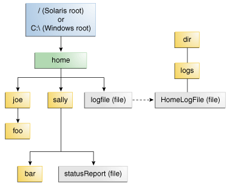

# IO

本章交要讲解基本的 I/O 。它首先集中在 “I/O 流”（I/O Streams），一个强大的概念用于简化 I/O 操作。本文还讲解了序列化，它可以让程序将整个对象转出为流，然后再从流读回来。随后介绍文件 I/O 和文件系统的操作，其中包括了随机访问文件。

大多数涵盖 I/O 流 的类都在`java.io`包。大多数涵盖文件 I/O 的类都在`java.nio.file`包。

# I/O 流

## 字节流(Byte Streams)

字节流处理原始的二进制数据 I/O。输入输出的是 8 位字节，相关的类为 [InputStream](https://docs.oracle.com/javase/8/docs/api/java/io/InputStream.html) 和 [OutputStream](https://docs.oracle.com/javase/8/docs/api/java/io/OutputStream.html).

字节流的类有许多。为了演示字节流的工作，我们将重点放在文件 I/O 字节流 [FileInputStream](https://docs.oracle.com/javase/8/docs/api/java/io/FileInputStream.html) 和 [FileOutputStream](https://docs.oracle.com/javase/8/docs/api/java/io/FileOutputStream.html) 上。其他种类的字节流用法类似，主要区别在于它们构造的方式，大家可以举一反三。

### 用法

下面一例子 CopyBytes， 从 xanadu.txt 文件复制到 outagain.txt，每次只复制一个字节：

```java
public class CopyBytes {
    /**
     * @param args
     * @throws IOException
     */
    public static void main(String[] args) throws IOException {
        FileInputStream in = null;
        FileOutputStream out = null;

        try {
            in = new FileInputStream("resources/xanadu.txt");
            out = new FileOutputStream("resources/outagain.txt");
            int c;

            while ((c = in.read()) != -1) {
                out.write(c);
            }
        } finally {
            if (in != null) {
                in.close();
            }
            if (out != null) {
                out.close();
            }
        }
    }
} 
```

CopyBytes 花费其大部分时间在简单的循环里面，从输入流每次读取一个字节到输出流，如图所示：


### 记得始终关闭流

不再需要一个流记得要关闭它，这点很重要。所以，CopyBytes 使用 finally 块来保证即使发生错误两个流还是能被关闭。这种做法有助于避免严重的资源泄漏。

一个可能的错误是，CopyBytes 无法打开一个或两个文件。当发生这种情况，对应解决方案是判断该文件的流是否是其初始 null 值。这就是为什么 CopyBytes 可以确保每个流变量在调用前都包含了一个对象的引用。

### 何时不使用字节流

CopyBytes 似乎是一个正常的程序，但它实际上代表了一种低级别的 I/O，你应该避免。因为 xanadu.txt 包含字符数据时，最好的方法是使用字符流，下文会有讨论。字节流应只用于最原始的 I/O。所有其他流类型是建立在字节流之上的。

## 字符流(Character Streams)

字符流处理字符数据的 I/O，自动处理与本地字符集转化。

Java 平台存储字符值使用 Unicode 约定。字符流 I/O 会自动将这个内部格式与本地字符集进行转换。在西方的语言环境中，本地字符集通常是 ASCII 的 8 位超集。

对于大多数应用，字符流的 I/O 不会比 字节流 I/O 操作复杂。输入和输出流的类与本地字符集进行自动转换。使用字符的程序来代替字节流可以自动适应本地字符集，并可以准备国际化，而这完全不需要程序员额外的工作。

如果国际化不是一个优先事项，你可以简单地使用字符流类，而不必太注意字符集问题。以后，如果国际化成为当务之急，你的程序可以方便适应这种需求的扩展。见[国际化](http://docs.oracle.com/javase/tutorial/i18n/index.html)获取更多信息。

### 用法

字符流类描述在 [Reader](https://docs.oracle.com/javase/8/docs/api/java/io/Reader.html) 和 [Writer](https://docs.oracle.com/javase/8/docs/api/java/io/Writer.html)。而对应文件 I/O ，在 [FileReader](https://docs.oracle.com/javase/8/docs/api/java/io/FileReader.html) 和 [FileWriter](https://docs.oracle.com/javase/8/docs/api/java/io/FileWriter.html)，下面是一个 CopyCharacters 例子：

```java
public class CopyCharacters {
    /**
     * @param args
     * @throws IOException 
     */
    public static void main(String[] args) throws IOException {
        FileReader inputStream = null;
        FileWriter outputStream = null;

        try {
            inputStream = new FileReader("resources/xanadu.txt");
            outputStream = new FileWriter("resources/characteroutput.txt");

            int c;
            while ((c = inputStream.read()) != -1) {
                outputStream.write(c);
            }
        } finally {
            if (inputStream != null) {
                inputStream.close();
            }
            if (outputStream != null) {
                outputStream.close();
            }
        }
    }
} 
```

CopyCharacters 与 CopyBytes 是非常相似的。最重要的区别在于 CopyCharacters 使用的 FileReader 和 FileWriter 用于输入输出，而 CopyBytes 使用 FileInputStream 和 FileOutputStream 中的。请注意，这两个 CopyBytes 和 CopyCharacters 使用 int 变量来读取和写入；在 CopyCharacters，int 变量保存在其最后的 16 位字符值;在 CopyBytes，int 变量保存在其最后的 8 位字节的值。

#### 字符流使用字节流

字符流往往是对字节流的“包装”。字符流使用字节流来执行物理 I/O，同时字符流处理字符和字节之间的转换。例如，FileReader 使用 FileInputStream，而 FileWriter 使用的是 FileOutputStream。

有两种通用的字节到字符的“桥梁”流：InputStreamReader 和 OutputStreamWriter。当没有预包装的字符流类时，使用它们来创建字符流。在 socket 章节中将展示该用法。

### 面向行的 I/O

字符 I/O 通常发生在较大的单位不是单个字符。一个常用的单位是行：用行结束符结尾。行结束符可以是回车/换行序列（“`\r\n`”），一个回车（“`\r`”），或一个换行符（“`\n`”）。支持所有可能的行结束符，程序可以读取任何广泛使用的操作系统创建的文本文件。

修改 CopyCharacters 来演示如使用面向行的 I/O。要做到这一点，我们必须使用两个类，[BufferedReader](https://docs.oracle.com/javase/8/docs/api/java/io/BufferedReader.html) 和 [PrintWriter](https://docs.oracle.com/javase/8/docs/api/java/io/PrintWriter.html) 的。我们会在缓冲 I/O 和 Formatting 章节更加深入地研究这些类。

该 CopyLines 示例调用 BufferedReader.readLine 和 PrintWriter.println 同时做一行的输入和输出。

```java
public class CopyLines {
    /**
     * @param args
     * @throws IOException 
     */
    public static void main(String[] args) throws IOException {
        BufferedReader inputStream = null;
        PrintWriter outputStream = null;

        try {
            inputStream = new BufferedReader(new FileReader("resources/xanadu.txt"));
            outputStream = new PrintWriter(new FileWriter("resources/characteroutput.txt"));

            String l;
            while ((l = inputStream.readLine()) != null) {
                outputStream.println(l);
            }
        } finally {
            if (inputStream != null) {
                inputStream.close();
            }
            if (outputStream != null) {
                outputStream.close();
            }
        }
    }
} 
```

调用 readLine 按行返回文本行。CopyLines 使用 println 输出带有当前操作系统的行终止符的每一行。这可能与输入文件中不是使用相同的行终止符。

除字符和行之外，有许多方法来构造文本的输入和输出。欲了解更多信息，请参阅 Scanning 和 Formatting。

## 缓冲流（Buffered Streams）

缓冲流通过减少调用本地 API 的次数来优化的输入和输出。

目前为止，大多数时候我们到看到使用非缓冲 I/O 的例子。这意味着每次读或写请求是由基础 OS 直接处理。这可以使一个程序效率低得多，因为每个这样的请求通常引发磁盘访问，网络活动，或一些其它的操作，而这些是相对昂贵的。

为了减少这种开销，所以 Java 平台实现缓冲 I/O 流。缓冲输入流从被称为缓冲区（buffer）的存储器区域读出数据;仅当缓冲区是空时，本地输入 API 才被调用。同样，缓冲输出流，将数据写入到缓存区，只有当缓冲区已满才调用本机输出 API。

程序可以转换的非缓冲流为缓冲流，这里用非缓冲流对象传递给缓冲流类的构造器。

```java
inputStream = new BufferedReader(new FileReader("xanadu.txt"));
outputStream = new BufferedWriter(new FileWriter("characteroutput.txt")); 
```

用于包装非缓存流的缓冲流类有 4 个：[BufferedInputStream](https://docs.oracle.com/javase/8/docs/api/java/io/BufferedInputStream.html) 和 [BufferedOutputStream](https://docs.oracle.com/javase/8/docs/api/java/io/BufferedOutputStream.html) 用于创建字节缓冲字节流, [BufferedReader](https://docs.oracle.com/javase/8/docs/api/java/io/BufferedReader.html) 和 [BufferedWriter](https://docs.oracle.com/javase/8/docs/api/java/io/BufferedWriter.html) 用于创建字符缓冲字节流。

### 刷新缓冲流

刷新缓冲区是指在某个缓冲的关键点就可以将缓冲输出，而不必等待它填满。

一些缓冲输出类通过一个可选的构造函数参数支持 autoflush（自动刷新）。当自动刷新开启，某些关键事件会导致缓冲区被刷新。例如，自动刷新 PrintWriter 对象在每次调用 println 或者 format 时刷新缓冲区。查看 Formatting 了解更多关于这些的方法。

如果要手动刷新流，请调用其 flush 方法。flush 方法可以用于任何输出流，但对非缓冲流是没有效果的。

## 扫描（Scanning）和格式化（Formatting）

扫描和格式化允许程序读取和写入格式化的文本。

I/O 编程通常涉及对人类喜欢的整齐的格式化数据进行转换。为了帮助您与这些琐事，Java 平台提供了两个 API。[scanning](http://docs.oracle.com/javase/tutorial/essential/io/scanning.html) API 使用分隔符模式将其输入分解为标记。[formatting](http://docs.oracle.com/javase/tutorial/essential/io/formatting.html) API 将数据重新组合成格式良好的，人类可读的形式。

### 扫描

#### 将其输入分解为标记

默认情况下，Scanner 使用空格字符分隔标记。（空格字符包括空格，制表符和行终止符。为完整列表，请参阅 [Character.isWhitespace](https://docs.oracle.com/javase/8/docs/api/java/lang/Character.html#isWhitespace-char-)）。示例 ScanXan 读取 xanadu.txt 的单个词语并打印他们：

```java
public class ScanXan {
    /**
     * @param args
     * @throws IOException 
     */
    public static void main(String[] args) throws IOException {
        Scanner s = null;

        try {
            s = new Scanner(new BufferedReader(new FileReader("resources/xanadu.txt")));

            while (s.hasNext()) {
                System.out.println(s.next());
            }
        } finally {
            if (s != null) {
                s.close();
            }
        }
    }
} 
```

虽然 Scanner 不是流，但你仍然需要关闭它，以表明你与它的底层流执行完成。

调用 useDelimiter() ,指定一个正则表达式可以使用不同的标记分隔符。例如,假设您想要标记分隔符是一个逗号，后面可以跟空格。你会调用

```java
s.useDelimiter(",\\s*"); 
```

#### 转换成独立标记

该 ScanXan 示例是将所有的输入标记为简单的字符串值。Scanner 还支持所有的 Java 语言的基本类型（除 char），以及 BigInteger 和 BigDecimal 的。此外，数字值可以使用千位分隔符。因此，在一个美国的区域设置，Scanner 能正确地读出字符串“32,767”作为一个整数值。

这里要注意的是语言环境，因为千位分隔符和小数点符号是特定于语言环境。所以，下面的例子将无法正常在所有的语言环境中，如果我们没有指定 scanner 应该用在美国地区工作。可能你平时并不用关心，因为你输入的数据通常来自使用相同的语言环境。可以使用下面的语句来设置语言环境：

```java
s.useLocale(Locale.US); 
```

该 ScanSum 示例是将读取的 double 值列表进行相加：

```java
public class ScanSum {
    /**
     * @param args
     * @throws IOException
     */
    public static void main(String[] args) throws IOException {
        Scanner s = null;
        double sum = 0;

        try {
            s = new Scanner(new BufferedReader(new FileReader("resources/usnumbers.txt")));
            s.useLocale(Locale.US);

            while (s.hasNext()) {
                if (s.hasNextDouble()) {
                    sum += s.nextDouble();
                } else {
                    s.next();
                }
            }
        } finally {
            s.close();
        }

        System.out.println(sum);
    }
} 
```

输出为:1032778.74159

### 格式化

实现格式化流对象要么是 字符流类的 [PrintWriter](https://docs.oracle.com/javase/8/docs/api/java/io/PrintWriter.html) 的实例，或为字节流类的 [PrintStream](https://docs.oracle.com/javase/8/docs/api/java/io/PrintStream.html) 的实例。

*注：对于 PrintStream 对象，你很可能只需要 [System.out](https://docs.oracle.com/javase/8/docs/api/java/lang/System.html#out) 和 [System.err](https://docs.oracle.com/javase/8/docs/api/java/lang/System.html#err)。 （请参阅命令行 I/O）当你需要创建一个格式化的输出流，请实例化 PrintWriter，而不是 PrintStream。*

像所有的字节和字符流对象一样，PrintStream 和 PrintWriter 的实例实现了一套标准的 write 方法用于简单的字节和字符输出。此外，PrintStream 和 PrintWriter 的执行同一套方法，将内部数据转换成格式化输出。提供了两个级别的格式：

*   print 和 println 在一个标准的方式里面格式化独立的值 。
*   format 用于格式化几乎任何数量的格式字符串值，且具有多种精确选择。

#### print 和 println 方法

调用 print 或 println 输出使用适当 toString 方法变换后的值的单一值。我们可以看到这 Root 例子：

```java
public class Root {
    /**
     * @param args
     */
    public static void main(String[] args) {
            int i = 2;
        double r = Math.sqrt(i);

        System.out.print("The square root of ");
        System.out.print(i);
        System.out.print(" is ");
        System.out.print(r);
        System.out.println(".");

        i = 5;
        r = Math.sqrt(i);
        System.out.println("The square root of " + i + " is " + r + ".");
    }
} 
```

输出为：

```java
The square root of 2 is 1.4142135623730951.
The square root of 5 is 2.23606797749979. 
```

在 i 和 r 变量格式化了两次：第一次在重载的 print 使用代码，第二次是由 Java 编译器转换码自动生成，它也利用了 toString。您可以用这种方式格式化任意值，但对于结果没有太多的控制权。

#### format 方法

该 format 方法用于格式化基于 format string（格式字符串） 多参。格式字符串包含嵌入了 format specifiers （格式说明)的静态文本;除非使用了格式说明，否则格式字符串输出不变。

格式字符串支持许多功能。在本教程中，我们只介绍一些基础知识。有关完整说明，请参阅 API 规范关于[格式字符串语法](https://docs.oracle.com/javase/8/docs/api/java/util/Formatter.html#syntax)。

Root2 示例在一个 format 调用里面设置两个值：

```java
public class Root2 {
    /**
     * @param args
     */
    public static void main(String[] args) {
        int i = 2;
        double r = Math.sqrt(i);

        System.out.format("The square root of %d is %f.%n", i, r);
    }
} 
```

输出为：The square root of 2 is 1.414214.

像本例中所使用的格式为：

*   d 格式化整数值为小数
*   f 格式化浮点值作为小数
*   n 输出特定于平台的行终止符。

这里有一些其他的转换格式：

*   x 格式化整数为十六进制值
*   s 格式化任何值作为字符串
*   tB 格式化整数作为一个语言环境特定的月份名称。

还有许多其他的转换。

*注意：除了 `%%` 和 `%n`，其他格式符都要匹配参数，否则抛出异常。在 Java 编程语言中，`\ n`转义总是产生换行符（`\u000A`）。不要使用`\ñ`除非你特别想要一个换行符。为了针对本地平台得到正确的行分隔符，请使用`％n`。*

除了用于转换，格式说明符可以包含若干附加的元素，进一步定制格式化输出。下面是一个 Format 例子，使用一切可能的一种元素。

```java
public class Format {
    /**
     * @param args
     */
    public static void main(String[] args) {
         System.out.format("%f, %1$+020.10f %n", Math.PI);
    }
} 
```

输出为：3.141593, +00000003.1415926536

附加元素都是可选的。下图显示了长格式符是如何分解成元素


元件必须出现在显示的顺序。从合适的工作，可选的元素是：

*   Precision(精确)。对于浮点值，这是格式化值的数学精度。对于 s 和其他一般的转换，这是格式化值的最大宽度;该值右截断，如果有必要的。
*   Width(宽度)。格式化值的最小宽度;如有必要，该值被填充。默认值是左用空格填充。
*   Flags(标志)指定附加格式设置选项。在 Format 示例中，+ 标志指定的数量应始终标志格式，以及 0 标志指定 0 是填充字符。其他的标志包括 - （垫右侧）和（与区域特定的千位分隔符格式号）。请注意，某些标志不能与某些其他标志或与某些转换使用。
*   Argument Index(参数索引)允许您指定的参数明确匹配。您还可以指定<到相同的参数作为前面的说明一致。这样的例子可以说：`System.out.format（“％F，％<+ 020.10f％N”，Math.PI）;`

## 命令行 I/O

命令行 I/O 描述了标准流（Standard Streams）和控制台（Console）对象。

Java 支持两种交互方式：标准流（Standard Streams）和通过控制台（Console）。

### 标准流

标准流是许多操作系统的一项功能。默认情况下，他们从键盘读取输入和写出到显示器。它们还支持对文件和程序之间的 I/O，但该功能是通过命令行解释器，而不是由程序控制。

Java 平台支持三种标准流：标准输入（Standard Input, 通过 System.in 访问）、标准输出（Standard Output, 通过 System.out 的访问）和标准错误（ Standard Error, 通过 System.err 的访问）。这些对象被自动定义，并不需要被打开。标准输出和标准错误都用于输出;错误输出允许用户转移经常性的输出到一个文件中，仍然能够读取错误消息。

您可能希望标准流是字符流，但是，由于历史的原因，他们是字节流。 System.out 和 System.err 定义为 [PrintStream](https://docs.oracle.com/javase/8/docs/api/java/io/PrintStream.html) 的对象。虽然这在技术上是一个字节流，PrintStream 利用内部字符流对象来模拟多种字符流的功能。

相比之下，System.in 是一个没有字符流功能的字节流。若要想将标准的输入作为字符流，可以包装 System.in 在 InputStreamReader

```java
InputStreamReader cin = new InputStreamReader(System.in); 
```

### Console (控制台)

更先进的替代标准流的是 Console 。这个单一，预定义的 [Console](https://docs.oracle.com/javase/8/docs/api/java/io/Console.html) 类型的对象，有大部分的标准流提供的功能，另外还有其他功能。Console 对于安全的密码输入特别有用。Console 对象还提供了真正的输入输出字符流，是通过 reader 和 writer 方法实现的。

若程序想使用 Console ，它必须尝试通过调用 System.console() 检索 Console 对象。如果 Console 对象存在，通过此方法将其返回。如果返回 NULL，则 Console 操作是不允许的，要么是因为操作系统不支持他们或者是因为程序本身是在非交互环境中启动的。

Console 对象支持通过读取密码的方法安全输入密码。该方法有助于在两个方面的安全。第一，它抑制回应，因此密码在用户的屏幕是不可见的。第二，readPassword 返回一个字符数组，而不是字符串，所以，密码可以被覆盖，只要它是不再需要就可以从存储器中删除。

Password 例子是一个展示了更改用户的密码原型程序。它演示了几种 Console 方法

```java
public class Password {
    /**
     * @param args
     */
    public static void main(String[] args) {
        Console c = System.console();
        if (c == null) {
            System.err.println("No console.");
            System.exit(1);
        }

        String login = c.readLine("Enter your login: ");
        char [] oldPassword = c.readPassword("Enter your old password: ");

        if (verify(login, oldPassword)) {
            boolean noMatch;
            do {
                char [] newPassword1 = c.readPassword("Enter your new password: ");
                char [] newPassword2 = c.readPassword("Enter new password again: ");
                noMatch = ! Arrays.equals(newPassword1, newPassword2);
                if (noMatch) {
                    c.format("Passwords don't match. Try again.%n");
                } else {
                    change(login, newPassword1);
                    c.format("Password for %s changed.%n", login);
                }
                Arrays.fill(newPassword1, ' ');
                Arrays.fill(newPassword2, ' ');
            } while (noMatch);
        }

        Arrays.fill(oldPassword, ' ');
    }

    // Dummy change method.
    static boolean verify(String login, char[] password) {
        // This method always returns
        // true in this example.
        // Modify this method to verify
        // password according to your rules.
        return true;
    }

    // Dummy change method.
    static void change(String login, char[] password) {
        // Modify this method to change
        // password according to your rules.
    }
} 
```

上面的流程是：

*   尝试检索 Console 对象。如果对象是不可用，中止。
*   调用 Console.readLine 提示并读取用户的登录名。
*   调用 Console.readPassword 提示并读取用户的现有密码。
*   调用 verify 确认该用户被授权可以改变密码。（在本例中，假设 verify 是总是返回 true ）
*   重复下列步骤，直到用户输入的密码相同两次：
    *   调用 Console.readPassword 两次提示和读一个新的密码。
    *   如果用户输入的密码两次，调用 change 去改变它。 （同样，change 是一个虚拟的方法）
    *   用空格覆盖这两个密码。
*   用空格覆盖旧的密码。

## 数据流（Data Streams）

Data Streams 处理原始数据类型和字符串值的二进制 I/O。

支持基本数据类型的值（(boolean, char, byte, short, int, long, float, 和 double）以及字符串值的二进制 I/O。所有数据流实现 [DataInput](https://docs.oracle.com/javase/8/docs/api/java/io/DataInput.html) 或 [DataOutput](https://docs.oracle.com/javase/8/docs/api/java/io/DataOutput.html) 接口。本节重点介绍这些接口的广泛使用的实现，[DataInputStream](https://docs.oracle.com/javase/8/docs/api/java/io/DataInputStream.html) 和 [DataOutputStream](https://docs.oracle.com/javase/8/docs/api/java/io/DataOutputStream.html) 类。

DataStreams 例子展示了数据流通过写出的一组数据记录到文件，然后再次从文件中读取这些记录。每个记录包括涉及在发票上的项目，如下表中三个值：

| 记录中顺序 | 数据类型 | 数据描述 | 输出方法 | 输入方法 | 示例值 |
| --- | --- | --- | --- | --- | --- |
| 1 | double | Item price | DataOutputStream.writeDouble | DataInputStream.readDouble | 19.99 |
| 2 | int | Unit count | DataOutputStream.writeInt | DataInputStream.readInt | 12 |
| 3 | String | Item description | DataOutputStream.writeUTF | DataInputStream.readUTF | "Java T-Shirt" |

首先，定义了几个常量，数据文件的名称，以及数据。

```java
static final String dataFile = "invoicedata";

static final double[] prices = { 19.99, 9.99, 15.99, 3.99, 4.99 };
static final int[] units = { 12, 8, 13, 29, 50 };
static final String[] descs = {
    "Java T-shirt",
    "Java Mug",
    "Duke Juggling Dolls",
    "Java Pin",
    "Java Key Chain"
}; 
```

DataStreams 打开一个输出流，提供一个缓冲的文件输出字节流：

```java
out = new DataOutputStream(new BufferedOutputStream(
              new FileOutputStream(dataFile))) 
```

DataStreams 写出记录并关闭输出流：

```java
for (int i = 0; i < prices.length; i ++) {
    out.writeDouble(prices[i]);
    out.writeInt(units[i]);
    out.writeUTF(descs[i]);
} 
```

该 writeUTF 方法写出以 UTF-8 改进形式的字符串值。

现在，DataStreams 读回数据。首先，它必须提供一个输入流，和变量来保存的输入数据。像 DataOutputStream 、DataInputStream 类，必须构造成一个字节流的包装器。

```java
in = new DataInputStream(new
            BufferedInputStream(new FileInputStream(dataFile)));

double price;
int unit;
String desc;
double total = 0.0; 
```

现在，DataStreams 可以读取流里面的每个记录，并在遇到它时将数据报告出来：

```java
try {
    while (true) {
        price = in.readDouble();
        unit = in.readInt();
        desc = in.readUTF();
        System.out.format("You ordered %d" + " units of %s at $%.2f%n",
            unit, desc, price);
        total += unit * price;
    }
} catch (EOFException e) {
} 
```

请注意，DataStreams 通过捕获 EOFException 检测文件结束的条件而不是测试无效的返回值。所有实现了 DataInput 的方法都使用 EOFException 类来代替返回值。

还要注意的是 DataStreams 中的各个 write 需要匹配对应相应的 read。它需要由程序员来保证。

DataStreams 使用了一个非常糟糕的编程技术：它使用浮点数来表示的货币价值。在一般情况下，浮点数是不好的精确数值。这对小数尤其糟糕，因为共同值（如 0.1），没有一个二进制的表示。

正确的类型用于货币值是 [java.math.BigDecimal](https://docs.oracle.com/javase/8/docs/api/java/math/BigDecimal.html) 的。不幸的是，BigDecimal 是一个对象的类型，因此它不能与数据流工作。然而，BigDecimal 将与对象流工作，而这部分内容将在下一节讲解。

## 对象流（Object Streams）

对象流处理对象的二进制 I/O。

正如数据流支持的是基本数据类型的 I/O，对象流支持的对象 I/O。大多数，但不是全部，标准类支持他们的对象的序列化，都需要实现 [Serializable](https://docs.oracle.com/javase/8/docs/api/java/io/Serializable.html) 接口。

对象流类包括 [ObjectInputStream](https://docs.oracle.com/javase/8/docs/api/java/io/ObjectInputStream.html) 和 [ObjectOutputStream](https://docs.oracle.com/javase/8/docs/api/java/io/ObjectOutputStream.html) 的。这些类实现的 [ObjectInput](https://docs.oracle.com/javase/8/docs/api/java/io/ObjectInput.html) 与 [ObjectOutput](https://docs.oracle.com/javase/8/docs/api/java/io/ObjectOutput.html) 的，这些都是 DataInput 和 DataOutput 的子接口。这意味着，所有包含在数据流中的基本数据类型 I/O 方法也在对象流中实现了。这样一个对象流可以包含基本数据类型值和对象值的混合。该 ObjectStreams 例子说明了这一点。ObjectStreams 创建与 DataStreams 相同的应用程序。首先，价格现在是 [BigDecimal](https://docs.oracle.com/javase/8/docs/api/java/math/BigDecimal.html) 对象，以更好地代表分数值。其次，[Calendar](https://docs.oracle.com/javase/8/docs/api/java/util/Calendar.html) 对象被写入到数据文件中，指示发票日期。

```java
public class ObjectStreams {
    static final String dataFile = "invoicedata";

    static final BigDecimal[] prices = { 
        new BigDecimal("19.99"), 
        new BigDecimal("9.99"),
        new BigDecimal("15.99"),
        new BigDecimal("3.99"),
        new BigDecimal("4.99") };
    static final int[] units = { 12, 8, 13, 29, 50 };
    static final String[] descs = { "Java T-shirt",
            "Java Mug",
            "Duke Juggling Dolls",
            "Java Pin",
            "Java Key Chain" };

    public static void main(String[] args) 
        throws IOException, ClassNotFoundException {

        ObjectOutputStream out = null;
        try {
            out = new ObjectOutputStream(new
                    BufferedOutputStream(new FileOutputStream(dataFile)));

            out.writeObject(Calendar.getInstance());
            for (int i = 0; i < prices.length; i ++) {
                out.writeObject(prices[i]);
                out.writeInt(units[i]);
                out.writeUTF(descs[i]);
            }
        } finally {
            out.close();
        }

        ObjectInputStream in = null;
        try {
            in = new ObjectInputStream(new
                    BufferedInputStream(new FileInputStream(dataFile)));

            Calendar date = null;
            BigDecimal price;
            int unit;
            String desc;
            BigDecimal total = new BigDecimal(0);

            date = (Calendar) in.readObject();

            System.out.format ("On %tA, %<tB %<te, %<tY:%n", date);

            try {
                while (true) {
                    price = (BigDecimal) in.readObject();
                    unit = in.readInt();
                    desc = in.readUTF();
                    System.out.format("You ordered %d units of %s at $%.2f%n",
                            unit, desc, price);
                    total = total.add(price.multiply(new BigDecimal(unit)));
                }
            } catch (EOFException e) {}
            System.out.format("For a TOTAL of: $%.2f%n", total);
        } finally {
            in.close();
        }
    }
} 
```

如果的 readObject() 不返回预期的对象类型，试图将它转换为正确的类型可能会抛出一个 [ClassNotFoundException](https://docs.oracle.com/javase/8/docs/api/java/lang/ClassNotFoundException.html)。在这个简单的例子，这是不可能发生的，所以我们不要试图捕获异常。相反，我们通知编译器，我们已经意识到这个问题，添加 ClassNotFoundException 到主方法的 throws 子句中的。

### 复杂对象的 I/O

writeObject 和 readObject 方法简单易用，但它们包含了一些非常复杂的对象管理逻辑。这不像 Calendar 类，它只是封装了原始值。但许多对象包含其他对象的引用。如果 readObject 从流重构一个对象，它必须能够重建所有的原始对象所引用的对象。这些额外的对象可能有他们自己的引用，依此类推。在这种情况下，writeObject 遍历对象引用的整个网络，并将该网络中的所有对象写入流。因此，writeObject 单个调用可以导致大量的对象被写入流。

如下图所示，其中 writeObject 调用名为 a 的单个对象。这个对象包含对象的引用 b 和 c，而 b 包含引用 d 和 e。调用 writeObject(a) 写入的不只是一个 a，还包括所有需要重新构成的这个网络中的其他 4 个对象。当通过 readObject 读回 a 时，其他四个对象也被读回，同时，所有的原始对象的引用被保留。


如果在同一个流的两个对象引用了同一个对象会发生什么？流只包含一个对象的一个拷贝，尽管它可以包含任何数量的对它的引用。因此，如果你明确地写一个对象到流两次，实际上只是写入了 2 此引用。例如，如果下面的代码写入一个对象 ob 两次到流：

```java
Object ob = new Object();
out.writeObject(ob);
out.writeObject(ob); 
```

每个 writeObject 都对应一个 readObject， 所以从流里面读回的代码如下：

```java
Object ob1 = in.readObject();
Object ob2 = in.readObject(); 
```

ob1 和 ob2 都是相同对象的引用。

然而，如果一个单独的对象被写入到两个不同的数据流，它被有效地复用 - 一个程序从两个流读回的将是两个不同的对象。

## 源码

本章例子的源码，可以在 [`github.com/waylau/essential-java`](https://github.com/waylau/essential-java) 中 `com.waylau.essentialjava.io` 包下找到。

# 文件 I/O

本教程讲述的是 JDK 7 版本以来引入的新的 I/O 机制（也被称为 NIO.2）。

相关的包在 java.nio.file ，其中 java.nio.file.attribute 提供对文件 I/O 以及访问默认文件系统的全面支持。虽然 API 有很多类，但你只需要重点关注几个。你会看到，这个 API 是非常直观和易于使用。

## 什么是路径（Path）？在其他文件系统的实际是怎么样的？

文件系统是用某种媒体形式存储和组织文件，一般是一个或多个硬盘驱动器，以这样的方式，它们可以很容易地检索文件。目前使用的大多数文件系统存储文件是以树（或层次）结构。在树的顶部是一个（或多个）根节点。根节点下，有文件和目录（在 Microsoft Windows 系统是指文件夹）。每个目录可以包含文件和子目录，而这又可以包含文件和子目录，以此类推，有可能是无限深度。

### 什么是路径（Path）？

下图显示了一个包含一个根节点的目录树。Microsoft Windows 支持多个根节点。每个根节点映射到一个卷，如 `C:\` 或 `D:\`。 Solaris OS 支持一个根节点，这由斜杠`/`表示。


文件系统通过路径来确定文件。例如，上图 statusReport 在 Solaris OS 描述为：

```java
/home/sally/statusReport 
```

而在 Microsoft Windows 下，描述如下：

```java
C:\home\sally\statusReport 
```

用来分隔目录名称的字符（也称为分隔符）是特定于文件系统的：Solaris OS 中使用正斜杠（/），而 Microsoft Windows 使用反斜杠（\）。

### 相对或绝对路径？

路径可以是相对或绝对的。绝对路径总是包含根元素以及找到该文件所需要的完整的目录列表。对于例如，`/home/sally/statusReport` 是一个绝对路径。所有找到的文件所需的信息都包含在路径字符串里。

相对路径需要与另一路径进行组合才能访问到文件。例如，`joe/foo` 是一个相对路径,没有更多的信息，程序不能可靠地定位 `joe/foo` 目录。

### 符号链接（Symbolic Links）

文件系统对象最典型的是目录或文件。每个人都熟悉这些对象。但是，某些文件系统还支持符号链接的概念。符号链接也被称为符号链接（symlink）或软链接（soft link）。

符号链接是，作为一个引用到另一个文件的特殊文件。在大多数情况下，符号链接对于应用程序来说透明的，符号链接上面的操作会被自动重定向到链接的目标（链接的目标是指该所指向的文件或目录）。当符号链接删除或重命名，在这种情况下，链接本身被删除或重命名，而不是链接的目标。

在下图中，logFile 对于用户来说看起来似乎是一个普通文件，但它实际上是 `dir/logs/HomeLogFile` 文件的符号链接。HomeLogFile 是链接的目标。



符号链接通常对用户来说是透明。读取或写入符号链接是和读取或写入到任何其他文件或目录是一样的。

解析链接（resolving a link）是指在文件系统中用实际位置取代符号链接。在这个例子中，logFile 解析为 `dir/logs/HomeLogFile`

在实际情况下，大多数文件系统自由使用的符号链接。有时，一不小心创建符号链接会导致循环引用。循环引用是指，当链接的目标点回到原来的链接。循环引用可能是间接的：目录 a 指向目录 b，b 指向目录 c，其中包含的子目录指回目录 a 。当一个程序被递归遍历目录结构时，循环引用可能会导致混乱。但是，这种情况已经做了限制，不会导致程序无限循环。

接下来章节将讨论 Java 文件 I/O 的核心 Path 类。

## Path 类

该 [Path](https://docs.oracle.com/javase/8/docs/api/java/nio/file/Path.html) 类是从 Java SE 7 开始引入的， 是 [java.nio.file](https://docs.oracle.com/javase/8/docs/api/java/nio/file/package-summary.html) 包的主要进入点之一。

*注：若果 Java SE 7 之前的版本，可以使用 [File.toPath](https://docs.oracle.com/javase/8/docs/api/java/io/File.html#toPath--) 实现 Path 类似的功能*

Path 类是在文件系统路径的编程表示。Path 对象包含了文件名和目录列表，用于构建路径，以及检查，定位和操作文件。

Path 实例反映了基础平台。在 Solaris OS,路径使用 Solaris 语法（`/home/joe/foo`）,而在 Microsoft Windows，路径使用 Windows 语法（`C:\home\joe\foo`）。路径是与系统相关，即 Solaris 文件系统中的路径不能与 Windows 文件系统的路径进行匹配。

对应于该路径的文件或目录可能不存在。您可以创建一个 Path 实例，并以各种方式操纵它：您可以附加到它，提取它的一部分，把它比作其他路径。在适当的时候，可以使用在 [Files](https://docs.oracle.com/javase/8/docs/api/java/nio/file/Files.html) 类的方法来检查对应路径的文件是否存在，创建文件，打开它，删除它，改变它的权限，等等。

### Path 操作

Path 类包括各种方法，可用于获得关于路径信息，路径的接入元件，路径转换为其它形式，或提取路径的部分。也有用于匹配的路径字符串的方法，也有用于在一个路径去除冗余的方法。这些路径方法，有时也被称为语义操作（syntactic operations），因为是在它们的路径本身进行操作，而不是访问文件系统。

#### 创建路径

Path 实例包含用于指定文件或目录的位置的信息。在它被定义的时候，一个 Path 上设置了一系列的一个或多个名称。根元素或文件名可能被包括在内，但也不是必需的。Path 可能包含只是一个单一的目录或文件名。

您可以通过 [Paths](https://docs.oracle.com/javase/8/docs/api/java/nio/file/Paths.html)（注意是复数）助手类的 get 方法很容易地创建一个 Path 对象：

```java
Path p1 = Paths.get("/tmp/foo");
Path p2 = Paths.get(args[0]);
Path p3 = Paths.get(URI.create("file:///Users/joe/FileTest.java")); 
```

Paths.get 是下面方式的简写：

```java
Path p4 = FileSystems.getDefault().getPath("/users/sally"); 
```

下面的例子假设你的 home 目录是 `/u/joe`,则将创建`/u/joe/logs/foo.log`, 或若果是 Windows 环境，则为`C:\joe\logs\foo.log`

#### 检索有关一个路径

你可以把路径作为储存这些名称元素的序列。在目录结构中的最高元素将设在索引为 0 的目录结构中，而最低元件将设在索引 [n-1]，其中 n 是 Path 的元素个数。方法可用于检索各个元素或使用这些索引 Path 的子序列。

本示例使用下面的目录结构：


下面的代码片段定义了一个 Path 实例，然后调用一些方法来获取有关的路径信息：

```java
// None of these methods requires that the file corresponding
// to the Path exists.
// Microsoft Windows syntax
Path path = Paths.get("C:\\home\\joe\\foo");

// Solaris syntax
Path path = Paths.get("/home/joe/foo");

System.out.format("toString: %s%n", path.toString());
System.out.format("getFileName: %s%n", path.getFileName());
System.out.format("getName(0): %s%n", path.getName(0));
System.out.format("getNameCount: %d%n", path.getNameCount());
System.out.format("subpath(0,2): %s%n", path.subpath(0,2));
System.out.format("getParent: %s%n", path.getParent());
System.out.format("getRoot: %s%n", path.getRoot()); 
```

下面是 Windows 和 Solaris OS 不同的输出:

| 方法 | Solaris OS 返回 | Microsoft Windows 返回 |
| --- | --- | --- |
| toString | /home/joe/foo | C:\home\joe\foo |
| getFileName | foo | foo |
| getName(0) | home | home |
| getNameCount | 3 | 3 |
| subpath(0,2) | home/joe | home\joe |
| getParent | /home/joe | \home\joe |
| getRoot | / | C:\ |

下面是一个相对路径的例子：

```java
// Solaris syntax
Path path = Paths.get("sally/bar");
or
// Microsoft Windows syntax
Path path = Paths.get("sally\\bar"); 
```

下面是 Windows 和 Solaris OS 不同的输出:

| 方法 | Solaris OS 返回 | Microsoft Windows 返回 |
| --- | --- | --- |
| toString | sally/bar | sally\bar |
| getFileName | bar | bar |
| getName(0) | sally | sally |
| getNameCount | 2 | 2 |
| subpath(0,1) | sally | sally |
| getParent | sally | sally |
| getRoot | null | null |

#### 从 Path 中移除冗余

许多文件系统使用“.”符号表示当前目录，“..”来表示父目录。您可能有一个 Path 包含冗余目录信息的情况。也许一个服务器配置为保存日志文件在“/dir/logs/.”目录，你想删除后面的“/.”

下面的例子都包含冗余：

```java
/home/./joe/foo
/home/sally/../joe/foo 
```

normalize 方法是删除任何多余的元素，其中包括任何 出现的“.”或“directory/...”。前面的例子规范化为 `/home/joe/foo`

要注意，当它清理一个路径时，normalize 不检查文件系统。这是一个纯粹的句法操作。在第二个例子中，如果 sally 是一个符号链接，删除`sally/..` 可能会导致不能定位的预期文件。

清理路径的同时，你可以使用 toRealPath 方法来确保结果定位正确的文件。此方法在下一节中描述

#### 转换一个路径

可以使用 3 个方法来转换路径。[toUri](https://docs.oracle.com/javase/8/docs/api/java/nio/file/Path.html#toUri--) 将路径转换为可以在浏览器中打开一个字符串，例如：

```java
Path p1 = Paths.get("/home/logfile");
// Result is file:///home/logfile
System.out.format("%s%n", p1.toUri()); 
```

[toAbsolutePath](https://docs.oracle.com/javase/8/docs/api/java/nio/file/Path.html#toAbsolutePath--) 方法将路径转为相对路径。如果传递的路径已是绝对的，则返回同一 Path 对象。toAbsolutePath 方法可以非常有助于处理用户输入的文件名。例如

```java
public class FileTest {
    /**
     * @param args
     */
    public static void main(String[] args) {

        if (args.length < 1) {
            System.out.println("usage: FileTest file");
            System.exit(-1);
        }

        // Converts the input string to a Path object.
        Path inputPath = Paths.get(args[0]);

        // Converts the input Path
        // to an absolute path.
        // Generally, this means prepending
        // the current working
        // directory.  If this example
        // were called like this:
        //     java FileTest foo
        // the getRoot and getParent methods
        // would return null
        // on the original "inputPath"
        // instance.  Invoking getRoot and
        // getParent on the "fullPath"
        // instance returns expected values.
        Path fullPath = inputPath.toAbsolutePath();
    }
} 
```

该 toAbsolutePath 方法转换用户输入并返回一个 Path 对于查询时返回是有用的值。此方法不需要文件存在才能正常工作。

[toRealPath](https://docs.oracle.com/javase/8/docs/api/java/nio/file/Path.html#toRealPath-java.nio.file.LinkOption...-) 方法返回一个已经存在文件的真实的路径，此方法执行以下其中一个：

*   如果 true 被传递到该方法，同时文件系统支持符号链接，那么该方法可以解析路径中的任何符号链接。
*   如果 Path 是相对的，它返回一个绝对路径。
*   如果 Path 中包含任何冗余元素，则返回一个删除冗余元素的路径。

若文件不存在或者无法访问,则方法抛出异常。可以捕捉处理异常：

```java
try {
    Path fp = path.toRealPath();
} catch (NoSuchFileException x) {
    System.err.format("%s: no such" + " file or directory%n", path);
    // Logic for case when file doesn't exist.
} catch (IOException x) {
    System.err.format("%s%n", x);
    // Logic for other sort of file error.
} 
```

#### 连接两个路径

可以使用 resolve 连接两个路径。你传递一个局部路径（partial path, 不包括一个根元素的路径），可以将局部路径追加到原始的路径。

例如，请考虑下面的代码片段：

```java
// Solaris
Path p1 = Paths.get("/home/joe/foo");
// Result is /home/joe/foo/bar
System.out.format("%s%n", p1.resolve("bar"));

or

// Microsoft Windows
Path p1 = Paths.get("C:\\home\\joe\\foo");
// Result is C:\home\joe\foo\bar
System.out.format("%s%n", p1.resolve("bar")); 
```

传递相对路径到 resolve 方法返回路径中的传递路径：

```java
// Result is /home/joe
Paths.get("foo").resolve("/home/joe"); 
```

#### 在两个路径间创建路径

文件 I/O 代码中的常见的需求是从路径能在不同的文件系统中兼容。可以使用 relativize 方法满足这一点。新的路径是相对于原来的路径。

例如，定义为 joe 和 sally 相对路径：

```java
Path p1 = Paths.get("joe");
Path p2 = Paths.get("sally"); 
```

在没有任何其他信息的，假定 joe 和 sally 是同一级别的节点。从 joe 导航到 sally，你会希望首先导航上一级父节点，然后向下找到 sally：

```java
// Result is ../sally
Path p1_to_p2 = p1.relativize(p2);
// Result is ../joe
Path p2_to_p1 = p2.relativize(p1); 
```

下面是复杂点的例子:

```java
Path p1 = Paths.get("home");
Path p3 = Paths.get("home/sally/bar");
// Result is sally/bar
Path p1_to_p3 = p1.relativize(p3);
// Result is ../..
Path p3_to_p1 = p3.relativize(p1); 
```

Copy 是个完整的使用 relativize 和 resolve 的例子：

```java
public class Copy {

    /**
     * Returns {@code true} if okay to overwrite a  file ("cp -i")
     */
    static boolean okayToOverwrite(Path file) {
        String answer = System.console().readLine("overwrite %s (yes/no)? ", file);
        return (answer.equalsIgnoreCase("y") || answer.equalsIgnoreCase("yes"));
    }

    /**
     * Copy source file to target location. If {@code prompt} is true then
     * prompt user to overwrite target if it exists. The {@code preserve}
     * parameter determines if file attributes should be copied/preserved.
     */
    static void copyFile(Path source, Path target, boolean prompt, boolean preserve) {
        CopyOption[] options = (preserve) ?
            new CopyOption[] { COPY_ATTRIBUTES, REPLACE_EXISTING } :
            new CopyOption[] { REPLACE_EXISTING };
        if (!prompt || Files.notExists(target) || okayToOverwrite(target)) {
            try {
                Files.copy(source, target, options);
            } catch (IOException x) {
                System.err.format("Unable to copy: %s: %s%n", source, x);
            }
        }
    }

    /**
     * A {@code FileVisitor} that copies a file-tree ("cp -r")
     */
    static class TreeCopier implements FileVisitor<Path> {
        private final Path source;
        private final Path target;
        private final boolean prompt;
        private final boolean preserve;

        TreeCopier(Path source, Path target, boolean prompt, boolean preserve) {
            this.source = source;
            this.target = target;
            this.prompt = prompt;
            this.preserve = preserve;
        }

        @Override
        public FileVisitResult preVisitDirectory(Path dir, BasicFileAttributes attrs) {
            // before visiting entries in a directory we copy the directory
            // (okay if directory already exists).
            CopyOption[] options = (preserve) ?
                new CopyOption[] { COPY_ATTRIBUTES } : new CopyOption[0];

            Path newdir = target.resolve(source.relativize(dir));
            try {
                Files.copy(dir, newdir, options);
            } catch (FileAlreadyExistsException x) {
                // ignore
            } catch (IOException x) {
                System.err.format("Unable to create: %s: %s%n", newdir, x);
                return SKIP_SUBTREE;
            }
            return CONTINUE;
        }

        @Override
        public FileVisitResult visitFile(Path file, BasicFileAttributes attrs) {
            copyFile(file, target.resolve(source.relativize(file)),
                     prompt, preserve);
            return CONTINUE;
        }

        @Override
        public FileVisitResult postVisitDirectory(Path dir, IOException exc) {
            // fix up modification time of directory when done
            if (exc == null && preserve) {
                Path newdir = target.resolve(source.relativize(dir));
                try {
                    FileTime time = Files.getLastModifiedTime(dir);
                    Files.setLastModifiedTime(newdir, time);
                } catch (IOException x) {
                    System.err.format("Unable to copy all attributes to: %s: %s%n", newdir, x);
                }
            }
            return CONTINUE;
        }

        @Override
        public FileVisitResult visitFileFailed(Path file, IOException exc) {
            if (exc instanceof FileSystemLoopException) {
                System.err.println("cycle detected: " + file);
            } else {
                System.err.format("Unable to copy: %s: %s%n", file, exc);
            }
            return CONTINUE;
        }
    }

    static void usage() {
        System.err.println("java Copy [-ip] source... target");
        System.err.println("java Copy -r [-ip] source-dir... target");
        System.exit(-1);
    }

    public static void main(String[] args) throws IOException {
        boolean recursive = false;
        boolean prompt = false;
        boolean preserve = false;

        // process options
        int argi = 0;
        while (argi < args.length) {
            String arg = args[argi];
            if (!arg.startsWith("-"))
                break;
            if (arg.length() < 2)
                usage();
            for (int i=1; i<arg.length(); i++) {
                char c = arg.charAt(i);
                switch (c) {
                    case 'r' : recursive = true; break;
                    case 'i' : prompt = true; break;
                    case 'p' : preserve = true; break;
                    default : usage();
                }
            }
            argi++;
        }

        // remaining arguments are the source files(s) and the target location
        int remaining = args.length - argi;
        if (remaining < 2)
            usage();
        Path[] source = new Path[remaining-1];
        int i=0;
        while (remaining > 1) {
            source[i++] = Paths.get(args[argi++]);
            remaining--;
        }
        Path target = Paths.get(args[argi]);

        // check if target is a directory
        boolean isDir = Files.isDirectory(target);

        // copy each source file/directory to target
        for (i=0; i<source.length; i++) {
            Path dest = (isDir) ? target.resolve(source[i].getFileName()) : target;

            if (recursive) {
                // follow links when copying files
                EnumSet<FileVisitOption> opts = EnumSet.of(FileVisitOption.FOLLOW_LINKS);
                TreeCopier tc = new TreeCopier(source[i], dest, prompt, preserve);
                Files.walkFileTree(source[i], opts, Integer.MAX_VALUE, tc);
            } else {
                // not recursive so source must not be a directory
                if (Files.isDirectory(source[i])) {
                    System.err.format("%s: is a directory%n", source[i]);
                    continue;
                }
                copyFile(source[i], dest, prompt, preserve);
            }
        }
    }
} 
```

#### 比较两个路径

Path 类支持 [equals](https://docs.oracle.com/javase/8/docs/api/java/nio/file/Path.html#equals-java.lang.Object-)，从而使您能够测试两个路径是否相等。[startsWith](https://docs.oracle.com/javase/8/docs/api/java/nio/file/Path.html#startsWith-java.nio.file.Path-) 和 [endsWith](https://docs.oracle.com/javase/8/docs/api/java/nio/file/Path.html#endsWith-java.nio.file.Path-) 方法，可以测试路径中是否有特定的字符串开头或者结尾。这些方法很容易使用。 例如：

```java
Path path = ...;
Path otherPath = ...;
Path beginning = Paths.get("/home");
Path ending = Paths.get("foo");

if (path.equals(otherPath)) {
    // equality logic here
} else if (path.startsWith(beginning)) {
    // path begins with "/home"
} else if (path.endsWith(ending)) {
    // path ends with "foo"
} 
```

Path 类实现了 [Iterable](https://docs.oracle.com/javase/8/docs/api/java/lang/Iterable.html) 接口。 iterator 方法返回一个对象，使您可以遍历路径中的元素名。返回的第一个元素是最接近目录树的根。下面的代码片段遍历路径，打印每个 name 元素：

```java
Path path = ...;
for (Path name: path) {
    System.out.println(name);
} 
```

该类同时还是实现了 [Comparable](https://docs.oracle.com/javase/8/docs/api/java/lang/Comparable.html) 接口，可以 compareTo 方法对于排序过的 Path 对象进行比较 。

你也可以把 Path 对象到放到 Collection。见集合线索有关此强大功能的更多信息。

如果您想验证两个 Path 对象是否定位同一个文件，可以使用 isSameFile 方法。

## File(文件)操作

[Files](https://docs.oracle.com/javase/8/docs/api/java/nio/file/Files.html) 类是 java.nio.file 包的其他主要入口。这个类提供了一组丰富的静态方法，用于读取、写入和操作文件和目录。Files 方法可以作用于 Path 对象实例。要进入下章节的学习，首先要建立如下概念：

### 释放系统资源

有许多使用此 API 的资源，如流或信道的，都实现或者继承了 [java.io.Closeable](https://docs.oracle.com/javase/8/docs/api/java/io/Closeable.html) 接口。一个 Closeable 的资源需在不用时调用 close 方法以释放资源。忘记关闭资源对应用程序的性能可能产生负面影响。

### 捕获异常

所有方法访问文件系统都可以抛出 IOException。最佳实践是通过 `try-with-resources` 语句（Java SE 7 引入该语句）来捕获异常。

使用 `try-with-resources` 语句的好处是，在资源不需要时，编译器会自动生成的代码以关闭资源。下面的代码显示了如何用：

```java
Charset charset = Charset.forName("US-ASCII");
String s = ...;
try (BufferedWriter writer = Files.newBufferedWriter(file, charset)) {
    writer.write(s, 0, s.length());
} catch (IOException x) {
    System.err.format("IOException: %s%n", x);
} 
```

或者，你可以使用 try-catch-finally 语句，在 finally 块记得关闭它们。例子如下：

```java
Charset charset = Charset.forName("US-ASCII");
String s = ...;
BufferedWriter writer = null;
try {
    writer = Files.newBufferedWriter(file, charset);
    writer.write(s, 0, s.length());
} catch (IOException x) {
    System.err.format("IOException: %s%n", x);
} finally {
    if (writer != null) writer.close();
} 
```

除了 IOException 异常，许多异常都继承了 [FileSystemException](https://docs.oracle.com/javase/8/docs/api/java/nio/file/FileSystemException.html)。这个类有一些有用的方法，如返回所涉及的文件 ([getFile](https://docs.oracle.com/javase/8/docs/api/java/nio/file/FileSystemException.html#getFile--)) ，详细信息字符串（[getMessage](https://docs.oracle.com/javase/8/docs/api/java/nio/file/FileSystemException.html#getMessage--)），文件系统操作失败的原因（[getReason](https://docs.oracle.com/javase/8/docs/api/java/nio/file/FileSystemException.html#getReason--)），以及所涉及的“其他”的文件，如果有的话（[getOtherFile](https://docs.oracle.com/javase/8/docs/api/java/nio/file/FileSystemException.html#getOtherFile--)）。

下面的代码片段显示了 getFile 方法的使用：

```java
try (...) {
    ...    
} catch (NoSuchFileException x) {
    System.err.format("%s does not exist\n", x.getFile());
} 
```

### 可变参数

Files 方法可以接受 可变参数，用法如

```java
Path Files.move(Path, Path, CopyOption...) 
```

可变参数可以用逗号隔开的数组 (CopyOption[]) ，用法：

```java
import static java.nio.file.StandardCopyOption.*;

Path source = ...;
Path target = ...;
Files.move(source,
           target,
           REPLACE_EXISTING,
           ATOMIC_MOVE); 
```

### 原子操作

几个 Files 的方法，如 move，是可以在某些文件系统上执行某些原子操作的。

原子文件操作是不能被中断或“部分”进行的操作。无论是执行或操作失败的整个操作。当你对文件系统的同一区域运行多个进程，并且需要保证每个进程访问一个完整的文件，这是非常重要的。

原子文件操作是不能被中断或不能进行“部分”的操作。整个操作要不就执行不要就操作失败。在多个进程中操作相同的文件系统，需要保证每个进程访问一个完整的文件，这是非常重要的。

### 方法链

许多文件 I/O 支持方法链。例如：

```java
String value = Charset.defaultCharset().decode(buf).toString();
UserPrincipal group =
    file.getFileSystem().getUserPrincipalLookupService().
         lookupPrincipalByName("me"); 
```

该技术可以生成紧凑的代码，使您避免声明不需要临时变量。

### 什么是 Glob？

Glob 是一种模式，它使用通配符来指定文件或者目录名名称。例如：`*.java`就是一个简单的 Glob，它指定了所有扩展名为“java”的文件。其中

*   `*`表示“任意的字符或字符组成字符串”
*   `**`原理类似于`*`，但可以越过目录。此语法通常用于匹配的完整路径。
*   `?`表示“任意单个字符”
*   大括号指定子模式的集合。 例如：
    *   {sun,moon,stars} 匹配 "sun", "moon", 或 "stars"
    *   {temp*,tmp*} 匹配所有 "temp" 或 "tmp" 开头的字符串
*   方括号传达了单个字符集合，或者使用连字符（-）时的字符的范围。 例如：
    *   [aeiou]匹配任意小写元音。
    *   [0-9]匹配任意数字。
    *   [A-Z]匹配任意大写字母。
    *   [a-z,A-Z]匹配任何大写或小写字母。

在方括号中，`*`，`？`，和`\`与自身匹配。

*   所有其他字符与自身匹配。
*   要匹配`*` ,`?`或其他特殊字符，您可以用反斜杠字符转义`\`。例如：`\\`匹配一个反斜杠，`\？`匹配问号。

下面是一些 Glob 的一些例子：

*   `*.html` - 匹配结尾以 .html 的所有字符串
*   `???` - 匹配所有的字符串恰好有三个字母或数字
*   `*[0-9]*` - 匹配含有数字值的所有字符串
*   `*.{htm,html,pdf}` - 匹配具有的 .htm 或 .html 或 .pdf 结尾的字符串
*   `a?*.java？` - 匹配 a 开头随后跟至少一个字母或数字，并以 .java 结尾的字符串
*   `{foo*,*[0-9]*}` - 匹配任何以 foo 开头的或包含数值的字符串

Glob 模式源于 Unix 操作系统，Unix 提供了一个“global 命令”,它可以缩写为 glob。Glob 模式与正则表达式类似，但它的功能有限。 详见 FileSystem 类的 [getPathMatcher](https://docs.oracle.com/javase/8/docs/api/java/nio/file/FileSystem.html#getPathMatcher-java.lang.String-) 。

### 链接意识

Files 方法在遇到符号链接时，要检测做什么，或者提供启用怎样的配置选项。

## 检查文件或目录

### 验证文件或者目录是否存在

使用 exists(Path, LinkOption...) 和 the notExists(Path, LinkOption...) 方法。注意 !Files.exists(path) 不同等于 Files.notExists(path)。当您在验证文件是否存在，三种可能的结果：

*   该文件被确认存在
*   该文件被证实不存在的
*   该文件的状态未知。当程序没有访问该文件时，可能会发生此结果。

若 exists 和 notExists 同时返回 false，则该文件的是否存在不能被验证。

### 检查是否可访问

使用 isReadable(Path), isWritable(Path), 和 isExecutable(Path) 来验证程序是否可以访问文件。

下面的代码片段验证一个特定的文件是否存在，以及该程序能够执行该文件：

```java
Path file = ...;
boolean isRegularExecutableFile = Files.isRegularFile(file) &
         Files.isReadable(file) & Files.isExecutable(file); 
```

*注：一旦这些方法中的任何一个完成，就无法再保证文件是可以访问的了。所以，在许多应用程序中的一个共同安全缺陷是先执行一个检查，然后访问该文件。有关更多信息，使用搜索引擎查找 TOCTTOU*

### 检查是否有两个路径定位了相同的文件

在使用符号链接的文件系统中，就可能有两个定位到相同文件的不同的路径。使用 [isSameFile(Path, Path)](https://docs.oracle.com/javase/8/docs/api/java/nio/file/Files.html#isSameFile-java.nio.file.Path-java.nio.file.Path-) 方法比较两个路径，以确定它们在该文件系统上是否定位为同一个文件。 例如：

```java
Path p1 = ...;
Path p2 = ...;

if (Files.isSameFile(p1, p2)) {
    // Logic when the paths locate the same file
} 
```

## 删除文件或目录

您可以删除文件，目录或链接。如果是符号链接，则该链接被删除后，不会删除所链接的目标。对于目录来说，该目录必须是空的，否则删除失败。

Files 类提供了两个删除方法。

[delete(Path)](https://docs.oracle.com/javase/8/docs/api/java/nio/file/Files.html#delete-java.nio.file.Path-) 方法删除文件或者删除失败将引发异常。例如，如果文件不存在就抛出 NoSuchFileException。您可以捕获该异常，以确定为什么删除失败，如下所示：

```java
try {
    Files.delete(path);
} catch (NoSuchFileException x) {
    System.err.format("%s: no such" + " file or directory%n", path);
} catch (DirectoryNotEmptyException x) {
    System.err.format("%s not empty%n", path);
} catch (IOException x) {
    // File permission problems are caught here.
    System.err.println(x);
} 
```

[deleteIfExists(Path)](https://docs.oracle.com/javase/8/docs/api/java/nio/file/Files.html#deleteIfExists-java.nio.file.Path-) 同样是删除文件，但在文件不存在时不回抛出异常。这在多个线程处理删除文件又不想抛出异常是很有用的。

## 复制文件或目录

使用 [copy(Path, Path, CopyOption...)](https://docs.oracle.com/javase/8/docs/api/java/nio/file/Files.html#copy-java.nio.file.Path-java.nio.file.Path-java.nio.file.CopyOption...-) 方法。如果目标文件已经存在了，则复制就会失败，除非指定 REPLACE_EXISTING 选项来替换已经存在的文件。

目录可以被复制。但是，目录内的文件不会被复制，因此新目录是空的，即使原来的目录中包含的文件。

当复制一个符号链接，链接的目标被复制。如果你想复制链接本身而不是链接的内容，请指定的 NOFOLLOW_LINKS 或 REPLACE_EXISTING 选项。

这种方法需要一个可变参数的参数。下面 StandardCopyOption 和 LinkOption 枚举是支持的：

*   REPLACE_EXISTING - 执行复制，即使目标文件已经存在。如果目标是一个符号链接，则链接本身被复制（而不是链接所指向的目标）。如果目标是一个非空目录，复制失败抛出 FileAlreadyExistsException。
*   COPY_ATTRIBUTES - 复制文件属性复制到目标文件。所支持的准确的文件属性是和文件系统和平台相关的，但是 last-modified-time 是支持跨平台的，将被复制到目标文件。
*   NOFOLLOW_LINKS - 指示符号链接不应该被跟随。如果要复制的文件是一个符号链接，该链接被复制（而不是链接的目标）

下面演示了 copy 的用法：

```java
import static java.nio.file.StandardCopyOption.*;
...
Files.copy(source, target, REPLACE_EXISTING); 
```

其他方法还包括，[copy(InputStream, Path, CopyOptions...)](https://docs.oracle.com/javase/8/docs/api/java/nio/file/Files.html#copy-java.io.InputStream-java.nio.file.Path-java.nio.file.CopyOption...-) 方法可用于所有字节从输入流复制到文件中。 [copy(Path, OutputStream)](https://docs.oracle.com/javase/8/docs/api/java/nio/file/Files.html#copy-java.nio.file.Path-java.io.OutputStream-) 方法可用于所有字节从一个文件复制到输出流中。

## 移动一个文件或目录

使用 [move(Path, Path, CopyOption...)](https://docs.oracle.com/javase/8/docs/api/java/nio/file/Files.html#move-java.nio.file.Path-java.nio.file.Path-java.nio.file.CopyOption...-) 方法。如果目标文件已经存在，则移动失败，除非指定了 REPLACE_EXISTING 选项

空目录可以移动。如果该目录不为空，那么在移动时可以选择只移动该目录而不移动该目录中的内容。在 UNIX 系统中，移动在同一分区内的目录一般包括重命名的目录。在这种情况下，即使该目录包含文件，这方法仍然可行。

该方法采用可变参数的参数 - 以下 StandardCopyOption 枚举的支持：

*   REPLACE_EXISTING - 执行移动，即使目标文件已经存在。如果目标是一个符号链接，符号链接被替换，但它指向的目标是不会受到影响。
*   ATOMIC_MOVE - 此举为一个原子文件操作。如果文件系统不支持原子移动，将引发异常。在 ATOMIC_MOVE 选项下，将文件移动到一个目录时，可以保证任何进程访问目录时都看到的是一个完整的文件。

下面介绍如何使用 move 方法：

```java
import static java.nio.file.StandardCopyOption.*;
...
Files.move(source, target, REPLACE_EXISTING); 
```

## 管理元数据（文件和文件存储的属性）

## 阅读，写作，和创建文件

## 随机访问文件

## 创建和读取目录

## 链接，符号或否则

## 走在文件树

## 查找文件

## 看目录的更改

## 其他有用的方法

## 传统的文件 I/ O 代码