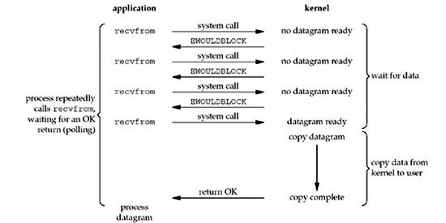

# 集合框架

# 网络基础

## 网络基础

在互联网上之间的通信交流，一般是基于 TCP (Transmission Control Protocol，传输控制协议) 或者 UDP (User Datagram Protocol，用户数据报协议) ，如下图：


编写 Java 应用，我们只需关注于应用层 （application layer），而不用关心 TCP 和 UDP 所在的传输层是如何实现的。java.net 包含了你编程所需的类，这些类是与操作系统无关的。比如 URL, URLConnection, Socket, 和 ServerSocket 类是使用 TCP 连接网络的， DatagramPacket, DatagramSocket, 和 MulticastSocket 类是用于 UDP 的。

Java 支持的协议只有 TCP 和 UDP ，以及在建立在 TCP 和 UDP 之上其他应用层协议。所有其他传输层、网际层和更底层的协议，如 ICMP、IGMP、ARP、RARP、RSVP 和其他协议 在 Java 中只能链接到原生代码来实现。

## TCP

TCP (Transmission Control Protocol) 是面向连接的、提供端到端可靠的数据流(flow of data)。TCP 提供超时重发，丢弃重复数据，检验数据，流量控制等功能，保证数据能从一端传到另一端。

“面向连接”就是在正式通信前必须要与对方建立起连接。这一过程与打电话很相似，先拨号振铃，等待对方摘机说“喂”，然后才说明是谁。

### 三次握手

TCP 是基于连接的协议，也就是说，在正式收发数据前，必须和对方建立可靠的连接。一个 TCP 连接必须要经过三次“握手”才能建立起来，简单的讲就是：

1.  主机 A 向主机 B 发出连接请求数据包：“我想给你发数据，可以吗？”；
2.  主机 B 向主机 A 发送同意连接和要求同步（同步就是两台主机一个在发送，一个在接收，协调工作）的数据包：“可以，你来吧”；
3.  主机 A 再发出一个数据包确认主机 B 的要求同步：“好的，我来也，你接着吧！”

三次“握手”的目的是使数据包的发送和接收同步，经过三次“对话”之后，主机 A 才向主机 B 正式发送数据。

可以详见[《TCP 协议的三次握手、四次分手》](http://www.waylau.com/tcp-connect-and-close/)

### 如何保证数据的可靠

TCP 通过下列方式来提供可靠性：

*   应用数据被分割成 TCP 认为最适合发送的数据块。这和 UDP 完全不同，应用程序产生的数据报长度将保持不变。由 TCP 传递给 IP 的信息单位称为报文段或段（segment）。
*   当 TCP 发出一个段后，它启动一个定时器，等待目的端确认收到这个报文段。如果不能及时收到一个确认，将重发这个报文段。（可自行了解 TCP 协议中自适应的超时及重传策略）。
*   当 TCP 收到发自 TCP 连接另一端的数据，它将发送一个确认。这个确认不是立即发送，通常将推迟几分之一秒。
*   TCP 将保持它首部和数据的检验和。这是一个端到端的检验和，目的是检测数据在传输过程中的任何变化。如果收到段的检验和有差错， TCP 将丢弃这个报文段和不确认收到此报文段（希望发送端超时并重发）。
*   既然 TCP 报文段作为 IP 数据报来传输，而 IP 数据报的到达可能会失序，因此 TCP 报文段的到达也可能会失序。如果必要， TCP 将对收到的数据进行重新排序，将收到的数据以正确的顺序交给应用层。
*   既然 IP 数据报会发生重复， TCP 的接收端必须丢弃重复的数据。
*   TCP 还能提供流量控制。TCP 连接的每一方都有固定大小的缓冲空间。 TCP 的接收端只允许另一端发送接收端缓冲区所能接纳的数据。这将防止较快主机致使较慢主机的缓冲区溢出。

## UDP

UDP (User Datagram Protocol) 不是面向连接的，主机发送独立的数据报（datagram）给其他主机，不保证数据到达。由于 UDP 在传输数据报前不用在客户和服务器之间建立一个连接，且没有超时重发等机制，故而传输速度很快。

而无连接是一开始就发送信息（严格说来，这是没有开始、结束的），只是一次性的传递，是先不需要接受方的响应，因而在一定程度上也无法保证信息传递的可靠性了，就像写信一样，我们只是将信寄出去，却不能保证收信人一定可以收到。

### TCP 和 UDP 如何抉择

TCP 是面向连接的，有比较高的可靠性， 一些要求比较高的服务一般使用这个协议，如 FTP、Telnet、SMTP、HTTP、POP3 等，而 UDP 是面向无连接的，使用这个协议的常见服务有 DNS、SNMP、QQ 等。对于 QQ 必须另外说明一下，QQ2003 以前是只使用 UDP 协议的，其服务器使用 8000 端口，侦听是否有信息传来，客户端使用 4000 端口，向外发送信息（这也就不难理解在一般的显 IP 的 QQ 版本中显示好友的 IP 地址信息中端口常为 4000 或其后续端口的原因了），即 QQ 程序既接受服务又提供服务，在以后的 QQ 版本中也支持使用 TCP 协议了。

## 端口

一般来说，一台计算机具有单个物理连接到网络。数据通过这个连接去往特定的计算机。然而，该数据可以被用于在计算机上运行的不同应用。那么，计算机知道哪个应用程序转发数据？通过使用端口。

在互联网上传输的数据是通过计算机的标识和端口来定位的。计算机的标识是 32-bit 的 IP 地址。端口由一个 16-bit 的数字。

在诸如面向连接的通信如 TCP，服务器应用将套接字绑定到一个特定端口号。这是向系统注册服务用来接受该端口的数据。然后，客户端可以在与服务器在服务器端口会合，如下图所示：


TCP 和 UDP 协议使用的端口来将接收到的数据映射到一个计算机上运行的进程。

在基于数据报的通信，如 UDP，数据报包中包含它的目的地的端口号，然后 UDP 将数据包路由到相应的应用程序，如本图所示的端口号：


端口号取值范围是从 0 到 65535 （因为是 16-bit 长度数字），其中范围从 0 到 1023 是受限的，它们是被知名的服务所保留使用，例如 HTTP （端口是 80）和 FTP （端口是 20、21）等系统服务。这些端口被称为众所周知的端口（well-known ports）。您的应用程序不应该试图绑定到他们。[Service Name and Transport Protocol Port Number Registry](http://www.iana.org/assignments/service-names-port-numbers/service-names-port-numbers.xhtml)提供了各种常用的已经分配的端口号列表

# Socket

## 什么是 Socket

Socket（套接字）：是在网络上运行两个程序之间的双向通信链路的一个端点。socket 绑定到一个端口号，使得 TCP 层可以标识数据最终要被发送到哪个应用程序。

正常情况下，一台服务器在特定计算机上运行，并具有被绑定到特定端口号的 socket。服务器只是等待，并监听用于客户发起的连接请求的 socket 。

在客户端：客户端知道服务器所运行的主机名称以及服务器正在侦听的端口号。建立连接请求时，客户端尝试与主机服务器和端口会合。客户端也需要在连接中将自己绑定到本地端口以便于给服务器做识别。本地端口号通常是由系统分配的。


如果一切顺利的话，服务器接受连接。一旦接受，服务器获取绑定到相同的本地端口的新 socket ，并且还具有其远程端点设定为客户端的地址和端口。它需要一个新的 socket，以便它可以继续监听原来用于客户端连接请求的 socket 。


在客户端，如果连接被接受，则成功地创建一个套接字和客户端可以使用该 socket 与服务器进行通信。

客户机和服务器现在可以通过 socket 写入或读取来交互了。

端点是 IP 地址和端口号的组合。每个 TCP 连接可以通过它的两个端点被唯一标识。这样，你的主机和服务器之间可以有多个连接。

java.net 包中提供了一个类 Socket，实现您的 Java 程序和网络上的其他程序之间的双向连接。 Socket 类隐藏任何特定系统的细节。通过使用 java.net.Socket 类，而不是依赖于原生代码，Java 程序可以用独立于平台的方式与网络进行通信。

此外，java.net 包含了 ServerSocket 类，它实现了服务器的 socket 可以侦监听和接受客户端的连接。下文将展示如何使用 Socket 和 ServerSocket 类。

## 实现一个 echo 服务器

让我们来看看这个例子，程序可以建立使用 Socket 类连接到服务器程序，客户端可以通过 socket 向服务器发送数据和接收数据。

EchoClient 示例程序实现了一个客户端，连接到回声服务器。回声服务器从它的客户端接收数据并原样返回回来。EchoServer 实现了 echo 服务器。 （客户端可以连接到支持 [Echo 协议](http://tools.ietf.org/html/rfc862)的任何主机）

EchoClient 创建一个 socket，从而得到回声服务器的连接。它从标准输入流中读取用户输入，然后通过 socket 转发该文本给回声服务器。服务器通过该 socket 将文本原样输入回给客户端。客户机程序读取并显示从服务器传递回给它的数据。

注意，EchoClient 例子既从 socket 写入又从 socket 中读取数据。

EchoClient 代码：

```java
public class EchoClient {
    public static void main(String[] args) throws IOException {

        if (args.length != 2) {
            System.err.println(
                "Usage: java EchoClient <host name> <port number>");
            System.exit(1);
        }

        String hostName = args[0];
        int portNumber = Integer.parseInt(args[1]);

        try (
            Socket echoSocket = new Socket(hostName, portNumber);
            PrintWriter out =
                new PrintWriter(echoSocket.getOutputStream(), true);
            BufferedReader in =
                new BufferedReader(
                    new InputStreamReader(echoSocket.getInputStream()));
            BufferedReader stdIn =
                new BufferedReader(
                    new InputStreamReader(System.in))
        ) {
            String userInput;
            while ((userInput = stdIn.readLine()) != null) {
                out.println(userInput);
                System.out.println("echo: " + in.readLine());
            }
        } catch (UnknownHostException e) {
            System.err.println("Don't know about host " + hostName);
            System.exit(1);
        } catch (IOException e) {
            System.err.println("Couldn't get I/O for the connection to " +
                hostName);
            System.exit(1);
        } 
    }
} 
```

EchoServer 代码：

```java
public class EchoServer {
    public static void main(String[] args) throws IOException {

        if (args.length != 1) {
            System.err.println("Usage: java EchoServer <port number>");
            System.exit(1);
        }

        int portNumber = Integer.parseInt(args[0]);

        try (
            ServerSocket serverSocket =
                new ServerSocket(Integer.parseInt(args[0]));
            Socket clientSocket = serverSocket.accept();     
            PrintWriter out =
                new PrintWriter(clientSocket.getOutputStream(), true);                   
            BufferedReader in = new BufferedReader(
                new InputStreamReader(clientSocket.getInputStream()));
        ) {
            String inputLine;
            while ((inputLine = in.readLine()) != null) {
                out.println(inputLine);
            }
        } catch (IOException e) {
            System.out.println("Exception caught when trying to listen on port "
                + portNumber + " or listening for a connection");
            System.out.println(e.getMessage());
        }
    }
} 
```

首先启动服务器，在命令行输入如下，设定一个端口号，比如 7（Echo 协议指定端口是 7）：

```java
java EchoServer 7 
```

而后启动客户端，echoserver.example.com 是你主机的名称，如果是本机的话，主机名称可以是 localhost

```java
java EchoClient echoserver.example.com 7 
```

输出效果如下：

```java
你好吗？
echo: 你好吗？
我很好哦
echo: 我很好哦
要过年了，www.waylau.com 祝你 猴年大吉，身体健康哦！
echo: 要过年了，www.waylau.com 祝你 猴年大吉，身体健康哦！ 
```

# I/O 模型的演进

什么是同步？什么是异步？阻塞和非阻塞又有什么区别？本文先从 Unix 的 I/O 模型讲起，介绍了 5 种常见的 I/O 模型。而后再引出 Java 的 I/O 模型的演进过程，并用实例说明如何选择合适的 Java I/O 模型来提高系统的并发量和可用性。

由于，Java 的 I/O 依赖于操作系统的实现，所以先了解 Unix 的 I/O 模型有助于理解 Java 的 I/O。

## 相关概念

### 同步和异步

描述的是用户线程与内核的交互方式：

*   **同步**是指用户线程发起 I/O 请求后需要等待或者轮询内核 I/O 操作完成后才能继续执行；
*   **异步**是指用户线程发起 I/O 请求后仍继续执行，当内核 I/O 操作完成后会通知用户线程，或者调用用户线程注册的回调函数。

### 阻塞和非阻塞

描述的是用户线程调用内核 I/O 操作的方式：

*   **阻塞**是指 I/O 操作需要彻底完成后才返回到用户空间；
*   **非阻塞**是指 I/O 操作被调用后立即返回给用户一个状态值，无需等到 I/O 操作彻底完成。

一个 I/O 操作其实分成了两个步骤：发起 I/O 请求和实际的 I/O 操作。 阻塞 I/O 和非阻塞 I/O 的区别在于第一步，发起 I/O 请求是否会被阻塞，如果阻塞直到完成那么就是传统的阻塞 I/O ，如果不阻塞，那么就是非阻塞 I/O 。 同步 I/O 和异步 I/O 的区别就在于第二个步骤是否阻塞，如果实际的 I/O 读写阻塞请求进程，那么就是同步 I/O 。

## Unix I/O 模型

Unix 下共有五种 I/O 模型：

1.  阻塞 I/O
2.  非阻塞 I/O
3.  I/O 多路复用（select 和 poll）
4.  信号驱动 I/O（SIGIO）
5.  异步 I/O（Posix.1 的 aio_ 系列函数）

### 阻塞 I/O

请求无法立即完成则保持阻塞。

*   阶段 1：等待数据就绪。网络 I/O 的情况就是等待远端数据陆续抵达；磁盘 I/O 的情况就是等待磁盘数据从磁盘上读取到内核态内存中。
*   阶段 2：数据拷贝。出于系统安全,用户态的程序没有权限直接读取内核态内存,因此内核负责把内核态内存中的数据拷贝一份到用户态内存中。


### 非阻塞 I/O

*   socket 设置为 NONBLOCK（非阻塞）就是告诉内核，当所请求的 I/O 操作无法完成时，不要将进程睡眠，而是返回一个错误码(EWOULDBLOCK) ，这样请求就不会阻塞
*   I/O 操作函数将不断的测试数据是否已经准备好，如果没有准备好，继续测试，直到数据准备好为止。整个 I/O 请求的过程中，虽然用户线程每次发起 I/O 请求后可以立即返回，但是为了等到数据，仍需要不断地轮询、重复请求，消耗了大量的 CPU 的资源
*   数据准备好了，从内核拷贝到用户空间。



一般很少直接使用这种模型，而是在其他 I/O 模型中使用非阻塞 I/O 这一特性。这种方式对单个 I/O 请求意义不大,但给 I/O 多路复用铺平了道路.

### I/O 多路复用（异步阻塞 I/O）

I/O 多路复用会用到 select 或者 poll 函数，这两个函数也会使进程阻塞，但是和阻塞 I/O 所不同的的，这两个函数可以同时阻塞多个 I/O 操作。而且可以同时对多个读操作，多个写操作的 I/O 函数进行检测，直到有数据可读或可写时，才真正调用 I/O 操作函数。


从流程上来看，使用 select 函数进行 I/O 请求和同步阻塞模型没有太大的区别，甚至还多了添加监视 socket，以及调用 select 函数的额外操作，效率更差。但是，使用 select 以后最大的优势是用户可以在一个线程内同时处理多个 socket 的 I/O 请求。用户可以注册多个 socket，然后不断地调用 select 读取被激活的 socket，即可达到在同一个线程内同时处理多个 I/O 请求的目的。而在同步阻塞模型中，必须通过多线程的方式才能达到这个目的。

I/O 多路复用模型使用了 Reactor 设计模式实现了这一机制。

调用 select / poll 该方法由一个用户态线程负责轮询多个 socket,直到某个阶段 1 的数据就绪,再通知实际的用户线程执行阶段 2 的拷贝。 通过一个专职的用户态线程执行非阻塞 I/O 轮询,模拟实现了阶段一的异步化

### 信号驱动 I/O（SIGIO）

首先我们允许 socket 进行信号驱动 I/O,并安装一个信号处理函数，进程继续运行并不阻塞。当数据准备好时，进程会收到一个 SIGIO 信号，可以在信号处理函数中调用 I/O 操作函数处理数据。


### 异步 I/O

调用 aio_read 函数，告诉内核描述字，缓冲区指针，缓冲区大小，文件偏移以及通知的方式，然后立即返回。当内核将数据拷贝到缓冲区后，再通知应用程序。


异步 I/O 模型使用了 Proactor 设计模式实现了这一机制。

告知内核,当整个过程(包括阶段 1 和阶段 2)全部完成时,通知应用程序来读数据.

## 几种 I/O 模型的比较

前四种模型的区别是阶段 1 不相同，阶段 2 基本相同，都是将数据从内核拷贝到调用者的缓冲区。而异步 I/O 的两个阶段都不同于前四个模型。

同步 I/O 操作引起请求进程阻塞，直到 I/O 操作完成。异步 I/O 操作不引起请求进程阻塞。


## 常见 Java I/O 模型

在了解了 UNIX 的 I/O 模型之后，其实 Java 的 I/O 模型也是类似。

## “阻塞 I/O”模式

在上一节 Socket 章节中的 EchoServer 就是一个简单的阻塞 I/O 例子，服务器启动后，等待客户端连接。在客户端连接服务器后，服务器就阻塞读写取数据流。

EchoServer 代码：

```java
public class EchoServer {
    public static int DEFAULT_PORT = 7;

    public static void main(String[] args) throws IOException {

        int port;

        try {
            port = Integer.parseInt(args[0]);
        } catch (RuntimeException ex) {
            port = DEFAULT_PORT;
        }

        try (
            ServerSocket serverSocket =
                new ServerSocket(port);
            Socket clientSocket = serverSocket.accept();     
            PrintWriter out =
                new PrintWriter(clientSocket.getOutputStream(), true);                   
            BufferedReader in = new BufferedReader(
                new InputStreamReader(clientSocket.getInputStream()));
        ) {
            String inputLine;
            while ((inputLine = in.readLine()) != null) {
                out.println(inputLine);
            }
        } catch (IOException e) {
            System.out.println("Exception caught when trying to listen on port "
                + port + " or listening for a connection");
            System.out.println(e.getMessage());
        }
    }
} 
```

## 改进为“阻塞 I/O+多线程”模式

使用多线程来支持多个客户端来访问服务器。

主线程 MultiThreadEchoServer.java

```java
public class MultiThreadEchoServer {
    public static int DEFAULT_PORT = 7;

    public static void main(String[] args) throws IOException {

        int port;

        try {
            port = Integer.parseInt(args[0]);
        } catch (RuntimeException ex) {
            port = DEFAULT_PORT;
        }
        Socket clientSocket = null;
        try (ServerSocket serverSocket = new ServerSocket(port);) {
            while (true) {
                clientSocket = serverSocket.accept();

                // MultiThread
                new Thread(new EchoServerHandler(clientSocket)).start();
            }
        } catch (IOException e) {
            System.out.println(
                    "Exception caught when trying to listen on port " + port + " or listening for a connection");
            System.out.println(e.getMessage());
        }
    }
} 
```

处理器类 EchoServerHandler.java

```java
public class EchoServerHandler implements Runnable {
    private Socket clientSocket;

    public EchoServerHandler(Socket clientSocket) {
        this.clientSocket = clientSocket;
    }

    @Override
    public void run() {
        try (PrintWriter out = new PrintWriter(clientSocket.getOutputStream(), true);
                BufferedReader in = new BufferedReader(new InputStreamReader(clientSocket.getInputStream()));) {

            String inputLine;
            while ((inputLine = in.readLine()) != null) {
                out.println(inputLine);
            }
        } catch (IOException e) {
            System.out.println(e.getMessage());
        }
    }
} 
```

**存在问题**：每次接收到新的连接都要新建一个线程，处理完成后销毁线程，代价大。当有大量地短连接出现时，性能比较低。

## 改进为“阻塞 I/O+线程池”模式

针对上面多线程的模型中，出现的线程重复创建、销毁带来的开销，可以采用线程池来优化。每次接收到新连接后从池中取一个空闲线程进行处理，处理完成后再放回池中，重用线程避免了频率地创建和销毁线程带来的开销。

主线程 ThreadPoolEchoServer.java

```java
public class ThreadPoolEchoServer {
    public static int DEFAULT_PORT = 7;

    public static void main(String[] args) throws IOException {

        int port;

        try {
            port = Integer.parseInt(args[0]);
        } catch (RuntimeException ex) {
            port = DEFAULT_PORT;
        }
        ExecutorService threadPool = Executors.newFixedThreadPool(5);
        Socket clientSocket = null;
        try (ServerSocket serverSocket = new ServerSocket(port);) {
            while (true) {
                clientSocket = serverSocket.accept();

                // Thread Pool
                threadPool.submit(new Thread(new EchoServerHandler(clientSocket)));
            }
        } catch (IOException e) {
            System.out.println(
                    "Exception caught when trying to listen on port " + port + " or listening for a connection");
            System.out.println(e.getMessage());
        }
    }
} 
```

**存在问题**：在大量短连接的场景中性能会有提升，因为不用每次都创建和销毁线程，而是重用连接池中的线程。但在大量长连接的场景中，因为线程被连接长期占用，不需要频繁地创建和销毁线程，因而没有什么优势。

## 改进为“非阻塞 I/O”模式

"阻塞 I/O+线程池"网络模型虽然比"阻塞 I/O+多线程"网络模型在性能方面有提升，但这两种模型都存在一个共同的问题：读和写操作都是同步阻塞的,面对大并发（持续大量连接同时请求）的场景，需要消耗大量的线程来维持连接。CPU 在大量的线程之间频繁切换，性能损耗很大。一旦单机的连接超过 1 万，甚至达到几万的时候，服务器的性能会急剧下降。

而 NIO 的 Selector 却很好地解决了这个问题，用主线程（一个线程或者是 CPU 个数的线程）保持住所有的连接，管理和读取客户端连接的数据，将读取的数据交给后面的线程池处理，线程池处理完业务逻辑后，将结果交给主线程发送响应给客户端，少量的线程就可以处理大量连接的请求。

Java NIO 由以下几个核心部分组成：

*   Channel
*   Buffer
*   Selector

要使用 Selector，得向 Selector 注册 Channel，然后调用它的 select()方法。这个方法会一直阻塞到某个注册的通道有事件就绪。一旦这个方法返回，线程就可以处理这些事件，事件的例子有如新连接进来，数据接收等。

主线程 NonBlokingEchoServer.java

```java
public class NonBlokingEchoServer {
    public static int DEFAULT_PORT = 7;

    public static void main(String[] args) throws IOException {

        int port;

        try {
            port = Integer.parseInt(args[0]);
        } catch (RuntimeException ex) {
            port = DEFAULT_PORT;
        }
        System.out.println("Listening for connections on port " + port);

        ServerSocketChannel serverChannel;
        Selector selector;
        try {
            serverChannel = ServerSocketChannel.open();
            InetSocketAddress address = new InetSocketAddress(port);
            serverChannel.bind(address);
            serverChannel.configureBlocking(false);
            selector = Selector.open();
            serverChannel.register(selector, SelectionKey.OP_ACCEPT);
        } catch (IOException ex) {
            ex.printStackTrace();
            return;
        }

        while (true) {
            try {
                selector.select();
            } catch (IOException ex) {
                ex.printStackTrace();
                break;
            }
            Set<SelectionKey> readyKeys = selector.selectedKeys();
            Iterator<SelectionKey> iterator = readyKeys.iterator();
            while (iterator.hasNext()) {
                SelectionKey key = iterator.next();
                iterator.remove();
                try {
                    if (key.isAcceptable()) {
                        ServerSocketChannel server = (ServerSocketChannel) key.channel();
                        SocketChannel client = server.accept();
                        System.out.println("Accepted connection from " + client);
                        client.configureBlocking(false);
                        SelectionKey clientKey = client.register(selector,
                                SelectionKey.OP_WRITE | SelectionKey.OP_READ);
                        ByteBuffer buffer = ByteBuffer.allocate(100);
                        clientKey.attach(buffer);
                    }
                    if (key.isReadable()) {
                        SocketChannel client = (SocketChannel) key.channel();
                        ByteBuffer output = (ByteBuffer) key.attachment();
                        client.read(output);
                    }
                    if (key.isWritable()) {
                        SocketChannel client = (SocketChannel) key.channel();
                        ByteBuffer output = (ByteBuffer) key.attachment();
                        output.flip();
                        client.write(output);

                        output.compact();
                    }
                } catch (IOException ex) {
                    key.cancel();
                    try {
                        key.channel().close();
                    } catch (IOException cex) {
                    }
                }
            }
        }

    }
} 
```

## 改进为“异步 I/O”模式

Java SE 7 版本之后，引入了异步 I/O （NIO.2） 的支持，为构建高性能的网络应用提供了一个利器。

主线程 AsyncEchoServer.java

```java
public class AsyncEchoServer {

    public static int DEFAULT_PORT = 7;

    public static void main(String[] args) throws IOException {
        int port;

        try {
            port = Integer.parseInt(args[0]);
        } catch (RuntimeException ex) {
            port = DEFAULT_PORT;
        }

        ExecutorService taskExecutor = Executors.newCachedThreadPool(Executors.defaultThreadFactory());
        // create asynchronous server socket channel bound to the default group
        try (AsynchronousServerSocketChannel asynchronousServerSocketChannel = AsynchronousServerSocketChannel.open()) {
            if (asynchronousServerSocketChannel.isOpen()) {
                // set some options
                asynchronousServerSocketChannel.setOption(StandardSocketOptions.SO_RCVBUF, 4 * 1024);
                asynchronousServerSocketChannel.setOption(StandardSocketOptions.SO_REUSEADDR, true);
                // bind the server socket channel to local address
                asynchronousServerSocketChannel.bind(new InetSocketAddress(port));
                // display a waiting message while ... waiting clients
                System.out.println("Waiting for connections ...");
                while (true) {
                    Future<AsynchronousSocketChannel> asynchronousSocketChannelFuture = asynchronousServerSocketChannel
                            .accept();
                    try {
                        final AsynchronousSocketChannel asynchronousSocketChannel = asynchronousSocketChannelFuture
                                .get();
                        Callable<String> worker = new Callable<String>() {
                            @Override
                            public String call() throws Exception {
                                String host = asynchronousSocketChannel.getRemoteAddress().toString();
                                System.out.println("Incoming connection from: " + host);
                                final ByteBuffer buffer = ByteBuffer.allocateDirect(1024);
                                // transmitting data
                                while (asynchronousSocketChannel.read(buffer).get() != -1) {
                                    buffer.flip();
                                    asynchronousSocketChannel.write(buffer).get();
                                    if (buffer.hasRemaining()) {
                                        buffer.compact();
                                    } else {
                                        buffer.clear();
                                    }
                                }
                                asynchronousSocketChannel.close();
                                System.out.println(host + " was successfully served!");
                                return host;
                            }
                        };
                        taskExecutor.submit(worker);
                    } catch (InterruptedException | ExecutionException ex) {
                        System.err.println(ex);
                        System.err.println("\n Server is shutting down ...");
                        // this will make the executor accept no new threads
                        // and finish all existing threads in the queue
                        taskExecutor.shutdown();
                        // wait until all threads are finished
                        while (!taskExecutor.isTerminated()) {
                        }
                        break;
                    }
                }
            } else {
                System.out.println("The asynchronous server-socket channel cannot be opened!");
            }
        } catch (IOException ex) {
            System.err.println(ex);
        }
    }
} 
```

## 源码

本章例子的源码，可以在 [`github.com/waylau/essential-java`](https://github.com/waylau/essential-java) 中 `com.waylau.essentialjava.net.echo` 包下找到。