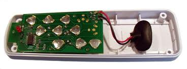
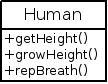

# Java 基础 04 封装与接口 Linux 架构

作者：Vamei 出处：http://www.cnblogs.com/vamei 欢迎转载，也请保留这段声明。谢谢！

总结之前的内容，对象(object)指代某一事物，类(class)指代象的类型。对象可以有状态和动作，即数据成员和方法。

到现在为止，数据成员和方法都是同时开放给内部和外部的。在对象内部，我们利用 this 来调用对象的数据成员和方法。在对象外部，比如当我们在另一个类中调用对象的时，可以使用 对象.数据成员 和 对象.方法() 来调用对象的数据成员和方法。

我们将要封装(encapsulation)对象的成员(成员包括数据成员和方法)，从而只允许从外部调用部分的成员。利用封装，我们可以提高对象的易用性和安全性。

### 封装与接口

封装(encapsulation)是计算机常见的术语，即保留有限的外部接口(interface)，隐藏具体实施细节。比如在[Linux 架构](http://www.cnblogs.com/vamei/archive/2012/09/19/2692452.html)，就可以看到 Linux 操作系统封装了底层硬件的具体细节，只保留了系统调用这一套接口。用户处在封装的外部，只能通过接口，进行所需的操作。

封装在生活中很常见。比如下面是一个充电电筒:


一个用户即使不看说明书，也可以猜到这个电筒的操作: 开关和充电。这个电筒用一个塑料壳将用户不需要接触的内部细节隐藏起来，只保留了两个接口，开关和电插头。使用这两个接口，用户足以使用该产品在设计中想要实现的功能。如果所有的细节都同时暴露给用户，那么用户会对产品感到不知所措 (比如下面不加壳的遥控器)。因此，封装提高了产品的易用性。



如果产品不封装，电筒或者遥控器的许多细节会暴露在用户面前: 电池、电路、密封的橡胶等等。尽管这可以让用户更自由的对产品实施操作，比如直接给电池放电，取出一个 LED 灯等等。然而，用户往往要承担更大的损坏产品的风险。因此，封装提高了产品的安全性。

一个 Java 软件产品与一个日常产品相同。一个对象内部可以有许多成员(数据成员和方法)。有一些数据成员和方法只是内部使用。这时，我们会希望有一个给对象“加壳”的机制，从而封装对象。这样，用户可以比较容易学习和使用外部的接口，而不必接触内部成员。

### 对象成员的封装

Java 通过三个关键字来控制对象的成员的外部可见性(visibility): public, private, protected。

*   public: 该成员外部可见，即该成员为接口的一部分
*   private: 该成员外部不可见，只能用于内部使用，无法从外部访问。

(protected 涉及继承的概念，放在以后说)

我们先来封装以前定义的 Human 类:

```java
public class Test
{
    public static void main(String[] args)
    {
        Human aPerson = new Human(160);
        System.out.println(aPerson.getHeight());
        aPerson.growHeight(170);
        System.out.println(aPerson.getHeight());
        aPerson.repeatBreath(100);
    }

}

class Human
{
    /**
     * constructor
     */
    public Human(int h)
    {
        this.height = h;
        System.out.println("I'm born");
    }

    /**
     * accessor
     */
    public int getHeight()
    {
       return this.height;
    }

    /**
     * mutator
     */
    public void growHeight(int h)
    {
        this.height = this.height + h;
    }

     /**
      * encapsulated, for internal use
      */
    private void breath()
    {
        System.out.println("hu...hu...");
    }

   /**
    * call breath()
    */
    public void repeatBreath(int rep)
    {
        int i;
        for(i = 0; i < rep; i++) {
            this.breath();
        }
    }

    private int height; // encapsulated, for internal use
}
```

内部方法并不受封装的影响。Human 的内部方法可以调用任意成员，即使是设置为 private 的 height 和 breath()

外部方法只能调用 public 成员。当我们在 Human 外部时，比如 Test 中，我们只能调用 Human 中规定为 public 的成员，而不能调用规定为 private 的成员。

通过封装，Human 类就只保留了下面几个方法作为接口:

*   getHeight()
*   growHeight()
*   repBreath()

我们可以将 Human 类及其接口表示为如下图的形式:



“加了壳的遥控器”

如果我们从 main 中强行调用 height:

```java
System.out.println(aPerson.height);
```

将会有如下错误提示:

Test.java:6: height has private access in Human
        System.out.println(aPerson.height);
                                  ^
1 error

Beep, 你触电了！ 一个被说明为 private 的成员，不能被外部调用。

在 Java 的通常规范中，表达状态的数据成员(比如 height)要设置成 private。对数据成员的修改要通过接口提供的方法进行(比如 getHeight()和 growHeight())。这个规范起到了保护数据的作用。用户不能直接修改数据，必须通过相应的方法才能读取和写入数据。类的设计者可以在接口方法中加入数据的使用规范。

### 类的封装

在一个.java 文件中，有且只能有一个类带有 public 关键字，比如上面的 Test 类。所以，从任意其他类中，我们都可以直接调用该类。Human 类没有关键字。更早之前，我们对象的成员也没有关键字。这种没有关键字的情况也代表了一种可见性，我将在包(package)的讲解中深入。

练习 封装一个 Torch 类，来表示电筒。接口有开关和充电。内部的成员有电量。

### 总结

封装，接口

private, public

欢迎继续阅读“[Java 快速教程](http://www.cnblogs.com/vamei/archive/2013/03/31/2991531.html)”系列文章