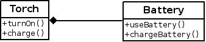

# Java 基础 06 组合从 HelloWorld 到面向对象

作者：Vamei 出处：http://www.cnblogs.com/vamei 欢迎转载，也请保留这段声明。谢谢！

我们已经尝试去定义类。定义类，就是新建了一种类型(type)。有了类，我们接着构造相应类型的对象。更进一步，每个类型还应该有一个清晰的接口(interface)，供用户使用。

我们可以在一个新类的定义中使用其他对象。这就是组合(composition)。组合是在 Java 中实现程序复用(reusibility)的基本手段之一。

### 组合与"has-a"

一个对象是另一个对象的数据成员。比如我们看之前提到的充电电筒的例子:


一个充电电筒中的电池、LED 灯、按钮…… 都可以是一个对象。我们可以定义一个 Battery 类来定义和产生电池对象。而在充电电筒的类定义中，可以用一个电池对象作为其数据成员，来代表电池部分的状态。


我们下面定义一个 Battery 类，并用 power 来表示其电量。一个 Battery 的可以充电(chargeBattery)和使用(useBattery)。我们在随后的 Torch 类定义中使用 Battery 类型的对象作为数据成员:

```java
class Battery 
{
    public void chargeBattery(double p)
    {
        if (this.power < 1.) {
            this.power = this.power + p;
        }
    }

    public boolean useBattery(double p)
    {
        if (this.power >= p) {
            this.power = this.power - p;
            return true;
        }
        else {
            this.power = 0.0;
            return false;
        }
    }

    private double power = 0.0;
}

class Torch
{
    /** 
     * 10% power per hour use
     * warning when out of power
     */
    public void turnOn(int hours)
    {
        boolean usable;
        usable = this.theBattery.useBattery( hours*0.1 );
        if (usable != true) {
            System.out.println("No more usable, must charge!");
        }
    }

    /**
     * 20% power per hour charge
     */
    public void charge(int hours)
    {
        this.theBattery.chargeBattery( hours*0.2 );
    }

    /**
     * composition
     */
    private Battery theBattery = new Battery();
}
```

上面的 new 为 theBattery 对象分配内存，不可或缺。

我们定义 Battery 类。Torch 类使用了一个 Battery 类型的对象(theBattery)来作为数据成员。在 Torch 的方法中，我们通过操纵 theBattery 对象的接口，来实现 Battery 类所提供的功能(functionality)。

我们说，一个 Torch 对象拥有(has-a)一个 Battery 对象。上述关系可以表示成:



has-a: 手电有电池 (注意上面的菱形连线)

通过组合，我们可以复用 Battery 相关的代码。假如我们还有其他使用 Battery 的类，比如手机，计算器，我们都可以将 Battery 对象组合进去。这样就不用为每个类单独编写相关功能了。

我们可以增加一个 Test 类，看看实际效果:

```java
public class Test
{
    public static void main(String[] args)
    {
        Torch aTorch = new Torch();
        System.out.println("Charge: 2 hours");
        aTorch.charge(2);
        System.out.println("First Turn On: 3 hours");
        aTorch.turnOn(3);
        System.out.println("Second Turn On: 3 hours");
        aTorch.turnOn(3);
    }
}
```

上面程序的运行结果:

Charge: 2 hours
First Turn On: 3 hours
Second Turn On: 3 hours
No more usable, must charge!

我们通过组合来使用了电池对象所提供的功能，比如探测电量是否用尽(根据 useBattery()的返回值)。

### 基本类型

在[从 HelloWorld 到面向对象](http://www.cnblogs.com/vamei/archive/2013/03/14/2958654.html)中，我们将 int, float, double, boolean 等称为基本类型(primitive type)，也就是特殊的类。我们可以将一个整数理解称为一个 int 类型的对象。int 类型可以有赋值、加法、减法等操作接口。普通类型可以视作对基本类型的拓展。我们已经见过了基本类型作为数据成员、方法的参数、方法的返回值和方法内部的自动变量。自然的，普通类型的对象，比如 Battery 和 Torch 类的对象，也都可以用于这些地方。

C 语言中，可用的数据类型(基本上)已经预设好，比如 int, float。在 Java 中，我们除了可以用这些预设的数据类型外，还可以通过类来定制自己想要的数据类型，然后通过组合来使用。但基本类型和普通类型还是有所区别的。基本类型经常被使用，且所占据内存空间不大，所以在 Java 中，为了效率起见，这些基本类型与普通的类型(也就是自定义的类)的内存管理方式不同。比如，基本类型一旦声明就会被分配内存空间，而普通类型需要使用 new 关键字来分配内存空间。

Java 为每个基本类型提供了相应的普通类型。比如 int 基本类型对应 Integer 类型。如果将基本类型的对象转成相应的普通类型变量，所谓的基本类型也就成为了一般意义上的类型(不再有内存管理上的不同)。

这样，我们对 Java“一切皆对象”的理念有了更深一步的理解。

### 总结

组合，has-a

基本类型

欢迎继续阅读“[Java 快速教程](http://www.cnblogs.com/vamei/archive/2013/03/31/2991531.html)”系列文章