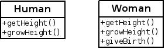
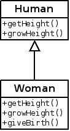
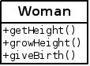
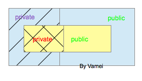
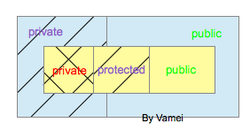

# Java 基础 08 继承

作者：Vamei 出处：http://www.cnblogs.com/vamei 欢迎转载，也请保留这段声明。谢谢！ 

继承(inheritance)是面向对象的重要概念。继承是除组合(composition)之外，提高代码重复可用性(reusibility)的另一种重要方式。我们在[组合(composition)](http://www.cnblogs.com/vamei/archive/2013/03/28/2987456.html)中看到，组合是重复调用对象的功能接口。我们将看到，继承可以重复利用已有的类的定义。

### 类的继承

我们之前定义类的时候，都是从头开始，详细的定义该类的每一个成员。比如下面的 Human 类:

```java
class Human
{   
   /**
     * accessor
     */
    public int getHeight()
    {
       return this.height;
    }

    /**
     * mutator
     */
    public void growHeight(int h)
    {
        this.height = this.height + h;
    }

    /**
     * breath
     */
    public void breath()
    {
        System.out.println("hu...hu...");
    }

    private int height; 
}
```

从上面的类定义，我们可以了解该类的所有细节: 该类的数据成员，该类的方法，该类的接口。

现在要定义一个新的类，比如 Woman 类，并假设 Woman 与 Human 类相当类似：




Human & Woman

我们可以像以前一样，从头开始，完整的定义 Woman 类:

```java
class Woman
{
    /**
     * accessor
     */
    public int getHeight()
    {
       return this.height;
    }

    /**
     * mutator
     */
    public void growHeight(int h)
    {
        this.height = this.height + h;
    }

```

```java
    /**
     * breath
     */
    public void breath()
    {
        System.out.println("hu...hu...");
    }

    /**
     * new method
     */
    public Human giveBirth()
    {
        System.out.println("Give birth");
        return (new Human(20));
    }

    private int height; 
}
```

一个程序员在写上面程序的时候，会有很大的烦恼。许多定义都曾在 Human 类中写过，但我们还要重新敲一遍。Woman 类只新增了一个 giveBirth()方法 (该方法创建并返回一个新的 Human 对象)。

利用继承，我们可以避免上面的重复。让 Woman 类继承自 Human 类，Woman 类就自动拥有了 Human 类中所有 public 成员的功能。

我们用 extends 关键字表示继承:

```java
class Woman extends Human
{
    /**
     * new method
     */
    public Human giveBirth()
    {
        System.out.println("Give birth");
        return (new Human(20));
    }
}
```

这样，我们就省去了大量的输入。通过继承，我们创建了一个新类，叫做衍生类(derived class)。被继承的类(Human)称为基类(base class)。衍生类以基类作为自己定义的基础，并补充基类中没有定义的 giveBirth()方法。继承关系可以表示为:



 继承: 箭头指向基类

可以用以下 Test 类测试:

```java
public class Test
{
    public static void main(String[] args)
    {
        Woman aWoman = new Woman();
        aWoman.growHeight(120);
        System.out.println(aWoman.getHeight());                                             
    }
}
```

### 衍生层

通过继承，我们创建了 Woman 类。整个过程可以分为三个层次: 基类定义，衍生类定义，外部使用。

基类定义的层次就是正常的定义一个类，比如上面的 Human 类定义。

在外部使用者看来(比如 Test 类中创建 Woman 类对象)，衍生类有一个统一的外部接口:

对于外部使用者来说，上述接口就已经足够了。仅从接口看，衍生类也没有什么特别之处。

然而，当程序员在衍生类定义的层次时，就必须要小心:

首先，接口是混合的: getHeight()方法和 growHeight()方法来自基类，giveBirth()方法则是在衍生类内部定义的。

还有更加复杂的地方。我们之前在类的内部可以自由访问类的成员([利用 this 指代对象](http://www.cnblogs.com/vamei/archive/2013/03/25/2964430.html))。然而，当我们在 Woman 类的定义范围内，我们无法访问基类 Human 的 private 成员。我们记得[private 的含义](http://www.cnblogs.com/vamei/archive/2013/03/27/2982209.html): private 的成员仅供该类内部使用。Woman 类是一个不同于 Human 类的新类，所以位于 Human 类的外部。在衍生类中，不能访问基类的 private 成员。

但有趣的是，我们的 growHeight()和 getHeight()方法依然可以运行。这说明基类的 private 成员存在，我们只是不能直接访问。

为了清晰概念，我们需要了解衍生类对象的生成机制。当我们创建一个衍生类的对象时，Java 实际上先创建了一个基类对象(subobject)，并在基类对象的外部(注意，这里是基类对象的外部，衍生类对象的内部)，增加衍生类定义的其他成员，构成一个衍生类对象。外部使用者能看到的，就是基类和衍生类的 public 成员。如下图:



 基类对象与衍生类对象

图中黄色为基类对象。基层的成员之间可以互相访问 (利用 Human 类定义中的 this 指代基类对象)。

蓝色部分为衍生对象新增的内容，我将这部分称为衍生层。蓝色和黄色部分共同构成衍生对象。衍生层的成员可以相互访问(Woman 定义中的 this)。更进一步，我们还可以访问基层中 public 的成员。为此，我们用 super 关键字来指代基类对象，使用 super.member 的方式来表示基层的(public)成员。

当我们位于衍生层时(也就是在定义 Woman 类时)，不能访问红色的基层 private 成员。当我们位于外部时，既不能访问紫色的衍生层 private 成员，也不能访问红色的基层 private 成员。

(衍生层的 private 成员有访问禁忌，所以标为斜线。基层的 private 成员访问禁忌最多，所以标为交叉斜线)

super 和 this 类似，也是隐式参数。我们在类定义的不同层次时，this 会有不同的含义。要小心的使用 this 和 super 关键字。

(Java 并不强制使用 this 和 super。Java 在许多情况下可以自动识别成员的归属。但我觉得这是个好习惯。)

### protected

我们之前介绍了两个访问权限相关的关键字，private 和 public，它们控制了成员的外部可见性。现在，我们介绍一个新的访问权限关键字: protected。

标为 protected 的成员在该类及其衍生类中可见。这个概念很容易理解，就是说，基类的 protected 成员可以被衍生层访问，但不能被外部访问，如下图:



### 方法覆盖

衍生类对象的外部接口最终由基类对象的 public 成员和衍生层的 public 成员共同构成。如果基类 public 成员和衍生层的 public 成员同名，Java 接口中呈现的究竟是哪一个呢?

我们在[构造方法与方法重载](http://www.cnblogs.com/vamei/archive/2013/03/26/2981728.html)中已经提到，Java 是同时通过方法名和参数列表来判断所要调用的方法的。方法是由方法名和参数列表共同决定的。上述问题中，如果只是方法名相同，而参数列表不同，那么两个方法会同时呈现到接口，不会给我们造成困扰。外部调用时，Java 会根据提供的参数，来决定使用哪个方法 (方法重载)。

如果方法名和参数列表都相同呢？ 在衍生层时，我们还可以通过 super 和 this 来确定是哪一个方法。而在外部时，我们呈现的只是统一接口，所以无法同时提供两个方法。这种情况下，Java 会呈现衍生层的方法，而不是基层的方法。

这种机制叫做方法覆盖(method overriding)。方法覆盖可以被很好的利用，用于修改基类成员的方法。比如，在衍生层，也就是定义 Woman 时，可以修改基类提供的 breath()方法:

```java
class Woman extends Human
{/**
     * new method
     */
    public Human giveBirth()
    {
        System.out.println("Give birth");
        return (new Human(20));
    }

    /**
     * override Human.breath()
     */
    public void breath()
    {
        super.breath();
        System.out.println("su...");
    }
}
```

注意，此时我们位于衍生层，依然可以通过 super 来调用基类对象的 breath()方法。当我们外部调用 Woman 类时，由于方法覆盖，就无法再调用基类对象的该方法了。

方法覆盖保持了基类对象的接口，而采用了衍生层的实现。

### 构造方法

在了解了基类对象和衍生层的概念之后，衍生类的构造方法也比较容易理解。

我们要在衍生类的定义中定义与类同名的构造方法。在该构造方法中:

*   由于在创建衍生对象的时候，基类对象先被创建和初始化，所以，基类的构造方法应该先被调用。我们可以使用 super(argument list)的语句，来调用基类的构造方法。
*   基类对象创建之后，开始构建衍生层 (初始化衍生层成员)。这和一般的构建方法相同，参考[构造方法与方法重载](http://www.cnblogs.com/vamei/archive/2013/03/26/2981728.html)

比如下面的程序中，Human 类有一个构造方法:

```java
class Human
{   

```

```java
    /**
     * constructor
     */
    public Human(int h)
    {
        this.height = h;
    }

    /**
     * accessor
     */
    public int getHeight()
    {
       return this.height;
    }

    /**
     * mutator
     */
    public void growHeight(int h)
    {
        this.height = this.height + h;
    }

    /**
     * breath
     */
    public void breath()
    {
        System.out.println("hu...hu...");
    }

    private int height; 
}
```

衍生类 Woman 类的定义及其构造方法:

```java
class Woman extends Human
{
    /**
     * constructor
     */
    public Woman(int h)
    {
        super(h); // base class constructor
        System.out.println("Hello, Pandora!");
    }

    /**
     * new method
     */
    public Human giveBirth()
    {
        System.out.println("Give birth");
        return (new Human(20));
    }

    /**
     * override Human.breath()
     */
    public void breath()
    {
        super.breath();
        System.out.println("su...");
    }
}
```

### 总结

extends

method overriding

protected

super.member, super()

欢迎继续阅读“[Java 快速教程](http://www.cnblogs.com/vamei/archive/2013/03/31/2991531.html)”系列文章