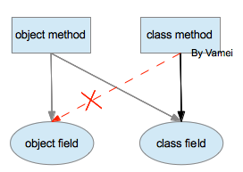

# Java 基础 09 类数据与类方法

作者：Vamei 出处：http://www.cnblogs.com/vamei 欢迎转载，也请保留这段声明。谢谢！

我们一直是为了产生对象而定义类(class)的。对象是具有功能的实体，而类是对象的类型分类。这是面向对象的一个基本概念。

在[继承(inheritance)](http://www.cnblogs.com/vamei/archive/2013/03/29/2982232.html)中，我们将类当做可以拓展的主体，这提高了我们对“类”的认识。

类本身还有许多值得讨论的地方。我们将继续深入。

### static 数据成员

有一些数据用于表述类的状态。比如 Human 类，我们可以用“人口”来表示 Human 类的对象的总数。“人口”直接描述类的状态，而不是某个对象。


Human 类的人口为 8

类的所有对象共享“人口”数据。这样的数据被称为类数据成员(class field)。

在类定义中，我们利用 static 关键字，来声明类数据成员，比如:

```java
class Human
{   
    /**
     * constructor
     */
    public Human(int h)
    {
        this.height = h;
    }

    /**
     * accessor
     */
    public int getHeight()
    {
       return this.height;
    }

    /**
     * mutator
     */
    public void growHeight(int h)
    {
        this.height = this.height + h;
    }

    /**
     * breath
     */
    public void breath()
    {
        System.out.println("hu...hu...");
    }

    private int height; 

    private static int population;
    public static boolean is_mammal = true;

}
```

我们定义了两个类数据成员: population 和 is_mammal。所有 Human 对象都共享一个 population 数据；任意 Human 对象的 is_mammal(是哺乳动物)的属性都为 true。

类数据成员同样要设置访问权限。对于声明为 public 的类数据成员，可以利用 class.field 的方式或者 object.field(如果存在该类的对象)的方式从外部直接访问。这两种访问方式都是合理的，因为类数据成员可以被认为是类的属性，可以认为是所有成员共享的属性。如果类数据成员被定义为 private，那么该类数据成员只能从类的内部访问。

(上面将 is_mammal 设置成了 public，只是为了演示。这样做是挺危险的，万一有人使用 Human.is_mammal=false;，所有人类都遭殃。还是那个基本原则，要尽量将数据设置为 private。)

### static 方法

我们也可以有类方法，也就是声明为 static 的方法。类方法代表了类可以实现的动作，其中的操作不涉及某个具体对象。如果一个方法声明为 static，那么它只能调用 static 的数据和方法，而不能调用非 static 的数据和方法。

事实上，在 static 方法中，将没有隐式传递的 this 和 super 参数。我们无从引用属于对象的数据和方法(这正是我们想要的效果)。

综合上面所说的，我们有如下关系:



红色的虚线表示不能访问。也就是说，类方法中，不能访问对象的数据。

下面我们增加一个 static 方法 getPopulation()，该方法返回 static 数据 population:

```java
class Human
{   
    /**
     * constructor
     */
    public Human(int h)
    {
        this.height = h;
    }

    /**
     * accessor
     */
    public int getHeight()
    {
       return this.height;
    }

    /**
     * mutator
     */
    public void growHeight(int h)
    {
        this.height = this.height + h;
    }

    /**
     * breath
     */
    public void breath()
    {
        System.out.println("hu...hu...");
    }

    private int height; 

    /*
     * static method, access population
     */
    public static int getPopulation()
    {
        return Human.population;
    }

    private static int population;
    private static boolean is_mammal = true;

}
```

调用类方法时，我们可以通过 class.method()的方式调用，也可以通过 object.method()的方式调用。比如使用下面的 Test 类测试:

```java
public class Test
{
    public static void main(String[] args)
    {
        System.out.println(Human.getPopulation());
        Human aPerson = new Human(160);
        System.out.println(aPerson.getPopulation());                     
    }
}
```

我们通过两种方式，在类定义的外部调用了类方法 getPopulation()。

### 对象方法修改类数据

我们看到，对象方法可以访问类数据。这是非常有用的概念。类的状态有可能随着对象而发生变化。比如“人口”，它应该随着一个对象的产生而增加 1。我们可以在对象的方法中修改类的“人口”数据。我们下面在构造方法中访问类数据成员。这里的构造方法是非 static 的方法，即对象的方法:

```java
class Human
{   
    /**
     * constructor
     */
    public Human(int h)
    {
        this.height = h;
        Human.populatin = Human.population + 1;
    }

    /**
     * accessor
     */
    public int getHeight()
    {
       return this.height;
    }

    /**
     * mutator
     */
    public void growHeight(int h)
    {
        this.height = this.height + h;
    }

    /**
     * breath
     */
    public void breath()
    {
        System.out.println("hu...hu...");
    }

    private int height; 

    /*
     * static method, access population
     */
    public static int getPopulation()
    {
        return Human.population;
    }

    private static int population;
    private static boolean is_mammal = true;

}
```

当我们每创建一个对象时，都会通过该对象的构造方法修改类数据，为 population 类数据增加 1。这样，population 就能实时的反映属于该类的对象的总数 (可以在 Test 中创建多个对象，然后打印 Human.population)。

除了上面举的构造方法的例子，我们也可以在普通的对象方法中访问类数据。

### final

final 关键字的基本含义是: 这个数据/方法/类不能被改变了。

*   final 基本类型的数据: 定值 (constant value)，只能赋值一次，不能再被修改。
*   final 方法: 该方法不能被覆盖。private 的方法默认为 final 的方法。
*   final 类: 该类不能被继承。

普通类型的对象也可以有 final 关键字，它表示对象引用(reference)不能再被修改。即该引用只能指向一个对象。但是，对象的内容可以改变 (类似于 C 中的 static 指针)。我们将在以后介绍对象引用。

如果一个基本类型的数据既为 final，也是 static，那么它是只存储了一份的定值。这非常适合于存储一些常量，比如圆周率。

### 总结

static field, static method

class.static_method()

final

欢迎继续阅读“[Java 快速教程](http://www.cnblogs.com/vamei/archive/2013/03/31/2991531.html)”系列文章