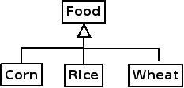

# Java 基础 10 接口的继承与抽象类实施接口实施接口

作者：Vamei 出处：http://www.cnblogs.com/vamei 欢迎转载，也请保留这段声明。谢谢！

在[实施接口](http://www.cnblogs.com/vamei/archive/2013/03/27/2982230.html)中，我们利用 interface 语法，将 interface 从类定义中独立出来，构成一个主体。interface 为类提供了接口规范。

在[继承](http://www.cnblogs.com/vamei/archive/2013/03/29/2982232.html)中，我们为了提高程序的可复用性，引入的继承机制。当时的继承是基于类的。interface 接口同样可以继承，以拓展原 interface。

### 接口继承

接口继承(inheritance)与类继承很类似，就是以被继承的 interface 为基础，增添新增的接口方法原型。比如，我们以 Cup 作为原 interface:

```java
interface Cup {
    void addWater(int w);
    void drinkWater(int w);
}
```

我们在继承 Cup 的基础上，定义一个新的有刻度的杯子的接口，MetricCup


接口如下:

```java
interface MetricCup extends Cup
{
    int WaterContent();
}
```

我们增添了一个新的方法原型 WaterContent()，这个方法返回一个整数(水量)。

### interface 的多重继承

在 Java 类的继承中，一个衍生类只能有一个基类。也就是说，一个类不能同时继承多于一个的类。在 Java 中，interface 可以同时继承多于一个 interface，这叫做多重继承(multiple inheritance)。

比如我们有下面一个 Player 接口:

```java
interface Player
{
    void play();
}
```

我们新增一个 MusicCup 的接口。它既有 Cup 接口，又有 Player 接口，并增加一个 display()方法原型。

```java
interface MusicCup extends Cup, Player 
{
    void display();
}
```

(如何使用 interface，见[实施接口](http://www.cnblogs.com/vamei/archive/2013/03/27/2982230.html))

### 抽象类

在生活中，我们会有一些很抽象的概念。这些抽象的概念往往是许多类的集合，比如:

*   粮食 (可以是玉米、小麦、大米)
*   图形 (可以是三角形、圆形、正方形)

再比如，我们之前举出了例子:

*   人类 (可以是男人、女人)

在组织这样的关系时，我们可以使用继承，比如:



根据我们的常识:

*   "Food 类的对象"的说法是抽象的。这样一个对象应该是属于 Corn, Rice, Wheat 子类中的一个。
*   Food 类有 eat()方法 (食物可以吃)。然而，这样的一个动作是抽象的。粮食的具体吃法是不同的。比如 Corn 需要剥皮吃，Wheat 要磨成面粉吃。我们需要在每个类中覆盖 Food 类的 eat()方法。


抽象与具体

Java 中提供了抽象类(abstract class)的语法，用于说明类及其方法的抽象性。比如:

```java
abstract class Food {
    public abstract void eat();
    public void happyFood();
    {
        System.out.println("Good! Eat Me!");
    }
}
```

类中的方法可以声明为 abstract，比如上面的 eat()。这时，我们不需要具体定义方法，只需要提供该方法的原型。这与接口类似。当我们在比如 Corn 类中继承该类时，需要提供 eat()方法的具体定义。

类中的另一个方法 happyFood()并不是

当一个类中出现 abstract 方法时，这个类的声明必须加上 abstract 关键字，否则 Java 将报错。一个 abstract 类不能用于创建对象。

### 抽象类的继承

我们可以像继承类那样继承一个抽象类。我们必须用完整的方法定义，来覆盖抽象类中的抽象方法，否则，衍生类依然是一个抽象类。

抽象类的定义中可以有数据成员。数据成员的继承与正常类的继承相同。

### 总结

interface 继承，多重继承

abstract method, abstract 类

欢迎继续阅读“[Java 快速教程](http://www.cnblogs.com/vamei/archive/2013/03/31/2991531.html)”系列文章