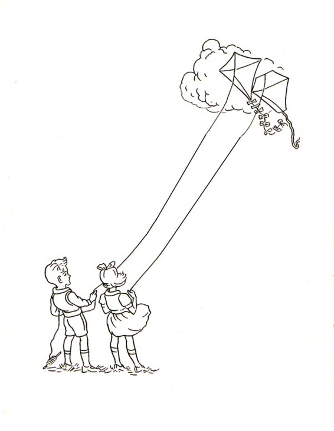
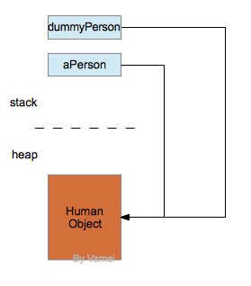
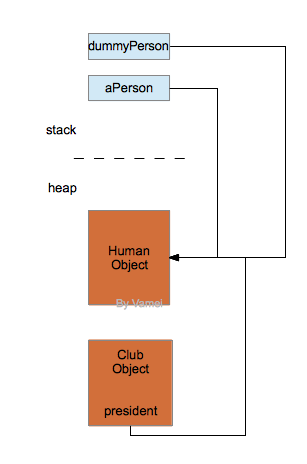

# Java 基础 11 对象引用 Linux 从程序到进程

作者：Vamei 出处：http://www.cnblogs.com/vamei 欢迎转载，也请保留这段声明。谢谢！

我们之前一直在使用“对象”这个概念，但没有探讨对象在内存中的具体存储方式。这方面的讨论将引出“对象引用”(object reference)这一重要概念。

### 对象引用

我们沿用之前定义的 Human 类，并有一个 Test 类:

```java
public class Test
{
    public static void main(String[] args)
    {
        Human aPerson = new Human(160);                 
    }
}

class Human
{   
    /**
     * constructor
     */
    public Human(int h)
    {
        this.height = h;
    }

    /**
     * accessor
     */
    public int getHeight()
    {
       return this.height;
    }

    /**
     * mutator
     */
    public void growHeight(int h)
    {
        this.height = this.height + h;
    }

    private int height;
}
```

外部可以调用类来创建对象，比如上面在 Test 类中:

```java
Human aPerson = new Human(160);
```

创建了一个 Human 类的对象 aPerson。

上面是一个非常简单的表述，但我们有许多细节需要深入:

1.  首先看等号的右侧。new 是在内存中为对象开辟空间。具体来说，new 是在内存的堆(heap)上为对象开辟空间。这一空间中，保存有对象的数据和方法。
2.  再看等号的左侧。aPerson 指代一个 Human 对象，被称为对象引用(reference)。实际上，aPerson 并不是对象本身，而是类似于一个指向对象的指针。aPerson 存在于内存的栈(stack)中。
3.  当我们用等号赋值时，是将右侧 new 在堆中创建对象的地址赋予给对象引用。

这里的内存，指的是 JVM (Java Virtual Machine)虚拟出来的 Java 进程内存空间。内存的堆和栈概念可参考[Linux 从程序到进程](http://www.cnblogs.com/vamei/archive/2012/10/09/2715388.html)。


对象引用

栈的读取速度比堆快，但栈上存储的数据受到有效范围的限制。在 C 语言中，当一次函数调用结束时，相应的栈帧(stack frame)要删除，栈帧上存储的参量和自动变量就消失了。Java 的栈也受到同样的限制，当一次方法调用结束，该方法存储在栈上的数据将清空。在 Java 中，所有的(普通)对象都储存在堆上。因此，new 关键字的完整含义是，在堆上创建对象。

基本类型(primitive type)的对象，比如 int, double，保存在栈上。当我们声明基本类型时，不需要 new。一旦声明，Java 将在栈上直接存储基本类型的数据。所以，基本类型的变量名表示的是数据本身，不是引用。

引用和对象的关系就像风筝和人。我们看天空时(程序里写的)，看到的是风筝(引用)，但风筝下面对应的，是人(对象):



引用和对象分离；引用指向对象

尽管引用和对象是分离的，但我们所有通往对象的访问必须经过引用这个“大门”，比如以 引用.方法() 的方式访问对象的方法。在 Java 中，我们不能跳过引用去直接接触对象。再比如，对象 a 的数据成员如果是一个普通对象 b，a 的数据成员保存的是指向对象 b 的引用 (如果是基本类型变量，那么 a 的数据成员保存的是基本类型变量本身了)。

在 Java 中，引用起到了指针的作用，但我们不能直接修改指针的值，比如像 C 语言那样将指针值加 1。我们只能通过引用执行对对象的操作。这样的设计避免了许多指针可能引起的错误。

### 引用的赋值

当我们将一个引用赋值给另一个引用时，我们实际上复制的是对象的地址。两个引用将指向同一对象。比如 dummyPerson=aPerson;，将导致:



一个对象可以有多个引用 (一个人可以放多个风筝)。当程序通过某个引用修改对象时，通过其他引用也可以看到该修改。我们可以用以下 Test 类来测试实际效果:

```java
public class Test
{
    public static void main(String[] args)
        {
             Human aPerson = new Human(160);
             Human dummyPerson = aPerson;
             System.out.println(dummyPerson.getHeight());
             aPerson.growHeight(20);
             System.out.println(dummyPerson.getHeight());
        }
}
```

我们对 aPerson 的修改将影响到 dummyPerson。这两个引用实际上指向同一对象。

所以，将一个引用赋值给另一个引用，并不能复制对象本身。我们必须寻求其他的机制来复制对象。

### 垃圾回收

随着方法调用的结束，引用和基本类型变量会被清空。由于对象存活于堆，所以对象所占据的内存不会随着方法调用的结束而清空。进程空间可能很快被不断创建的对象占满。Java 内建有垃圾回收(garbage collection)机制，用于清空不再使用的对象，以回收内存空间。

垃圾回收的基本原则是，当存在引用指向某个对象时，那么该对象不会被回收; 当没有任何引用指向某个对象时，该对象被清空。它所占据的空间被回收。

 上图假设了某个时刻 JVM 中的内存状态。Human Object 有三个引用: 来自栈的 aPerson 和 dummyPerson，以及另一个对象的数据成员 president。而 Club Object 没有引用。如果这个时候垃圾回收启动，那么 Club Object 将被清空，而 Human Object 来自 Club Object 的引用(president)也随之被删除。

垃圾回收是 Java 中重要的机制，它直接影响了 Java 的运行效率。我将在以后深入其细节。

### 参数传递

当我们分离了引用和对象的概念后，Java 方法的参数传递机制实际上非常清晰: Java 的参数传递为值传递。也就是说，当我们传递一个参数时，方法将获得该参数的一个拷贝。

实际上，我们传递的参数，一个是基本类型的变量，另一个为对象的引用。

基本类型变量的值传递，意味着变量本身被复制，并传递给 Java 方法。Java 方法对变量的修改不会影响到原变量。

引用的值传递，意味着对象的地址被复制，并传递给 Java 方法。Java 方法根据该引用的访问将会影响对象。

在这里有另一个值得一提的情况: 我们在方法内部使用 new 创建对象，并将该对象的引用返回。如果该返回被一个引用接收，由于对象的引用不为 0，对象依然存在，不会被垃圾回收。

### 总结

new

引用，对象

被垃圾回收的条件

参数: 值传递

欢迎继续阅读“[Java 快速教程](http://www.cnblogs.com/vamei/archive/2013/03/31/2991531.html)”系列文章