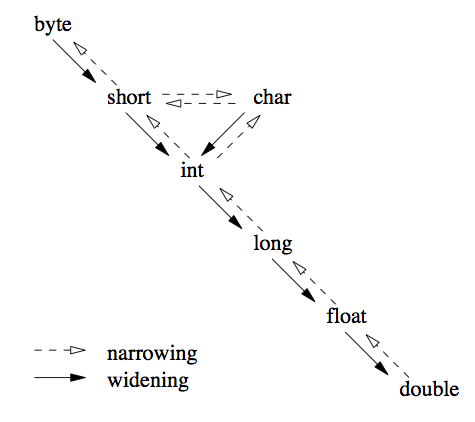
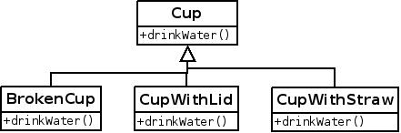

# Java 基础 12 类型转换与多态

作者：Vamei 出处：http://www.cnblogs.com/vamei 欢迎转载，也请保留这段声明。谢谢！

我们之前使用类创造新的类型(type)，并使用继承来便利我们创建类的过程。我将在这一讲中深入类型，并介绍多态(polymorphism)的概念。

### 类型检查

Java 的任意变量和引用经过类型声明(type declaration)，才能使用。我们之前见过对象数据、类数据、方法参数、方法返回值以及方法内部的自动变量，它们都需要声明其类型。Java 是一种强类型(strongly typing)语言，它会对类型进行检查。如果我们错误的使用类型，将造成错误。


 类型不符，卖萌无效

比如在下面的 Test 类中，我们将一个 Cup 类对象赋予给 aPerson 类引用:

```java
public class Test
{
    public static void main(String[] args)
    {
        Human aPerson;            
        aPerson = new Cup();     
    }
}

class Human
{   
    /**
     * constructor
     */
    public Human(int h)
    {
        this.height = h;
    }

    /**
     * accessor
     */
    public int getHeight()
    {
       return this.height;
    }

    /**
     * mutator
     */
    public void growHeight(int h)
    {
        this.height = this.height + h;
    }

    private int height;
}

class Cup 
{
    public void addWater(int w) 
    {
        this.water = this.water + w;
    }

    public void drinkWater(int w)
    {
        this.water = this.water - w;
    }

    private int water = 0;
}
```

javac 将返回:

found   : Cup
required: Human
                aPerson = new Cup();             
                          ^
1 error

### 基本类型转换

Java 可以对基本类型的变量进行类型转换。不同的基本类型有不同的长度和存储范围。如果我们从一个高精度类型转换到低精度类型，比如从 float 转换到 int，那么我们有可能会损失信息。这样的转换叫做收缩变换(narrowing conversion)。这种情况下，我们需要显示的声明类型转换，比如:

```java
public class Test
{
    public static void main(String[] args)
    {
        int a;
        a = (int) 1.23;  // narrowing conversion
        System.out.println(a);
    }
}
```

如果我们从低精度类型转换成高精度类型，则不存在信息损失的顾虑。这样的变换叫做宽松变换(widening conversion)。我们不需要显示的要求类型转换，Java 可以自动进行:

```java
public class Test
{
    public static void main(String[] args)
    { 
        int a = 3;
        double b;
        b = a;  // widening conversion
        System.out.println(a);
    }
}
```



基本类型转换

### upcast 与多态

在 Java 中，引用也可以进行类型转换，但是有限制。


我们可以将一个衍生类引用转换为其基类引用，这叫做向上转换(upcast)或者宽松转换。下面的 BrokenCup 类继承自 Cup 类，并覆盖了 Cup 类中原有的 addWater()和 drinkWater()方法:

```java
public class Test
{
    public static void main(String[] args)
    { 
        Cup aCup;
        BrokenCup aBrokenCup = new BrokenCup();
        aCup = aBrokenCup; // upcast
        aCup.addWater(10); // method binding
    }
}

class Cup 
{
    public void addWater(int w) 
    {
        this.water = this.water + w;
    }

    public void drinkWater(int w)
    {
        this.water = this.water - w;
    }

    private int water = 0;
}

class BrokenCup extends Cup
{
    public void addWater(int w) 
    {
        System.out.println("shit, broken cup");
    }

    public void drinkWater(int w)
    {
        System.out.println("om...num..., no water inside");
    }
}
```

程序运行结果:

shit, broken cup

在上面可以看到，不需要任何显示说明，我们将衍生类引用 aBrokenCup 赋予给它的基类引用 aCup。类型转换将由 Java 自动进行。

我们随后调用了 aCup(我们声明它为 Cup 类型)的 addWater()方法。尽管 aCup 是 Cup 类型的引用，它实际上调用的是 BrokenCup 的 addWater()方法！也就是说，即使我们经过 upcast，将引用的类型宽松为其基类，Java 依然能正确的识别对象本身的类型，并调用正确的方法。Java 可以根据当前状况，识别对象的真实类型，这叫做多态(polymorphism)。多态是面向对象的一个重要方面。

多态是 Java 的支持的一种机制，同时也是面向对象的一个重要概念。这提出了一个分类学的问题，既子类对象实际上“是”父类对象。比如一只鸟，也是一个动物；一辆汽车，也必然是一个交通工具。Java 告诉我们，一个衍生类对象可以当做一个基类对象使用，而 Java 会正确的处理这种情况。

比如下面的继承关系:

 

我们可以说用杯子(Cup)喝水(drinkWater)。实际上，喝水这个动作具体含义会在衍生类中发生很大变换。比如用吸管喝水，和从一个破杯子喝水，这两个动作差别会很大，虽然我们抽象中都讲“喝水”。我们当然可以针对每个衍生类分别编程，调用不同的 drinkWater 方法。然而，作为程序员，我们可以对杯子编程，调用 Cup 的 drinkWater()方法，而无论这个杯子是什么样的衍生类杯子。Java 会调用相应的正确方法，正如我们在上面程序中看到的。

看一个更加有意义的例子，我们给 Human 类增加一个 drink()方法，这个方法接收一个杯子对象和一个整数作为参数。整数表示喝水的水量:

```java
public class Test
{
    public static void main(String[] args)
    {
        Human guest = new Human();
        BrokenCup hisCup  = new BrokenCup();
        guest.drink(hisCup, 10);
    }
}

class Human 
{
    void drink(Cup aCup, int w)
    {
        aCup.drinkWater(w);
    }
}
```

程序运行结果:

shit, no water inside

我们在 Human 类的 drink()的定义中，要求第一个参量为 Cup 类型的引用。但在实际运用时(Test 类)，将 Cup 的 BrokenCup 衍生类对象。这实际上是将 hisCup 向上转型称为 Cup 类，传递给 drink()方法。在方法中，我们调用了 drinkWater()方法。Java 发现这个对象实际上是 BrokenCup 对象，所以实际调用了 BrokenCup 的相应方法。

### downcast

我们可以将一个基类引用向下转型(downcast)成为衍生类的引用，但要求该基类引用所指向的对象，已经是所要 downcast 的衍生类对象。比如可以将上面的 hisCup 向上转型为 Cup 类引用后，再向下转型成为 BrokenCup 类引用。

### Object 类型

Java 中，所有的类实际上都有一个共同的继承祖先，即 Object 类。Object 类提供了一些方法，比如 toString()。我们可以在自己的类定义中覆盖这些方法。


Object: 祖先

我们可以编写一个操作 Object 对象的程序，就可以通过 upcast，将任意对象传递给该程序。

我将在以后深入 Object 类。

(多态的实现是依靠 RTTI 的支持。我将在以后深入。)

### 总结

基本类型转换

polymorphism

downcast

Object

欢迎继续阅读“[Java 快速教程](http://www.cnblogs.com/vamei/archive/2013/03/31/2991531.html)”系列文章