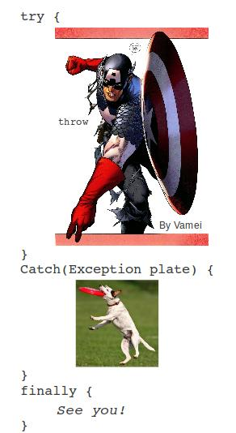
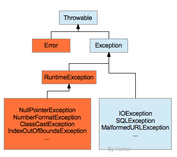

# Java 进阶 02 异常处理

作者：Vamei 出处：http://www.cnblogs.com/vamei 欢迎转载，也请保留这段声明。谢谢！ 

程序很难做到完美，不免有各种各样的异常。比如程序本身有 bug，比如程序打印时打印机没有纸了，比如内存不足。为了解决这些异常，我们需要知道异常发生的原因。对于一些常见的异常，我们还可以提供一定的应对预案。C 语言中的异常处理是简单的通过函数返回值来实现的，但返回值代表的含义往往是由惯例决定的。程序员需要查询大量的资料，才可能找到一个模糊的原因。面向对象语言，比如 C++, Java, Python 往往有更加复杂的异常处理机制。这里讨论 Java 中的异常处理机制。



Java 异常处理

### 异常处理

Java 的异常处理机制很大一部分来自 C++。它允许程序员跳过暂时无法处理的问题，以继续后续的开发，或者让程序根据异常做出更加聪明的处理。

Java 使用一些特殊的对象来代表异常状况，这样对象称为异常对象。当异常状况发生时，Java 会根据预先的设定，抛出(throw)代表当前状况的对象。所谓的抛出是一种特殊的返回方式。该线程会暂停，逐层退出方法调用，直到遇到异常处理器(Exception Handler)。异常处理器可以捕捉(catch)的异常对象，并根据对象来决定下一步的行动，比如:

*   提醒用户
*   处理异常
*   继续程序
*   退出程序
*   ......

异常处理器看起来如下，它由 try, catch, finally 以及随后的程序块组成。finally 不是必须的。

```java
try {

  ...;

}

catch() {

  ...;

}

catch() {

  ...;

}

finally {

  ...;

}
```

这个异常处理器监视 try 后面的程序块。catch 的括号有一个参数，代表所要捕捉的异常的类型。catch 会捕捉相应的类型及其衍生类。try 后面的程序块包含了针对该异常类型所要进行的操作。try 所监视的程序块可能抛出不止一种类型的异常，所以一个异常处理器可以有多个 catch 模块。finally 后面的程序块是无论是否发生异常，都要执行的程序。

我们在 try 中放入可能出错，需要监视的程序，在 catch 中设计应对异常的方案。

下面是一段使用到异常处理的部分 Java 程序。try 部分的程序是从一个文件中读取文本行。在读取文件的过程中，可能会有 IOException 发生:

```java
BufferedReader br = new BufferedReader(new FileReader("file.txt"));
try {
    StringBuilder sb = new StringBuilder();
    String line = br.readLine();

    while (line != null) {
        sb.append(line);
        sb.append("\n");
        line = br.readLine();
    }
    String everything = sb.toString();
} 
catch(IOException e) {
    e.printStackTrace();
    System.out.println("IO problem");
}
finally {
    br.close();
}
```

如果我们捕捉到 IOException 类对象 e 的时，可以对该对象操作。比如调用对象的 printStackTrace()，打印当前栈的状况。此外，我们还向中端打印了提示"IO problem"。

无论是否有异常，程序最终会进入 finally 块中。我们在 finally 块中关闭文件，清空文件描述符所占据的资源。

### 异常的类型

Java 中的异常类都继承自 Trowable 类。一个 Throwable 类的对象都可以抛出(throw)。



橙色: unchecked; 蓝色: checked

Throwable 对象可以分为两组。一组是 unchecked 异常，异常处理机制往往不用于这组异常，包括:

*   Error 类通常是指 Java 的内部错误以及如资源耗尽的错误。当 Error(及其衍生类)发生时，我们不能在编程层面上解决 Error，所以应该直接退出程序。
*   Exception 类有特殊的一个衍生类 RuntimeException。RuntimeException(及其衍生类)是 Java 程序自身造成的，也就是说，由于程序员在编程时犯错。RuntimeException 完全可以通过修正 Java 程序避免。比如将一个类型的对象转换成没有继承关系的另一个类型，即 ClassCastException。这类异常应该并且可以避免。

剩下的是 checked 异常。这些类是由编程与环境互动造成程序在运行时出错。比如读取文件时，由于文件本身有错误，发生 IOException。再比如网络服务器临时更改 URL 指向，造成 MalformedURLException。文件系统和网络服务器是在 Java 环境之外的，并不是程序员所能控制的。如果程序员可以预期异常，可以利用异常处理机制来制定应对预案。比如文件出问题时，提醒系统管理员。再比如在网络服务器出现问题时，提醒用户，并等待网络服务器恢复。异常处理机制主要是用于处理这样的异常。

### 抛出异常

在上面的程序中，异常来自于我们对 Java IO API 的调用。我们也可以在自己的程序中抛出异常，比如下面的 battery 类，有充电和使用方法:

```java
public class Test
{
    public static void main(String[] args)
    {
        Battery aBattery = new Battery();
        aBattery.chargeBattery(0.5);
        aBattery.useBattery(-0.5);
    }
}

class Battery 
{
    /**
     * increase battery
     */
    public void chargeBattery(double p)
    {
        // power <= 1
        if (this.power + p < 1.) {
            this.power = this.power + p;
        }
        else {
            this.power = 1.;
        }
    }

    /**
     * consume battery
     */
    public boolean useBattery(double p)
    {
        try {
            test(p);
        }
        catch(Exception e) {
            System.out.println("catch Exception");
            System.out.println(e.getMessage());
            p = 0.0;
        }

        if (this.power >= p) {
            this.power = this.power - p;
            return true;
        }
        else {
            this.power = 0.0;
            return false;
        }
    }

    /**
     * test usage
     */
    private void test(double p) throws Exception // I just throw, don't handle
    {
        if (p < 0) {
            Exception e = new Exception("p must be positive");
            throw e;
        }
    }

    private double power = 0.0; // percentage of battery
}
```

useBattery()表示使用电池操作。useBattery()方法中有一个参数，表示使用的电量。我们使用 test()方法测试该参数。如果该参数为负数，那么我们认为有异常，并抛出。

在 test 中，当有异常发生时(p < 0)，我们创建一个 Exception 对象 e，并用一个字符串作为参数。字符串中包含有异常相关的信息，该参数不是必需的。使用 throw 将该 Exception 对象抛出。

我们在 useBattery()中有异常处理器。由于 test()方法不直接处理它产生的异常，而是将该异常抛给上层的 useBattery()，所以在 test()的定义中，我们需要 throws Exception 来说明。

(假设异常处理器并不是位于 useBattery()中，而是在更上层的 main()方法中，我们也要在 useBattery()的定义中增加 throws Exception。)

在 catch 中，我们使用 getMessage()方法提取其异常中包含的信息。上述程序的运行结果如下:

catch Exception
p must be positive

异常处理器中，我们会捕捉任意 Exception 类或者其衍生类异常。这往往不利于我们识别问题，特别是一段程序可能抛出多种异常时。我们可以提供一个更加具体的类来捕捉。

### 自定义异常

我们可以通过继承来创建新的异常类。在继承时，我们往往需要重写构造方法。异常有两个构造方法，一个没有参数，一个有一个 String 参数。比如:

```java
class BatteryUsageException extends Exception
{
    public BatteryUsageException() {}
    public BatteryUsageException(String msg) {
        super(msg);
    }
}
```

我们可以在衍生类中提供更多异常相关的方法和信息。

在自定义异常时，要小心选择所继承的基类。一个更具体的类要包含更多的异常信息，比如 IOException 相对于 Exception。

### 总结

异常处理是在解决问题，同时也是在制造问题。大型项目中，过多、过细的异常处理往往会导致程序变得一团糟。异常处理的设计并不简单，并需要谨慎使用。

欢迎继续阅读“[Java 快速教程](http://www.cnblogs.com/vamei/archive/2013/03/31/2991531.html)”系列文章