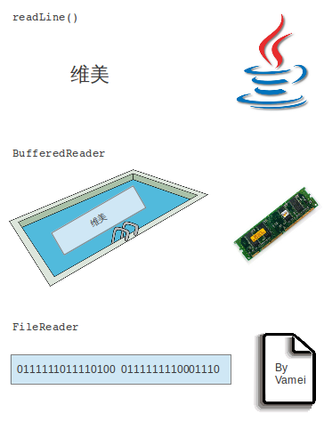
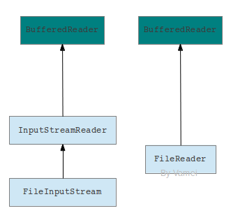
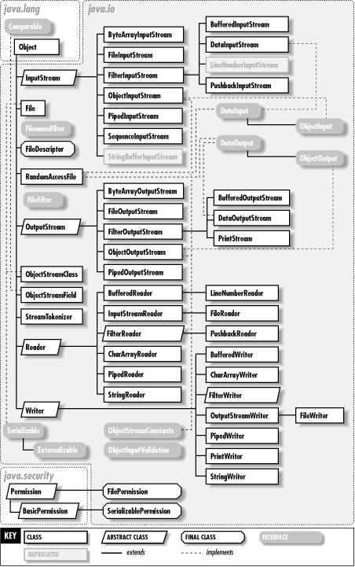
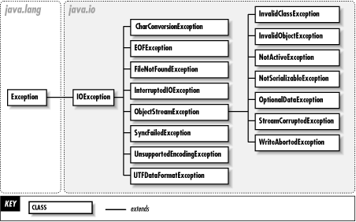
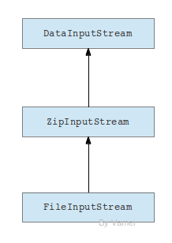

# Java 进阶 03 IO 基础 TCP 协议与流通信

作者：Vamei 出处：http://www.cnblogs.com/vamei 欢迎转载，也请保留这段声明。谢谢！

计算机最重要的功能是处理数据。一个有用的计算机语言需要拥有良好的 IO 功能，以便让未处理的数据流入程序，让已处理的数据流出。

与其他语言相比，Java 的 IO 功能显得复杂。在其他语言中，许多 IO 功能(比如读取文件)，是被封装好的，可以用一两行程序实现。在 Java 中，程序员往往需要多个层次的装饰(decoration)，才能实现文件读取。

相对的复杂性带来的好处是 IO 的灵活性。在 Java 中，程序员可以控制 IO 的整个流程，从而设计出最好的 IO 方式。我们将在下文看到更多。

### IO 示例

 下面是我用于演示的文件 file.txt

```java
Hello World!
Hello Nerd!
```

我们先来研究一个文件读取的例子:

```java
import java.io.*;

public class Test
{
    public static void main(String[] args)
    {
        try {
            BufferedReader br =
              new BufferedReader(new FileReader("file.txt")); 

            String line = br.readLine();

            while (line != null) {
                System.out.println(line);
                line = br.readLine();
            }
            br.close();
        }
        catch(IOException e) {
            System.out.println("IO Problem");
        }
    }
}
```

这段程序中包含一个 try...catch...finally 的异常处理器。可参考[Java 进阶 02 异常处理](http://www.cnblogs.com/vamei/archive/2013/04/09/3000894.html)

### 装饰器与功能组合

程序 IO 的关键在于创建 BufferedReader 对象 br:

    BufferedReader br = new BufferedReader(new FileReader("file.txt"));

在创建的过程中，我们先建立了一个 FileReader 对象，这个对象的功能是从文件"file.txt"中读取字节(byte)流，并转换为文本流。在 Java 中，标准的文本编码方式为 unicode。BufferedReader()接收该 FileReader 对象，并拓展 FileReader 的功能，新建出一个 BufferedReader 对象。该对象除了有上述的文件读取和转换的功能外，还提供了缓存读取(buffered)的功能。最后，我们通过对 br 对象调用 readLine()方法，可以逐行的读取文件。

(缓存读取是在内存中开辟一片区域作为缓存，该区域存放 FileReader 读出的文本流。当该缓存的内容被读走后(比如 readLine()命令)，缓存会加载后续的文本流。)

BufferedReader()是一个装饰器(decorator)，它接收一个原始的对象，并返回一个经过装饰的、功能更复杂的对象。修饰器的好处是，它可以用于修饰不同的对象。我们这里被修饰的是从文件中读取的文本流。其他的文本流，比如标准输入，网络传输的流等等，都可以被 BufferedReader()修饰，从而实现缓存读取。

下图显示了 br 的工作方式，数据自下而上流动:



(文本流可参考[Linux 文本流](http://www.cnblogs.com/vamei/archive/2012/09/14/2683756.html)和[TCP 协议与流通信](http://www.cnblogs.com/vamei/archive/2012/12/08/2805252.html))

上述的装饰过程与[Linux 中的文本流](http://www.cnblogs.com/vamei/archive/2012/09/14/2683756.html)思想很相似。在 Linux 中，我们使用类似函数的方式来处理和传递文本流。在 Java 中，我们使用了装饰器。但它们的目的都类似，就是实现功能的模块化和自由组合。

### 更多的组合

事实上，Java 提供了丰富的装饰器。FileReader 中合并了读取和转换两个步骤，并采用了常用的默认设置，比如编码采取 unicode。我们可以使用 FileInputStream + InputStreamReader 的组合来替代 FileReader，从而分离读取字节和转换两个步骤，并对两个过程有更好的控制。

(当然，FileReader 的使用更加方便。InputStreamReader 是将 FileInputStream 转换成一个 Reader，用于处理 unicode 文本)



箭头表示数据流动方向

流的读写来自于四个基类: InputStream, OutputStream, Reader 和 Writer。InputStream 和 Reader 是处理读取操作，OutputStream 和 Writer 是处理写入操作。它们都位于 java.io 包中。继承关系如下:



java.io

此外，IOException 有如下衍生类:



IOException

Reader 和 Writer 及其衍生类是处理 unicode 文本。如我们看到的 Buffered Reader, InputStreamReader 或者 FileReader。

InputStream 和 OutputStream 及其衍生类是处理字节(byte)流。计算机中的数据都可以认为是字节形式，所以 InputStream 和 OutputStream 可用于处理更加广泛的数据。比如我们可以使用下面的组合来读取压缩文件中包含的数据(比如整数):



箭头表示数据流动方向

我们从压缩文件中读出字节流，然后解压缩，最终读出数据。

### 写入

写入(write)操作与读取操作相似。我们可以通过使用装饰，实现复杂的写入功能。这里是一个简单的写入文本的例子:

```java
import java.io.*;

public class Test
{
    public static void main(String[] args)
    {
        try {
            String content = "Thank you for your fish.";

            File file = new File("new.txt");

            // create the file if doesn't exists
            if (!file.exists()) {
                file.createNewFile();
            }

            FileWriter fw = new FileWriter(file.getAbsoluteFile());
            BufferedWriter bw = new BufferedWriter(fw);
            bw.write(content);
            bw.close();

        }
        catch(IOException e) {
            System.out.println("IO Problem");
        }
    }
}
```

上面创建了 file 对象，用于处理文件路径。

### 总结

这里只是对 Java IO 的基本介绍。Java 的 IO 相对比较复杂。Java 程序员需要花一些时间来熟悉 java.io 中的类及其功能。

欢迎继续阅读“[Java 快速教程](http://www.cnblogs.com/vamei/archive/2013/03/31/2991531.html)”系列文章