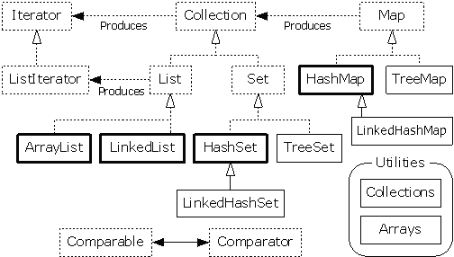

# Java 进阶 06 容器

作者：Vamei 出处：http://www.cnblogs.com/vamei 欢迎转载，也请保留这段声明。谢谢！ 

Java 中有一些对象被称为容器(container)。容器中可以包含多个对象，每个对象称为容器中的一个元素。容器是用对象封装的数据结构(data structure)。


充满梦想的容器

不同的数据结构有不同的组织元素的方式，也可以有不同的操作。根据具体实施的不同，数据结构的操作效率也各有差别。Java 中的容器也是这样。我们要选择适当的容器，以应对变化的需求。

(关于数据结构更多的内容，可参考[纸上谈兵: 算法与数据结构](http://www.cnblogs.com/vamei/archive/2013/03/22/2974052.html))

### 数组

数组(array)是最常见的数据结构。数组是相同类型元素的有序集合，并有固定的大小(可容纳固定数目的元素)。数组可以根据下标(index)来随机存取(random access)元素。在内存中，数组通常是一段连续的存储单元。

Java 支持数组这一数据结构。我们需要说明每个数组的类型和大小。如下:

```java
public class Test
{
    public static void main(String[] args)
    {
        Human[] persons = new Human[2];              // array size 2
        persons[0] = new Human(160);
        persons[1] = new Human(170);

        int[] a = {1, 2, 3, 7, 9};                   // array size 5
        System.out.println(a[2]);

        String[] names = {"Tom", "Jerry", "Luffy"};  // array size 3
        System.out.println(names[0]);
    }
}
```

在说明类型时，在类型说明(Human)后面增加一个[]，来说明是一个数组。使用 new 创建容器时，需要说明数组的大小。

我们可以使用 数组名[下标] 的方式来调用某个元素。我们可以逐个的初始化数组的元素，也可以在声明的同时使用{}初始化数组。

对于非基本类型的数组，比如 Human[]，数组中存储的是对象的引用。

我们可以调用 System.arraycopy()方法来有效的复制数组:

```java
public class Test
{
    public static void main(String[] args)
    {
        int[] aFrom = {1, 2, 3, 7, 9}; // array size 5
        int[] aTo  = new int[3];
        System.arraycopy(aFrom, 1, aTo, 0, 3);
        System.out.println(aTo[1]);
    }
}
```

System.arraycopy()中，aFrom 为想要复制出去的数组，aTo 为想要复制到的数组，1 为 aFrom 的想要复制出去的元素起始位置，0 为 aTo 中想要存储复制来元素的起始位置，3 为所要复制的元素总数。

### Collection

表(List)和集合(Set)是 java.util 中定义的两个接口(interface)。这两个接口都继承自 Collection 接口。通过实施接口，我们可以获得相应的容器。

我们之前都是使用类(class)来说明引用的类型。事实上，我们也可以用接口(interface)来说明引用的类型。该类型引用所指向的对象必须实施了该接口。

我们先来使用表(List)容器。List 是有序的元素集合，所以可以使用下标来说明元素的位置。集合中的元素可以相等:

```java
import java.util.*;

public class Test
{
    public static void main(String[] args)
    {
        List<String> l1 = new ArrayList<String>();
        l1.add("good");
        l1.add("bad");
        l1.add("shit");
        l1.remove(0);
        System.out.println(l1.get(1));
        System.out.println(l1.size());
    }
}
```

当我们在定义接口和创建容器时，我们使用<class>的方式来说明容器中所能容纳元素的类型。我们将只能在容器中放入 class 类及其衍生类的对象。

容器的引用为 List 类型，但容器的实施为 ArrayList 类。这里是将接口与实施分离。事实上，同一种抽象数据结构(ADT)都可以有多种实施方法(比如栈可以实施为数组和链表)。这样的分离允许我们更自由的选择 ADT 的实施方式。

我们可以定义<Object>类型的容器。由于 Java 中的所有类都继承自 Object 类，这样的容器实际上可以放入任意类型的对象。

在上面的程序中，容器为 String 类型。我们用

*   add()方法加入新的元素
*   get()方法可以获取容器中的元素，传递一个整数下标作为参数
*   remove()方法可以删除容器中的元素，传递一个整数下标作为参数。(有另一个 remove()，传递元素自身作为参数)
*   size()方法用来返回容器中元素的总数。

[List 的官方文档](http://docs.oracle.com/javase/6/docs/api/java/util/List.html)

集合(set)也是元素的集合。集合中不允许有等值的元素，集合的元素没有顺序:

```java
import java.util.*;

public class Test
{
    public static void main(String[] args)
    {
        Set<Integer> s1 = new HashSet<Integer>();
        s1.add(4);
        s1.add(5);
        s1.add(4);
        s1.remove(5);
        System.out.println(s1);
        System.out.println(s1.size());
    }
}
```

重复加入的元素 4 只被放入容器一次。由于 Set 是无序的，在 remove()中，我们直接传递目标元素本身作为参数。

[Set 的官方文档](http://docs.oracle.com/javase/6/docs/api/java/util/Set.html)

List 和 Set 都继承自 Collection 接口。Collection 代表了对象的集合。上面 List 和 Set 接口中的许多方法实际上继承自 Collection，比如:

add("good")        加入元素

size()             返回元素的总数

contains("bad")    是否包含元素

remove("good")     删除元素

[Collection 的官方文档](http://docs.oracle.com/javase/6/docs/api/java/util/Collection.html)

Collection 还有一个 iterator()的方法。该方法将 Collection 容器封装成循环器(Iterator)。循环器是元素的集合，它有 next()方法，用于每次返回一个元素，直到循环器中元素穷尽。

```java
import java.util.*;

public class Test
{
    public static void main(String[] args)
    {
        List<Integer> l1 = new ArrayList<Integer>();
        l1.add(4);
        l1.add(5);
        l1.add(2);
        Iterator i = l1.iterator();
        while(i.hasNext()) {
            System.out.println(i.next());
        }
    }
}
```

[Iterator 的官方文档](http://docs.oracle.com/javase/6/docs/api/java/util/Iterator.html)

### Map

Map 是键值对的集合。Map 中的每个元素是一个键值对，即一个键(key)和它对应的对象值(value)。对于 Map 容器，我们可以通过键来找到对应的对象。

哈希表是 Map 常见的一种实施方式，参考[纸上谈兵: 哈希表 (hash table)](http://www.cnblogs.com/vamei/archive/2013/03/24/2970339.html)

我们需要声明 Map 的键和值的类型。我们下面实施一个 HashMap:

```java
import java.util.*;

public class Test
{
    public static void main(String[] args)
    {
        Map<String, Integer> m1 = new HashMap<String, Integer>();
        m1.put("Vamei", 12);
        m1.put("Jerry", 5);
        m1.put("Tom", 18);
        System.out.println(m1.get("Vamei"));

    }
}
```

在 Map 中，我们使用 put()方法来添加元素，用 get()方法来获得元素。

Map 还提供了下面的方法，来返回一个 Collection:

keySet()  将所有的键转换为 Set

values()  将所有的值转换为 List

### 总结

Java 中，容器的接口与实施分离。这给了 Java 程序员更大的选择自由，当然，也为编程增加了难度。

接口为我们提供了合法的操作。在效果层面上看，不同的实施都有相同的效果。当然，不同的情境下，实施的细节将决定运行效率。

最后，是我们提到的各个类与接口的关系:



欢迎继续阅读“[Java 快速教程](http://www.cnblogs.com/vamei/archive/2013/03/31/2991531.html)”系列文章