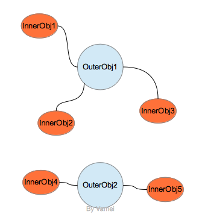

# Java 进阶 07 嵌套类

作者：Vamei 出处：http://www.cnblogs.com/vamei 欢迎转载，也请保留这段声明。谢谢！

到现在为止，我们都是在 Java 文件中直接定义类。这样的类出现在包(package)的级别上。Java 允许类的嵌套定义。

这里将讲解如何在一个类中嵌套定义另一个类。


 嵌套

### 内部类

Java 允许我们在类的内部定义一个类。如果这个类是没有 static 修饰符，那么这样一个嵌套在内部的类称为内部类(inner class)。

内部类被认为是外部对象的一个成员。在定义内部类时，我们同样有访问权限控制(public, private, protected)。

在使用内部类时，我们要先创建外部对象。由于内部类是外部对象的一个成员，我们可以在对象的内部自由使用内部类:

```java
public class Test
{
    public static void main(String[] args)
    {
        Human me        = new Human("Vamei");
        me.drinkWater(0.3);
    }
}

class Human
{
    /**
     * inner class
     */
    private class Cup
    {
        public void useCup(double w)
        {
            this.water = this.water - w;
        }

        public double getWater()
        {
            return this.water;
        }

        private double water = 1.0;
    }

    /**
     * constructor
     */
    public Human(String n)
    {
        this.myCup = new Cup();
        this.name  = n;
    }

    public void drinkWater(double w)
    {
        myCup.useCup(w);
        System.out.println(myCup.getWater());
    }

    private Cup myCup;
    private String name;
}
```

上面的例子中，Cup 类为内部类。该内部类有 private 的访问权限，因此只能在 Human 内部使用。这样，Cup 类就成为一个被 Human 类专用的类。

如果我们使用其他访问权限，内部类也能从外部访问，比如:

```java
public class Test
{
    public static void main(String[] args)
    {
        Human me        = new Human("Vamei");
        me.drinkWater(0.3);

        Human.Cup soloCup = me.new Cup(); // be careful here
    }
}

class Human
{
    /**
     * inner class
     */                                                                                                                                                             
    class Cup
    {
        public void useCup(double w)
        {
            this.water = this.water - w;
        }

        public double getWater()
        {
            return this.water;
        }

        private double water = 1.0;
    }

    /**
     * constructor
     */
    public Human(String n)
    {
        this.myCup = new Cup();
        this.name  = n;
    }

    public void drinkWater(double w)
    {
        myCup.useCup(w);
        System.out.println(myCup.getWater());
    }

    private Cup myCup;
    private String name;
}
```

这里，内部类为默认访问权限(包访问权限)。我们可以在 Test 类中访问 Human 的内部类 Cup，并使用该内部类创建对象。注意我们创建时如何说明类型以及使用 new:

Human.Cup soloCup = me.new Cup();

我们在创建内部类对象时，必须基于一个外部类对象(me)，并通过该外部类对象来创建 Cup 对象(me.new)。我将在下一节讲述其中的含义。

### 闭包

可以看到，我们直接创建内部类对象时，必须是基于一个外部类对象。也就是说，内部类对象必须依附于某个外部类对象。



内部对象与外部对象

与此同时，内部类对象可以访问它所依附的外部类对象的成员(即使是 private 的成员)。从另一个角度来说，内部类对象附带有创建时的环境信息，也就是其他语言中的闭包(closure)特性。可参考[Python 闭包](http://www.cnblogs.com/vamei/archive/2012/12/15/2772451.html)

我们看下面的例子:

```java
public class Test
{
    public static void main(String[] args)
    {
        Human me        = new Human("Vamei");
        Human him       = new Human("Jerry");

        Human.Cup myFirstCup  = me.new Cup();
        Human.Cup mySecondCup = me.new Cup();
        Human.Cup hisCup      = him.new Cup();
        System.out.println(myFirstCup.whosCup());
        System.out.println(mySecondCup.whosCup());
        System.out.println(hisCup.whosCup());
    }
}

class Human
{
    /**
     * inner class
     */
    class Cup
    {
        public String whosCup()
        {
            return name;  // access outer field
        }
    }

    /**
     * constructor
     */
    public Human(String n)
    {
        this.name = n;
    }

    public void changeName(String n)
    {
        this.name = n;
    }

    private String name;
}
```

运行结果:

Vamei
Vamei
Jerry

在上面的例子中，我们通过内部类对象访问外部类对象的 name 成员。当我们基于不同的外部对象创建内部类对象时，所获得的环境信息也将随之变化。

### 嵌套 static 类 

我们可以在类的内部定义 static 类。这样的类称为嵌套 static 类(nested static class)。

我们可以直接创建嵌套 static 类的对象，而不需要依附于外部类的某个对象。相应的，嵌套 static 类也无法调用外部对象的方法，也无法读取或修改外部对象的数据。从效果上看，嵌套 static 类拓展了类的命名空间(name space)，比如下面的 Human.Mongolian:

```java
public class Test
{
    public static void main(String[] args)
    {
        Human.Mongolian him = new Human.Mongolian();
        him.Shout();
    }
}

class Human
{
    /**
     * nested class
     */
    static class Mongolian
    {
        public void Shout()
        {
            System.out.println("Oh...Ho...");
        }
    }
}
```

在定义嵌套 static 类时，我们同样可以有不同的访问权限修饰符。

### 总结

嵌套类允许我们更好的组织类

内部类实现了闭包

欢迎继续阅读“[Java 快速教程](http://www.cnblogs.com/vamei/archive/2013/03/31/2991531.html)”系列文章