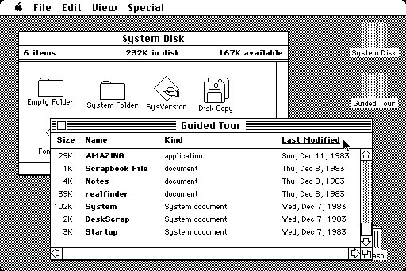
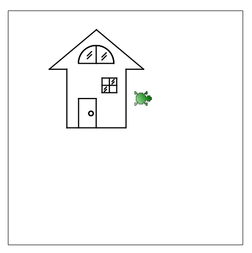
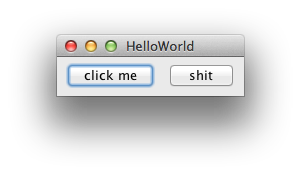
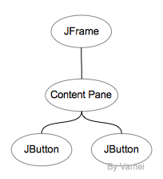
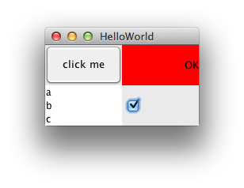

# Java 进阶 08 GUI 把你的孩子打造成为码农

作者：Vamei 出处：http://www.cnblogs.com/vamei 欢迎转载，也请保留这段声明。谢谢！

GUI(Graphical User Interface)提供了图形化的界面，允许用户以图形的方式与系统进行互动。在 GUI 推广之前，用户通常要以文本命令的方式来控制计算机。GUI 直观的将计算机的功能呈现给用户，降低了用户使用计算机的门槛。苹果和微软是 GUI 方面的先驱(虽然他们都一定程度上抄袭了 Xerox)，GUI 也为这两位 PC 王者带来了丰厚的市场回报。



早期 Mac GUI

GUI 需要操作系统和硬件的支持。因此，GUI 编程往往要处理移植性的问题。Java 的 GUI 编程有相对比较好的可移植性。然而，随着 GUI 的重心向移动端转移，Java 的 GUI 部分地位有些尴尬。无论如何，我们还是可以通过 Java 来了解 GUI 编程的一些基本内容。

### 图形的理解

看下面一个图片:



KTurtle 绘制。参看[把你的孩子打造成为码农](http://www.cnblogs.com/vamei/archive/2012/09/15/2686966.html)

可以看到，图中有一个房子，房子上有窗户和门，窗户上有条纹，门上有把手，此外图像外还有一只小乌龟。我们所提到的房子，窗户，门，条纹，把手，都可以称其为对象。不同的对象之间有组合(composition)关系，比如 窗户和门属于房子，而把手属于门。乌龟和房子是相互独立的两个对象。此外，整个图像外有一个方框，用来表明可绘图的范围，所有上面提到的元素都依附于该方框。

另一方面，上述的对象有许多重复使用的图形元素(component)。比如把手是一个圆，房子和门由直线构成。相同的图形元素可以归为一类(class)。我们可以重复使用直线类来生成(不同性质的)直线，并组合到不同的对象中。

这是用面向对象的方式来理解一个图形。对象是描述图形的自然方式。面向对象编程在计算机图形方面应用非常成功。

### 一个简单的 GUI

Java 的 GUI 功能主要集中在 awt 和 swing 两个包中。awt 是 GUI 底层包。swing 包是高层的封装，更容易移植。这里将更侧重于 swing 包。

```java
import javax.swing.*;
import java.awt.*;

public class HelloWorldSwing {
    private static void createAndShowGUI() {
        JFrame frame = new JFrame("HelloWorld");
        frame.setDefaultCloseOperation(JFrame.EXIT_ON_CLOSE);

        // Pane's layout
        Container cp = frame.getContentPane();
        cp.setLayout(new FlowLayout());

        // create button
        JButton b1 = new JButton("click me");
        JButton b2 = new JButton("shit");

        // add buttons
        cp.add(b1);
        cp.add(b2);

        // show the window
        frame.pack();
        frame.setVisible(true);
    }

    public static void main(String[] args) {
        Runnable tr = new Runnable() {
            public void run() {
                createAndShowGUI();
            }
        };
        javax.swing.SwingUtilities.invokeLater(tr);
    }
}
```

 上面程序中的 main()方法中，我们使用匿名类(anonymous class)定义线程 Runnable tr。匿名类是 Java 的一种嵌套类，它是在使用 new 创建对象时，使用一个{}来直接包含类的定义。在匿名类定义中，我们不需要说明类名。new 后面跟随 接口() 或者 类()，匿名类的定义将实施该接口或继承该类。

运行结果如下:



### 图形树

我们利用 add()方法，将一个图形元素加入到另一个元素中。通过这样的组合，所有的图形元素构成一个树状数据结构，这棵树表示了图像元素之间的隶属关系(containment hierarchy)。一个图形树就代表了一个 GUI 图形界面。

 

图形树

在程序中，我们首先创建了 JFrame 对象。JFrame 是 top-level container，也就是图形树的根。JFrame 默认包含有 Content Pane。Content Pane 是一个 Container 对象，它一般包含有图形(除菜单 MenuBar 外)的所有可见元素。Content Pane 中包含有两个按钮，即 JButton 元素。

Content Pane 的 setLayout()方法决定了元素的布局(layout)方式。布局决定了元素的位置。最直接的布局是直接说明元素的坐标位置(像素)。但 GUI 的设备尺寸可能差别很大，硬性规定像素位置将大大减小程序的可移植性。Swing 提供了更高层的一些布局方法，比如 FlowLayout 下，元素将从左向右排列，在排满之后进入下一行。

[更多的 Java 布局方式](http://docs.oracle.com/javase/tutorial/uiswing/layout/visual.html)

### 图形元素

除了按钮之外，我们还可以在 GUI 中增加更多的元素，这些元素大都是 JComponent 的衍生类。比如:

```java
import javax.swing.*;
import java.awt.*;
public class HelloWorldSwing {
    private static void createAndShowGUI() {
        JFrame frame = new JFrame("HelloWorld");
        frame.setDefaultCloseOperation(JFrame.EXIT_ON_CLOSE);

        // Pane's layout
        Container cp = frame.getContentPane();
        cp.setLayout(new GridLayout(0,2));

        // JButton
        JButton button = new JButton("click me");
        JLabel label = new JLabel("OK");

        // JPanel       
        JPanel panel1 = new JPanel(new BorderLayout());
        JPanel panel2 = new JPanel(new BorderLayout());
        panel2.setBackground(Color.red);

        panel1.add(button, BorderLayout.CENTER);
        cp.add(panel1);
        panel2.add(label, BorderLayout.EAST);
        cp.add(panel2);

        // JList
        String[] lines = {"a", "b", "c"};
        JList list = new JList(lines);
        cp.add(list);

        // JCheckBox
        cp.add(new JCheckBox());

        // show the window
        frame.pack();
        frame.setVisible(true);
    }

    public static void main(String[] args) {
        Runnable tr = new Runnable() {
            public void run() {
                createAndShowGUI();
            }
        };
        javax.swing.SwingUtilities.invokeLater(tr);
    }
}
```

这里使用了 GridLayout，效果如下:



JComponent

[更多元素](http://docs.oracle.com/javase/6/docs/api/javax/swing/JComponent.html)

### 总结

这里只是简单的展示了 GUI 编程的一些例子，以便从概念上了解 GUI 编程。随着使用的深入，我们很可能转入 IDE 设计 GUI，并自动生成 GUI 代码。无论如何，概念的理解都是必不可少的。

GUI 的知识有助于学习移动端开发。

欢迎继续阅读“[Java 快速教程](http://www.cnblogs.com/vamei/archive/2013/03/31/2991531.html)”系列文章