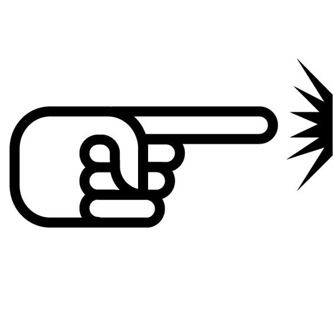
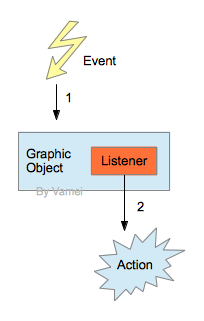
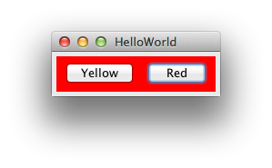

# Java 进阶 09 事件响应

作者：Vamei 出处：http://www.cnblogs.com/vamei 欢迎转载，也请保留这段声明。谢谢！

在[GUI](http://www.cnblogs.com/vamei/archive/2013/04/17/3000908.html)中，我们看到了如何用图形树来组织一个图形界面。然而，这样的图形界面是静态的。我们无法互动的对该界面进行操作。GUI 的图形元素需要增加事件响应(event handling)，才能得到一个动态的图形化界面。



### 元素, 事件, 监听器

我们在[GUI](http://www.cnblogs.com/vamei/archive/2013/04/17/3000908.html)一文中提到了许多图形元素。有一些事件(Event)可能发生在这些图形元素上，比如:

*   点击按钮
*   拖动滚动条
*   选择菜单

Java 中的事件使用对象表示，比如 ActionEvent。每个事件有作用的图形对象，比如按钮，滚动条，菜单。

所谓互动的 GUI，是指当上面事件发生时，会有相应的动作产生，比如:

*   改变颜色
*   改变窗口内容
*   弹出菜单

每个动作都针对一个事件。我们将动作放在一个监听器(ActionListener)中，然后让监听器监视(某个图形对象)的事件。当事件发生时，监听器中的动作随之发生。

 

因此，一个响应式的 GUI 是图形对象、事件对象、监听对象三者互动的结果。我们已经知道了如何创建图形对象。我们需要给图形对象增加监听器，并让监听器捕捉事件。

### 按钮响应

下面实现一个响应式的按钮。在点击按钮之后，面板的颜色会改变，如下图:



 (这个例子改编自 Core Java 2，Volume 1， Example 8-1)

```java
import javax.swing.*;
import java.awt.event.*;
import java.awt.*;

public class HelloWorldSwing {
    private static void createAndShowGUI() {
        JFrame frame = new JFrame("HelloWorld");
        frame.setDefaultCloseOperation(JFrame.EXIT_ON_CLOSE);

        // Pane's layout
        Container cp = frame.getContentPane();
        cp.setLayout(new FlowLayout());

        // add interactive panel to Content Pane
        cp.add(new ButtonPanel());

        // show the window
        frame.pack();
        frame.setVisible(true);
    }

    public static void main(String[] args) {
        Runnable tr = new Runnable() {
            public void run() {
                createAndShowGUI();
            }
        };
        javax.swing.SwingUtilities.invokeLater(tr);
    }
}

/**
 * JPanel with Event Handling
 */
class ButtonPanel extends JPanel
{
    public ButtonPanel()
    {
        JButton yellowButton = new JButton("Yellow");
        JButton redButton = new JButton("Red");

        this.add(yellowButton);
        this.add(redButton);

        /**
         * register ActionListeners
         */
        ColorAction yellowAction = new ColorAction(Color.yellow);
        ColorAction redAction    = new ColorAction(Color.red);

        yellowButton.addActionListener(yellowAction);
        redButton.addActionListener(redAction);
    }

    /**
     * ActionListener as an inner class
     */
    private class ColorAction implements ActionListener
    {
        public ColorAction(Color c)
        { 
            backgroundColor = c;
    }

        /**
         * Actions
         */
        public void actionPerformed(ActionEvent event)
        {
            setBackground(backgroundColor); // outer object, JPanel method
            repaint();
        }

        private Color backgroundColor;
    }
}
```

上面，我们用一个内部类 ColorAction 来实施 ActionListener 接口。这样做是为了让监听器能更方便的调用图形对象的成员，比如 setBackground()方法。

ActionListener 的 actionPerformed()方法必须被覆盖。该方法包含了事件的对应动作。该方法的参数为事件对象，即监听 ActionEvent 类型的事件。ActionEvent 是一个高层的类，Java 会找到图形对象(按钮)会发生的典型事件(点击)作为事件。

ColorAction 生成的对象即为监听器对象。

我们为两个按钮 JButton 添加了相应的监听器对象。当有事件发生时，对应动作将随之产生。

### 总结

ActionListener interface

ActionEvent class

欢迎继续阅读“[Java 快速教程](http://www.cnblogs.com/vamei/archive/2013/03/31/2991531.html)”系列文章