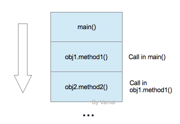
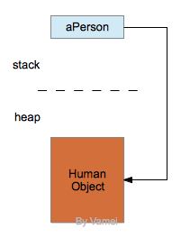
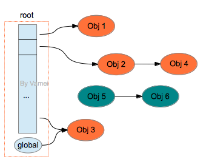
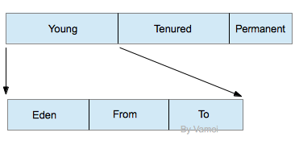

# Java 进阶 10 内存管理与垃圾回收 Linux 从程序到进程

作者：Vamei 出处：http://www.cnblogs.com/vamei 欢迎转载，也请保留这段声明。谢谢！

[整个教程](http://www.cnblogs.com/vamei/archive/2013/03/31/2991531.html)中已经不时的出现一些内存管理和垃圾回收的相关知识。这里进行一个小小的总结。

Java 是在 JVM 所虚拟出的内存环境中运行的。内存分为栈(stack)和堆(heap)两部分。我们将分别考察这两个区域。

### 栈

栈的基本概念参考[纸上谈兵: 栈 (stack)](http://www.cnblogs.com/vamei/archive/2013/03/14/2960201.html)。许多语言利用栈数据结构来记录函数调用的次序和相关变量(参考[Linux 从程序到进程](http://www.cnblogs.com/vamei/archive/2012/10/09/2715388.html))。

在 Java 中，JVM 中的栈记录了线程的方法调用。每个线程拥有一个栈。在某个线程的运行过程中，如果有新的方法调用，那么该线程对应的栈就会增加一个存储单元，即帧(frame)。在 frame 中，保存有该方法调用的参数、局部变量和返回地址。

调用栈

Java 的参数和局部变量只能是基本类型的变量(比如 int)，或者对象的引用(reference)。因此，在栈中，只保存有基本类型的变量和对象引用。

引用所指向的对象保存在堆中。(引用可能为 Null 值，即不指向任何对象)

引用与对象

当被调用方法运行结束时，该方法对应的帧将被删除，参数和局部变量所占据的空间也随之释放。线程回到原方法，继续执行。当所有的栈都清空时，程序也随之运行结束。

### 堆

如上所述，栈(stack)可以自己照顾自己。但堆必须要小心对待。堆是 JVM 中一块可自由分配给对象的区域。当我们谈论垃圾回收(garbage collection)时，我们主要回收堆(heap)的空间。

Java 的普通对象存活在堆中。与栈不同，堆的空间不会随着方法调用结束而清空。因此，在某个方法中创建的对象，可以在方法调用结束之后，继续存在于堆中。这带来的一个问题是，如果我们不断的创建新的对象，内存空间将最终消耗殆尽。

### 垃圾回收

垃圾回收(garbage collection，简称 GC)可以自动清空堆中不再使用的对象。垃圾回收机制最早出现于 1959 年，被用于解决 Lisp 语言中的问题。垃圾回收是 Java 的一大特征。并不是所有的语言都有垃圾回收功能。比如在 C/C++中，并没有垃圾回收的机制。程序员需要手动释放堆中的内存。

由于不需要手动释放内存，程序员在编程中也可以减少犯错的机会。利用垃圾回收，程序员可以避免一些指针和内存泄露相关的 bug(这一类 bug 通常很隐蔽)。但另一方面，垃圾回收需要耗费更多的计算时间。垃圾回收实际上是将原本属于程序员的责任转移给计算机。使用垃圾回收的程序需要更长的运行时间。

在 Java 中，对象的是通过引用使用的(把对象相像成致命的毒物，引用就像是用于提取毒物的镊子)。如果不再有引用指向对象，那么我们就再也无从调用或者处理该对象。这样的对象将不可到达(unreachable)。垃圾回收用于释放不可到达对象所占据的内存。这是垃圾回收的基本原则。

(不可到达对象是死对象，是垃圾回收所要回收的垃圾)

早期的垃圾回收采用引用计数(reference counting)的机制。每个对象包含一个计数器。当有新的指向该对象的引用时，计数器加 1。当引用移除时，计数器减 1。当计数器为 0 时，认为该对象可以进行垃圾回收。

然而，一个可能的问题是，如果有两个对象循环引用(cyclic reference)，比如两个对象互相引用，而且此时没有其它(指向 A 或者指向 B)的引用，我们实际上根本无法通过引用到达这两个对象。

因此，我们以栈和 static 数据为根(root)，从根出发，跟随所有的引用，就可以找到所有的可到达对象。也就是说，一个可到达对象，一定被根引用，或者被其他可到达对象引用。

橙色，可到达；绿色，不可到达

### JVM 实施

JVM 的垃圾回收是多种机制的混合。JVM 会根据程序运行状况，自行决定采用哪种垃圾回收。

我们先来了解"mark and sweep"。这种机制下，每个对象将有标记信息，用于表示该对象是否可到达。当垃圾回收启动时，Java 程序暂停运行。JVM 从根出发，找到所有的可到达对象，并标记(mark)。随后，JVM 需要扫描整个堆，找到剩余的对象，并清空这些对象所占据的内存。

另一种是"copy and sweep"。这种机制下，堆被分为两个区域。对象总存活于两个区域中的一个。当垃圾回收启动时，Java 程序暂停运行。JVM 从根出发，找到可到达对象，将可到达对象复制到空白区域中并紧密排列，修改由于对象移动所造成的引用地址的变化。最后，直接清空对象原先存活的整个区域，使其成为新的空白区域。

可以看到，"copy and sweep"需要更加复杂的操作，但也让对象可以紧密排列，避免"mark and sweep"中可能出现的空隙。在新建对象时，"copy and sweep"可以提供大块的连续空间。因此，如果对象都比较"长寿"，那么适用于"mark and sweep"。如果对象的"新陈代谢"比较活跃，那么适用于"copy and sweep"。

上面两种机制是通过分代回收(generational collection)混合在一起的。每个对象记录有它的世代(generation)信息。所谓的世代，是指该对象所经历的垃圾回收的次数。世代越久远的对象，在内存中存活的时间越久。

根据对 Java 程序的统计观察，世代越久的对象，越不可能被垃圾回收(富人越富，穷人越穷)。因此，当我们在垃圾回收时，要更多关注那些年轻的对象。

现在，具体看一下 JVM 中的堆:

我们看到，堆分为三代。其中的永久世代(permanent generation)中存活的是 Class 对象。这些对象不会被垃圾回收。我们在[RTTI](http://www.cnblogs.com/vamei/archive/2013/04/14/3013985.html)中已经了解到，每个 Class 对象代表一个类，包含有类相关的数据与方法，并提供类定义的代码。每个对象在创建时，都要参照相应的 Class 对象。每个对象都包含有指向其对应 Class 对象的引用。

年轻世代(young generation)和成熟世代(tenured generation)需要进行垃圾回收。年轻世代中的对象世代较近，而成熟世代中的对象世代较久。

世代

年轻世代进一步分为三个区域

eden(伊甸): 新生对象存活于该区域。新生对象指从上次 GC 后新建的对象。

新生对象生活于伊甸园

from, to: 这两个区域大小相等，相当于 copy and sweep 中的两个区域。

当新建对象无法放入 eden 区时，将出发 minor collection。JVM 采用 copy and sweep 的策略，将 eden 区与 from 区的可到达对象复制到 to 区。经过一次垃圾回收，eden 区和 from 区清空，to 区中则紧密的存放着存活对象。随后，from 区成为新的 to 区， to 区成为新的 from 区。

如果进行 minor collection 的时候，发现 to 区放不下，则将部分对象放入成熟世代。另一方面，即使 to 区没有满，JVM 依然会移动世代足够久远的对象到成熟世代。

如果成熟世代放满对象，无法移入新的对象，那么将触发 major collection。JVM 采用 mark and sweep 的策略，对成熟世代进行垃圾回收。

### 总结

以上是对 JVM 内存管理的一个概述。实际上，JVM 拥有众多版本。不同版本实施的 GC 机制会有不小的差异。另一方面，Java 本身并没有规定 JVM 的 GC 实施方式。GC 依然是 JVM 发展的一个热点方向。我们可以预期 JVM 的 GC 机制在未来会发生许多变化。

参考链接

[`www.ibm.com/developerworks/java/library/j-jtp11253/`](http://www.ibm.com/developerworks/java/library/j-jtp11253/)

[`www.cs.princeton.edu/picasso/mats/HotspotOverview.pdf`](http://www.cs.princeton.edu/picasso/mats/HotspotOverview.pdf)

[`www.cs.umd.edu/class/spring2008/cmsc433/lectures/gc.pdf`](http://www.cs.umd.edu/class/spring2008/cmsc433/lectures/gc.pdf)

欢迎继续阅读“[Java 快速教程](http://www.cnblogs.com/vamei/archive/2013/03/31/2991531.html)”系列文章