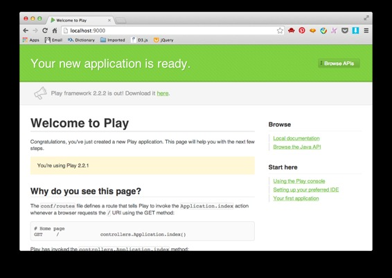
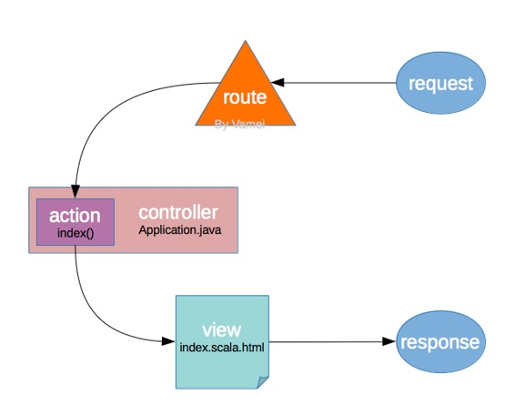

# 来玩 Play 框架 01 简介

作者：Vamei 出处：http://www.cnblogs.com/vamei 欢迎转载，也请保留这段声明。谢谢!

说到网络框架，Ruby 的 Ruby on Rail 和 Python 的 Django 都相当轻巧好用，但 Java 下的框架，则要沉重很多。有人因此质疑 Java 语言本身是否符合网络时代的需求。Java 大神们对这一问题嗤之以鼻。想要轻巧好用的框架？写一个给你就是了。Java 程序员 Guillaume Bort 在 JVM 上创造了一个全新的框架 Play framework。Play 拥有 ROR 或 Django 那样的灵巧，又不失 Java 的稳定，更有 JVM 这一强大的运行平台。魔鬼身材，天使脸蛋。让我们来玩玩 Play 吧。


### 下载与安装

Play 的安装相当简单。在[Play 官网下载](http://www.playframework.com/download)，我下载的是[2.2.1 版本](http://downloads.typesafe.com/play/2.2.1/play-2.2.1.zip)。该版本的 API 文档为[2.2.1API](http://www.playframework.com/documentation/2.2.1/api/java/index.html)。

把下载的.zip 文件解压缩，并将解压缩后的文件夹放到某个位置。比如/home/vamei/Util。

```java
unzip play-2.2.1.zip
mv play-2.2.1 /home/vamei/Util/
```

文件夹里重要的是可执行文件 play。我一般是在/home/vamei/Util/下创建一个 bin 文件夹，并在该文件夹中创建 play 的软链接。

```java
mkdir -p /home/vamei/Util/bin
cd /home/vamei/Util/bin
ln -s /home/vamei/Util/play-2.2.1/play .
```

最后，将新建的 bin 文件夹放入系统路径。

```java
echo "export PATH=/home/vamei/Util/bin:$PATH" >> /home/vamei/.bashrc
source /home/vamei/.bashrc
```

在命令行输入 play，将显示：

```java
       _
 _ __ | | __ _ _  _
| '_ \| |/ _' | || |
|  __/|_|\____|\__ /
|_|            |__/

play 2.2.1 built with Scala 2.10.2 (running Java 1.7.0_51), http://www.playframework.com

This is not a play application!

Use `play new` to create a new Play application in the current directory,
or go to an existing application and launch the development console using `play`.

You can also browse the complete documentation at http://www.playframework.com.
```

注：

上面是 Ubuntu 下的安装过程。Linux 系统都类似。

在 Mac OS 下，选择合适的路径安装 play，过程也相同。

对于 Windows 下的安装，没有探索。欢迎补充。

### 创建与运行

切换到/home/vamei，创建一个网络应用 test，

```java
play new test
```

跟随指示，输入项目的必要信息。应用名和编程语言，分别为 test 和 Java。

将有一个新的文件夹/home/vamei/test 出现在当前路径。它包含该项目的所有文件。

```java
test
├── README
├── app
│   ├── controllers
│   │   └── Application.java
│   └── views
│       ├── index.scala.html
│       └── main.scala.html
├── build.sbt
├── conf
│   ├── application.conf
│   └── routes
├── project
│   ├── build.properties
│   └── plugins.sbt
├── public
│   ├── images
│   │   └── favicon.png
│   ├── javascripts
│   │   └── jquery-1.9.0.min.js
│   └── stylesheets
│       └── main.css
└── test
    ├── ApplicationTest.java
    └── IntegrationTest.java
```

上面最重要的文件夹是 app，里面包含了项目的 MVC 定义。Play 采用 MVC 架构(model-view-control)。新建项目已经创建好了 controllers 和 views，包含有控制器(controller)和视图(view)模板。如果有必要，可以在 app 下创建 models 文件夹，用来定义数据模型(model)。

application.conf 包含了项目的各个设置参数。

routes 记录了 url 请求和控制器的对应关系。当有 http 请求进入时，Play 将根据该文件的设置，调用特定的控制器行动。

现在，切换到/home/vamei/test，并运行项目。输入命令：

```java
play run
```

Play 自己包含有一个网络服务器模块，所以不需要和 apache 衔接，就可以作为网络服务器，直接工作。 

打开浏览器，访问 localhost:9000，将看到运行的 test 应用。



这一页面是新建项目自带的页面。

### 解析

Play 框架的主要功能是动态生成 http 响应。http 协议按照“请求-响应”(request-response)的方式工作。http 通信的相关介绍，可参考[http 协议](http://www.cnblogs.com/vamei/archive/2013/05/11/3069788.html)。 

Play 是 MVC 架构，分步骤生成响应，而每一步由不同的模块负责。上面的一个简单页面，是如下过程产生的：



图中的黑色字体表明了这些功能在项目中所在的具体文件。

routes 负责将 url 导向正确的行动(action)。action 是生成 http 响应的核心。一个 action 会经过一系列的运算，产生一个响应。而控制器 controller 只是一个 action 的集合。在 Java 编程中，action 是 controller 类的一个方法。action 的响应可以传给某个视图，比如上面的 index.scala.html，从而更好的控制显示效果。最后的结果，就是一个 http 响应，也就是我们所看到的页面。

通过个性化上述过程，我们可以设计出功能更丰富的网络应用。

### 持续运行

Play 自带的服务器可以持续运行。将 Play 安装在目标服务器，比如云上后，在 Play 项目的根目录下，用：

```java
play start
```

来持续运行服务器。此后你可以按 Ctrl-D 来返回命令行。此时的 Play 不依赖于 Shell，即使退出服务器的登陆，Play 还是会持续运行。

使用其它端口运行：

```java
play "start -Dhttp.port=8080"
```

停止运行。切换到项目的根目录下，使用命令：

```java
play stop
```

### 总结

play new

play run

动态生成响应

model-control-view

欢迎继续阅读“[Java 快速教程](http://www.cnblogs.com/vamei/archive/2013/03/31/2991531.html)”系列文章