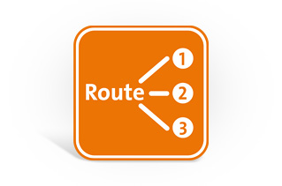
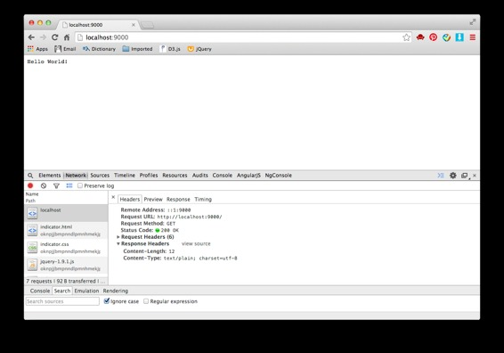

# 来玩 Play 框架 02 响应

作者：Vamei 出处：http://www.cnblogs.com/vamei 欢迎转载，也请保留这段声明。谢谢! 

我上一章总结了 Play 框架的基本使用。这一章里，我将修改和增加响应。

HTTP 协议是按照“请求-响应”的方式工作。Play 框架的核心是用动作(Action)来完成“请求-响应”。一个动作负责处理一种请求。一个项目可能要定义许多动作。复杂的网站，可能要定义上百个动作。所以，Play 使用控制器(Controller)和 URL 路由(URL routing)来组织管理动作。控制器用于给动作分类。URL 路由(routes)记录了 URL 和动作的对应关系。

### IDE

在开发代码之前，先简单介绍如何使用 Eclipse，开发 Play 项目。

在项目的根目录下，使用命令：

```java
play eclipse
```

成功后，打开 Eclipse，在 File->Import 中，选择 General->Existing Projects into Workspace。在 Select root directory 中，选择项目的根目录。随后，项目被引入 Eclipse。

Java 是静态语言，可以在编译时就决定对象的类型，因此能方便的实现代码自动提示补齐、自动寻找类所在的包并 import。在写程序的过程中，也能有很多友好提示。

后面的代码中，如果没有写明 import 的包，可以在 Eclipse 环境下自动寻找。

### 理解响应

我先来介绍控制器和 URL 路由。我以 Play 默认生成的动作为例讲解。你可以在 Play 项目中找到下面文件。

一个请求进入服务器后，由 URL 路由引导到正确的动作来处理。URL 路由根据请求的方法和 URL 来识别这一请求，再寻找对应动作。



URL 路由是一个文件，即项目根目录下的 conf/routes。文件的每一行是一条记录，规定了某个 URL 的对应动作。比如：

```java
# Home page
GET     /                           controllers.Application.index()
```

#开始的行是注释

记录分为三个部分。第一部分为请求的方法，第二个部分为请求的 URL，第三个是请求的对应动作。这里 Application 是一个控制器，位于 app/controllers/Application.java 中。一个控制器也是一个 Java 类。而动作 index()是类的一个方法。

我对默认生成的 Application.java 略作修改。新的 app/controllers/Application.java 为：

```java
package controllers;

import play.*;
import play.mvc.*;

import views.html.*;

public class Application extends Controller {

    public static Result index() {
        return ok("Hello World!");
    }

}
```

可以注意到，作为控制器的 Application，需要继承自 Controller 类。

一个动作必须是一个静态(static)的方法。一个动作返回一个 Result 类型的对象。ok("Hello World!")返回的就是这么一个 Result 对象，代表了一个 HTTP 响应。ok()返回的响应都是 200 状态，即 ok（正常回复）。在这个例子中，响应的主体内容为"Hello World!"。

你可以启动 Play 服务器，访问上面的 URL(localhost:9000/)。使用 Chrome 的 network 工具监视回复。页面如下：



根据 network 工具的监视，响应的状态码为 200。响应的类型为 text/plain。这是 ok()生成 Result 对象时自动决定的。我可以手动控制响应类型，比如将 index()的返回语句改为：

```java
return ok("Hello World!").as("text/html");
```

这样，响应的主体类型为 html。

### 其它状态的响应

除了 ok()之外，Play 还提供了其他的一些便捷方法，用以生成不同状态的响应。这些方法的名字和状态的名字相同，比如：

```java
return badRequest("bad request"); // 400, 坏请求
return unauthorized("You are forbidden"); // 401, 未授权
return redirect("/new");    // 303, 重新定向
```

这些方法返回对应的状态码。浏览器根据状态码和回复的内容，做出反应。比如收到 303 时，重新定向到新的 URL。

此外，我还可以直接使用 status()来说明数字形式的状态码

```java
return status(200, "good");
```

更多的响应生成方式可参考[Results](http://www.playframework.com/documentation/2.2.1/api/java/play/mvc/Results.html)

**练习**

在上面的控制器 Application 中，增加一个新的动作，用于显示

```java
<p>See you!</p>
```

修改 routes，并验证效果。

### URL 路由

URL 路由是由一行一行的记录组成的。上面我们看到了 GET 方法，还可以是其它 HTTP 方法，比如 POST：

```java
POST    /somePost                   controllers.Application.somePost()
```

我要在 Application 类中增加 somePost()动作来处理该请求，比如：

```java
public static Result somePost() {
    return ok("posted");
}
```

POST 方法常用于向服务器提交数据。我将在以后深入。

url 还可以有用户定义的变量，从而让一行记录对应不止一个请求，比如：

```java
GET    /record/:id            controllers.Application.record(id: Long)
```

上面的:id 是一个名为 id 的变量。":"是一个提示符。id 将从":"开始，直到结束或者另一个"/"。

当我们访问/record/1234 时，id 就是 1234。对应的动作包含有一个参数，来接收 id 变量。我这里把参数类型定义为 Long。Play 将负责类型的转换。

相应的 record()动作为：

```java
public static Result record(Long id) {
    return ok("record:" + id.toString());
}
```

可以看到，该动作与之前的动作有点不一样，它接受一个参数，即来自 url 的变量。

除了":"之外，还有另一个提示符"*"。与":"不同，"*"表示的区间不受"/"限制。

```java
GET    /newRecord/*name           controllers.Application.newRecord(name: String)
```

如果我们访问/newRecord/abc/def，那么 name 将对应字符串"abc/def"

### 总结

动作、控制器、URL 路由

ok()

欢迎继续阅读“[Java 快速教程](http://www.cnblogs.com/vamei/archive/2013/03/31/2991531.html)”系列文章