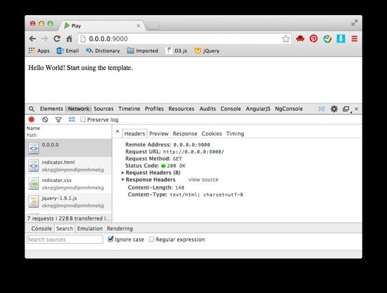
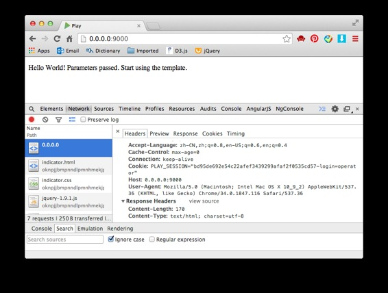
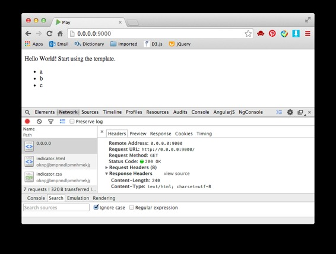

# 来玩 Play 框架 03 模板

作者：Vamei 出处：http://www.cnblogs.com/vamei 欢迎转载，也请保留这段声明。谢谢！

在上一章节中，我把字符串通过 ok()返回给客户。我可以把一个完整的 html 页面放入字符串中返回。然而，现代的框架都提供了更好的方法——模板。模板将视图和数据分开。服务器可以把不同的数据传递给同一个模板，从而产生不同的页面。 Play 同样也有一套模板系统。模板的大部分内容都可以用 html 写，作为视图，而在一些特别的地方，预留给数据参数。在模板中，用 Scala 语言来调用参数。

### 使用模板

我首先创建一个模板，纯粹起视图功能。在 app/views 文件夹中，新建文件 index.scala.html （如果已有，则删除并重新创建）。

```java
<!DOCTYPE html>
<html>
  <header>
    <title>Play</title>
  </header>

  <body>
    <p>Hello World! Start using the Template.</p>
  </body>
</html>
```

这个模板是个纯粹的 html 文件，是最简单的模板形式。

修改 app/controllers/Application.java：

```java
package controllers;

import play.*;
import play.mvc.*;

public class Application extends Controller {
    public static Result index() {
        return ok(views.html.index.render());
    }
}
```

ok()中接收的是 views.html.index.render()，实际上就是 app/views/index.scala.html 这一模板的 render()方法。Play 会根据模板，自动生成相应的类。

*** 也可以用 import 引入 views.html.index，而不是使用完整的类路径。

访问页面：



### 模板语言

这一部分，我把对象作为参数传给模板，然后在模板中显示对象中包含的数据。修改 index.scala.html：

```java
@(title: String, content: String)

<!DOCTYPE html>
<html>
  <header>
    <title>@title</title>
  </header>

  <body>
    <p>@(content) Start using the template.</p>
  </body>
</html>
```

上面的第一行，以@符号开头，说明了该模板所接收的两个参数，即 String 类型的 title 和 content。在模板中，用@符号和参数名，来调用参数。参数名周围可以用括号"()"，以区分正文。

修改动作：

```java
public static Result index() {
    return ok(views.html.index.render("Play", "Hello World! Parameters passed. "));
}
```

这里传递两个字符串给模板。最终显示的结果中，两个字符串将填充在模板中的适当位置。

 

上面把一个对象传递给模板。我们还可以在模板中调用对象的属性或方法：

@object.method()

@object.field

### 模板控制

我还可以用 Scala 的语法，在模板中实现更复杂的逻辑。比如下面的模板中使用循环：

```java
@(title: String, content: String, lines: List[String])

<!DOCTYPE html>
<html>
  <header>
    <title>@title</title>
  </header>

  <body>
    <p>@(content) Start using the template.</p>
    <ul>
    @for(line <- lines) {
      <li>@line</li>
    }
    </ul>
  </body>
</html>
```

循环是@for 实现的。@后面不仅可以是一个对象，还可以是一个完整的 Scala 语法。

修改动作，把一个字符串类型的表作为参数传递给模板：

```java
package controllers;

import play.*;
import play.mvc.*;

import java.util.List;
import java.util.ArrayList;

public class Application extends Controller {
    public static Result index() {
        List<String> lines = new ArrayList<String>();
        lines.add("a");
        lines.add("b");
        lines.add("c");
        return ok(views.html.index.render("Play", "Hello World!", lines));
    }
}
```

得到下面的页面：



模板中还可以有 if 选择结构，比如

```java
@if(item) {
  <p>True</p>
} else {
  <p>False</p>
}
```

根据参数 item 的真假，if 结构显示不同的内容。

### 其它

在@* *@中加入注释

由于@的特殊功能，为了在模板中显示"@"字符，需要使用@@。

### 总结

模板

render()

@

欢迎继续阅读“[Java 快速教程](http://www.cnblogs.com/vamei/archive/2013/03/31/2991531.html)”系列文章