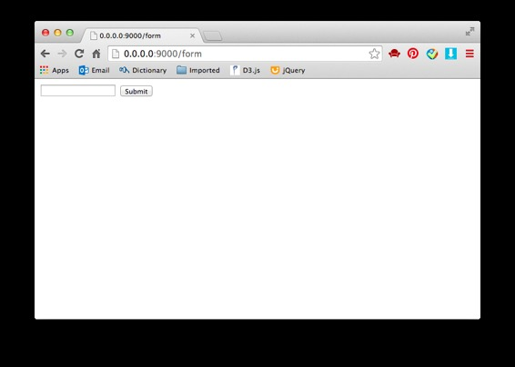

# 来玩 Play 框架 04 表单

作者：Vamei 出处：http://www.cnblogs.com/vamei 欢迎转载，也请保留这段声明。谢谢！

表单(form)是最常见的从客户往服务器传递数据的方式。Play 框架提供了一些工具。它们可以从表单中提取数据，验证提交数据的合法性，或者在视图中显示表单。我先来介绍最简单的使用表单提交数据的方式。 

### 增加表单

我可以用纯粹 html 的方式产生一个表单。在 app/views 下增加模板 form.scala.html:

```java
<!DOCTYPE html>
<html>
  <body>
    <form method="POST" action="/postForm">
      <input type="text" name="content"></input>
      <input type="submit"></input>
    </form>
  </body>
</html>
```

在 Application 控制器中，增加一个动作 form()，显示模板:

```java
public static Result form() {
    return ok(views.html.form.render());
}
```

在 routes 中增加导航

```java
GET     /form                       controllers.Application.form()
```

页面如下：



### 数据提取

在文本框中输入任意字符，点击 submit 后，表单将以 POST 方法提交到/postForm 这一 URL。增添负责处理该 URL 的动作，Application.postForm()

```java
public static Result postForm() {
    DynamicForm in   = Form.form().bindFromRequest();
    String result    = in.get("content");
    return ok(result);
}
```

DynamicForm 和 Form 都来自 play.data。Form.form().bindFormRequest()从请求中提取表单信息，并放入到 DynamicForm 类型的 in 对象中。

我上面用 get()方法，来提取表单中不同名字的输入栏。比如上面的"content"。postForm()动作把表单中填写的内容直接显示。

增加 routes 记录

```java
POST    /postForm                   controllers.Application.postForm()
```

在/form 的页面下输入任意字符串并提交，查看效果。

我介绍了表单最基本的使用方式。下面了解 Play 框架提供的其它的表单工具。

### 表单对象

在动作内部，可以创建一个对象来指代表单。表单的每个输入栏为表单对象的一个属性。我可以通过增加标注(annotation)的方法，验证表单的输入(Form Validation)。

首先修改 app/views/form.scala.html

```java
<!DOCTYPE html>
<html>
  <body>
    <form method="POST" action="/postForm">
      <label>Email</label>
      <input type="email" name="email">
      <label>Password</label>
      <input type="password" name="password">
      <label>Comment</label>
      <input type="text" name="comment">
      <input type="submit">
    </form>
  </body>
</html>
```

这个表单有三个输入栏，名字分别为 email, password 和 comment。

创建 app/util/文件夹，在其中创建 User.java。User 类用于在 Play 内部指代上面的表单：

```java
package util;

import play.data.validation.Constraints.Email;
import play.data.validation.Constraints.Required;

public class User {
    @Email
    public String email;
    @Required
    public String password;
    public String comment;
}
```

User 类指代一个表单的数据。我还为两个属性增加了标注。Play 服务器可以据此验证输入的合法性。比如@Email 的限定就要求输入为"*@*"的形式。@Required 则要求输入栏不为空。如果违反这些限定，那么 Play 将抛出异常。

修改动作 postForm()。User 类的对象 user 用来保存表单数据。

```java
public static Result postForm() {
    Form<User> userForm = Form.form(User.class);
    User user = userForm.bindFromRequest().get();
    return ok(user.email + " " + user.password);
}
```

最后的 ok()中调用了表单对象中保存的数据。 

分别输入合法和不合法的数据，观察 Play 返回的页面。

### 表单模板

我上面手动创建模板中的表单，并保持视图中的表单和表单对象一致。我还可以在模板中直接调用表单对象。这样做，能让视图中的表单和表单对象自动的保持一致。

修改 form.scala.html 为

```java
@(userForm: Form[util.User])

<!DOCTYPE html>
<html>
  <body>
    @helper.form(action = routes.Application.postForm()) {
      @helper.inputText(userForm("email"))
      @helper.inputPassword(userForm("password"))
      @helper.inputText(userForm("comment"))
      <input type="submit">
    }
  </body>
</html>
```

这里使用了 Play 所提供的 helper 工具。helper 可以在表单中增加表单 form，再加入不同类型的输入栏，比如 inputText 和 inputPassword。

修改原有的动作 form()

```java
public static Result form() {
    Form<User> userForm = Form.form(User.class);
    return ok(views.html.form.render(userForm));
}
```

这里，表单对象作为参数传递给模板。最后的 html 页面中的表单，将由 Play 自动生成。

### 总结

表单

数据提交

欢迎继续阅读“[Java 快速教程](http://www.cnblogs.com/vamei/archive/2013/03/31/2991531.html)”系列文章