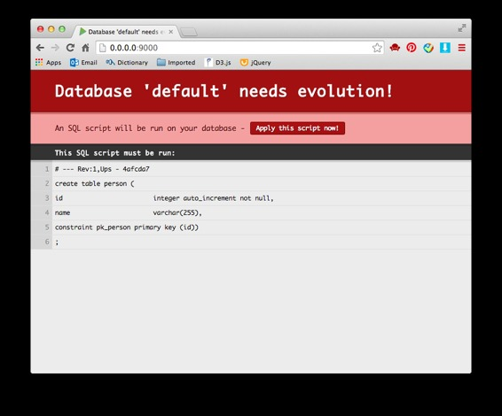
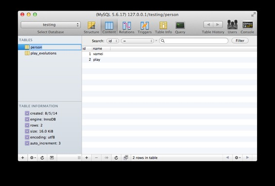
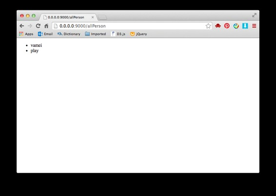

# 来玩 Play 框架 05 数据库

作者：Vamei 出处：http://www.cnblogs.com/vamei 欢迎转载，也请保留这段声明。谢谢！

数据库是整个站点的数据储藏室。用户提交的数据可以存储在数据库中，以便未来使用。Play 可以通过 JDBC 和数据库通信。我讲介绍 Play 和 mysql 数据库的连接。 

Play 2.*版本的默认操作数据库的方式是通过[Ebean](http://www.avaje.org/ebean/documentation.html)。Play 提供 Finder 这一帮助类型，可以实现一些简单的数据库查询。

### 数据库准备

在 mysql 中增加数据库 testing。增加用户"player"，密码为"player"。为用户 player 增加适当的权限。

```java
CREATE DATABASE testing DEFAULT CHARACTER SET utf8;
CREATE USER 'player'@'localhost' IDENTIFIED BY 'player';
GRANT SELECT, INSERT, UPDATE, DELETE, CREATE, DROP, INDEX, ALTER, CREATE TEMPORARY TABLES, LOCK TABLES ON testing.* TO 'player'@'localhost';
```

为了在 Play 中使用 mysql 数据库，需要在 conf/application.conf 中增加设置：

```java
# Database configuration

db.default.driver=com.mysql.jdbc.Driver
db.default.url="jdbc:mysql://127.0.0.1:3306/testing"
db.default.user="player"
db.default.password="player"

```

```java
# Ebean configuration
ebean.default="models.*"
```

还需要修改 build.sbt 为：

```java
name := "test"

version := "1.0-SNAPSHOT"

libraryDependencies ++= Seq(
  javaJdbc,
  javaEbean,
  cache,
  "mysql" % "mysql-connector-java" % "5.1.18"
)

play.Project.playJavaSettings
```

上面的改动完成后，使用 play run 来运行服务器。

### 创建模型

下面，我在模型中增加一个实体(entity)，即一个 Person 类。放入 models/Person.java

```java
package models;

import java.util.List;

import javax.persistence.Entity;
import javax.persistence.Id;

import play.db.ebean.Model;
import play.db.ebean.Model.Finder;

@Entity
public class Person extends Model {
    @Id
    public Integer id;
    public String name;

    // Query
    public static Finder<Integer,Person> find = 
            new Finder<Integer,Person>(Integer.class, Person.class);

    public static List<Person> findAll() {
        return find.all();
    }

    public static Person findByName (String name) {
        return find.where().eq("name", name).findUnique();
    }
}
```

Person 类继承自 Model 类，并有一个@Entity 的注解，从而说明它是模型中的一个实体。实体有两个场，整数的 id 和字符串的 name，用来保存数据。

@id 注解下，id 将不为空，不重复，并自动增加。

Person 还有一个静态的场 find。find 是 Play 提供的 Finder 类型，用于数据库查询。而 Person 类中得 findAll()和 findByName()的静态方法中，就调用了 find，从而在数据库中查询条目。

Play 有 evolution 模块，管理数据库的表。写好 Person.java 后，访问项目。Play 这时会生成在 mysql 中建立表格的脚本。运行该脚本即可。



### 增加数据库条目

增加一个动作。这个动作向数据库增加条目：

```java
public static Result addPerson() {
    Person p1 = new Person();
    Person p2 = new Person();
    p1.name = "vamei";
    p2.name = "play";
    p1.save();
    p2.save();
    return ok("Saved");
}
```

*** 上面的代码要 import models.Person。

将/addPerson 这一 URL 对应该动作。访问后，数据库将增加条目：



**练习** 根据[表单](http://www.cnblogs.com/vamei/p/3708612.html)一讲的内容，增加一个向数据库添加条目的表单。

### 数据库查询

我可以在动作中调用刚才定义的查询方法 findAll()和 findByName()，比如增加 allPerson()动作：

```java
public static Result allPerson() {
    List<Person> persons = Person.findAll();
    return ok(views.html.personList.render(persons));
}
```

上面查询得到的 Person 类型的表，传递给模板 views/personList.scala.html:

```java
@(personList: List[models.Person])

<!DOCTYPE html>
<html>
  <body>
    <ul>
      @for(person <- personList) {
        <li>@person.name</li>
      }
    </ul>
  </body>
</html>
```

修改 routes，增加对应的 URL 为/allPerson，页面如下：



事实上，我也可以在动作中直接调用 Person.find，来组成查询语句。这将让动作内部有更大的查询自由度。比如上面的动作可以改写成：

```java
public static Result allPerson() {
    List<Person> persons = Person.find.all();
    return ok(views.html.personList.render(persons));
}
```

### 总结

save()

Finder

欢迎继续阅读“[Java 快速教程](http://www.cnblogs.com/vamei/archive/2013/03/31/2991531.html)”系列文章