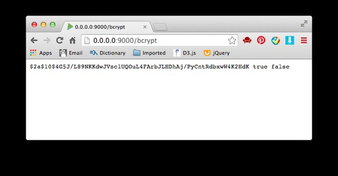
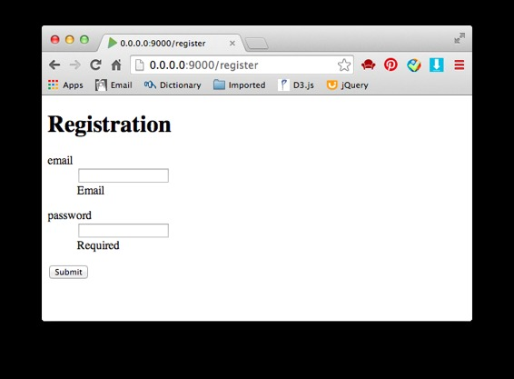
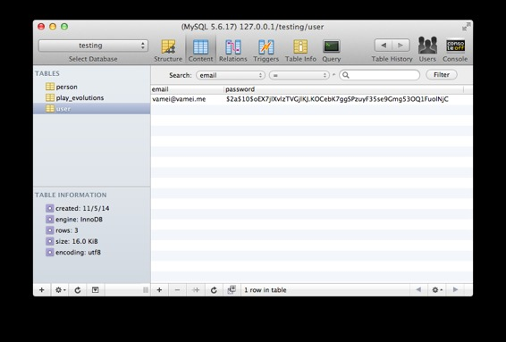
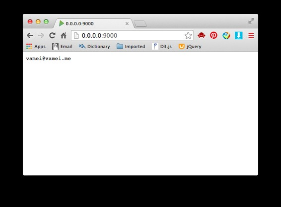

# 来玩 Play 框架 06 用户验证

作者：Vamei 出处：http://www.cnblogs.com/vamei 欢迎转载，也请保留这段声明。谢谢！

用户验证(User Authentification)复合的使用 Play 框架的数个功能，包括前面已经了解的表单和数据库，以及这篇文章里要提到的加密和会话。根据应用或站点的复杂程度，用户验证也可以随之变化。这里将介绍用户验证的一个基本实现方式。

### 加密

为了信息安全，用户密码需要加密，而不是保存为明文。Bcrypt 算法可以对明文密码进行哈希(Hash)转换。我保存在数据库中的密码，是经过转换后的文本。

JBcrypt 是一个外部的包，提供了 Bcrypt 功能。要在 build.sbt 中说明这个包的来源和版本：

```java
name := "test"

version := "1.0-SNAPSHOT"

libraryDependencies ++= Seq(
  javaJdbc,
  javaEbean,
  cache,
  "mysql" % "mysql-connector-java" % "5.1.18",
  "org.mindrot" % "jbcrypt" % "0.3m"
)

play.Project.playJavaSettings
```

即上面新增的 jbcrypt 行。重新运行 Play 后即可使用。为了 Eclipse 能自动补齐该包的相关调用，可以使用 play eclipse，并重新在 Eclipse 引入项目。

我下面用一个小例子，来说明该 Bcrypt 的哈希转换。在 Play 中增加动作：

```java
public static Result bcrypt() {
    String passwordHash = BCrypt.hashpw("Hello",BCrypt.gensalt());
    boolean correct = BCrypt.checkpw("Hello", passwordHash);
    boolean wrong = BCrypt.checkpw("World", passwordHash);
    return ok(passwordHash + " " + correct + " " + wrong);
}
```

上面程序需引入 org.mindrot.jbcrypt.BCrypt。动作中对"Hello"字符串进行了哈希转换，并验证"Hello"和"World"是否为原始的明文文本。

在 routes 增加对应 URL，/bcrypt

```java
GET     /bcrypt                     controllers.Application.bcrypt()
```

访问页面：



### 用户注册

有了[表单](http://www.cnblogs.com/vamei/p/3708612.html)、[数据库](http://www.cnblogs.com/vamei/p/3713820.html)和加密的基础，用户注册很容易实现。首先建立数据模型 app/models/User.java：

```java
package models;

import javax.persistence.*;
import play.db.ebean.Model;
import org.mindrot.jbcrypt.BCrypt;

@Entity
public class User extends Model {
    @Id    
    private String email;
    private String password;

    // Constructor
    public User(String email, String password) {
        String passwordHash = BCrypt.hashpw(password, BCrypt.gensalt());
        this.email = email;
        this.password = passwordHash;
    }
}
```

这段代码创建了 User 类，包含两个属性 email 和 password。在构造器中，我对密码进行了哈希转换。

下面修改控制器 Application(app/controllers/Application.java)。控制器中包含两个动作和一个表单类 Registration。一个动作 register()用于显示注册页面，另一个动作 postRegister 处理表单提交的信息，并增加相应的数据库记录。Registration 则对应注册页面所显示的表格：

```java
package controllers;

import play.*;
import play.mvc.*;
import play.data.Form;
import play.data.validation.Constraints.*;import models.User;

public class Application extends Controller {
    public static class Registration {
        @Email
        public String email;
        @Required
        public String password;
    }

    public static Result register() {
        Form<Registration> userForm = Form.form(Registration.class);
        return ok(views.html.register.render(userForm));
    }

    public static Result postRegister() {
        Form<Registration> userForm = 
                Form.form(Registration.class).bindFromRequest();
        User user = new User(userForm.get().email, userForm.get().password);
        user.save(); 
        return ok("registered"); 
    }
}
```

register()动作使用的模板为 app/views/register.scala.html:

```java
@(userForm: Form[controllers.Application.Registration])

<!DOCTYPE html>
<html>
  <body>
    <h1> Registration </h1>
    @helper.form(action = routes.Application.postRegister()) {
      @helper.inputText(userForm("email"))
      @helper.inputPassword(userForm("password"))
      <input type="submit">
    }
  </body>
</html>
```

在 routes 中为两个动作增加对应的 URL：

```java
GET     /register                   controllers.Application.register()
POST    /register                   controllers.Application.postRegister()
```

访问页面：



输入用户名和密码，可以看到数据库中增加的记录：



### 用户验证

将用户验证的主要逻辑放入到模型 User 中。修改 User 类，为 User 类增加 authenticate()方法：

```java
package models;

import javax.persistence.*;
import play.db.ebean.Model;
import org.mindrot.jbcrypt.BCrypt;

@Entity
public class User extends Model {
    @Id    
    private String email;
    private String password;

    // Constructor
    public User(String email, String password) {
        String passwordHash = BCrypt.hashpw(password, BCrypt.gensalt());
        this.email = email;
        this.password = passwordHash;
    }

    // Query
    public static Model.Finder<Integer, User> find = 
        new Model.Finder<>(Integer.class, User.class);

    // Authentification
    public static User authenticate(String email, String password) {
        User user =  find.where()
                .eq("email", email)
                .findUnique();
        if (user == null) {
            return user;
        } else if (BCrypt.checkpw(password, user.password)) {
            return user;
        } else {
            return null;
        }
    }
}
```

authenticate()接收的是明文密码。上面的验证中，首先检查用户邮箱是否存在。如果存在，则检查密码是否符合数据库的记录。如果邮箱或者密码错误，将返回 null。否则返回正确的用户对象。

我进一步修改控制器 Application。这一次还是增加两个动作和一个表单类。动作 login()用于显示登录页面，动作 postLogin()用于处理登录表单填写的信息，并根据信息决定是否登入用户。Login 类对应登录页面的表单。

```java
package controllers;

import play.*;
import play.mvc.*;

import play.data.Form;
import play.data.validation.Constraints.*;

import models.User;

public class Application extends Controller {

    public static class Registration {
        @Email
        public String email;
        @Required
        public String password;
    }

    public static Result register() {
        Form<Registration> userForm = Form.form(Registration.class);
        return ok(views.html.register.render(userForm));
    }

    public static Result postRegister() {
        Form<Registration> userForm = 
                Form.form(Registration.class).bindFromRequest();
        User user = new User(userForm.get().email, userForm.get().password);
        user.save(); 
        return ok("registered"); 
    }

    public static class Login {
        @Email
        public String email;
        @Required
        public String password;

        public String validate() {
            if (User.authenticate(email, password) == null) {
                return "Invalid user or password";
            } 
            return null;
        }
    }

    public static Result login() {
        Form<Login> userForm = Form.form(Login.class);
        return ok(views.html.login.render(userForm));
    }

    public static Result postLogin() {
        Form<Login> userForm = Form.form(Login.class).bindFromRequest();
        if (userForm.hasErrors()) {
            return badRequest("Wrong user/password");
        } else {
            return ok("Valid user");
        }
    }
}
```

上面的表单类 Login 中，增加了 validate()方法，并在其中调用 User 的验证逻辑。正如 postLogin()中所示，表单的 hasErrors()方法将自动检查 validate()方法的返回值。如果 validate()方法返回为 null，则说明表单无误。postLogin()的 if 结构，将根据登录是否合法，来返回不同的结果。

为新增的动作增加对应的 URL：

```java
GET     /login                      controllers.Application.login()
POST    /login                      controllers.Application.postLogin()
```

访问/login 页面，并尝试登录。

### 会话

[HTTP 协议是无状态的](http://www.cnblogs.com/vamei/archive/2013/05/11/3069788.html)。即使我在/login 登录成功，但下一次访问时，服务器又会忘记我是谁。HTTP 协议可以用会话(Session)的方式，来记录用户的登录信息。在会话有效期内，服务器可以识别相应客户的访问。Play 实现会话相当方便。

提交登录表格时，如果登录合法，我将让服务器开启和该客户的会话，记录客户的信息。因此，修改 postLogin()为：

```java
    public static Result postLogin() {
        Form<Login> userForm = Form.form(Login.class).bindFromRequest();
        if (userForm.hasErrors()) {
            return badRequest(views.html.login.render(userForm));
        } else {
            session().clear();
            session("email",userForm.get().email);
            return redirect("/");
        }
    }
```

这里用户登录成功后，将启动一个会话。在会话中，可放入键值对(key-value pair)形式的信息。这里的键名为"email"，对应值为登录用户的邮箱地址。登录成功后将重新定向到/。

增加 index()动作，对应/这一 URL。在该动作中，我调用 session 中保存的用户信息：

```java
    public static Result index() {
        String email = session("email");
        if (email != null) {
            return ok(email);
        } else {
            return ok("not login");
        }
    }
```

增加 routes 中对应的 URL：

```java
GET     /                           controllers.Application.index()
```

访问/login，并登录。成功登录后重新定向到/，页面为：



可以看到，会话中的信息可以持续到以后的页面访问。为了销毁会话，可以在某个动作中调用：

```java
session().clear();
```

### 总结

用户验证

会话

欢迎继续阅读“[Java 快速教程](http://www.cnblogs.com/vamei/archive/2013/03/31/2991531.html)”系列文章