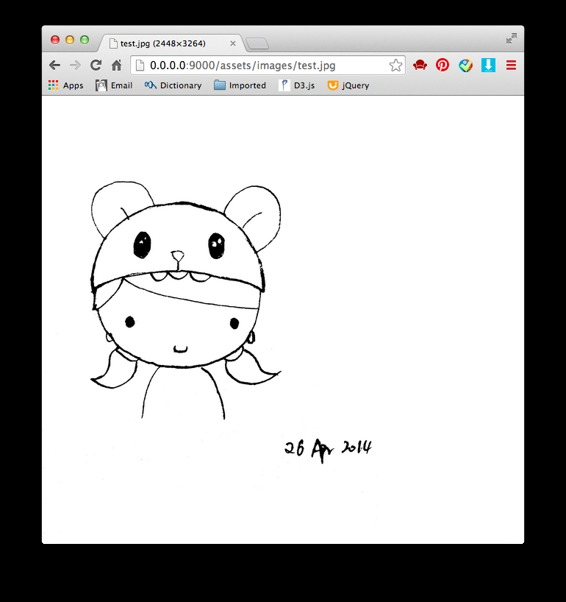
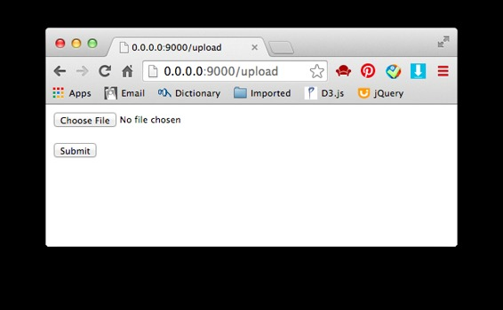

# 来玩 Play 框架 07 静态文件

作者：Vamei 出处：http://www.cnblogs.com/vamei 欢迎转载，也请保留这段声明。谢谢！

Play 框架的主要功能是提供动态响应的内容。但一个网络项目中必然有大量的静态内容，比如图片、Javascript 文件、CSS 文件等。我下面介绍如何在 Play 项目中加入静态文件。

### 默认路径

Play 项目的静态文件一般存储在根目录下的 public 文件夹。新建 Play 项目时，routes 文件会有下面的默认记录：

```java
# Map static resources from the /public folder to the /assets URL path
GET     /assets/*file               controllers.Assets.at(path="/public", file)
```

该记录将/assets/下的 URL，对应到项目的/public 文件夹内的文件。比如在项目的/public/images/test.jpg，就可以通过/assests/images/test.jpg 这一 URL 访问：



其它类型的静态文件，也都可以放入/public 文件夹中。 

在 Play 的模板中，也可以利用@routes.Assets.at("images/test.jpg")的方式，来调用静态文件的 URL。

### 文件上传

客户有时需要自行上传文件。我可以通过一个表单来让客户上传。表单的模板 app/views/upload.scala.html 为：

```java
@helper.form(action = routes.Application.upload, 'enctype -> "multipart/form-data") {
    <input type="file" name="picture">
    <p>
        <input type="submit">
    </p>
}
```

增加动作 uploadForm()，用于显示该模板：

```java
    public static Result uploadForm() {
        return ok(views.html.upload.render());
    }
```

文件上传的界面如下：



对于表单提交，我用动作 upload()来处理：

```java
    public static Result upload() {
          MultipartFormData body = request().body().asMultipartFormData();
          FilePart picture = body.getFile("picture");
          if (picture != null) {
            String fileName = picture.getFilename();
            String contentType = picture.getContentType(); 
            File file   = picture.getFile();
            // get the root path of the Play project
            File root = Play.application().path();
            // save file to the disk
            file.renameTo(new File(root, "/public/uploads/" + fileName));
            return ok(fileName + " " + contentType + " uploaded");
          } else {
            return badRequest("not a valid file");    
          }
    }
```

这里通过 multipart/form-data 的加密方式，来传输静态文件。文件传输成功后，我提取出 File 类型的文件对象，并利用 renameTo()方法，将文件保存到/public/uploads 路径下。

### CoffeeScript 和 LESS

Play 中可以用 CoffeeScript 编写前端 JavaScript。建立 app/assets/javascripts 文件夹。文件夹中放入.coffee 文件，比如 test.coffee。Play 将自动把.coffee 文件编译成.js 文件。在模板中，可以通过

@routes.Assets.at("javascripts/test.js")

@routes.Assets.at("javascripts/test.min.js")

来分别调用.js 文件或压缩后的.js 文件。用于 routes 中的设置，也可以用/assets/javascripts/test.js 直接访问。

Play 还可以用 LESS 来编写 CSS 文件。在 app/assets/stylesheets 中放入.less 文件，Play 将自动编译。用

@routes.Assets.at("stylesheets/test.css")

@routes.Assets.at("stylesheets/test.min.css")

在模板中访问。或者用/assets/stylesheets/test.css 直接访问。

### 总结

静态文件

文件上传

欢迎继续阅读“[Java 快速教程](http://www.cnblogs.com/vamei/archive/2013/03/31/2991531.html)”系列文章