# Android 的历史与花边

作者：Vamei 出处：http://www.cnblogs.com/vamei 欢迎转载，也请保留这段声明。谢谢！

### 历史 

现在的 Android 如日中天。每天 150 万部的 Android 设备被激活，全球 Android 用户有 7 亿。三星也凭借 Android 手机，成为第一大智能手机生产商。而 Android 在 2007 年最初发布时，当时负责微软移动开发的 Scott Horn 评论说，“我看不出他们(Android)能有多大的影响”。如今，Android 的成功已经不需要预测。

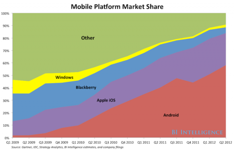

移动操作系统份额

Android 是 Google 收购的诸多项目的一个。Android 之父 Andy Rubin 最初只想做一个数码相机的操作系统。2005 年，Google 以五千万美元的价格收购了名不见经传的 Android。随后 Android 项目在花完资金后，陷入不温不火的尴尬境地。正当 Andy 为未来悲观时，苹果拯救了 Android。2007 年，乔布斯发布第一款 iPhone。全新的理念和无比友好的界面，立即震撼市场。Google 意识到这小小的掌上机隐含的威胁。很快，Google 从自己收购来的大把项目中找到 Android，以免费提供 Android 操作系统为诱饵，联合灰头土脸的手机生产商们对抗苹果。手机厂商挤不进苹果封闭的系统，也只能搭 Android 这条船。

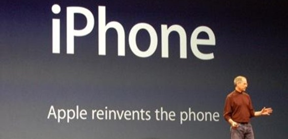

Google 擅长于网络，硬件和操作系统的积累较少。为了尽快建起防线，Android 采用了较为廉价的发展路线。Android 主要支持 ARM 架构的芯片。这一架构以精简节能著称。在 ARM 上层，Android 使用 Linux 内核，从而利用 Linux 丰富的硬件支持。在 Linux 内核之上，Android 以 Java 虚拟机(JVM)为蓝本，制作适宜移动端使用的 Dalvik 虚拟机。Dalvik 虚拟机中，运行着 App 代码。相比于 iPhone 长达数年的酝酿，Android 不到一年即发布产品，但这种四处借鉴的做法也为未来的专利之争埋下祸根。

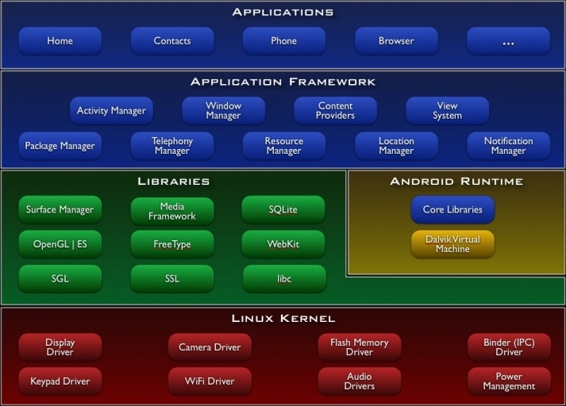

Android 架构

Android 初期只能跟在 iPhone 身后亦步亦趋。相对于 iPhone 的“高富帅”气质，Android 用户被标签为屌丝。开发者在 Google 应用商店的收益，也远低于在苹果的收益。然而，三星的 S 系列手机彻底改变了这一局面。Android 针对移动机的优化不足，因此相同硬件条件下，难以达到 iPhone 的流畅度。三星 S 系列手机利用超高的硬件配置来弥补这一缺陷。S 系列手机的超大屏，也是 iPhone 不具备。凭借 S 系列的成功，三星手机迅速拉升 Android 的市场占有率，反过来威胁到了 iPhone 的一哥地位。

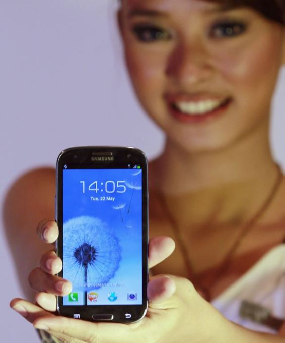

三星 S3

风向迅速转变。苹果无法以技术创新拉开距离，开始动用专利武器，对 Android 和三星提起诉讼。然而乔布斯手中的两百多项专利，并不能真正击败 Android。通过一些小的改动，比如将横向滑动的解锁改为不定向的滑动，Android 就可以避开专利陷阱。而三星甚至因为苹果的诉讼，提高了在美国市场的知名度。然而，Google 自己也没有预期到 Android 的成功，暗自后悔最初太保守。三星在 Android 阵营中的一家独大也让 Google 心生警惕。Google 花大价钱收购了摩托罗拉，打造自己的硬件生产线。

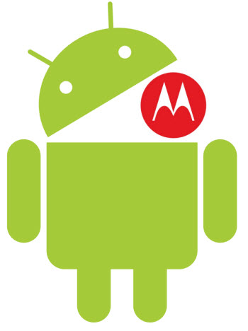

相对于苹果，更有破坏性的是 Oracle。从 Sun 手中买过 Java 后，Oracle 还没有从 Java 中获得太大的利益。而 Oracle 手中的 Java，也发展缓慢。然而这并不妨碍 Oracle 对 Android 的觊觎。Oracle 对 Google 提起系列诉讼，其中的理由是“Google 对 Java API 的改动，破坏了 Java 平台的完整性”。听起来有些空洞，却支撑起百亿美元的专利案。相对于此，Oracle 收购 Sun 的 56 亿美元，显得便宜得多。

无论 Android 的未来如何，都是智能手机大潮的一部分。在这股浪潮中，曾经的个人电脑巨人们被远远抛下。PC 的出货量已经开始衰落，不但被智能手机远远抛在后面，甚至被新生的平版电脑赶上。曾经的 PC 霸主们，Intel 和微软，开始思考自己的移动端策略。然而看看智能手机的增长曲线，留给他们的时间有限。

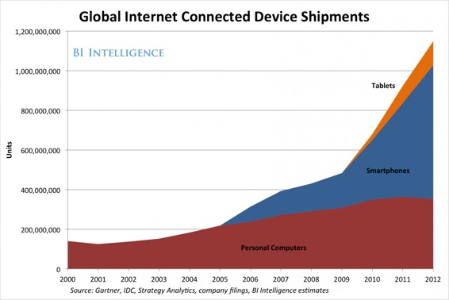

### 花边

最后，收集一些 Android 的梗。从经典的 Cupcake 开始，Android 的版本昵都是一种甜品，且首字母按顺序排列。

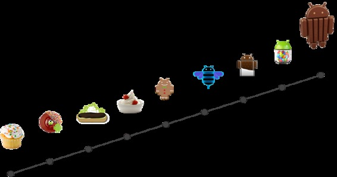

"Android"这个词早就存在，用于描述自动工作的机器。这个词的现代含义为人形机器人。Android 包含了 Android 之父 Andy 和 Droid。Droid 指《星球大战》中的机器人，是导演乔治卢卡斯捏造的。

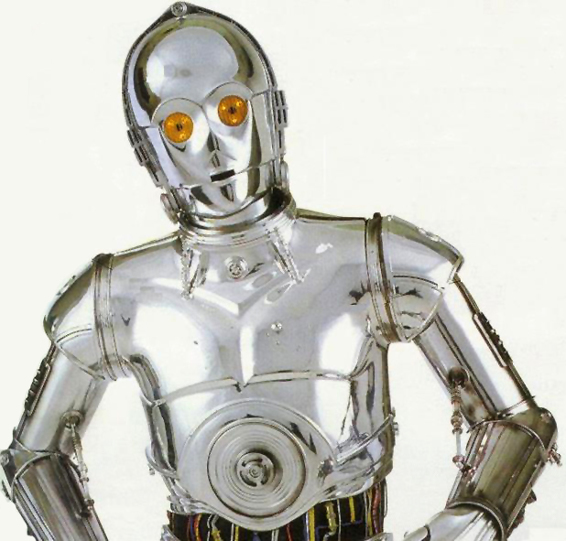

Android 的形象与一款老游戏中的叫做“Android”的人物相仿。这暂时还没有引起一宗新的专利案。

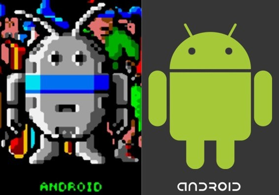

NASA(美国航空航天局)将一颗搭载 Google Nexus One 的超小型试验卫星 STRaND-1 送上太空。Android 作为卫星的大脑，收集信息，指挥卫星的运行和通信。如果温度过低，那么系统会增加运行的进程，避免电池过冷。太空轨道上还没有一台 iPhone。这一次，Android 领先。

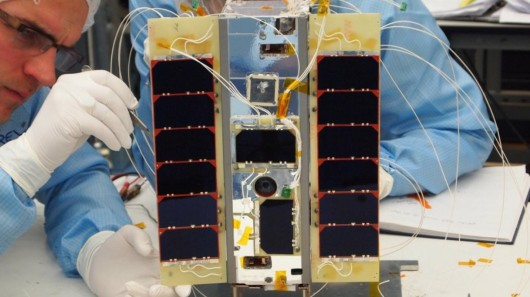

STRaND-1

我的第一台 Android 设备是 Motorola Charm，机械键盘，搭载 Android 2.1。如今已经走入历史了吧。

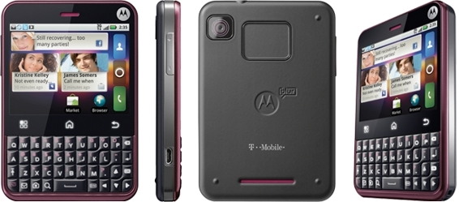

欢迎继续阅读“[Java 快速教程](http://www.cnblogs.com/vamei/archive/2013/03/31/2991531.html)”系列文章