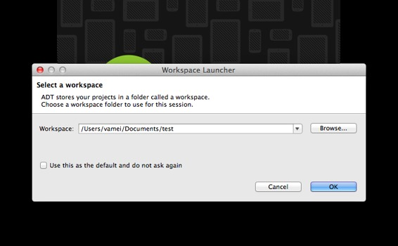
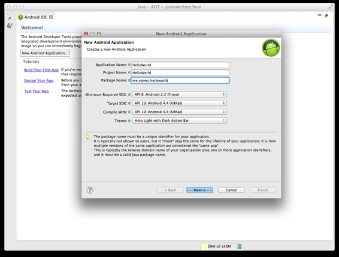
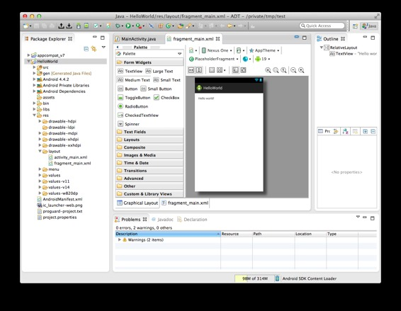
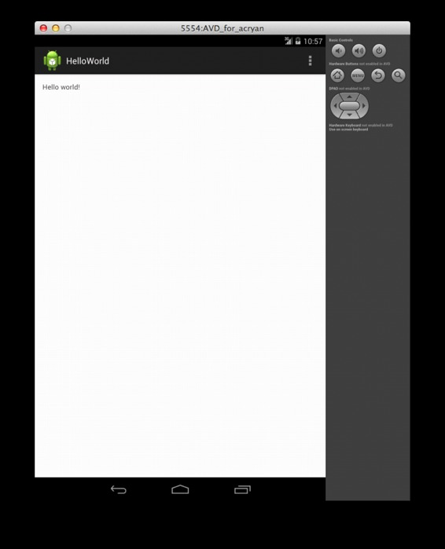
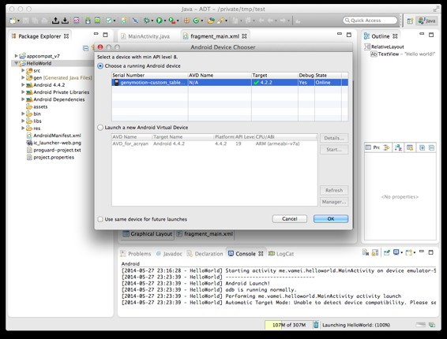
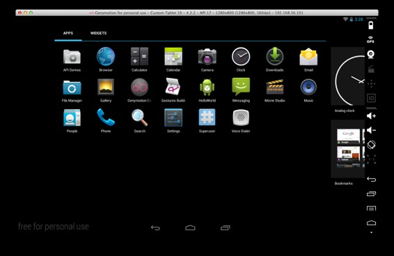

# 安卓第一夜 第一个应用 Android 的历史与花边

作者：Vamei 出处：http://www.cnblogs.com/vamei 欢迎转载，也请保留这段声明。谢谢！

承接“[Java 快速教程](http://www.cnblogs.com/vamei/archive/2013/03/31/2991531.html)”，我将开始写安卓相关的文章。

安卓（Android）开发主要使用 Java 语言。Java 语言基础，是安卓开发的第一道门槛。再者，一个好的安卓应用往往配合有远程服务器。这两方面，可以参考[Java 快速教程](http://www.cnblogs.com/vamei/archive/2013/03/31/2991531.html)中对 Java 语言和 Play 框架的讲解。安卓开发还需要其它技术的合作，包括操作系统、互联网、图形化界面、数据库等。可以说，移动开发是一个现实的战场，平常操练的各项本领都会派上用场。

从本质上讲，移动平台和传统的 PC 平台并无本质区别。两者都是在硬件平台上搭建一个操作系统，再在操作系统上运行应用程序。移动平台许多概念也源于 PC 平台，比如内核(kernel)、进程(process)、事件响应(event)。但移动平台有自己的特点，一个是性能弱于 PC，二是电量有限。移动平台必须要在这两个方面有针对性的优化。我们将在后面看到，安卓系统的许多新的设计和概念，都是在解决这两个问题。然而，即使是这些移动平台的专有新概念，也可以在传统技术中找到它们的影子。

移动开发相当有趣。我看到自己的代码能在一个小巧的设备上运行时，心里会有很大的成就感。而安卓这样的开放系统，还接管着诸如 Google Glass 有趣的硬件平台。当然，移动端发展时间比较短，所以相关技术经常会更新换代，所以要努力学习才能跟得上潮流。然而，考虑到移动端已经取得的巨大成功，以及移动端尚待开发的巨大潜力，移动端开发的技能都相当值得“上手”。安卓的相关历史，可见[Android 的历史与花边](http://www.cnblogs.com/vamei/p/3726620.html)。

安卓开发的最好资料是[Google 的文档](https://developer.android.com/training/index.html)。我在这个系列文章将以更循序渐进的方式推进，并不断引入开发所需的基础知识。这些基础知识大多来自我之前的文章。

### 开发环境 

在我们开始开发之前，先在命令行中尝试使用命令：

```java
javac
```

如果终端提示找不到命令，那么需要安装 JDK(Java Development Kit)。JDK 可以编译 Java 代码，所以是安卓开发所必须的。如果 JDK 缺失，你可以到[Oracle 的官网](http://www.oracle.com/technetwork/java/javase/downloads/index.html?ssSourceSiteId=otnjp)下载并安装。在 Linux 系统下，也可以安装应用商店中的 openJDK。

下一步是安装 ADT，ADT 中包含了 Eclipse 编辑器和 Android SDK。Eclipse 能很好的支持 Java 开发。我们会在 Eclipse 下编写代码、编译、运行和 debug。下载[Android Developer Tools](http://developer.android.com/sdk/index.html?hl=sk%20)(ADT)，并安装。ADT 有 Mac, Linux 和 Windows 版本。

*   在 Linux 下，解压缩，在 eclipse 文件夹下，运行可执行文件 eclipse，即可启动。你可以将 eclipse 所在文件夹放入 PATH 搜索路径中，方便以后使用。
*   在 Mac 下，用 Finder 找到 eclipse 文件夹中的 Eclipse，点击即可运行。你可以将该 Eclipse 拖到 Application 中，方便以后使用。
*   在 Windows 下，下载.exe 安装程序并安装。

*** 如果你已经有了 Eclipse，并且熟悉 Eclipse 插件的配置，可以只下载 Android SDK，并在 Eclipse 中导入。 

### 生成第一个应用

启动 ADT，设置 Work Space 路径，即 Eclipse 的工作路径。



进入 Eclipse 后，点击 New Android Application，来创建新的 App。你也可以沿：

File -> New -> Android Application Project

来创建新的应用。



填写 App 名字，即 HelloWorld。按照 Java 包的命名规则，将 Package Name 改为 me.vamei.helloworld (vamei.me 是我的域名，不过一直没打理)。然后一路 Next，直到 Finish。

创建新应用后，我们就到了 Eclipse 的主界面:



左侧的 Package Explorer 中可以浏览 HelloWorld 应用下的所有文件。点击后，文件内容将在右侧的编辑器主界面中打开。

### 运行第一个应用

我们可以在 ADT 中，控制应用的安装和运行

Run -> Run As -> Android Application 

由于我们还没有注册其它的安卓设备，此时安卓将自动运行模拟器(emulator)。模拟器从你的电脑中分出计算和存储资源，生成一个虚拟的安卓设备。HelloWorld 应用将安装到模拟器中。可以在右下角的 Console 监视整个过程。



友情提醒：安卓自带的虚拟器确实很方便，但真的是太慢了。时间都够现磨一杯咖啡了。

### 其它设备

由于安卓自带虚拟器太慢，因此可以用 USB 连接安卓设备。大部分的安卓设备可以自动识别。当你点击 Run 时，将弹出选择设备的窗口。



我最近听朋友说[Genymotion 虚拟器](http://www.genymotion.com/)速度不错。它是基于[VirtualBox](https://www.virtualbox.org/wiki/Downloads)的。安装 VirtualBox 和 Genymotion，然后在 Genymotion 中添加设备。该虚拟器也将出现在选择设备的窗口。速度大大超过了安卓自带的虚拟器。



我个人试用了一下，速度确实不错。

### 总结

创建新应用

运行应用

欢迎继续阅读“[Java 快速教程](http://www.cnblogs.com/vamei/archive/2013/03/31/2991531.html)”系列文章