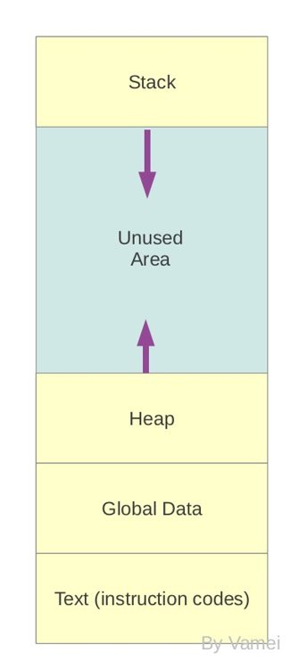
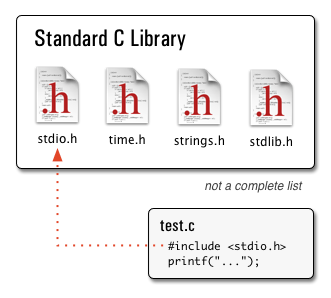
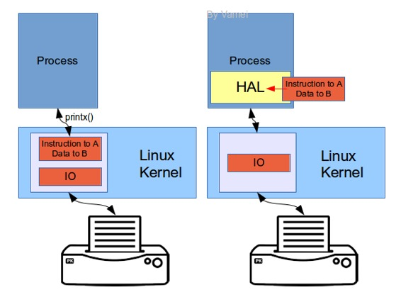

# 安卓第二夜 有趣的架构 Linux 从程序到进程 Java 内存管理与垃圾回收

作者：Vamei 出处：http://www.cnblogs.com/vamei 欢迎转载，也请保留这段声明。谢谢！

学习安卓的架构，是从操作系统的角度理解安卓。安卓使用 Linux 内核，但安卓的架构又与常见的 Linux 系统有很大的区别。我们先来回顾一下传统的 Linux 架构，再来看安卓的变化。

### Linux 系统架构

先来看常见的 Linux 系统架构，你可以参考[Linux 的架构](http://www.cnblogs.com/vamei/archive/2012/09/19/2692452.html)

 

内核是系统的底层。Linux 开机后，内核即启动，并存活于属于自己的内存空间，即内核空间(kernel space)。内核的一大功能是和硬件通信。内核中包含各种驱动程序，这些驱动程序既能实现底层的硬件读写操作，又包含硬件使用逻辑。比如一台打印机的驱动，会把打印指令放在内存中的 A 位置，把打印数据放在内存中的 B 位置。打印机读取指令后，会从 B 位置取得数据打印。在内核上层，驱动程序的功能被抽象为函数调用，比如 printx(data)。这个函数调用隐藏了许多细节，比如如何执行读写，以及 A 和 B 的具体位置。

除了抽象硬件外，内核还维护着 Linux 的许多重要运行机制，比如虚拟内存、调度器、信号以及进程间通信(IPC)。内核的功能接口是系统调用(system call)函数。

用户使用 C 或者 C++编写的程序，将编译成机器码，运行成为一个进程(process)。每个进程都会有一个自己的进程空间。进程空间存活于内核空间之外的用户空间(user space)。进程空间中包含程序的代码和数据。不同进程的进程空间相互独立。进程间如果想要相互交流，需要借用特殊的进程间通信(IPC)机制。进程空间中有栈(stack)和堆(heap)。当执行到新的函数调用时，栈顶会增加一帧(stack frame)，用于记录该函数的数据和返回地址。当函数执行完成时，该帧会弹出，并根据返回地址接着执行母程序的指令。堆中的空间由程序自由分配。你可以进一步参考[Linux 从程序到进程](http://www.cnblogs.com/vamei/archive/2012/10/09/2715388.html)。

一个进程空间

Linux 的程序大多是 C 和 C++编写。代码被编译为机器码，以便计算机理解。常用的代码被编译成库(library)。程序员可以从自己的程序中调用库函数，来重复利用已有代码。程序中调用库函数时，库中包含的机器代码会加载入程序对应的进程空间。

 

### Android 架构

我们现在来看看安卓的架构。Android 的底层使用的是 Linux 内核。在用户空间中，每个应用也会运行为一个进程。但安卓细节方面和传统 Linux 差别很大。

**HAL**

安卓驱动硬件的方式与 Linux 不尽相同。传统 Linux 的驱动完全存活于内核空间。Android 则在内核外部增加了硬件抽象层(HAL, Hardware Abstraction Layer)，把一部分驱动功能放到 HAL 层中。你或许会奇怪，安卓为什么费尽麻烦增加一个 HAL 呢？为了保护源代码。Linux 内核采用了 GPL 协议，所以硬件生产商想要支持 Linux 系统，必须遵照 GPL 协议公开硬件驱动的源代码。但这些源代码中包含有许多硬件的设计信息，牵涉到硬件生产商的核心利益。而增加了 HAL 层之后，硬件厂商就不需要开放所有的驱动代码了。

我们来看看 HAL 的具体工作方式。安卓的 HAL 存活在用户空间，它与内核驱动通信。但 HAL 是个“空壳”，安卓会根据需要，加载不同的动态库，比如调用计算机时，载入 libprinter.so。这个动态库是由硬件厂商提供的。比如上面的打印机，硬件厂商可以把读写功能做成驱动。而“指令写入位置 A、数据写入位置 B”这样的高层逻辑，则编译成库文件(.so)。当我们使用打印机打印时，我们将打印需求和数据发送给 HAL。HAL 加载对应的动态库，通过内核驱动的读写功能，将指令写入打印机的内存位置 A，数据写入位置 B。打印机预装的程序从位置 A 读到打印指令，就会从位置 B 读取数据，实现打印。这样，HAL 实际上把部分驱动功能放入到动态库中，内核中的驱动只保留最基本的读写操作功能。部分驱动功能从内核空间转移到了用户空间。由于高层逻辑是编译好的.so 文件，打印机厂商不用担心如指令位置 A、数据位置 B 这样的信息泄露。

左为 Linux，右为安卓 HAL

安卓的 HAL 模块是从 Linux 内核导出的，所以源代码公开。HAL 是 Apache 协议，并不要求它的配套程序，如硬件驱动的源码公开。由于这些库函数没有直接调用内核，所以不需要释放源代码。通过 HAL 层，安卓保护了硬件厂商的商业利益，鼓励了硬件厂商对安卓系统的支持。

当然，Linux 开发小组对此很不高兴，把安卓的开发分支从 Linux 内核中删除。

**Dalvik 虚拟机**

安卓的应用是由 Java 编写的，而包括 HAL 在内的 Linux 的库都是由 C/C++编写的，这个落差由 Dalvik 虚拟机衔接的。当一个应用运行时，进程空间内将包含一个 Dalvik 虚拟机。Java 程序编译为字节码文件，运行在 Dalvik 虚拟机中。根据 Java 代码中的要求，Dalvik 通过 JNI(Java Native Interface)调用底层的 C/C++编写的功能。JNI 是从 Java 中调用 C/C++模块的接口。由于上层接口的标准化，字节码可以畅通无阻的跨平台运行。

 

Dalvik VM

Dalvik 虚拟机内部是一个“虚拟”进程空间，有自己的栈和堆，管理代码的运行流程。如果这以“虚拟”进程空间不足，Dalvik 内建的垃圾回收(garbage collection)机制会自动清空堆上不再使用的对象。自动的垃圾回收简化了程序员的工作，但速度较慢。手动内存管理效率高，但需要更多的编程，且容易犯错。垃圾回收的具体原理可参考[Java 内存管理与垃圾回收](http://www.cnblogs.com/vamei/archive/2013/04/28/3048353.html)。 

当然，Oracle 不高兴，认为 Dalvik 是对 JVM 赤裸裸的抄袭。

**Core Library 和 Android Framework**

Android 程序员的主要工作是编写 Dalvik 上运行的 Java 程序。Google 提供了核心类库(Java core library)，它包括 Java 的常用类库，如:

*   java.lang
*   java.util
*   java.math
*   java.net
*   ...

这些类库的 API，与 Oracle 的官方 API 相同，所以你可以按照同样的方法调用。

核心类库中还包括 Dalvik 虚拟机的调用接口：

*   dalvik.annotation
*   dalvik.bytecode
*   dalvik.system

安卓程序员还可以调用一些针对安卓的类库，即安卓框架(Android Framework)。这些类库对应安卓的特定功能。通过它们，我们可以操纵安卓上的各个功能模块，从触屏到 GPS，从视图元素到数据库。如：

*   android.database
*   android.bluetooth
*   android.gesture
*   ...

[安卓相关的类库列表](http://developer.android.com/reference/packages.html)

核心类库和安卓框架是安卓程序员的左膀右臂。再加上 Java 语言本身的逻辑，这就是安卓程序员战斗着的世界了。我会在以后的文章中，继续深入这个战场。

多谢微博 @文艺复兴记 指导我 Dalvik 的相关内容。下面资料也帮助了我理解：

http://sujaiantony.wordpress.com/2012/06/25/an-android-101-hardware-and-hal/

### 总结

HAL

Dalvik

Core Library

Android Framework

欢迎继续阅读“[Java 快速教程](http://www.cnblogs.com/vamei/archive/2013/03/31/2991531.html)”系列文章