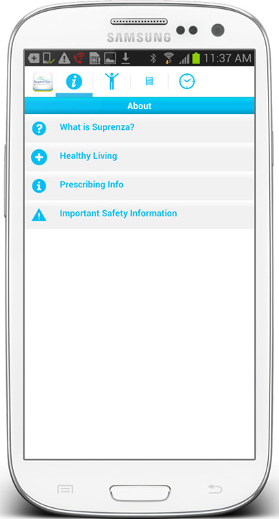
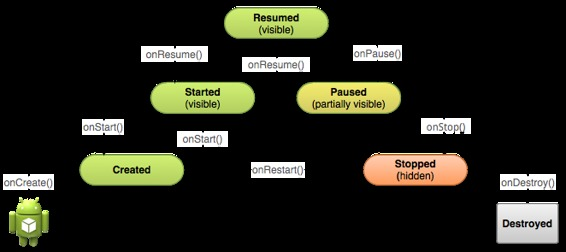

# 安卓第三夜 概念漫游（上）

作者：Vamei 出处：http://www.cnblogs.com/vamei 欢迎转载，也请保留这段声明。谢谢！ 

拿起一个手机，总是满屏的应用图标。点击图标，选择应用，玩一把游戏，刷一下微博，写一篇日记。“叮咚”一声，邮件应用提醒有一封新来的邮件。在安卓里，眼花缭乱的应用承载着各种有趣的功能。欢迎来到安卓应用的世界。

每一个应用都是存储在手机中的一段小程序。编写这段小程序，是每个安卓开发者的主要工作。程序运行后成为一个进程后，在进程的内存空间中新建一个 Dalvik 虚拟机。程序预设的各种视觉效果和功能，都会在这一虚拟机中进行。如同一个小小的军团，安卓应用也需要不同功能的单元配合。

### Activity

> 步兵是军团的基石

使用手机的大多数时候，你会停留在某一个“页面”，比如和恋人的对话页面、切水果页面、相机的取景页面。用安卓的术语讲，页面是一个 Activity，它是一个占据整个屏幕的界面。用户和手机可以通过 Activity 交流。页面，也就是 Activity，是手机应用中如此常见的概念，以至于用户有时会忽视它们的存在，就像那些无比普通的小步兵。

观察这些页面，我们会发现一些共同点。

*   Activity 包含一些特别的视觉元素，比如一个竖直列表、一个彩色的背景或者一个小小的按钮。
*   Activity 呈现各种信息，比如图片、文字、输入栏等等。静态信息之外，Activity 也可以播放动态的动画或视频。
*   用户可以与 Activity 互动，输入信息、点击按钮、上下滑动，而 Activity 会根据这些互动动作，触发特定的效果。

一个应用往往包含多个页面。在某些情况下，我们会从当前 Activity 离开，激活并前往下一个 Activity。在联系人条目菜单的页面上，点击某个联系人，进入一个新的页面，这个新的页面上包含该联系人的具体信息；再点击返回键，我们退出了包含具体信息的页面，又回到联系人条目菜单的页面上。应用的进程空间中有一个栈(stack)，用来记录我们依次激活的各个 Activity。新激活的 Activity 被压入到栈的顶端。在手机屏幕上，我们只能看到栈顶的这个 Activity，也只能和该 Activity 互动。当我们点击返回键时，当前 Activity 结束，从栈中弹出。上一个被激活的 Activity 出现在栈顶，重新占领手机屏幕。这也就是我们按返回键时，能回到历史页面（联系人条目菜单）的原理。

正如默默守卫的小步兵，Activity 也总是处于一种相对静止的某个状态，比如运行、暂停、停止等。Activity 的许多功能，都是在状态切换中完成的。状态转换过程中执行的命令，都是程序员预设好的，包含在特定的方法中。比如一个 Activity 从未激活状态到运行状态的过程中，会自动执行 Activity 对象的 onStart()方法。安卓程序员在该方法中，设计 Activity 在目标状态的效果：实现特定的页面布局，为按钮注册回调函数，访问互联网获取信息等。再比如，Activity 从暂停到恢复的状态，会执行 onRestart()方法。安卓程序员可以在该方法中，实现诸如调整亮度和弹出提示之类的功能。这正如小兵在平时训练时，预设了切换过程中要做的事情。小兵从一个状态进入到另一个状态，比如从“警戒”到“预备射击”。在该状态过程中，士兵执行预设动作，即装填子弹，随即进入射击待命状态。

Activity 的状态与转换方法

有趣的是，一个安卓的 Activity 与互联网上的一个 Web 页面非常相似。它们都是充斥屏幕的页面，包含视觉元素和信息。用户可以通过这样的页面实现某些功能。就连这些界面的编写方式，也有相似之处：安卓用 XML 设计一个页面，而 Web 用 HTML 设计一个页面。你甚至于可以把一个应用直接看做包含了多个页面的小型网站。

### Service

> 应用得当，骑兵是战场上的一把利剑。

安卓军团的另一个重要组成部分是 Service。在安卓应用中，Activity 负责的界面大部分时间处于相对静止的状态，直到有特定的触发时间发生。这种异步的工作方式，能有效的节省系统资源。然而，有一些工作需要一个持续运行的程序来负责的，比如：

*   每五分钟登录邮件服务器，检查新邮件
*   保持联系人条目与云服务器同步
*   相对大运算量的工作，比如图像和视频编辑 

这些工作并不需要界面交互。必须的时候，安卓应用可以启动一个 Service。Service 在背景运行，来负责上述的需要长时间运行的工作。Service 对象本身在主线程内工作。在设计 Service 时，安卓程序员一般会为 Service 内大计算量的部分开启新线程，以便不影响主线程的运行。当我们刷微博时，背景 Service 中访问互联网，以获得新的微博，并更新到微博列表页面。Service 中的互联网访问不会影响到阅读旧有的微博条目。Service 尽管功能强大，但它持续运行的工作方式会比较消耗运算资源。在手机这样运算资源有限的移动平台上，Service 就好像一支精贵的骑兵。

 

### Broadcast Receiver

> 预备队，随时待命。

除了 Activity 和 Service，安卓应用还有一种重要的功能单元，就是 Broadcast Receiver。它的功能比较简单，就是在接收到系统广播后，执行特定的功能。Broadcast Receiver 接收的是 Intent 对象，将在后面详解。

### Intent

> 传令兵少送了一道命令，军团输了一场战争。

上面讲了 Activity 和 Service，每个 Activity 和 Service 之间都可以实现特定的功能。一个完整的应用需要将这些单个的功能个体粘合起来，比如从一个 Activity 启动另一个 Activity，在比如从一个 Activity 内部启动一个 Service。安卓中的 Intent 就是军团中的传令兵，粘合各个功能单元。

Intent 对象说明了下一步要做的事情，比如启动一个 Activity 或 Service。我们可以在旧的 Activity 中发起一个 Intent 对象，从而连接新旧的功能单元。在 Intent 对象中，可以说明要激活的功能单元，比如具体某一个 Activity。Intent 还可以附加数据，交给新的功能模块。

如果不具体说明要激活的功能单元，Intent 对象可以只说明想要执行的动作，而由安卓系统寻找合适的下家。这样的 Intent 对象会传给安卓系统。安卓系统根据 Intent 的要求，在整个系统范围内遍历，找到合适的 app 来处理。合适与否，是由接收方的 Intent Filter 来决定的。每一个 app 的功能单元在编写时，都会附加一个 Intent Filter 的说明，注明该功能单元愿意执行的动作。如果 Intent 中说明的动作与 Intent Filter 说明的吻合，那么该 app 就是一个备选对象。如果有多个合适的备选对象，安卓手机会跳出菜单，供用户选择。

Intent 和 Intent Filter

### 总结

这里提到了安卓开发中最基本的一些概念。大体看来，一个安卓应用总是由数个功能单元构成，这些功能单元由 Intent 连接。我将在后面的文章中，深入更多细节。

功能单元：Activity, Service, Broadcast Receiver

胶水：Intent

欢迎继续阅读“[Java 快速教程](http://www.cnblogs.com/vamei/archive/2013/03/31/2991531.html)”系列文章