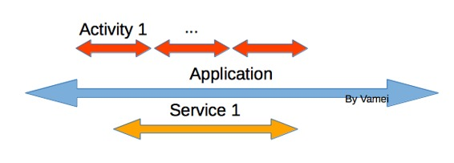
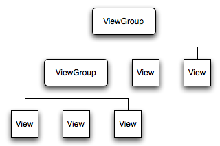
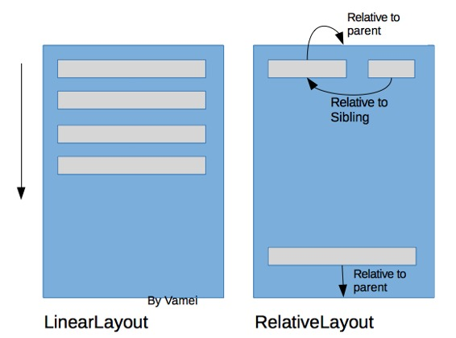
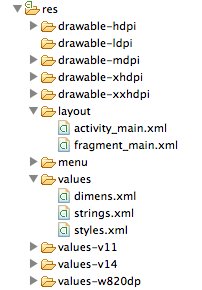

# 安卓第四夜 概念漫游（下）

作者：Vamei 出处：http://www.cnblogs.com/vamei 欢迎转载，也请保留这段声明。谢谢！

在[安卓第三夜 概念漫游（上）](http://www.cnblogs.com/vamei/p/3657249.html)中，我介绍了安卓最基本的功能单元和 Intent 的连接方式。在这个骨架之上，我们可以进一步增加一些与开发密切相关的重要概念。

### Context

一个应用是由多个 Activity 和 Service 这样的功能单元组成。一个应用共享有一个 Application Context 对象。在功能单元内部，可以用特定的方法来调用该对象。正如名字所表示的，Context 对象记录了应用所处的环境。如同新生儿的功能单元，可以通过查询 Context 对象，了解当前的周边状况，比如屏幕的尺寸。这个 Context 对象还中包含了许多应用级别的功能，比如加载应用资源。一个 Context 对象与对应应用共存。它在应用运行之初即创立，直到应用结束运行。整个过程中，应用的功能单元就好像共同沐浴在 Application Context 这个温水池中，随时享受着沐浴带来的舒适。


Context

除了一个应用中唯一的 Application Context 对象，应用运行过程中还可能创建其他的 Context 对象。Activity 类和 Service 类都继承自 Context 类，所以 Activity 对象和 Service 对象也都是 Context 对象，我把它们称为 Activity Context 和 Service Context。这两种 Context 对象与对应的 Activity 对象和 Service 对象有相同的生命周期。它们为内部的对象，提供了周边信息和功能。比如在创建一个 UI 元素 View 的时候，就需要把 Activity Context 对象作为参数传给该 View。在 Activity 结束时，对应的 Activity Context 对象也会销毁。在 Activity 和 Service 内部，可以通过 this 来调用对应的 Activity Context 和 Service Context 对象。Activity Context 对象提供了启动一个新的 Activity 的功能，而 Service Context 对象则没有 UI 相关的功能。

不同类型的 Context 对象在功能上有许多重叠的地方，比如都可以启动一个 Service。但要注意它们生命周期的不同。Application Context 对象有最长的生命周期。过度依赖 Application Context 对象，可能导致内存泄露。所以，原则上要尽可能的使用 Activity Context 和 Service Context 对象来实现 Context 类的功能。



Life Cycles 

### View

Activity 是一个屏幕界面。界面上总是有各种各样的视图元素，比如一个按钮，一行文字和一个输入栏。每一种视图元素在安卓中表示为一个 View 类，比如 Button 类，TextView 类和 EditText 类。安卓的视图元素很多样，就连图片和网页也都有对应的视图元素。除了具体的视图元素，View 类还有一个 ViewGroup 的子类。多个 View 对象可以归属于一个 ViewGroup 对象，而 ViewGroup 对象往往定义了下属视图元素的布局关系，比如自上而下线性排列，或者格点式排列。通过这样的归属关系，一个 Activity 的所有视图元素和抽象布局构成一个视图树。这棵树就包含了整个屏幕的视图信息。



视图树

在安卓设计中，我们往往要给 View 元素增加各种属性，以控制它们的文字、尺寸、大小、颜色等信息。对于 ViewGroup 来说，它有多个子类，代表了不同的布局方式。比较常见的有线性布局 LinearLayout 和相对布局 RelativeLayout。线性布局是沿着一个方向线性排列视图元素，而相对布局则定义了视图元素和母 View 对象或兄弟 View 对象的相对位置关系。通过嵌套使用多种布局，我们可以创造出复杂的界面布局方式。



在一个 Activity 中，我们可以通过新建 View 对象的方式，用编程的手段来创建视图树。视图元素的属性可以通过 View 对象的方法来调整。但更常用的方法是定义一个 XML 文件。利用 XML 天然的树形结构来表示一个视图树。一个 XML 节点对应一个 View 对象，View 对象的属性可以记录在节点的属性中。 安卓可以理解这样的 XML 定义，并把 XML 节点实例化为内存中的对象，也就是 Layout Inflate 的过程。比如下面的 XML 记录：

```java
<?xml version="1.0" encoding="utf-8"?>
<LinearLayout 
              android:layout_width="match_parent"
              android:layout_height="match_parent"
              android:orientation="vertical" >
    <TextView android:id="@+id/text"
              android:layout_width="wrap_content"
              android:layout_height="wrap_content"
              android:text="Hello, I am a TextView" />
    <Button android:id="@+id/button"
            android:layout_width="wrap_content"
            android:layout_height="wrap_content"
            android:text="Hello, I am a Button" />
</LinearLayout>
```

它表示了一个线性布局，包含了一个文字视图和一个按钮。

从 3.0 之后，安卓引入了 Fragment。Fragment 与 Activity 一样，包含了一个视图树。由于一个 Activity 可以包含多个 Fragment，也就是多个视图树，这就增加了界面设计的灵活性。毕竟，在 Fragment 以前，Activity 只能包含一个视图树，比较死板。有了 Fragment 之后，程序员可以根据 Activity 的当前状况，来选择所包含的视图树，比如在手机屏幕显示一个 Fragment，而在平板上显示两个 Fragment。这样，视图的设计也可以重复利用不用不同的设备了。

Fragment 的运行方式与 Activity 类似，也是在状态转换中调用 onStart()等方法。

### Resource

在安卓开发中，有可能需要一些静态资源，比如图片、字符串、XML 文件等等。这些资源被存储在安卓项目 res/下不同的文件夹中。



不同资源分类存放。我们上面提到用 XML 来定义布局，它们就保存在 layout 下。drawable*的文件夹中包含不同清晰度的图片，而字符串存放在 values 下的 strings.xml 中。在安卓项目中，我们可以用 ID 或文件名，来引用对应的资源。

### 总结

Context: 环境信息和功能

View: 视图

Resource: 静态资源

欢迎继续阅读“[Java 快速教程](http://www.cnblogs.com/vamei/archive/2013/03/31/2991531.html)”系列文章