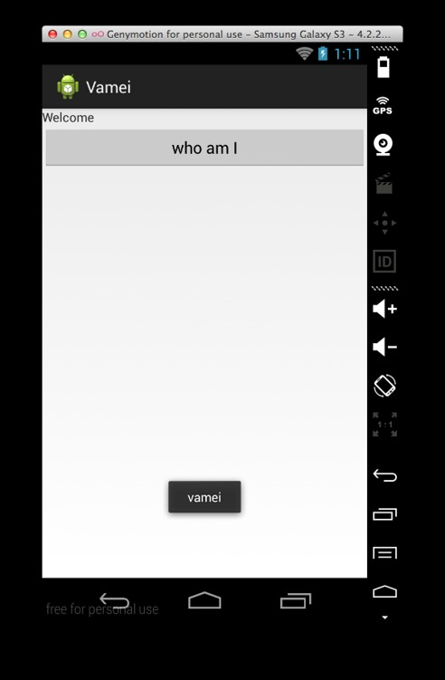

# 安卓第五夜 维纳斯的诞生

作者：Vamei 出处：http://www.cnblogs.com/vamei 欢迎转载，也请保留这段声明。谢谢！

之前各讲中，分别讲解了安卓的开发环境、架构和基本概念。从这一讲开始，我将制作一个简单的应用，并通过逐步升级它的功能，连带出安卓开发的多个情境。

《维纳斯的诞生》是文艺复兴早期名画。相传美神维纳斯从海的泡沫中诞生，波提切利用大胆的笔触描绘这一古典神话。画面洋溢着对人体和美的热爱。如果在中世纪或者西班牙宗教审判时期，这幅画足够波提切利上火刑架了。 


### 任务描述

我将制作一个简单的欢迎页面。页面中有一个按钮。点击后，将显示制作人姓名。

知识点包括：

*   新建 Activity：通过继承 Activity 类，来创建一个新的类。
*   页面布局：LinearLayout
*   按钮点击监：OnClickListener
*   临时显示简单的文字信息：Toast 用于显示简单的文字信息

### 编写视图

按照[安卓第一夜 第一个应用](http://www.cnblogs.com/vamei/p/3649342.html)中的介绍，创建一个 Android 项目 Vamei，项目包的名字为 me.vamei.vamei。

我将要创建一个页面。这个页面的视图定义在 res/layout/activity_main.xml 中。从[安卓第四夜 概念漫游（下）](http://www.cnblogs.com/vamei/p/3889215.html)中，我们已经知道，这个 XML 文件描述了一个视图树。内容如下：

```java
<LinearLayout 

    android:orientation="vertical"
    android:layout_width="match_parent"
    android:layout_height="match_parent" >

    <TextView 
        android:layout_width="match_parent"
        android:layout_height="wrap_content"
        android:text="Welcome" />

    <Button
        android:id="@+id/author"
        android:layout_width="match_parent"
        android:layout_height="wrap_content"
        android:text="@string/btn_text" />

</LinearLayout>
```

这里采用了线性布局 LinearLayout，根据它的 orientation 的属性"vertical"，视图元素将从上向下排列。线性布局中包含一个 TextView，以及一个 Button 按钮。TextView 用于显示文本"Welcome"。

视图元素有 layout_width 和 layout_height 属性，分别定义元素的宽度和高度。这两个属性可以是具体的数值，比如"10px"，也可以是：

*   "match_parent"：与母元素相同
*   "wrap_content"：与包含的内容相同，如文字本身的尺寸

Button 还有一个 id，即 author。在程序中我们可以借用这个 id 来引用该按钮。Button 上文本是一个字符串。注意符号@，表示这里引用了一个名为 btn_text 的字符资源。我们当然可以像"Welcome"那样直接使用一个字符串，但引用字符资源有额外的好处。我们可以在程序的多处重复利用的同一个资源条目，从而便于修改。该字符串保存在 res/values/strings.xml 中：

```java
<?xml version="1.0" encoding="utf-8"?>
<resources>
    <string name="app_name">Vamei</string>
    <string name="action_settings">Settings</string>
    <string name="author">vamei</string>    
    <string name="btn_text">who am I</string>
</resources>
```

可以看到，名为 btn_text 的字符串资源为"who am I"。

### 编写 Activity

上面 XML 定义的视图是静态的。想要实现动态的应用，我还需要一个配套的 Activity。在 src 文件夹下的 me.vamei.vamei 包中，会有一个 MainActivity.java。这个 Java 文件中包含一个 MainActivity 类，继承自 Activity。我将其中的代码修改为：

```java
package me.vamei.vamei;

import android.app.Activity;
import android.os.Bundle;
import android.view.View;
import android.view.View.OnClickListener;
import android.widget.Button;
import android.widget.Toast;

public class MainActivity extends Activity {

    @Override
    protected void onCreate(Bundle savedInstanceState) {
        super.onCreate(savedInstanceState);

        // attach view tree to the activity
        setContentView(R.layout.activity_main);

        // monitor "click" action for the button
        Button btn = (Button) findViewById(R.id.author);
        btn.setOnClickListener(new View.OnClickListener(){
            @Override
            public void onClick(View view) {
                Toast.makeText(MainActivity.this, 
                        getString(R.string.author), 
                        Toast.LENGTH_LONG).show();
            }
        });
    }
}
```

在这个类中，我只包含了一个 onCreate()方法。当应用启动时，安卓将调用 onCreate()方法。该方法有一个 Bundle 类型的参数，记录 Activity 的状态，我将在以后讲解。

onCreate()方法中主要做了两件事：

1.  连接 Activity 与视图树。setContentView()方法为 Activity 增加了视图树。这里引用了 activity_main.xml 中的视图树。可以注意到，安卓中用 R 来代表资源。
2.  监听按钮的点击事件。因为我们在 activity_main.xml 中定义了按钮的 id，所以可以使用 findViewById 方法，便捷的引用按钮。View 元素可以使用 setOnClickListner()方法，为点击事件增加 OnClickListener 类型的监听对象。

用户点击按钮后，安卓将执行监听对象的 onClick()方法。该方法利用 Toast，显示一段文本，即 R.string.author 对应的字符串资源。在 res/values/strings.xml 中，已经定义该字符串为"vamei"。Toast 是一个弹出的文字显示框。makeText()的三个参数分别为弹出框的 Context、要显示的字符串和显示时间。

### 注册 Activity

已经完成的 Activity 需要在 AndoriManifest.xml 中注册。这是安卓应用的配置文件，可以进行许多权限相关的设定。我的 AndroidManifest.xml 如下：

```java
<?xml version="1.0" encoding="utf-8"?>
<manifest 
    package="me.vamei.vamei"
    android:versionCode="1"
    android:versionName="1.0" >

    <uses-sdk
        android:minSdkVersion="8"
        android:targetSdkVersion="19" />

    <application
        android:allowBackup="true"
        android:icon="@drawable/ic_launcher"
        android:label="@string/app_name"
        android:theme="@style/AppTheme" >
        <activity
            android:name="me.vamei.vamei.MainActivity"
            android:label="@string/app_name" >
            <intent-filter>
                <action android:name="android.intent.action.MAIN" />
                <category android:name="android.intent.category.LAUNCHER" />
            </intent-filter>
        </activity>
    </application>

</manifest>
```

可以看到<activity>标签中注册了 MainActivity。<Activity>中还定义了该 Activity 的 Intent Filter，即愿意接收的 Intent。

### 运行

运行应用，效果如下：



好吧，这个界面离维纳斯还有点距离…… 

### 总结

一个单页 Activity

LinearLayout, TextView, Button

layout_width, layout_height, "wrap_content", "match_parent"

setContentView()

setOnClickListener()

Toast.maketext()

<activity>

欢迎继续阅读“[Java 快速教程](http://www.cnblogs.com/vamei/archive/2013/03/31/2991531.html)”系列文章