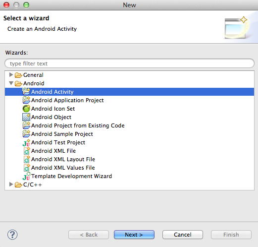
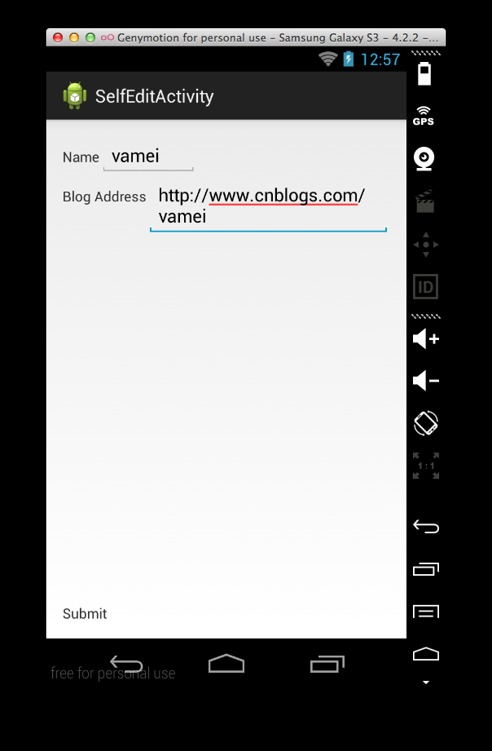
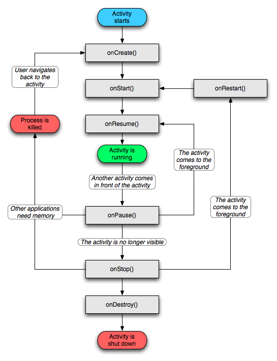
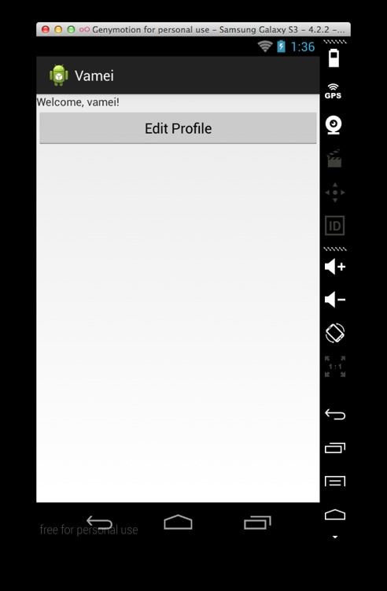

# 安卓第六夜 凡高的自画像

作者：Vamei 出处：http://www.cnblogs.com/vamei 欢迎转载，也请保留这段声明。谢谢！

在上一讲中，我已经制作了一个简单的 Android 应用。项目的主要文件包括：

*   MainActivity.java
*   activity_main.xml

在这一讲，我将拓展应用的功能，从而允许用户输入个人信息。

《自画像》，凡高。凡高一生不得志，精神更是越来越差。在割掉自己的耳朵一部分后，画家给自己留下了这幅自画像。在当时，这幅画依然是无人问津。


### 描述

我将创建一个新的 Activity。这个界面允许用户输入本人的姓名和博客地址。这些输入数据将在会保存起来。在主界面中再次调出数据，并显示。相关知识点包括：

*   启动 Activity。利用 Intent，启动一个新的 Activity。
*   文本输入。增加 EditText 输入栏，让用户输入文本信息。
*   数据存储。将数据存入 SharedPreferences，跨 Activity 读取。

### 创建新的项目文件

我们将在应用项目中增加新的文件。在 ADT 的文件导航栏中右键点击文件夹，选择 New->Other 后，可以得到下面的对话框：



你可以在这里选择想要创建的新文件的类型，比如 XML 文件，Java 文件等。安卓会根据你选择的类型，做一些默认设置。比如选择 Android Activity 后，在 AndroidManifest.xml 中自动注册该 Activity，从而省去用户的麻烦。 

### 新 Activity 的界面

我们要设计一个用于输入姓名和博客地址的安卓界面。由于姓名和博客地址都是字符串类型，因此我们可以借助 EditText 类的 View 元素，来增加字符串类型的输入栏。我们还需要提交功能。按钮是最容易想到的方式。这里，我没有使用按钮，而是为一个 TextView 增加点击事件监听。



这个视图的 XML 布局文件为 activity_self_edit.xml，如下：

```java
<RelativeLayout 

    android:layout_width="match_parent"
    android:layout_height="match_parent"
    android:paddingBottom="@dimen/activity_vertical_margin"
    android:paddingLeft="@dimen/activity_horizontal_margin"
    android:paddingRight="@dimen/activity_horizontal_margin"
    android:paddingTop="@dimen/activity_vertical_margin" >
    <LinearLayout
      android:orientation="vertical"
      android:layout_width="match_parent"
      android:layout_height="wrap_content" >
      <LinearLayout
        android:id="@+id/input1"
        android:orientation="horizontal"
        android:layout_width="wrap_content"
        android:layout_height="wrap_content" >
        <TextView
            android:layout_width="wrap_content"
            android:layout_height="wrap_content"
            android:text="Name" />
        <EditText
            android:id="@+id/name"
            android:layout_width="wrap_content"
            android:layout_height="wrap_content"
            android:hint="full name" />
    </LinearLayout>

    <LinearLayout
        android:orientation="horizontal"
        android:layout_width="wrap_content"
        android:layout_height="wrap_content"
        android:layout_below="@id/input1" >
        <TextView
            android:layout_width="wrap_content"
            android:layout_height="wrap_content"
            android:text="Blog Address" />
        <EditText
            android:id="@+id/url"
            android:layout_width="wrap_content"
            android:layout_height="wrap_content"
            android:hint="url" />
    </LinearLayout>
  </LinearLayout>

  <TextView
      android:id="@+id/submit"
      android:layout_width="wrap_content"
      android:layout_height="wrap_content"
      android:layout_alignParentBottom="true"
      android:text="Submit" />
</RelativeLayout>
```

这里使用了 RelativeLayout 来布局。我们可以在该布局下，说明元素的相对位置。TextView 就使用了 layout_alignParentBottom 属性，来说明它的下边缘将对齐母元素的下边缘。此外，这里还嵌套使用了 LinearLayout。

### 用 SharedPreferences 存储数据

我们现在来为视图编写 SelfEditActivity，以增加数据存储功能。在提交数据后，这个 Activity 将通过 EditText 的 getText()方法获取字符输入。提交的字符串将使用 SharedPreferences 存储起来。

SharedPreferences 以键值对(key-value pair)的方式存储数据。在写入时，我们需要说明数据对应的键。在读取时，我们将根据键，来获得对应的数据值。数据可以在整个应用范围内调用。特定权限下，SharedPrefereces 可以跨应用使用。SharedPreferences 简单易用，适合存储少量的、结构松散的信息。

```java
package me.vamei.vamei;

import android.app.Activity;
import android.content.Context;
import android.content.SharedPreferences;
import android.os.Bundle;
import android.view.View;
import android.widget.EditText;
import android.widget.TextView;

public class SelfEditActivity extends Activity {
    private EditText nameInput;
    private EditText urlInput;
    private TextView tvSubmit;

    private SharedPreferences sharedPref;

    @Override
    protected void onCreate(Bundle savedInstanceState) {
        super.onCreate(savedInstanceState);
        setContentView(R.layout.activity_self_edit);

        // find views
        tvSubmit   = (TextView) findViewById(R.id.submit);
        nameInput  = (EditText) findViewById(R.id.name);
        urlInput   = (EditText) findViewById(R.id.url);

        sharedPref = this.getSharedPreferences("me.vamei.vamei", 
                Context.MODE_PRIVATE);

        // submit
        tvSubmit.setOnClickListener(new View.OnClickListener() {
            @Override
            public void onClick(View v) {
                String name = nameInput.getText().toString();
                String url  = urlInput.getText().toString();

                // Save to Shared Preferences
                SharedPreferences.Editor editor = sharedPref.edit();
                editor.putString("name", name);
                editor.putString("url", url);
                editor.commit();

                // End Current Activity
                SelfEditActivity.this.finish();

            }
        });
    }    
}
```

Context 对象的 getSharedPreferences()获得 SharedPrerences。第一个参数"me.vamei.vamei"说明了该 SharedPreferences 对象所在的文件名，第二个参数说明了权限，即只能该应用范围内私用。使用 SharedPreferences.Editor 类对象写入数据时，我们调用了 putString()方法，以存储字符串类型的数据值。commit()方法将执行写入。

最后，Activity Context 的 finish()方法结束当前 Activity。

### 从一个 Activity 启动另一个 Activity

我现在要把 MainActivity 和新的 SelfEditActivity 用 Intent 串联起来。MainActivity 对应的布局为 activity_main.xml，如下：

```java
<LinearLayout 

    android:orientation="vertical"
    android:layout_width="match_parent"
    android:layout_height="match_parent" >

    <TextView 
        android:id="@+id/welcome"
        android:layout_width="match_parent"
        android:layout_height="wrap_content" />

    <Button
        android:id="@+id/author"
        android:layout_width="match_parent"
        android:layout_height="wrap_content"
        android:text="Edit Profile" />
</LinearLayout>
```

TextView 用于显示用户信息。Button 用于启动上面定义的 SelfEditActivity。

修改 MainActivity。相对于上一讲，这里主要增加了两个功能。一个功能是监听按钮，在按钮点击后启动 SelfEditActivity。另一个功能是从 SharedPreferences 中获得存储的键值，即用户名，再将用户名信息更新到界面上。

```java
package me.vamei.vamei;

import android.app.Activity;
import android.content.Context;
import android.content.Intent;
import android.content.SharedPreferences;
import android.os.Bundle;
import android.view.View;
import android.view.View.OnClickListener;
import android.widget.Button;
import android.widget.TextView;

public class MainActivity extends Activity {
    private SharedPreferences sharedPref;

    @Override
    protected void onCreate(Bundle savedInstanceState) {
        super.onCreate(savedInstanceState);
        setContentView(R.layout.activity_main);

        sharedPref = this.getSharedPreferences("me.vamei.vamei", 
                Context.MODE_PRIVATE);

        Button btn = (Button) findViewById(R.id.author);
        btn.setOnClickListener(new OnClickListener(){
            @Override
            public void onClick(View view) {
                Intent intent = new Intent(MainActivity.this, SelfEditActivity.class);
                MainActivity.this.startActivity(intent);
            }
        });
    }

    @Override
    protected void onResume() {
        super.onResume();
        TextView nameView = (TextView) findViewById(R.id.welcome);

        // retrieve content from shared preference, with key "name"
        String   welcome  = "Welcome, " + sharedPref.getString("name", "unknown") + "!";
        nameView.setText(welcome);
    }
}
```

Intent 构造器的第一个参数说明了 Context，第二个参数显式的说明了想要启动的功能单元，即 SelfEditActivity 类。startActivity()方法将根据 intent 参数，创建并启动对应的功能单元。该方法执行后，新的 SelfEditActivity 将压入栈顶，成为激活的 Activity，而 MainActivity 将暂停。

另一方面，我把数据读取部分放入了 onResume()方法。根据安卓的规定，MainActivity 第一次运行，以及每次从暂停中复苏时，都会调用该方法。用户在 SelfEditActivity 修改返回后，就可以立即获得最新的数据。使用 getString()方法，从 SharedPreferences 对象获得键位"name"的值。如果"name"键不存在，将返回默认值"unknown"。



onResume()

最后，用 setText()方法，把新的数据加载到视图的 TextView 中。

### 运行

在"Edit Profile"中输入用户信息，提交后返回主页面，效果如下：



### 总结

RelativeLayout, EditText

Intent, startActivity()

getSharedPreferences(), putString, getString()

onResume()

欢迎继续阅读“[Java 快速教程](http://www.cnblogs.com/vamei/archive/2013/03/31/2991531.html)”系列文章